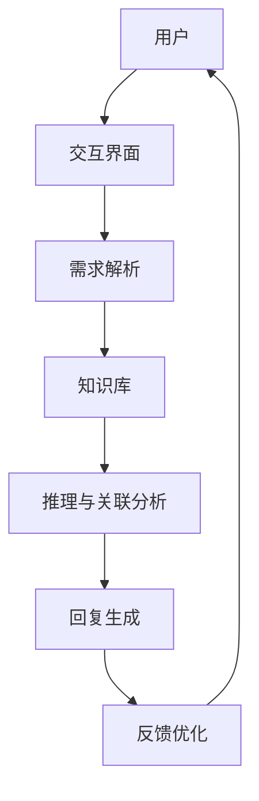

                 


# 政务AI Agent：提升公共服务效率

> 关键词：政务AI Agent，公共服务，人工智能，效率提升，算法原理，系统架构

> 摘要：本文详细探讨了政务AI Agent在公共服务中的应用，分析了其核心概念、算法原理、系统架构，并通过实际案例展示了如何通过AI Agent提升公共服务效率。

---

## 第一部分：背景介绍

### 第1章：政务AI Agent的背景与问题背景

#### 1.1 政务AI Agent的定义与核心概念

- **1.1.1 政务AI Agent的定义**  
  政务AI Agent（Government AI Agent）是指利用人工智能技术，模拟人类思维方式和行为模式，能够自主执行任务、处理复杂问题的智能体。它主要用于政府公共服务领域，旨在提高服务效率和用户体验。

- **1.1.2 政务AI Agent的核心要素**  
  政务AI Agent的核心要素包括：  
  1. **知识库**：存储政府业务知识、法律法规、公共服务流程等。  
  2. **推理引擎**：基于知识库进行逻辑推理和问题解答。  
  3. **交互界面**：与用户进行自然语言交互，理解用户需求并提供服务。  
  4. **学习模块**：通过反馈不断优化自身的知识库和推理能力。

- **1.1.3 政务AI Agent的边界与外延**  
  政务AI Agent的边界在于其服务范围和能力限制。例如，它不能处理超出其知识库范围的问题，也不能完全替代人类决策。外延则体现在与其他技术（如大数据、区块链）的结合，进一步提升其功能和应用范围。

#### 1.2 政务AI Agent的应用场景

- **1.2.1 公共服务中的AI Agent应用**  
  政务AI Agent在公共服务中的应用包括：  
  1. **智能问答**：解答公众关于政策法规、办事流程等问题。  
  2. **服务推荐**：根据用户需求推荐合适的公共服务。  
  3. **流程优化**：通过分析用户行为优化政务服务流程。  

- **1.2.2 政务AI Agent的典型场景**  
  1. **在线政务服务**：通过AI Agent为用户提供7x24小时的在线服务。  
  2. **复杂问题处理**：协助用户处理涉及多部门的复杂问题。  
  3. **数据整合与分析**：利用AI Agent整合多源数据，提供更精准的服务。  

- **1.2.3 政务AI Agent的潜在问题**  
  1. **隐私与安全**：处理大量敏感数据可能引发隐私泄露和安全问题。  
  2. **技术局限性**：AI Agent的能力受限于知识库的完整性和算法的先进性。  
  3. **用户体验**：复杂的交互设计可能影响用户体验。

---

## 第二部分：核心概念与联系

### 第2章：政务AI Agent的核心概念与联系

#### 2.1 政务AI Agent的核心原理

- **2.1.1 政务AI Agent的基本原理**  
  政务AI Agent的基本原理包括：  
  1. **知识表示**：将政府业务知识转化为计算机可理解的形式（如知识图谱）。  
  2. **推理与决策**：基于知识库进行逻辑推理，生成解决方案。  
  3. **自然语言处理**：通过NLP技术与用户进行交互，理解意图并生成回复。  

- **2.1.2 政务AI Agent的核心算法**  
  政务AI Agent的核心算法包括：  
  1. **知识抽取与构建**：使用NLP技术从文本中抽取实体、关系和事件。  
  2. **对话管理**：基于用户意图进行对话状态管理。  
  3. **知识推理**：利用图结构进行路径推理和关联推理。  

- **2.1.3 政务AI Agent的实现流程**  
  政务AI Agent的实现流程包括：  
  1. **需求分析**：明确用户需求和业务场景。  
  2. **知识库构建**：收集、整理和存储相关知识。  
  3. **算法实现**：设计和实现核心算法。  
  4. **系统集成**：将AI Agent集成到公共服务系统中。  
  5. **测试与优化**：通过测试反馈优化系统性能。  

#### 2.2 政务AI Agent与相关技术的对比

- **2.2.1 政务AI Agent与传统AI的区别**  
  | 特性             | 政务AI Agent                     | 传统AI                     |
  |------------------|----------------------------------|---------------------------|
  | 应用场景         | 政府公共服务                     | 各行业                    |
  | 交互方式         | 自然语言交互                   | �界面对话或API调用         |
  | 知识库           | 结构化的政府知识库              | 通用知识库                |
  | 学习能力         | 基于反馈持续学习                | 需人工干预更新             |

- **2.2.2 政务AI Agent与RPA的对比**  
  - **RPA**：机器人流程自动化，主要应用于重复性任务的自动化处理。  
  - **政务AI Agent**：基于AI的智能体，能够理解需求并自主解决问题。  
  - **对比**：RPA强调流程自动化，而政务AI Agent强调智能决策和问题解决。

- **2.2.3 政务AI Agent与知识图谱的联系**  
  政务AI Agent依赖知识图谱进行推理和关联分析。知识图谱为AI Agent提供了结构化的知识表示，使其能够更好地理解和处理复杂问题。

---

## 第三部分：算法原理讲解

### 第3章：政务AI Agent的算法原理

#### 3.1 政务AI Agent的核心算法

- **3.1.1 政务AI Agent的模型训练**  
  政务AI Agent的模型训练包括：  
  1. **数据预处理**：清洗、标注和转换数据。  
  2. **模型选择**：选择适合的NLP模型（如BERT、GPT）。  
  3. **模型训练**：在训练数据上优化模型参数。  
  4. **模型评估**：通过验证集评估模型性能。  

- **3.1.2 政务AI Agent的推理过程**  
  政务AI Agent的推理过程包括：  
  1. **用户输入解析**：将用户输入转换为结构化请求。  
  2. **知识库查询**：基于请求在知识库中进行关联查询。  
  3. **推理与生成**：结合推理结果生成回复内容。  
  4. **反馈优化**：根据用户反馈优化回复内容。  

- **3.1.3 政务AI Agent的优化策略**  
  政务AI Agent的优化策略包括：  
  1. **在线学习**：根据用户反馈实时更新知识库。  
  2. **多轮对话**：通过上下文记忆优化对话流程。  
  3. **多模态交互**：结合图像、语音等多种交互方式。  

#### 3.2 政务AI Agent的数学模型与公式

- **3.2.1 政务AI Agent的数学模型**  
  政务AI Agent的数学模型可以表示为：  
  $$ P(\text{response} | \text{input}) = \text{softmax}(W_{\text{response}} \cdot \text{input}) $$  
  其中，$W_{\text{response}}$ 是模型权重，$\text{input}$ 是用户输入，$\text{response}$ 是生成的回复。

- **3.2.2 政务AI Agent的核心公式**  
  在知识图谱中，实体间的关系可以表示为：  
  $$ \text{Entity}_i \text{与} \text{Entity}_j \text{有关系} R $$  
  其中，$R$ 是关系类型，$\text{Entity}_i$ 和 $\text{Entity}_j$ 是实体。

- **3.2.3 政务AI Agent的公式推导**  
  通过推导公式，可以得到：  
  $$ \text{最优解} = \argmax_{x} f(x) $$  
  其中，$f(x)$ 是目标函数，$x$ 是决策变量。

---

## 第四部分：系统分析与架构设计方案

### 第4章：政务AI Agent的系统架构设计

#### 4.1 政务AI Agent的系统功能设计

- **4.1.1 政务AI Agent的功能模块划分**  
  政务AI Agent的功能模块包括：  
  1. **知识库管理模块**：负责知识库的构建、更新和维护。  
  2. **对话管理模块**：处理用户输入并生成回复。  
  3. **推理与关联分析模块**：基于知识库进行推理和关联分析。  
  4. **交互界面模块**：提供用户与AI Agent交互的界面。  

- **4.1.2 政务AI Agent的交互流程设计**  
  政务AI Agent的交互流程包括：  
  1. **用户输入**：用户通过自然语言输入需求。  
  2. **需求解析**：AI Agent解析用户需求并生成请求。  
  3. **知识查询**：AI Agent在知识库中进行关联查询。  
  4. **推理与生成**：AI Agent基于推理结果生成回复。  
  5. **反馈优化**：根据用户反馈优化回复内容。  

- **4.1.3 政务AI Agent的性能指标**  
  政务AI Agent的性能指标包括：  
  1. **响应时间**：用户输入到系统回复的时间。  
  2. **准确率**：系统回复的准确性。  
  3. **满意度**：用户的满意度评分。  

#### 4.2 政务AI Agent的系统架构图



---

## 第五部分：项目实战

### 第5章：政务AI Agent的项目实战

#### 5.1 项目环境与安装

- **5.1.1 环境要求**  
  - 操作系统：Linux/Windows/macOS  
  - Python版本：3.6+  
  - 依赖库：numpy, pandas, spacy, transformers  

- **5.1.2 安装依赖**  
  ```bash
  pip install numpy pandas spacy transformers
  ```

#### 5.2 核心代码实现

- **5.2.1 知识库构建**  
  ```python
  import spacy

  nlp = spacy.load("zh_core_web_sm")
  doc = nlp("办理营业执照需要哪些手续?")
  for token in doc:
      print(token.text)
  ```

- **5.2.2 对话管理**  
  ```python
  from transformers import AutoModelForSeq2Seq, AutoTokenizer

  model_name = "facebook/bart-base"
  model = AutoModelForSeq2Seq.from_pretrained(model_name)
  tokenizer = AutoTokenizer.from_pretrained(model_name)

  input_text = "如何申请社保?"
  inputs = tokenizer(input_text, return_tensors="np")
  outputs = model.generate(inputs.input_ids)
  response = tokenizer.decode(outputs[0].tolist()[0])
  print(response)
  ```

- **5.2.3 推理与关联分析**  
  ```python
  from sklearn.metrics.pairwise import cosine_similarity

  embeddings = model.encode(["办理营业执照", "申请社保", "缴纳公积金"])
  similarity_matrix = cosine_similarity(embeddings)
  print(similarity_matrix)
  ```

#### 5.3 案例分析与项目总结

- **5.3.1 案例分析**  
  以“办理营业执照”为例，AI Agent通过知识库查询相关流程，生成回复：“办理营业执照需提供身份证明、经营场所证明、公司章程等材料，并前往当地工商局提交申请。”

- **5.3.2 项目总结**  
  通过实际案例分析，展示了政务AI Agent在提高公共服务效率和用户体验方面的巨大潜力。同时，也暴露了当前技术的一些局限性，如知识库的不完善和算法的局限性。

---

## 第六部分：最佳实践与注意事项

### 第6章：政务AI Agent的最佳实践

#### 6.1 最佳实践 tips

- **数据质量**：确保知识库的数据准确性和完整性。  
- **模型优化**：定期更新模型，提高准确率和响应速度。  
- **用户体验**：设计友好的交互界面，优化对话流程。  
- **安全与隐私**：加强数据加密和访问控制，确保用户隐私。  

#### 6.2 项目小结

通过本文的详细讲解和实际案例分析，我们展示了政务AI Agent在提升公共服务效率中的巨大潜力。同时，我们也认识到当前技术的一些局限性，如知识库的不完善和算法的局限性。

#### 6.3 注意事项

- **数据管理**：妥善管理知识库，避免数据泄露和错误。  
- **技术局限性**：AI Agent的能力受限于知识库和算法，需结合人工审核。  
- **用户教育**：通过宣传和培训提高用户对AI Agent的认知和信任。  

#### 6.4 拓展阅读

- **相关书籍**：《人工智能：一种现代的方法》、《深度学习》  
- **技术文档**：OpenAI的GPT系列论文、Hugging Face的Transformers库文档  
- **在线资源**：Kaggle上的NLP项目、GitHub上的AI Agent开源项目  

---

## 作者：AI天才研究院/AI Genius Institute & 禅与计算机程序设计艺术 /Zen And The Art of Computer Programming

---

以上是《政务AI Agent：提升公共服务效率》的技术博客文章的完整内容，希望对您有所帮助！

