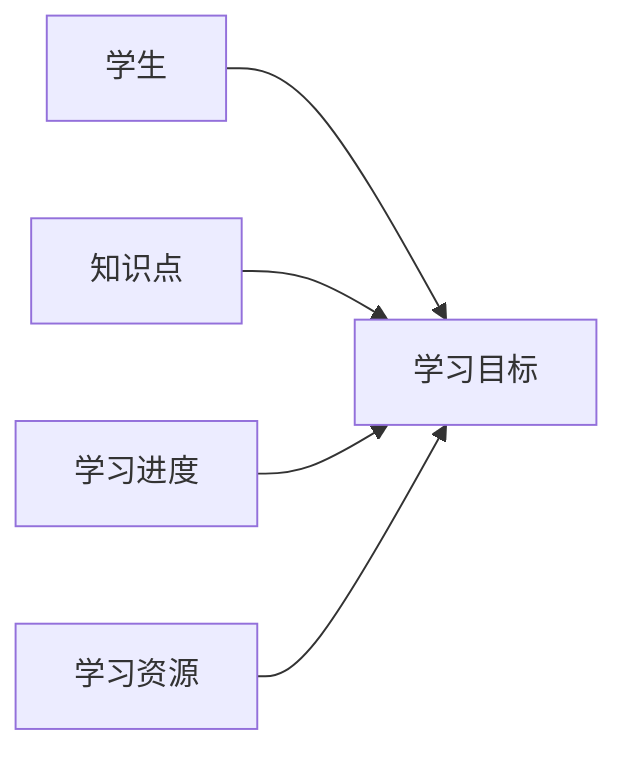
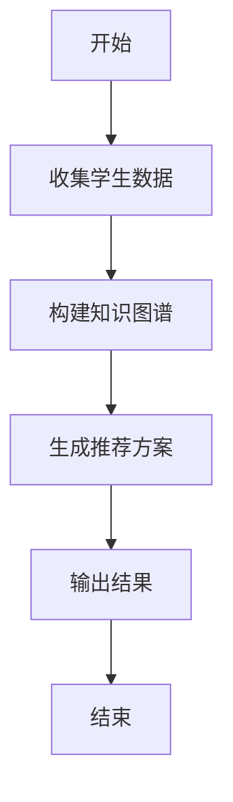
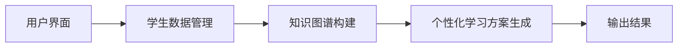
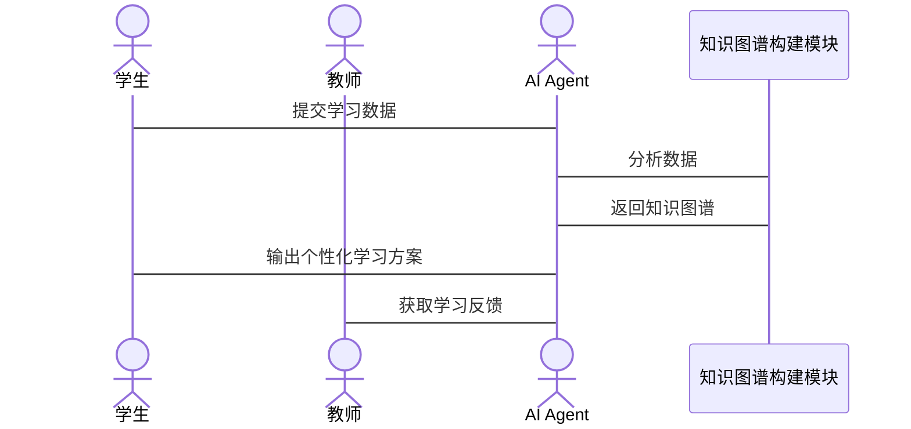

                 


# 教育领域AI Agent的个性化学习方案

**关键词：** AI Agent, 个性化学习, 教育技术, 知识图谱, 机器学习

**摘要：**  
随着人工智能技术的快速发展，教育领域正在经历一场深刻的变革。AI Agent（人工智能代理）在教育中的应用，为个性化学习方案的制定提供了新的可能性。本文将深入探讨教育领域中AI Agent的核心概念、算法原理、系统架构以及实际应用，旨在为教育技术的研究者和实践者提供理论支持和实践指导。通过分析AI Agent在教育中的角色，本文将展示如何利用AI技术实现个性化学习方案，从而提升学习效果和教学效率。

---

# 第1章: 教育领域AI Agent的背景与问题描述

## 1.1 问题背景

### 1.1.1 当前教育领域的挑战
传统教育模式往往以教师为中心，难以满足每个学生的个性化学习需求。学生的学习能力、兴趣爱好和知识水平各不相同，但现有的教学方案通常采用“一刀切”的方式，导致部分学生无法充分发挥潜力，而另一些学生则可能感到学习压力过大。此外，教育资源的分配不均也加剧了教育不公平的问题。

### 1.1.2 传统学习方案的局限性
传统学习方案通常基于固定的课程安排和教学计划，难以根据学生的实时反馈和学习进度进行动态调整。学生在学习过程中遇到的问题往往得不到及时解决，导致学习效果不佳。此外，教师需要花费大量时间进行备课和批改作业，限制了其在个性化教学中的投入。

### 1.1.3 AI技术在教育中的潜力
AI技术的快速发展为教育领域带来了前所未有的机遇。通过AI Agent，我们可以实现对学生学习行为的实时监测、分析和反馈，从而为每个学生量身定制个性化学习方案。AI Agent还可以帮助教师减轻重复性工作，使其能够更专注于教学创新和学生指导。

## 1.2 问题描述

### 1.2.1 学生个性化学习需求的多样性
每个学生都有独特的学习风格、知识水平和兴趣爱好。例如，有的学生适合通过视觉学习，而有的学生则更适合通过听觉或动手实践来学习。AI Agent需要能够识别并适应这些差异，为每个学生提供个性化的学习建议。

### 1.2.2 教师与教育资源的分配问题
教育资源的分配不均是一个长期存在的问题。AI Agent可以通过数据分析和智能推荐，帮助教师更高效地分配资源，确保每个学生都能获得适合其学习需求的材料。

### 1.2.3 学习效果的评估与反馈机制
传统的学习效果评估通常基于考试成绩，缺乏对学习过程的实时监测和反馈。AI Agent可以通过分析学生的学习数据，提供实时的评估和反馈，帮助学生及时调整学习策略。

## 1.3 问题解决思路

### 1.3.1 AI Agent在教育中的角色定位
AI Agent在教育领域中的角色可以是学习助手、资源推荐器或学习效果评估工具。通过与学生和教师的交互，AI Agent可以帮助学生制定个性化学习计划，为教师提供教学建议，并实时监测学习进度。

### 1.3.2 个性化学习方案的核心要素
个性化学习方案的核心要素包括：
1. **学生数据收集**：通过问卷调查、学习记录等方式收集学生的学习偏好、知识水平和学习风格。
2. **知识图谱构建**：将学科知识转化为结构化的知识图谱，以便AI Agent能够理解知识之间的关联。
3. **学习路径推荐**：基于学生数据和知识图谱，生成个性化的学习路径。
4. **实时反馈与调整**：根据学生的学习反馈，动态调整学习方案。

### 1.3.3 技术实现的可行性分析
AI Agent的核心技术包括自然语言处理（NLP）、机器学习（ML）和知识图谱构建。这些技术在教育领域的应用已经取得了显著成果，但仍需克服数据隐私、模型泛化能力等问题。

---

# 第2章: 教育领域AI Agent的核心概念与联系

## 2.1 核心概念原理

### 2.1.1 AI Agent的基本定义
AI Agent是一种能够感知环境并采取行动以实现特定目标的智能实体。在教育领域，AI Agent可以以软件或硬件的形式存在，例如智能辅导系统或教育机器人。

### 2.1.2 个性化学习方案的构建逻辑
个性化学习方案的构建逻辑可以分为以下几个步骤：
1. **数据收集**：收集学生的背景信息、学习记录和行为数据。
2. **数据分析**：利用机器学习算法分析数据，识别学生的知识盲点和学习偏好。
3. **方案生成**：基于分析结果，生成个性化的学习计划。
4. **方案实施与反馈**：通过AI Agent与学生互动，实时监测学习进度并提供反馈。

### 2.1.3 教育领域中的知识表示方法
知识表示方法是AI Agent理解教育知识的核心。常见的知识表示方法包括：
1. **知识图谱**：将知识表示为实体和关系的网络，例如“数学->代数->方程”。
2. **向量表示**：将知识表示为向量，用于机器学习模型的输入。

## 2.2 核心概念属性对比表

| 属性         | 描述                                                         |
|--------------|--------------------------------------------------------------|
| 个性化       | 根据学生特点定制学习方案                                     |
| 智能性       | 利用AI技术动态调整学习策略                                   |
| 适应性       | 根据反馈持续优化学习方案                                     |
| 实时性       | 提供即时反馈和调整                                           |
| 可扩展性     | 能够处理大规模数据和复杂场景                                   |

## 2.3 实体关系图



---

# 第3章: 教育领域AI Agent的算法原理

## 3.1 算法选择与原理

### 3.1.1 基于知识图谱的推荐算法
基于知识图谱的推荐算法通过分析学生的学习数据，生成个性化的学习路径。例如，如果学生在数学的代数部分有薄弱点，AI Agent会推荐相关的练习题和教学资源。

### 3.1.2 基于机器学习的预测模型
机器学习模型可以用于预测学生的学习效果和潜在的学习需求。例如，利用回归算法预测学生在下一次测试中的成绩。

### 3.1.3 基于自然语言处理的交互方式
自然语言处理技术可以用于实现AI Agent与学生之间的自然对话。例如，学生可以通过提问或描述问题，AI Agent提供相应的解答和建议。

## 3.2 算法流程图



## 3.3 算法实现代码

### 3.3.1 知识图谱构建
```python
# 示例代码：构建简单的知识图谱
from py2neo import Graph

# 连接知识图谱数据库
graph = Graph("http://localhost:7474", auth=("neo4j", "password"))

# 添加节点和关系
query = """
    CREATE (a:Concept {name: '数学'}),
           (b:Concept {name: '代数'}),
           (c:Concept {name: '方程'}),
           (a)-[:PART_OF]->(b),
           (b)-[:HAS]->(c)
    RETURN a, b, c
"""
graph.run(query)
```

### 3.3.2 机器学习模型训练
```python
# 示例代码：训练简单的机器学习模型
from sklearn.tree import DecisionTreeRegressor
from sklearn.model_selection import train_test_split

# 数据准备
X = [[1, 2, 3], [4, 5, 6], [7, 8, 9]]  # 特征
y = [2, 3, 4]                           # 标签

# 划分训练集和测试集
X_train, X_test, y_train, y_test = train_test_split(X, y, test_size=0.2)

# 训练模型
model = DecisionTreeRegressor()
model.fit(X_train, y_train)

# 预测结果
print(model.predict(X_test))
```

---

# 第4章: 教育领域AI Agent的系统分析与架构设计

## 4.1 系统功能设计

### 4.1.1 学生数据管理模块
学生数据管理模块负责收集和存储学生的学习数据，包括学习记录、考试成绩和行为数据。

### 4.1.2 知识图谱构建模块
知识图谱构建模块将学科知识转化为结构化的知识图谱，以便AI Agent理解和推理。

### 4.1.3 个性化学习方案生成模块
个性化学习方案生成模块基于学生数据和知识图谱，生成个性化的学习计划。

## 4.2 系统架构设计



## 4.3 系统接口设计

### 4.3.1 API接口
1. `/api/v1/student-data`：用于上传学生数据。
2. `/api/v1/knowledge-graph`：用于查询知识图谱。
3. `/api/v1/personalized-plan`：用于获取个性化学习方案。

## 4.4 系统交互流程



---

# 第5章: 教育领域AI Agent的项目实战

## 5.1 环境安装

### 5.1.1 安装依赖
```bash
pip install neo4j sklearn
```

## 5.2 系统核心实现

### 5.2.1 知识图谱构建
```python
from py2neo import Graph

graph = Graph("http://localhost:7474", auth=("neo4j", "password"))

query = """
    CREATE (a:Concept {name: '数学'}),
           (b:Concept {name: '代数'}),
           (c:Concept {name: '方程'}),
           (a)-[:PART_OF]->(b),
           (b)-[:HAS]->(c)
    RETURN a, b, c
"""
graph.run(query)
```

### 5.2.2 个性化学习方案生成
```python
from sklearn.tree import DecisionTreeRegressor
from sklearn.model_selection import train_test_split

X = [[1, 2, 3], [4, 5, 6], [7, 8, 9]]
y = [2, 3, 4]

X_train, X_test, y_train, y_test = train_test_split(X, y, test_size=0.2)

model = DecisionTreeRegressor()
model.fit(X_train, y_train)

print(model.predict(X_test))
```

## 5.3 实际案例分析

### 5.3.1 案例背景
某中学希望通过AI Agent为学生提供个性化的数学学习方案。

### 5.3.2 数据收集与分析
收集了100名学生的数学学习数据，包括他们的学习记录、考试成绩和兴趣爱好。

### 5.3.3 知识图谱构建
将数学知识转化为结构化的知识图谱，包括代数、几何和概率论等模块。

### 5.3.4 学习方案生成
根据学生的学习数据和知识图谱，生成个性化的学习路径。

### 5.3.5 实施与反馈
学生通过AI Agent进行学习，系统实时监测学习进度并提供反馈。

## 5.4 项目总结

### 5.4.1 成功经验
个性化学习方案显著提升了学生的学习效果。

### 5.4.2 问题与不足
部分学生对AI Agent的交互方式感到不适应。

### 5.4.3 改进方向
优化AI Agent的用户体验，增加多模态交互方式。

---

# 第6章: 教育领域AI Agent的最佳实践与小结

## 6.1 最佳实践Tips

### 6.1.1 数据隐私保护
在处理学生数据时，必须遵守相关法律法规，确保数据安全。

### 6.1.2 模型可解释性
尽量选择可解释性强的算法，以便教师和学生理解AI Agent的决策过程。

### 6.1.3 用户体验优化
通过用户研究和反馈，不断优化AI Agent的交互设计。

## 6.2 小结

通过本文的分析和实践，我们可以看到，AI Agent在教育领域的应用前景广阔。个性化学习方案的实现不仅能够提升学生的学习效果，还能够优化教育资源的分配，推动教育公平。然而，AI Agent的开发和应用仍面临诸多挑战，需要我们在技术、教育和政策等多个方面共同努力。

## 6.3 注意事项

### 6.3.1 数据隐私
确保学生数据的隐私和安全。

### 6.3.2 模型泛化能力
避免模型过于依赖特定数据集，确保其在不同场景下的适用性。

### 6.3.3 用户反馈
定期收集用户反馈，及时优化系统。

## 6.4 拓展阅读

### 6.4.1 推荐书籍
1. 《人工智能：一种现代的方法》
2. 《机器学习实战》

### 6.4.2 推荐博客
1. [AI教育博客](https://example.com)
2. [机器学习与教育](https://example.com)

---

# 作者：AI天才研究院/AI Genius Institute & 禅与计算机程序设计艺术 /Zen And The Art of Computer Programming

