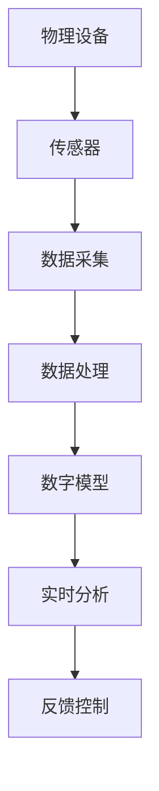
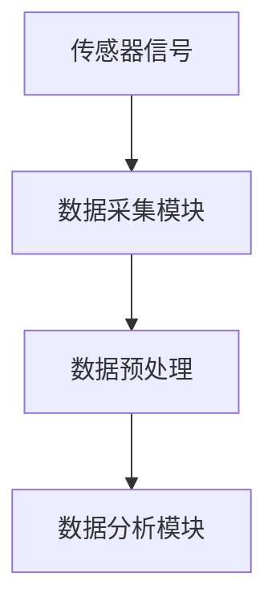
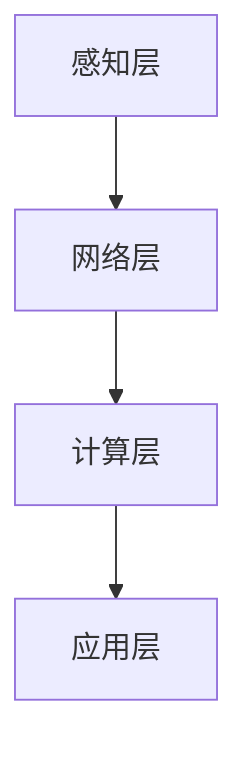
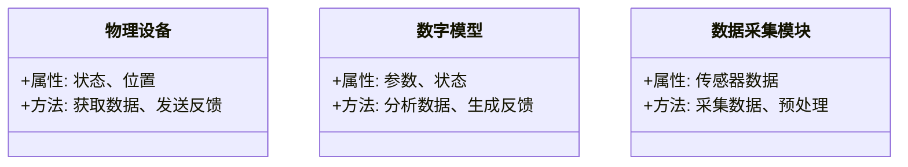
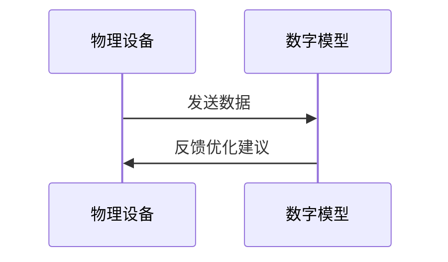

                 


# 数字孪生技术在工业领域的应用与投资机会

## 关键词：数字孪生、工业互联网、智能制造、投资机会、算法原理、系统架构、项目实战

## 摘要：
数字孪生技术是一种通过物理实体与数字模型的实时映射来优化工业生产过程的创新技术。本文深入探讨了数字孪生在工业领域的应用背景、核心概念、算法原理、系统架构、项目实战以及投资机会。通过具体的案例分析，展示了数字孪生技术如何帮助企业提高效率、降低成本并实现智能化转型。同时，本文还分析了数字孪生技术的投资价值及未来发展趋势，为投资者提供了有益的参考。

---

## 第一部分: 数字孪生技术的背景与核心概念

### 第1章: 数字孪生技术的定义与背景

#### 1.1 数字孪生的定义与核心概念
##### 1.1.1 数字孪生的定义
数字孪生（Digital Twin）是指通过物理实体与数字模型之间的实时数据同步，构建物理世界与数字世界的镜像，从而实现对物理实体的智能化监控、分析和优化。

##### 1.1.2 数字孪生的核心要素
- **物理实体**：实际存在的设备、产品或系统。
- **数字模型**：基于物理实体的虚拟模型，包括几何、物理、行为等特性。
- **数据流**：连接物理实体与数字模型的实时数据。
- **实时通信**：物理实体与数字模型之间的双向数据传输。
- **反馈机制**：基于数字模型的分析结果，向物理实体提供反馈和优化建议。

##### 1.1.3 数字孪生与相关技术的区别
| 技术         | 描述                                                                 |
|--------------|----------------------------------------------------------------------|
| CAD建模      | 仅用于设计阶段，缺乏实时数据反馈                                       |
| 工业互联网    | 侧重于设备连接与数据传输，缺乏数字模型的动态更新                     |
| 数字工厂     | 侧重于虚拟化生产流程，缺乏与实际设备的实时互动                       |

##### 1.1.4 数字孪生在工业领域的应用背景
随着工业4.0的推进，企业需要更高效的方式优化生产流程。数字孪生通过实时数据和虚拟模型，帮助企业实现预测性维护、生产优化和产品创新。

#### 1.2 数字孪生技术的技术基础
##### 1.2.1 物联网技术
物联网技术为数字孪生提供了设备连接和数据采集的基础。

##### 1.2.2 大数据技术
大数据技术用于处理和分析海量数据，支持数字孪生的实时性和准确性。

##### 1.2.3 人工智能技术
人工智能技术用于数据建模、预测和优化，是数字孪生的核心驱动力。

##### 1.2.4 虚拟现实与增强现实技术
VR/AR技术用于数字模型的可视化和人机交互，提升用户体验。

---

### 第2章: 数字孪生技术的核心概念与联系

#### 2.1 数字孪生的核心概念
##### 2.1.1 物理实体与数字模型的关系
数字孪生通过实时数据将物理实体与数字模型保持一致，形成双向映射。

##### 2.1.2 数据流的双向传输机制
数据从物理实体流向数字模型，同时数字模型的分析结果也反馈到物理实体。

##### 2.1.3 实时反馈与优化机制
数字模型通过分析数据，向物理实体提供实时反馈，优化其运行状态。

#### 2.2 数字孪生的实体关系图


---

## 第二部分: 数字孪生技术的算法原理

### 第3章: 数字孪生的数据采集与建模算法

#### 3.1 数据采集算法
##### 3.1.1 传感器信号处理


##### 3.1.2 数据采集的Python实现
```python
import numpy as np
from scipy import signal

# 示例传感器数据
data = np.random.normal(size=1000)
# 傅里叶变换分析信号频谱
fft_data = np.abs(signal.fft.fft(data))
print("频谱分析结果:", fft_data)
```

#### 3.2 数据建模算法
##### 3.2.1 几何建模
数字模型的几何建模使用三维建模技术，如基于CAD的建模。

##### 3.2.2 基于傅里叶变换的信号建模
$$ X(f) = \sum_{n=0}^{N-1} x[n] e^{-j2\pi fn/N} $$

#### 3.3 数据分析算法
##### 3.3.1 时间序列分析
使用ARIMA模型进行时间序列预测。

##### 3.3.2 数据分析的Python实现
```python
from statsmodels.tsa.arima_model import ARIMA

# 示例时间序列数据
data = [1.5, 2.3, 2.8, 3.2, 3.8, 4.1, 4.5, 5.0, 5.5, 6.0]
model = ARIMA(data, order=(1, 1, 0))
model_fit = model.fit(disp=0)
print("预测结果:", model_fit.forecast(steps=5))
```

#### 3.4 数据优化算法
##### 3.4.1 基于遗传算法的优化
使用遗传算法优化生产参数。

##### 3.4.2 遗传算法的Python实现
```python
import random

# 示例优化问题：最大化目标函数
def objective(x):
    return x[0] + x[1] * 2 + x[2] * 3

# 遗传算法实现
def genetic_algorithm(population, fitness_fn):
    # 交配、变异等步骤略去
    pass

print("优化结果:", genetic_algorithm(initial_population, objective))
```

---

## 第三部分: 数字孪生系统的架构设计

### 第4章: 数字孪生系统的架构设计

#### 4.1 系统架构设计


#### 4.2 系统功能设计
##### 4.2.1 类图设计


#### 4.3 系统接口设计
##### 4.3.1 接口设计
- 数据采集接口：提供传感器数据的读取和写入功能。
- 数字模型接口：提供模型的构建和更新功能。

#### 4.4 系统交互流程


---

## 第四部分: 数字孪生技术的项目实战

### 第5章: 数字孪生技术的项目实战

#### 5.1 项目介绍
以智能制造中的设备预测性维护为例，展示数字孪生技术的应用。

#### 5.2 系统实现
##### 5.2.1 环境配置
- 操作系统：Linux
- 开发工具：Python、TensorFlow、ROS

##### 5.2.2 核心代码实现
```python
import tensorflow as tf
from tensorflow.keras import layers

# 示例神经网络模型
model = tf.keras.Sequential([
    layers.Dense(64, activation='relu'),
    layers.Dense(1, activation='sigmoid')
])
model.compile(optimizer='adam', loss='binary_crossentropy')
print("模型训练结果:", model.fit(X_train, y_train, epochs=10))
```

#### 5.3 测试与优化
对模型进行测试，并根据结果进行参数调优。

#### 5.4 结果分析
分析模型的预测准确率和优化效果，总结经验教训。

---

## 第五部分: 数字孪生技术的投资机会分析

### 第6章: 数字孪生技术的投资机会分析

#### 6.1 投资价值分析
##### 6.1.1 市场需求
工业4.0的推动下，数字孪生技术需求增长迅速。

##### 6.1.2 技术壁垒
数字孪生技术涉及多领域，具有较高的技术门槛。

#### 6.2 投资策略建议
##### 6.2.1 看好智能制造领域的应用
##### 6.2.2 关注技术创新企业
##### 6.2.3 重视数据隐私和安全

#### 6.3 投资风险分析
##### 6.3.1 技术成熟度风险
##### 6.3.2 数据隐私风险
##### 6.3.3 市场竞争风险

---

## 第六部分: 数字孪生技术的未来趋势与挑战

### 第7章: 数字孪生技术的未来趋势与挑战

#### 7.1 技术发展趋势
##### 7.1.1 与边缘计算的结合
##### 7.1.2 与5G技术的融合
##### 7.1.3 与人工智能的深度结合

#### 7.2 主要挑战
##### 7.2.1 数据隐私与安全
##### 7.2.2 技术标准化问题
##### 7.2.3 计算资源需求

---

## 总结

数字孪生技术正在 revolutionize 工业领域，通过实时数据和虚拟模型的结合，为企业带来显著的效率提升和成本节约。随着技术的不断发展，数字孪生将在智能制造、智慧城市等领域发挥更大的作用。对于投资者而言，数字孪生技术的投资机会广阔，但也需要关注相关风险，选择具有技术优势和市场竞争力的企业。

---

## 作者：AI天才研究院/AI Genius Institute & 禅与计算机程序设计艺术 /Zen And The Art of Computer Programming

