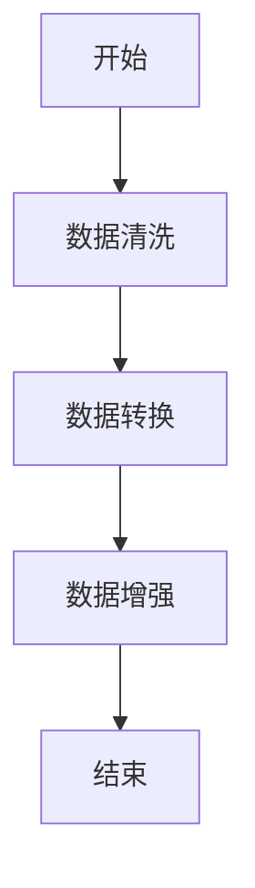
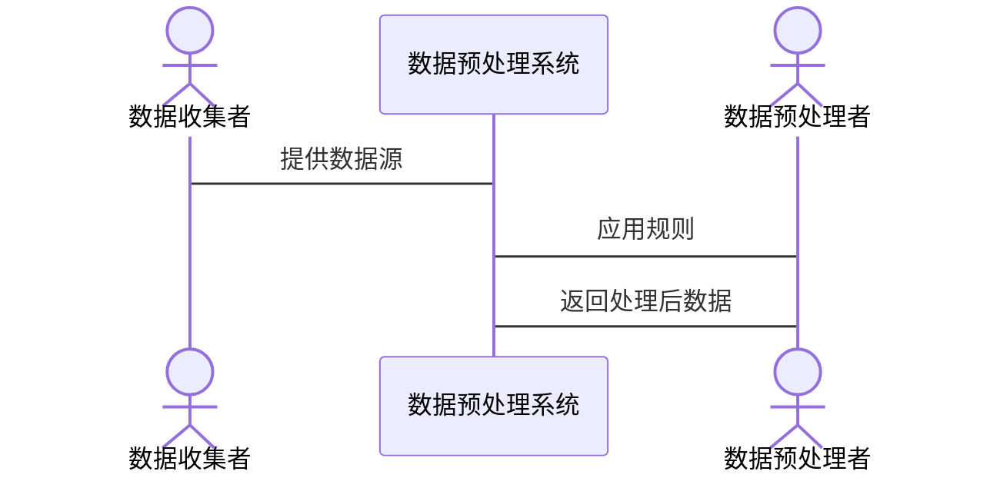

                 


# 数据收集与预处理：为AI Agent准备高质量训练集

> 关键词：数据收集，数据预处理，AI Agent，训练集，数据清洗，数据增强

> 摘要：数据是人工智能代理（AI Agent）的核心，高质量的训练集是模型性能的基础。本文详细探讨了数据收集与预处理的关键步骤，包括数据来源、清洗、转换和增强，结合实际案例和系统设计，为构建高效AI Agent提供指导。

---

# 第一部分: 数据收集与预处理基础

# 第1章: 数据收集与预处理概述

## 1.1 数据收集与预处理的背景

### 1.1.1 数据在AI Agent中的重要性

AI Agent依赖数据进行决策和学习，高质量数据是模型准确性的保障。数据的多样性、完整性和相关性直接影响模型性能。

### 1.1.2 数据收集与预处理的基本概念

数据收集是获取所需数据的过程，预处理是对数据进行清洗、转换和增强，确保其适合模型训练。

### 1.1.3 数据质量与训练集的关系

高质量数据减少模型偏差，提升泛化能力。训练集需平衡多样性与代表性，避免过拟合。

## 1.2 数据收集与预处理的必要性

### 1.2.1 数据的多样性和复杂性

数据来源多样（文本、图像、数值），预处理确保统一格式和标准化。

### 1.2.2 数据噪声对模型的影响

噪声导致模型过拟合，预处理减少噪声，提升模型泛化能力。

### 1.2.3 高质量训练集对AI Agent的意义

高质量训练集提升模型性能，增强AI Agent的决策能力。

## 1.3 数据收集与预处理的挑战

### 1.3.1 数据来源的多样性

处理多源数据需不同方法，确保数据一致性。

### 1.3.2 数据隐私与合规性问题

遵守数据保护法规，确保收集过程合法。

### 1.3.3 数据清洗与标注的复杂性

清洗需识别和处理异常值，标注需准确且耗时。

## 1.4 数据收集与预处理的流程

### 1.4.1 数据收集阶段

从多种来源（数据库、API、传感器）获取数据，确保数据量足够。

### 1.4.2 数据清洗阶段

识别和处理异常值、重复项，填补缺失值，去噪。

### 1.4.3 数据转换与增强阶段

转换（归一化、标准化）、增强（数据扩充）提升数据多样性。

---

# 第2章: 数据收集的核心概念与联系

## 2.1 数据收集的原理

### 2.1.1 数据来源的分类

- 结构化数据：数据库、CSV文件
- 半结构化数据：JSON、XML
- 非结构化数据：文本、图像

### 2.1.2 数据采集的常用方法

- API接口获取
- 数据库查询
- 网络爬取
- 传感器采集

### 2.1.3 数据采集的工具与技术

- 数据库：MySQL、MongoDB
- 网络爬虫：Scrapy、BeautifulSoup
- 数据处理工具：Pandas、NumPy

## 2.2 数据预处理的原理

### 2.2.1 数据清洗的必要性

去除噪声，提高数据质量，减少模型偏差。

### 2.2.2 数据转换与标准化

归一化：使数据范围在[0,1]之间，公式：\( x' = \frac{x - \min(x)}{\max(x) - \min(x)} \)

标准化：使数据服从正态分布，公式：\( x' = \frac{x - \mu}{\sigma} \)

### 2.2.3 数据增强的技巧

- 图像增强：旋转、翻转、裁剪
- 文本增强：同义词替换、数据扩充

## 2.3 数据收集与预处理的ER实体关系图

```mermaid
er
    actor: 数据收集者
    role: 数据预处理者
    entity: 数据源
    entity: 数据集
    entity: 数据清洗规则
    entity: 数据转换规则
    entity: 数据增强规则
    relationship: 数据收集者 -> 数据源: 采集数据
    relationship: 数据预处理者 -> 数据集: 应用规则
```

## 2.4 数据预处理的属性特征对比

| 属性 | 描述 | 示例 |
|------|------|------|
| 数据类型 | 文本、图像、数值等 | 文本数据：用户评论 |
| 数据格式 | 结构化、半结构化、非结构化 | 结构化数据：CSV文件 |
| 数据质量 | 完整性、一致性、准确性 | 缺失值：处理为均值填充 |
| 数据相关性 | 变量间相关程度 | 相关系数：Pearson相关系数 |

---

# 第3章: 数据预处理的算法原理

## 3.1 数据清洗算法

### 3.1.1 异常值检测

使用Z-score或IQR方法识别异常值。

### 3.1.2 重复数据处理

检查唯一性，删除重复项。

### 3.1.3 缺失值填充

- 均值填充：适用于数值型数据
- 众数填充：适用于分类数据
- 线性插值：适用于时间序列数据

## 3.2 数据转换算法

### 3.2.1 标准化与归一化

标准化公式：\( Z = \frac{X - \mu}{\sigma} \)

归一化公式：\( X' = \frac{X - \min(X)}{\max(X) - \min(X)} \)

### 3.2.2 特征编码

- 独热编码：将类别变量转换为虚拟变量
- 标签编码：将类别映射为整数

## 3.3 数据增强算法

### 3.3.1 图像增强

- 旋转：Pillow库实现，角度范围0-30度
- 翻转：水平或垂直翻转，增强数据多样性

### 3.3.2 文本增强

- 同义词替换：使用WordNet进行替换
- 数据扩充：增加训练数据的多样性

## 3.4 数据预处理的流程图



---

# 第4章: 系统分析与架构设计

## 4.1 系统功能设计

### 4.1.1 数据采集模块

负责从多源获取数据，支持多种数据格式。

### 4.1.2 数据清洗模块

实现异常值检测和缺失值填充。

### 4.1.3 数据转换模块

执行标准化、归一化和特征编码。

### 4.1.4 数据增强模块

针对图像和文本数据，进行数据增强处理。

## 4.2 系统架构设计

### 4.2.1 分层架构

- 数据层：存储原始数据
- 业务逻辑层：处理数据清洗、转换和增强
- 表现层：展示处理结果

### 4.2.2 微服务架构

- 数据采集服务：负责数据获取
- 数据处理服务：负责清洗、转换和增强

## 4.3 系统接口设计

### 4.3.1 数据接口

- 输入接口：接收原始数据
- 输出接口：输出处理后的数据

### 4.3.2 API接口

- RESTful API：提供数据处理服务

## 4.4 系统交互流程图



---

# 第5章: 项目实战

## 5.1 环境安装

- Python 3.8+
- 安装库：Pandas、NumPy、Scikit-learn、TensorFlow

## 5.2 系统核心实现源代码

### 5.2.1 数据清洗代码

```python
import pandas as pd
import numpy as np

def data_cleaning(df):
    # 删除重复项
    df.drop_duplicates(inplace=True)
    # 处理缺失值
    df['age'].fillna(df['age'].mean(), inplace=True)
    # 删除异常值
    z = np.abs((df['salary'] - df['salary'].mean()) / df['salary'].std())
    df = df[(z < 3).all()]
    return df
```

### 5.2.2 数据增强代码

```python
from tensorflow.keras.preprocessing.image import ImageDataGenerator

datagen = ImageDataGenerator(rotation_range=20, horizontal_flip=True)
```

## 5.3 案例分析

### 5.3.1 案例介绍

处理一个图像分类任务，使用CIFAR-10数据集。

### 5.3.2 数据清洗与增强

清洗：去除重复和异常值，增强：旋转和翻转图像。

## 5.4 项目总结

通过项目实战，验证了数据预处理的重要性，提高了模型性能。

---

# 结论

高质量数据集是AI Agent成功的关键。本文详细探讨了数据收集与预处理的流程，结合实际案例，展示了如何构建高效的数据处理系统。未来，自动化数据标注和更高效的数据预处理算法将是研究重点。

---

作者：AI天才研究院 & 禅与计算机程序设计艺术

