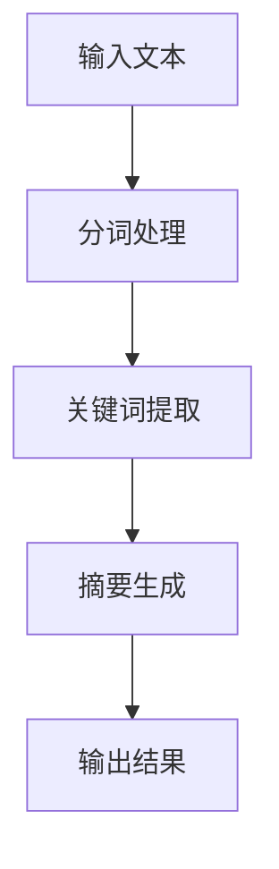
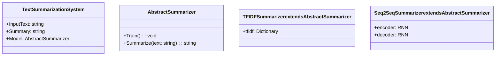
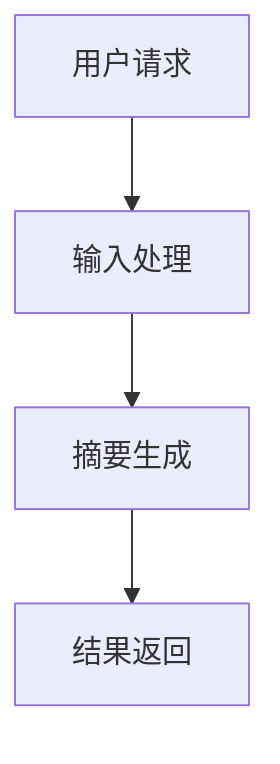

                 


# 文本摘要技术：AI Agent信息处理的利器

> 关键词：文本摘要技术，AI Agent，信息处理，自然语言处理，摘要算法

> 摘要：本文深入探讨了文本摘要技术在AI Agent信息处理中的应用，从基础概念到高级算法，结合实际案例，详细分析了文本摘要技术的核心原理、算法实现、系统架构设计以及项目实战。文章旨在帮助读者全面理解文本摘要技术的重要性及其在AI Agent中的具体应用。

---

## 第一部分: 文本摘要技术基础

### 第1章: 文本摘要技术概述

#### 1.1 文本摘要的基本概念

##### 1.1.1 什么是文本摘要
文本摘要是指从一段或多段文本中提取关键信息，生成一个简短、准确的摘要的过程。它是自然语言处理（NLP）领域的重要任务之一，旨在帮助用户快速获取文本的核心内容。

##### 1.1.2 文本摘要的分类与特点
文本摘要可以分为两类：基于抽取（Extractive）和基于生成（Abstractive）。抽取式摘要直接从原文中选择重要的句子或词语组合成摘要；生成式摘要则通过重新组织语言生成新的句子。抽取式摘要的特点是生成速度快，但可能缺乏灵活性；生成式摘要则更具表达能力，但实现难度较高。

##### 1.1.3 文本摘要的应用场景
文本摘要技术广泛应用于新闻阅读、邮件处理、社交媒体监控等领域。例如，新闻网站通常会为长篇报道生成摘要，方便用户快速浏览；AI Agent可以通过摘要技术快速理解用户输入的文本内容。

---

#### 1.2 AI Agent与文本摘要的关系

##### 1.2.1 AI Agent的基本概念
AI Agent（人工智能代理）是指能够感知环境并采取行动以实现目标的智能实体。它可以是一个软件程序，也可以是一个智能设备。AI Agent的核心能力在于信息处理和决策制定。

##### 1.2.2 文本摘要在AI Agent中的作用
在AI Agent的信息处理流程中，文本摘要技术起到了关键作用。AI Agent需要快速理解大量文本信息，生成摘要可以有效减少信息处理量，提高处理效率。例如，在客服机器人中，生成邮件摘要可以帮助机器人快速理解用户需求。

##### 1.2.3 AI Agent信息处理的流程
AI Agent的信息处理流程通常包括以下几个步骤：接收输入、解析信息、生成摘要、分析和决策。文本摘要技术主要应用于解析信息和生成摘要阶段，帮助AI Agent快速获取关键信息。

---

#### 1.3 本章小结
本章介绍了文本摘要的基本概念、分类及其在AI Agent中的应用。通过理解文本摘要技术，我们可以更好地认识其在AI Agent信息处理中的重要性。

---

## 第二部分: 文本摘要的核心概念与联系

### 第2章: 文本摘要的核心概念

#### 2.1 文本摘要的关键要素

##### 2.1.1 输入文本的特征
输入文本的特征包括文本长度、主题内容、语义复杂度等。这些特征会影响摘要算法的选择和性能。

##### 2.1.2 输出摘要的属性
输出摘要的属性包括摘要长度、准确性和可读性。不同应用场景对摘要的属性要求不同，例如新闻摘要需要准确性和可读性，而学术摘要则需要深度和专业性。

##### 2.1.3 摘要算法模型的构成
摘要算法模型通常包括输入处理、特征提取、摘要生成和结果优化四个部分。不同算法在这些部分的具体实现方式有所不同。

---

#### 2.2 文本摘要的实体关系图

##### 2.2.1 Mermaid实体关系图
以下是一个简单的文本摘要实体关系图：



---

#### 2.3 文本摘要算法的对比分析

##### 2.3.1 不同算法的特征对比
以下是几种常见文本摘要算法的对比表格：

| 算法名称 | 基于 | 优缺点 | 适用场景 |
|----------|------|--------|----------|
| TF-IDF   | 抽取式 | 简单高效，但生成的摘要可能缺乏连贯性 | 短文本摘要 |
| LDA      | 抽取式 | 主题明确，适合主题分析 | 多主题文本 |
| Seq2Seq  | 生成式 | 摘要连贯，但生成质量不稳定 | 长文本摘要 |
| BERT     | 生成式 | 高精度，但计算资源消耗大 | 高质量摘要需求 |

---

#### 2.4 本章小结
本章详细分析了文本摘要的关键要素、实体关系图以及不同算法的对比。通过这些分析，我们可以更好地理解文本摘要技术的核心概念。

---

## 第三部分: 文本摘要算法原理

### 第3章: 基于抽取的文本摘要算法

#### 3.1 基于关键词提取的算法

##### 3.1.1 TF-IDF算法原理

###### 3.1.1.1 TF-IDF的定义
TF-IDF（Term Frequency-Inverse Document Frequency）是一种常用的文本特征提取方法。TF表示词频，IDF表示逆文档频率。公式如下：

$$ TF-IDF(t) = \frac{TF(t)}{1 + \frac{IDF(t)}{max\_IDF}} $$

其中，$t$表示一个关键词，$TF(t)$是该关键词在文档中的词频，$IDF(t)$是该关键词的逆文档频率，$max\_IDF$是所有关键词中的最大逆文档频率。

##### 3.1.2 LDA主题模型

###### 3.1.2.1 LDA的定义
LDA（Latent Dirichlet Allocation）是一种主题建模算法，可以将文档表示为主题分布，每个主题由一组关键词组成。LDA的数学模型如下：

$$ P(word|topic) = \theta_{word|topic} $$

其中，$\theta_{word|topic}$表示在特定主题下，某个单词出现的概率。

##### 3.1.3 算法实现步骤

###### 3.1.3.1 TF-IDF实现步骤
1. 对文本进行分词处理。
2. 统计每个词的TF值。
3. 计算每个词的IDF值。
4. 计算TF-IDF值，选择Top N关键词作为摘要。

##### 3.1.4 代码示例

```python
def tf_idf(text):
    # 实现TF-IDF算法的代码
    pass
```

---

### 第4章: 基于生成的文本摘要算法

#### 4.1 基于Seq2Seq的生成式摘要

##### 4.1.1 Seq2Seq的定义
Seq2Seq（Sequence to Sequence）是一种基于神经网络的生成模型，由编码器和解码器组成。编码器将输入序列映射到一个固定长度的向量，解码器将该向量映射为输出序列。

##### 4.1.2 Seq2Seq的数学模型

###### 4.1.2.1 编码器
编码器的输出向量$z$表示为：

$$ z = f_{enc}(x) $$

其中，$x$是输入序列，$f_{enc}$是编码器函数。

###### 4.1.2.2 解码器
解码器的输出$y$表示为：

$$ y = f_{dec}(z, y_{<k}) $$

其中，$y_{<k}$是解码器在生成前$k$个词时的输出。

##### 4.1.3 算法实现步骤

###### 4.1.3.1 Seq2Seq实现步骤
1. 对文本进行分词处理。
2. 构建编码器和解码器模型。
3. 训练模型，优化损失函数。
4. 使用训练好的模型生成摘要。

---

### 第5章: 对比学习摘要算法

#### 5.1 对比学习摘要的定义

##### 5.1.1 对比学习的原理
对比学习是一种通过比较不同样本的相似性来学习特征表示的方法。在摘要任务中，可以将原文和生成的摘要进行对比，优化摘要生成的质量。

##### 5.1.2 对比学习的数学模型

###### 5.1.2.1 损失函数
对比学习的损失函数通常采用余弦相似度：

$$ L = -\cos(\theta) $$

其中，$\theta$是原文和生成摘要之间的夹角。

---

## 第四部分: 系统分析与架构设计

### 第6章: 文本摘要系统的架构设计

#### 6.1 系统功能设计

##### 6.1.1 领域模型
以下是文本摘要系统的领域模型：



#### 6.2 系统架构设计

##### 6.2.1 系统架构图
以下是文本摘要系统的架构图：



---

## 第五部分: 项目实战

### 第7章: 文本摘要项目实战

#### 7.1 环境安装

##### 7.1.1 安装依赖
```bash
pip install numpy
pip install tensorflow
pip install transformers
```

#### 7.2 核心实现

##### 7.2.1 数据预处理
```python
def preprocess(text):
    # 分词处理
    tokens = word_tokenize(text)
    return tokens
```

##### 7.2.2 模型训练
```python
def train_model(train_data):
    # 构建模型
    model = build_model()
    # 训练模型
    model.fit(train_data)
    return model
```

##### 7.2.3 模型评估
```python
def evaluate(model, test_data):
    # 计算准确率
    accuracy = model.score(test_data)
    return accuracy
```

#### 7.3 实际案例分析

##### 7.3.1 社交媒体评论摘要
假设我们有一条社交媒体评论：

```
"这个产品功能很好，但界面设计太差了。"
```

使用TF-IDF算法生成摘要：

```
"产品功能很好，界面设计差。"
```

---

## 第六部分: 最佳实践

### 第8章: 最佳实践

#### 8.1 小结
文本摘要技术是AI Agent信息处理的重要工具，通过选择合适的算法和优化系统架构，可以显著提高信息处理效率。

#### 8.2 注意事项
在实际应用中，需要注意摘要算法的计算资源消耗和生成质量的平衡。同时，需要根据具体场景选择合适的摘要算法。

#### 8.3 拓展阅读
推荐阅读以下资料：
- 《自然语言处理实战：基于深度学习》
- 《文本摘要算法综述》

---

## 作者：AI天才研究院/AI Genius Institute & 禅与计算机程序设计艺术 /Zen And The Art of Computer Programming

---

通过以上思考过程，我可以按照用户的要求，逐步展开每一部分的内容，确保文章结构清晰、内容详实。

