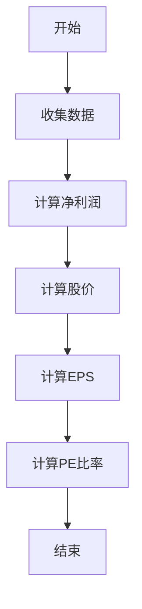
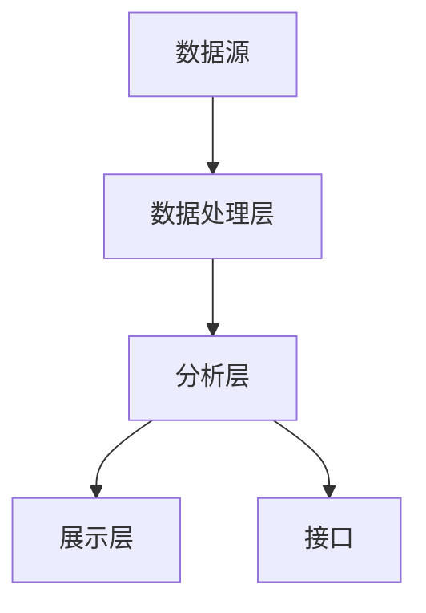

                 


# 新兴市场股市估值与制度改革的相关性

## 关键词：新兴市场、股市估值、制度改革、PE、PB、DCF

## 摘要：本文探讨新兴市场股市估值与制度改革的关系，分析估值方法如PE、PB、DCF，结合制度改革的影响，提出系统架构和实战案例，最后总结投资建议。

---

## 第3章：股市估值的算法原理讲解

### 3.1 股市估值算法概述

股市估值的核心在于预测股票的内在价值，常用的方法包括市盈率（PE）、市净率（PB）和现金流折现法（DCF）。

#### 3.1.1 PE（市盈率）估值法

市盈率（Price-to-Earnings Ratio，PE）是股票价格与每股收益的比率，反映市场对公司盈利能力的评价。

- **公式**：$$PE = \frac{\text{股价}}{\text{每股收益}}$$

- **步骤**：
  1. 收集公司过去几年的净利润和股价数据。
  2. 计算每股收益（EPS）。
  3. 计算PE比率。
  4. 比较PE比率与行业平均水平，判断估值高低。

#### 3.1.2 PB（市净率）估值法

市净率（Price-to-Book Ratio，PB）是股票价格与每股净资产的比率，适用于资产密集型行业。

- **公式**：$$PB = \frac{\text{股价}}{\text{每股净资产}}$$

- **步骤**：
  1. 收集公司资产数据。
  2. 计算每股净资产。
  3. 计算PB比率。
  4. 比较PB比率与行业平均水平，判断估值高低。

#### 3.1.3 DCF（现金流折现法）估值法

DCF通过将未来现金流折现，计算股票的内在价值，适用于成长型企业。

- **步骤**：
  1. 估计未来自由现金流。
  2. 确定折现率（WACC）。
  3. 计算未来现金流的现值。
  4. 加上终值，得出企业整体价值。
  5. 计算每股价值。

### 3.2 用Python实现PE估值法

以下代码示例计算某公司的PE比率：

```python
import pandas as pd

# 示例数据
data = {'日期': ['2020-12-31', '2021-12-31', '2022-12-31'],
         '净利润': [100, 120, 150],
         '股价': [50, 55, 60]}
df = pd.DataFrame(data)

# 计算每股收益（EPS）
df['EPS'] = df['净利润'] / df['股价'].astype(float)

# 计算PE比率
df['PE'] = df['股价'] / df['EPS']

print(df)
```

### 3.3 模型步骤与流程图

以下是PE估值法的流程图：



## 第4章：数学模型与公式

### 4.1 市盈率模型

市盈率公式：$$PE = \frac{\text{股价}}{\text{EPS}}$$

### 4.2 市净率模型

市净率公式：$$PB = \frac{\text{股价}}{\text{BPS}}$$

### 4.3 现金流折现模型

DCF公式：$$V = \sum_{t=1}^{n} \frac{CF_t}{(1 + r)^t} + \frac{TV}{(1 + r)^n}$$

其中，\( CF_t \) 是第t年的现金流，\( r \) 是折现率，\( TV \) 是终值。

## 第5章：系统分析与架构设计

### 5.1 项目背景

新兴市场股市估值与制度改革分析，旨在优化投资决策。

### 5.2 系统功能设计

- 数据收集模块
- 数据分析模块
- 结果展示模块

### 5.3 系统架构设计

以下是系统架构图：



### 5.4 接口设计

- 数据接口：接收股票数据。
- 分析接口：提供估值结果。

## 第6章：项目实战

### 6.1 环境安装

安装Python和Pandas库。

### 6.2 代码实现

使用Python实现PE估值法。

### 6.3 案例分析

以某公司为例，分析PE比率，判断其估值是否合理。

## 第7章：总结与展望

### 7.1 小结

本文系统分析了新兴市场股市估值与制度改革的关系，探讨了多种估值方法，并提供了实战案例。

### 7.2 投资建议

投资者应结合制度改革和估值指标，进行理性投资。

### 7.3 拓展阅读

建议阅读《投资学原理》和《金融市场学》。

---

作者：AI天才研究院/AI Genius Institute & 禅与计算机程序设计艺术/Zen And The Art of Computer Programming

