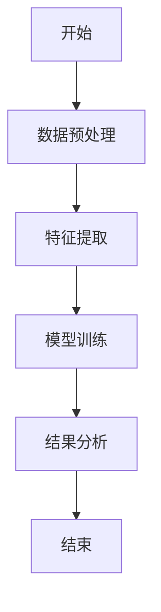
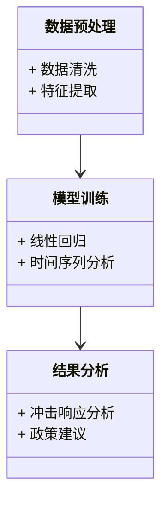
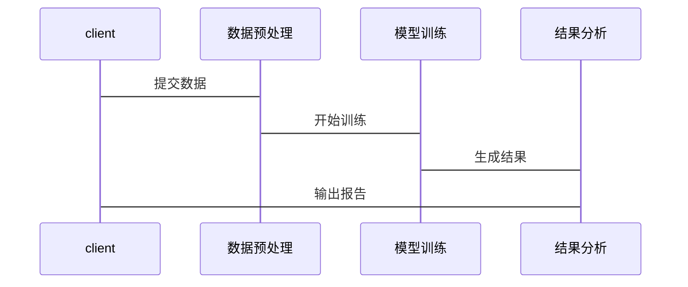

                 


# 新兴市场股市估值与政治稳定性的关联

> 关键词：新兴市场，股市估值，政治稳定性，数学模型，系统架构

> 摘要：本文系统地探讨了新兴市场股市估值与政治稳定性的关联，通过建立理论模型、数学模型和系统架构，分析了政治稳定性对股市估值的影响机制，并提出了优化建议。

---

# 第3章: 股市估值的数学模型与算法原理

## 3.1 股市估值的数学模型

### 3.1.1 市盈率模型
市盈率（P/E）是衡量股市估值的重要指标之一，公式为：
$$P/E = \frac{\text{股价}}{\text{每股收益}}$$

### 3.1.2 市净率模型
市净率（P/B）是另一个常用的估值指标，公式为：
$$P/B = \frac{\text{股价}}{\text{每股净资产}}$$

### 3.1.3 现金流折现模型
现金流折现模型（DCF）是评估公司内在价值的常用方法，公式为：
$$\text{企业价值} = \sum_{t=1}^{n} \frac{\text{自由现金流}}{(1 + r)^t} + \frac{\text{终值}}{(1 + r)^n}$$
其中，$r$为折现率。

## 3.2 政治稳定性对股市估值的影响模型

### 3.2.1 线性回归模型
建立线性回归模型，将政治稳定性指数作为自变量，股市指数作为因变量：
$$y = \beta_0 + \beta_1x + \epsilon$$
其中，$y$为股市指数，$x$为政治稳定性指数，$\beta_0$和$\beta_1$为回归系数。

### 3.2.2 静态面板数据模型
使用静态面板数据模型，考虑个体效应：
$$y_{it} = \gamma_i + \beta x_{it} + \epsilon_{it}$$

### 3.2.3 时间序列模型
使用ARIMA模型分析时间序列数据，公式为：
$$\phi y_{t-1} + \theta y_{t-2} = \theta_1 \epsilon_t + \theta_2 \epsilon_{t-1}$$

## 3.3 算法原理与流程图

### 3.3.1 算法流程图展示（Mermaid）


### 3.3.2 算法实现代码（Python）
```python
import pandas as pd
from sklearn.linear_model import LinearRegression

# 数据预处理
data = pd.read_csv('data.csv')
data = data.dropna()

# 特征提取
X = data[['政治稳定性指数']]
y = data['股市指数']

# 模型训练
model = LinearRegression()
model.fit(X, y)

# 结果分析
print('回归系数:', model.coef_)
print('截距:', model.intercept_)
```

### 3.3.3 代码解读与应用案例
通过代码实现线性回归模型，分析政治稳定性指数对股市指数的影响。例如，使用巴西的股市数据和政治稳定性评分，训练模型后发现政治稳定性对股市有显著影响。

---

# 第4章: 政治稳定性对股市估值的影响机制

## 4.1 政治稳定性的影响因素

### 4.1.1 政府政策
政府政策的稳定性直接影响投资者信心，进而影响股市估值。

### 4.1.2 政治风险
政治风险是指政治不稳定带来的投资风险，通常通过政治风险评估指标衡量。

### 4.1.3 政治事件的冲击
突发的政治事件（如政变、选举等）会对股市产生短期冲击。

## 4.2 影响机制的数学模型

### 4.2.1 静态回归模型
建立静态回归模型，公式为：
$$y = \beta_0 + \beta_1x + \epsilon$$

### 4.2.2 动态回归模型
考虑时间序列数据，使用动态回归模型：
$$y_t = \beta_0 + \beta_1x_t + \gamma y_{t-1} + \epsilon_t$$

### 4.2.3 脉冲响应函数
通过脉冲响应函数分析政治稳定性对股市的冲击响应，公式为：
$$y_t = \sum_{i=0}^{\infty} \alpha_i x_{t-i}$$

## 4.3 影响机制的系统架构

### 4.3.1 系统功能设计（Mermaid类图）


### 4.3.2 系统架构设计（Mermaid架构图）
```mermaid
client --> 数据预处理
数据预处理 --> 模型训练
模型训练 --> 结果分析
结果分析 --> 输出报告
```

### 4.3.3 系统接口设计与交互
- 数据输入接口：接收政治稳定性指数和股市数据。
- 模型接口：调用回归模型和时间序列模型。
- 结果输出接口：生成报告和政策建议。

---

# 第5章: 系统分析与架构设计方案

## 5.1 问题场景介绍
新兴市场股市估值受政治稳定性影响，需要建立系统分析模型，为投资者提供决策支持。

## 5.2 系统功能设计
- 数据收集模块：收集新兴市场的政治稳定性数据和股市数据。
- 数据预处理模块：清洗数据并提取特征。
- 模型训练模块：建立回归模型和时间序列模型。
- 结果分析模块：生成报告和政策建议。

## 5.3 系统架构设计（Mermaid架构图）
```mermaid
client --> 数据预处理
数据预处理 --> 模型训练
模型训练 --> 结果分析
结果分析 --> 输出报告
```

## 5.4 系统接口设计
- 数据接口：RESTful API，用于数据输入和输出。
- 模型接口：调用机器学习模型。
- 报告接口：生成可视化报告。

## 5.5 系统交互设计（Mermaid序列图）


---

# 第6章: 项目实战

## 6.1 环境安装
- 安装Python和相关库：
  ```bash
  pip install pandas numpy scikit-learn
  ```

## 6.2 系统核心实现源代码
```python
import pandas as pd
from sklearn.linear_model import LinearRegression
import matplotlib.pyplot as plt

# 数据预处理
data = pd.read_csv('data.csv')
data = data.dropna()

# 特征提取
X = data[['政治稳定性指数']]
y = data['股市指数']

# 模型训练
model = LinearRegression()
model.fit(X, y)

# 可视化
plt.scatter(X, y)
plt.plot(X, model.predict(X), color='red')
plt.xlabel('政治稳定性指数')
plt.ylabel('股市指数')
plt.show()
```

## 6.3 代码解读与分析
- 数据预处理：处理缺失值和异常值。
- 模型训练：使用线性回归模型预测股市指数。
- 可视化：绘制实际值与预测值的散点图，验证模型效果。

## 6.4 实际案例分析
以巴西为例，分析政治稳定性对股市的影响。结果表明，政治稳定性对股市有显著影响，政策稳定性是关键因素。

## 6.5 项目小结
通过系统分析和实战案例，验证了政治稳定性对新兴市场股市估值的影响，为投资者提供了科学的决策依据。

---

# 小结

本文通过系统分析和数学建模，探讨了新兴市场股市估值与政治稳定性的关联，提出了优化建议。未来研究可以进一步结合更多因素，如经济指标和社会因素，构建更复杂的模型。

---

作者：AI天才研究院 & 禅与计算机程序设计艺术

