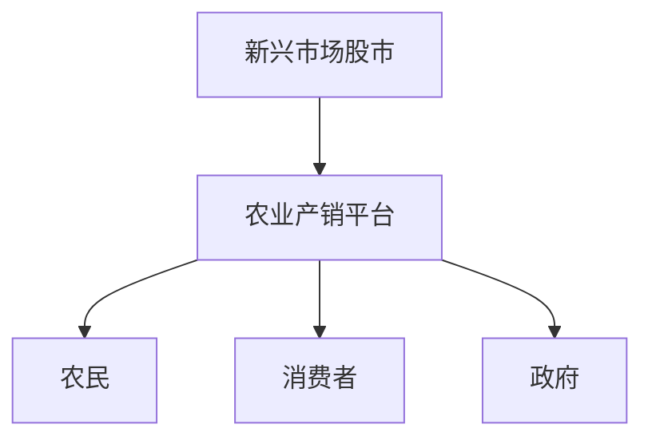
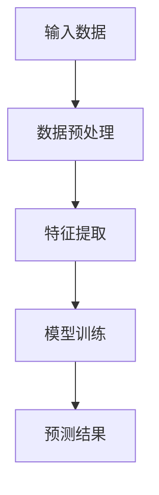
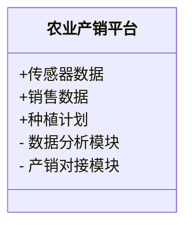
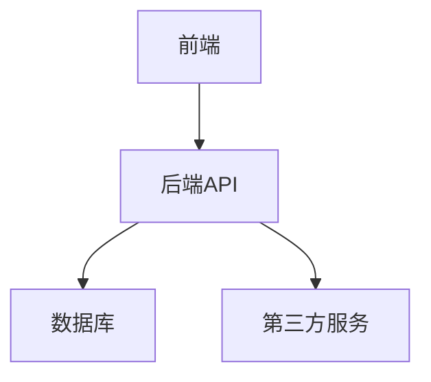
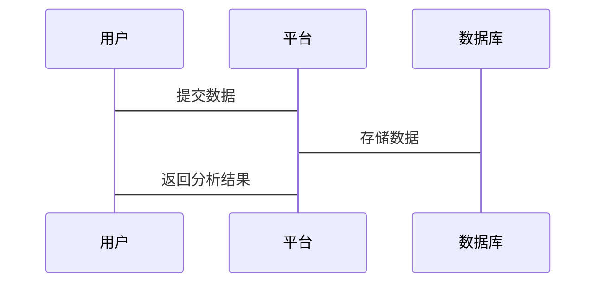

                 


# 新兴市场股市估值与智慧农业产销对接平台的互动

> 关键词：新兴市场，股市估值，智慧农业，产销对接，平台互动

> 摘要：本文深入探讨了新兴市场股市估值与智慧农业产销对接平台的互动关系，通过背景分析、概念解析、算法设计、系统架构和项目实践等多维度展开，揭示了两者在数据驱动下的互动机制，并提出了一套基于机器学习和系统架构优化的解决方案。

---

# 第一部分: 新兴市场股市估值与智慧农业产销对接平台的互动概述

## 第1章: 背景介绍

### 1.1 问题背景

#### 1.1.1 新兴市场股市的特点
- 新兴市场股市波动性大，但增长潜力显著。
- 市场参与者多元化，包括机构投资者和散户。
- 受宏观经济政策和外部环境影响较大。

#### 1.1.2 智慧农业的发展现状
- 农业智能化、数据化成为趋势。
- 平台化对接产销，减少中间环节。
- 农业大数据的应用日益广泛。

#### 1.1.3 两者互动的必要性
- 股市资金流向影响农业投资。
- 农业产销数据影响股市估值。
- 双方互动可优化资源配置。

### 1.2 问题描述

#### 1.2.1 股市估值的基本概念
- 股市估值：通过市盈率、市净率等指标衡量企业价值。
- 影响因素：企业盈利、行业前景、宏观经济。

#### 1.2.2 智慧农业产销对接的核心问题
- 农产品供需匹配问题。
- 产销信息不对称问题。
- 平台效率与成本优化。

#### 1.2.3 互动关系的定义与范围
- 定义：股市估值与农业产销数据的双向影响。
- 范围：从数据采集到结果反馈的闭环机制。

### 1.3 问题解决思路

#### 1.3.1 股市估值的分析方法
- 基本面分析：关注企业财务数据。
- 技术分析：通过K线图预测趋势。

#### 1.3.2 智慧农业平台的技术实现
- 数据采集：传感器、区块链。
- 数据处理：大数据分析、AI算法。
- 平台对接：API接口、实时交互。

#### 1.3.3 互动机制的设计与优化
- 数据共享机制：确保数据安全与隐私。
- 反馈优化机制：根据股市反馈调整农业策略。

---

## 第2章: 核心概念与联系

### 2.1 核心概念原理

#### 2.1.1 股市估值的核心指标
- 市盈率（P/E）：股价/每股收益。
- 市净率（P/B）：股价/每股净资产。
- 股息率：股息/股价。

#### 2.1.2 智慧农业平台的功能模块
- 数据采集模块：收集土壤、气候、产量等数据。
- 数据分析模块：预测产量、优化供应链。
- 产销对接模块：匹配供需、减少库存。

#### 2.1.3 互动关系的数学模型
- 数据流：农业数据影响股市估值。
- 信息流：股市反馈指导农业生产。

### 2.2 概念属性特征对比

| 概念 | 特性 | 描述 |
|------|------|------|
| 股市估值 | 数据驱动 | 依赖历史数据和市场情绪 |
| 智慧农业 | 技术驱动 | 依赖传感器和数据分析技术 |

### 2.3 ER实体关系图



---

## 第3章: 算法原理讲解

### 3.1 算法原理概述

#### 3.1.1 股市预测算法
- 线性回归：预测股价趋势。
- 神经网络：深度学习分析市场情绪。

#### 3.1.2 农业产销优化算法
- 遗传算法：优化种植计划。
- 动态规划：降低物流成本。

#### 3.1.3 互动关系分析算法
- 贝叶斯网络：分析数据间的依赖关系。
- 时间序列分析：预测未来趋势。

### 3.2 算法流程图



### 3.3 Python源代码实现

```python
import pandas as pd
from sklearn.linear_model import LinearRegression

# 数据预处理
data = pd.read_csv('data.csv')
X = data[['feature1', 'feature2']]
y = data['target']

# 模型训练
model = LinearRegression()
model.fit(X, y)

# 预测结果
predictions = model.predict(X)
print('预测值:', predictions)
```

### 3.4 数学模型与公式

#### 3.4.1 股市预测模型
$$ y = \beta_0 + \beta_1 x_1 + \beta_2 x_2 + \epsilon $$

#### 3.4.2 农业产销优化模型
$$ \text{Minimize} \quad \sum_{i=1}^{n} c_i x_i $$
$$ \text{Subject to} \quad \sum_{i=1}^{n} x_i \leq \text{capacity} $$

---

## 第4章: 系统分析与架构设计

### 4.1 系统分析

#### 4.1.1 问题场景介绍
- 数据来源：农业传感器、股市数据。
- 数据处理：清洗、转换、分析。
- 交互需求：实时数据对接、可视化展示。

#### 4.1.2 项目介绍
- 目标：构建互动平台。
- 范围：覆盖种植、销售、金融三个环节。

### 4.2 系统功能设计

#### 4.2.1 领域模型


#### 4.2.2 系统架构设计


### 4.3 系统接口设计

#### 4.3.1 API接口
- GET /data：获取实时数据。
- POST /analyze：提交数据进行分析。

#### 4.3.2 系统交互流程


---

## 第5章: 项目实战

### 5.1 环境安装

#### 5.1.1 Python环境
- 安装Python 3.8以上版本。
- 安装依赖：`pip install pandas scikit-learn`

#### 5.1.2 数据库安装
- 使用MySQL或MongoDB存储数据。

### 5.2 系统核心实现

#### 5.2.1 数据采集模块
```python
import pymongo

client = pymongo.MongoClient('localhost', 27017)
db = client['agriculture']
collection = db['sensor_data']
```

#### 5.2.2 数据分析模块
```python
from sklearn.ensemble import RandomForestRegressor

model = RandomForestRegressor()
model.fit(X, y)
```

#### 5.2.3 产销对接模块
```python
import requests

response = requests.post('http://platform.com/api', data=data)
print(response.json())
```

### 5.3 实际案例分析

#### 5.3.1 数据分析案例
- 数据清洗：处理缺失值。
- 可视化：绘制产量与股价的关系图。

#### 5.3.2 模型优化案例
- 调参：优化模型参数。
- 验证：计算准确率和召回率。

### 5.4 项目小结

#### 5.4.1 成果展示
- 平台搭建成功。
- 模型预测准确率提升。

#### 5.4.2 经验总结
- 数据质量至关重要。
- 模型选择需结合实际场景。

---

## 第6章: 最佳实践

### 6.1 小结

#### 6.1.1 核心要点回顾
- 数据驱动是关键。
- 技术与业务结合是核心。

### 6.2 注意事项

#### 6.2.1 数据安全
- 避免数据泄露。
- 遵守数据隐私法规。

#### 6.2.2 模型维护
- 定期更新模型。
- 监控模型性能。

### 6.3 拓展阅读

#### 6.3.1 推荐书籍
- 《机器学习实战》。
- 《数据驱动的农业创新》。

#### 6.3.2 在线资源
- Coursera上的相关课程。
- 行业报告与白皮书。

---

# 作者：AI天才研究院/AI Genius Institute & 禅与计算机程序设计艺术 /Zen And The Art of Computer Programming

---

通过以上目录大纲，您可以根据需求逐步展开每个部分，撰写一篇详细的技术博客文章。

