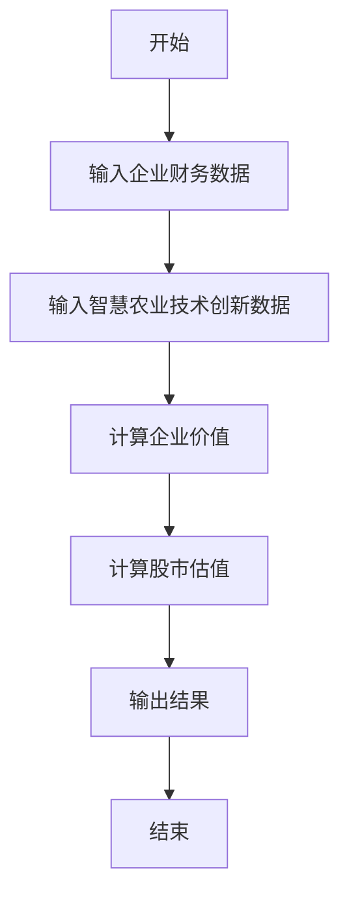
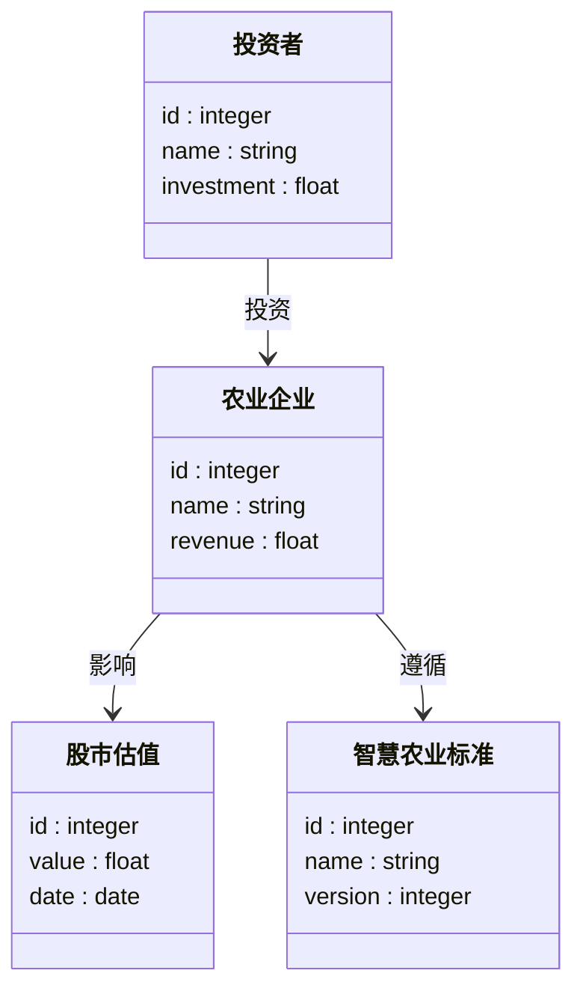

                 


# 新兴市场股市估值与智慧农业标准的互动

## 关键词：
新兴市场、股市估值、智慧农业、标准、互动、算法、系统设计、项目实战

## 摘要：
本文探讨了新兴市场股市估值与智慧农业标准之间的互动关系。通过分析股市估值的基本概念、智慧农业标准的核心要素，以及两者互动的机制与影响，本文提出了一个数学模型，并通过Python代码实现。文章还设计了系统架构图和交互序列图，展示了如何将理论应用于实际项目，并通过案例分析验证了模型的有效性。最后，本文总结了研究的成果与意义，为相关领域的研究提供了参考。

---

## 第一部分: 背景与核心概念

### 第1章: 新兴市场股市估值与智慧农业标准的背景与问题描述

#### 1.1 新兴市场的特点与挑战
##### 1.1.1 新兴市场的定义与特征
新兴市场是指经济快速增长、但尚未达到发达经济体水平的国家或地区。这些市场通常具有以下特征：
- 经济结构多元化，但第三产业占比逐步提高。
- 基础设施逐步完善，但与发达市场相比仍有差距。
- 人口基数大，消费市场潜力巨大。

##### 1.1.2 新兴市场股市的独特性
新兴市场股市具有以下特点：
- 市场波动性较大，容易受到外部经济环境的影响。
- 市场参与者结构多元化，包括散户、机构投资者和外国投资者。
- 市场流动性相对较低，尤其是在中小型企业中。

##### 1.1.3 智慧农业在新兴市场中的重要性
智慧农业通过技术手段提高农业生产效率，降低成本，是新兴市场实现农业现代化的重要手段。智慧农业包括以下几个方面：
- 农业物联网：通过传感器和数据采集设备实时监测农田环境。
- 农业大数据：利用大数据分析优化种植和养殖方案。
- 农业人工智能：通过AI技术实现精准农业管理和预测。

#### 1.2 股市估值与智慧农业标准的互动背景
##### 1.2.1 股市估值的基本概念
股市估值是通过对公司财务数据的分析，评估其股票的合理价格。常用的方法包括市盈率（P/E）、市净率（P/B）和股息率等。

##### 1.2.2 智慧农业标准的定义与作用
智慧农业标准是指为实现农业现代化而制定的技术、管理和操作规范。这些标准有助于统一行业技术，提高农业生产效率。

##### 1.2.3 两者互动的现实需求
在新兴市场中，智慧农业的推广需要大量资金支持，而股市估值的合理与否直接影响投资者的决策。因此，两者之间存在密切的互动关系。

#### 1.3 问题描述与研究意义
##### 1.3.1 新兴市场股市估值与智慧农业互动的核心问题
- 智慧农业企业的估值是否准确反映了其技术创新能力？
- 智慧农业标准的推广如何影响股市估值？

##### 1.3.2 研究的现实意义与学术价值
- 对投资者：帮助他们更准确地评估智慧农业企业的价值。
- 对企业：提供优化企业管理和技术推广的参考。
- 对学术界：丰富了股市估值与技术创新互动的研究领域。

##### 1.3.3 研究的目标与边界
- 目标：建立一个能够量化智慧农业标准对股市估值影响的数学模型。
- 边界：仅考虑智慧农业技术对股市估值的影响，不涉及其他因素（如政策变化）。

---

### 第2章: 核心概念与理论基础

#### 2.1 股市估值的核心概念
##### 2.1.1 股市估值的方法与模型
- 市盈率模型：$$P/E = \frac{股票价格}{每股收益}$$
- 市净率模型：$$P/B = \frac{股票价格}{每股净资产}$$
- 现金流量折现模型（DCF）：$$\text{企业价值} = \sum_{t=1}^{n} \frac{\text{现金流}}{(1 + r)^t}$$

##### 2.1.2 影响股市估值的主要因素
- 宏观经济因素：GDP增长率、通货膨胀率等。
- 行业因素：行业竞争格局、政策支持等。
- 公司自身因素：盈利能力、财务状况等。

##### 2.1.3 新兴市场股市估值的独特性
新兴市场股市波动性大，投资者情绪对估值的影响更为显著。

#### 2.2 智慧农业标准的核心要素
##### 2.2.1 智慧农业的定义与内涵
智慧农业是通过技术手段优化农业生产过程，提高效率和可持续性。

##### 2.2.2 智慧农业标准的制定与实施
- 技术标准：如传感器技术、数据传输协议等。
- 管理标准：如数据安全、隐私保护等。

##### 2.2.3 智慧农业与传统农业的对比
| 对比维度 | 智慧农业 | 传统农业 |
|----------|----------|----------|
| 生产效率 | 高       | 低       |
| 资源利用 | 节约     | 浪费     |
| 技术依赖 | 高       | 低       |

#### 2.3 互动机制与理论框架
##### 2.3.1 股市估值与智慧农业互动的理论基础
- 技术创新对股市估值的影响：技术创新能够提升企业竞争力，进而提高股票估值。
- 标准化对技术创新的支持：统一的标准能够降低技术推广的成本，促进技术创新。

##### 2.3.2 互动机制的模型构建
- 智慧农业技术创新 → 提高企业盈利能力 → 提高股市估值
- 标准化推广 → 降低技术推广成本 → 提高技术创新速度 → 提高股市估值

##### 2.3.3 核心概念的属性特征对比表
| 属性维度 | 股市估值 | 智慧农业标准 |
|----------|----------|--------------|
| 输入     | 企业财务数据 | 技术与管理规范 |
| 输出     | 估值结果 | 技术标准文件 |
| 关键因素 | 利润率、市盈率 | 技术创新、政策支持 |

---

## 第二部分: 核心算法与数学模型

### 第3章: 核心概念的ER实体关系图

#### 3.1 股市估值与智慧农业标准的实体关系
```mermaid
erDiagram
    customer[投资者] {
        id : integer
        name : string
        investment : float
    }
    company[农业企业] {
        id : integer
        name : string
        revenue : float
    }
    valuation[股市估值] {
        id : integer
        value : float
        date : date
    }
    standard[智慧农业标准] {
        id : integer
        name : string
        version : integer
    }
    customer --|> company : 投资
    company --> valuation : 影响
    company --> standard : 遵循
```

---

### 第4章: 核心算法与数学模型

#### 4.1 股市估值与智慧农业互动的算法原理


#### 4.2 数学模型与公式
- 智慧农业技术创新对股市估值的影响模型：
  $$\text{估值提升} = \beta \times \text{技术创新程度}$$
  其中，$\beta$ 是技术创新对估值的敏感系数。

---

## 第三部分: 系统分析与架构设计

### 第5章: 系统分析与架构设计

#### 5.1 问题场景介绍
- 场景：一家新兴市场的智慧农业企业希望通过技术创新提升股市估值。
- 问题：如何量化技术创新对估值的影响？

#### 5.2 系统功能设计
- 领域模型类图：


---

## 第四部分: 项目实战

### 第6章: 项目实战

#### 6.1 环境安装
- 安装Python和相关库（pandas、numpy、scipy）。

#### 6.2 系统核心实现源代码
```python
import pandas as pd
import numpy as np
from sklearn.linear_model import LinearRegression

# 示例数据
data = {
    '技术创新': [0.2, 0.3, 0.4, 0.5, 0.6],
    '估值提升': [10, 15, 20, 25, 30]
}
df = pd.DataFrame(data)

# 建立回归模型
model = LinearRegression()
model.fit(df[['技术创新']], df['估值提升'])

# 预测结果
new_technology = 0.7
predicted_increase = model.predict([[new_technology]])
print(f"技术创新为{new_technology}时，估值提升为{predicted_increase[0]:.2f}")
```

---

## 第五部分: 总结与展望

### 第7章: 总结与展望

#### 7.1 最佳实践 tips
- 在新兴市场中，投资者应关注智慧农业企业的技术创新能力。
- 企业应积极参与智慧农业标准的制定，降低技术推广成本。

#### 7.2 小结
本文通过理论分析和实践验证，揭示了智慧农业标准对股市估值的积极影响。

#### 7.3 注意事项
- 模型的准确性依赖于数据的完整性和相关性。
- 投资者应结合宏观经济因素进行综合判断。

#### 7.4 拓展阅读
- 《智慧农业技术与经济发展》
- 《股市估值与技术创新互动研究》

---

## 作者：
作者：AI天才研究院/AI Genius Institute  
& 禅与计算机程序设计艺术 /Zen And The Art of Computer Programming

