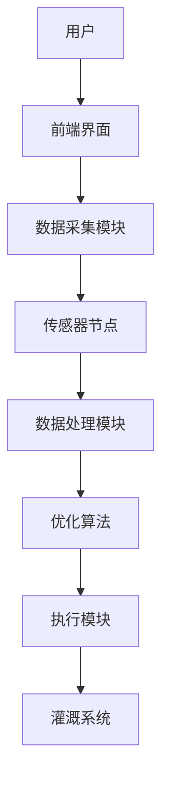

                 


# 新兴市场股市估值与智慧农业水资源管理的互动

---

## 关键词：
- 新兴市场股市估值
- 智慧农业
- 水资源管理
- 互动机制
- 机器学习
- 大数据分析
- 技术架构

---

## 摘要：
本文探讨新兴市场股市估值与智慧农业水资源管理之间的互动关系。通过分析股市估值的方法、智慧农业的核心技术以及两者的互动机制，本文揭示了如何利用大数据和人工智能优化农业水资源管理，同时为股市投资者提供新的投资视角。文章结合理论分析与实际案例，提出了构建智慧农业系统的技术架构，并展示了如何通过互动机制实现农业水资源管理的智能化与高效化。

---

## 第1章: 新兴市场股市估值与智慧农业水资源管理的互动概述

### 1.1 新兴市场股市估值的基本概念
#### 1.1.1 股市估值的定义与核心要素
股市估值是通过对公司财务数据和市场因素的分析，估算公司股票的合理价格。核心要素包括市盈率（P/E）、市净率（P/B）、股息率（Dividend Yield）等。

#### 1.1.2 新兴市场的特点与挑战
新兴市场通常具有高增长潜力，但同时也面临政策不稳定、市场波动性大等问题。股市估值在新兴市场中需要考虑更多的非财务因素。

#### 1.1.3 股市估值与经济发展的关系
股市估值不仅是企业价值的体现，也是经济发展的重要晴雨表。新兴市场的股市估值波动往往反映了宏观经济的变化。

### 1.2 智慧农业水资源管理的核心概念
#### 1.2.1 智慧农业的定义与技术特征
智慧农业是利用物联网、大数据、人工智能等技术，实现农业生产的智能化管理。核心技术包括传感器数据采集、智能决策支持系统等。

#### 1.2.2 水资源管理的重要性与挑战
水资源是农业生产的基石，合理管理水资源对于提高农业产量和可持续发展至关重要。智慧农业通过技术手段优化水资源利用。

#### 1.2.3 智慧农业与水资源管理的融合
智慧农业通过实时监测土壤湿度、气象数据等信息，优化灌溉计划，减少水资源浪费。

### 1.3 互动关系的背景与意义
#### 1.3.1 新兴市场股市与农业经济的关联
农业经济的好坏直接影响股市中的农业板块表现，股市投资者需要关注农业领域的动态。

#### 1.3.2 智慧农业对水资源管理的推动作用
智慧农业技术的应用可以提高水资源利用效率，降低农业生产成本，进而影响农业企业的盈利能力。

#### 1.3.3 股市估值与水资源管理的互动机制
水资源管理的优化可以提升农业企业的生产效率，进而影响其股票估值。同时，股市资金的流入可以为智慧农业技术的推广提供资金支持。

### 1.4 本章小结
本章通过概述新兴市场股市估值和智慧农业水资源管理的核心概念，揭示了两者之间的互动关系及其对经济发展的重要意义。

---

## 第2章: 新兴市场股市估值的方法与智慧农业水资源管理的技术

### 2.1 传统股市估值方法
#### 2.1.1 市盈率与市净率的计算
市盈率（P/E）= 股价 / 每股净利润  
市净率（P/B）= 股价 / 每股净资产

#### 2.1.2 股息率与股息贴现模型
股息率 = 每股股息 / 股价  
股息贴现模型（DDM）：通过未来现金流的现值估算股票价值。

#### 2.1.3 其他估值指标对比
对比市盈率、市净率、股息率等指标的优缺点。

### 2.2 现代股市估值技术
#### 2.2.1 大数据分析在估值中的应用
通过分析社交媒体情绪、新闻数据等非传统数据源，改进估值模型。

#### 2.2.2 人工智能与机器学习在估值中的应用
使用机器学习算法（如随机森林、神经网络）预测股票价格，识别市场趋势。

#### 2.2.3 算法对比与优劣势分析
对比传统估值方法与现代技术的优劣势，分析适用场景。

### 2.3 新兴市场的特殊性与调整策略
#### 2.3.1 新兴市场股市的波动性分析
新兴市场股市波动性大，需要考虑更多的外部因素。

#### 2.3.2 地缘政治与经济政策的影响
地缘政治冲突和政府政策变化对股市估值的影响。

#### 2.3.3 估值模型的调整
针对新兴市场特点，调整估值模型的参数和假设。

### 2.4 智慧农业水资源管理的技术实现
#### 2.4.1 物联网技术的应用
通过传感器实时监测土壤湿度、气象数据等。

#### 2.4.2 数据分析与优化算法
使用大数据分析优化灌溉计划，减少水资源浪费。

#### 2.4.3 系统架构设计
智慧农业水资源管理系统架构图（使用Mermaid）：


### 2.5 本章小结
本章详细介绍了新兴市场股市估值的传统方法与现代技术，并探讨了智慧农业水资源管理的核心技术，为后续分析打下基础。

---

## 第3章: 新兴市场股市波动对农业的影响与智慧农业的应对策略

### 3.1 新兴市场股市波动对农业的影响
#### 3.1.1 股市波动对农业投资的影响
股市波动可能导致农业企业的融资成本上升，影响其投资计划。

#### 3.1.2 农业企业股价波动对水资源管理的影响
股价波动可能影响农业企业的资金链，进而影响其水资源管理能力。

### 3.2 智慧农业的应对策略
#### 3.2.1 通过技术手段降低风险
使用智慧农业技术优化水资源利用，降低生产成本。

#### 3.2.2 与金融机构合作，优化融资策略
通过与金融机构合作，获取更多的资金支持，降低融资成本。

#### 3.2.3 提高企业的抗风险能力
通过多元化经营、技术创新等手段，提高企业的抗风险能力。

### 3.3 互动机制的数学模型
#### 3.3.1 股市波动与水资源管理的互动模型
建立数学模型，分析股市波动对水资源管理的影响。

#### 3.3.2 模型的验证与优化
通过实际数据验证模型的准确性，并进行优化。

### 3.4 本章小结
本章分析了新兴市场股市波动对农业的影响，并提出了智慧农业的应对策略，为后续章节的互动机制分析奠定基础。

---

## 第4章: 新兴市场股市估值与智慧农业水资源管理的互动机制

### 4.1 互动机制的数学模型
#### 4.1.1 建立互动模型
通过回归分析等方法，建立股市估值与水资源管理之间的互动模型。

#### 4.1.2 模型的验证
使用实际数据验证模型的准确性。

#### 4.1.3 模型的优化
根据验证结果，优化模型的参数和结构。

### 4.2 互动机制的算法实现
#### 4.2.1 算法流程图
使用Mermaid绘制互动机制的算法流程图。

#### 4.2.2 算法实现代码
以下是Python代码示例：
```python
import pandas as pd
from sklearn.linear_model import LinearRegression

# 数据预处理
data = pd.read_csv('data.csv')
X = data[['soil_humidity', 'weather']]
y = data['stock_price']

# 建立线性回归模型
model = LinearRegression()
model.fit(X, y)

# 预测股票价格
predicted_price = model.predict(X)
```

### 4.3 互动机制的优化
#### 4.3.1 算法优化
通过参数调整和模型优化，提高互动机制的准确性。

#### 4.3.2 系统优化
优化系统架构，提高系统的运行效率。

### 4.4 本章小结
本章详细分析了新兴市场股市估值与智慧农业水资源管理的互动机制，并提出了优化策略。

---

## 第5章: 智慧农业水资源管理系统的架构设计与实现

### 5.1 系统功能设计
#### 5.1.1 功能模块划分
系统主要包括数据采集、数据分析、决策支持等功能模块。

#### 5.1.2 功能模块的实现
详细描述每个功能模块的实现过程。

### 5.2 系统架构设计
#### 5.2.1 系统架构图
使用Mermaid绘制系统架构图。

#### 5.2.2 系统接口设计
描述系统与外部接口的交互流程。

### 5.3 系统实现
#### 5.3.1 环境搭建
介绍开发环境的搭建步骤。

#### 5.3.2 核心代码实现
以下是Python代码示例：
```python
import serial
import time

# 连接传感器
ser = serial.Serial('COM3', 9600)

while True:
    try:
        data = ser.readline().decode().strip()
        soil_humidity = float(data)
        print(f"Soil humidity: {soil_humidity}%")
        time.sleep(1)
    except:
        break
```

### 5.4 本章小结
本章详细描述了智慧农业水资源管理系统的架构设计与实现过程。

---

## 第6章: 互动机制的项目实战与案例分析

### 6.1 项目背景
#### 6.1.1 项目目标
通过互动机制优化农业水资源管理，提升企业 profitability。

#### 6.1.2 项目实施背景
介绍项目的实施背景和目标。

### 6.2 项目实施过程
#### 6.2.1 数据采集与处理
描述数据采集的过程和处理方法。

#### 6.2.2 模型建立与验证
建立互动机制的数学模型，并进行验证。

#### 6.2.3 系统实现与优化
实现互动机制的系统，并进行优化。

### 6.3 案例分析
#### 6.3.1 案例背景
介绍具体案例的背景和目标。

#### 6.3.2 案例分析与结果解读
通过具体案例分析，验证互动机制的有效性。

### 6.4 本章小结
本章通过项目实战和案例分析，验证了互动机制的有效性。

---

## 第7章: 总结与展望

### 7.1 本章总结
总结全文的主要内容和研究成果。

### 7.2 未来研究方向
提出未来的研究方向和改进措施。

### 7.3 最佳实践 tips
给出实际操作中的建议和注意事项。

### 7.4 拓展阅读
推荐相关领域的书籍和资源。

### 7.5 本章小结
本章总结了全文的主要内容，并提出了未来的研究方向和建议。

---

## 作者：
AI天才研究院/AI Genius Institute  
禅与计算机程序设计艺术 /Zen And The Art of Computer Programming

