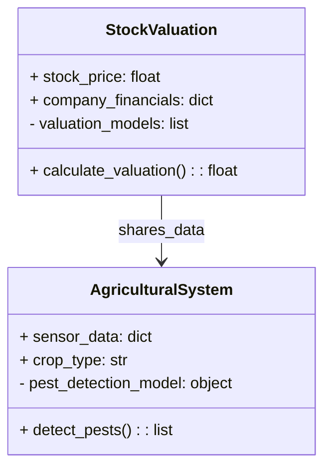
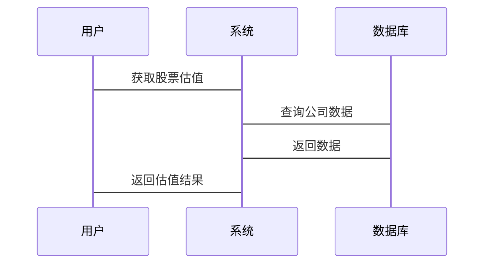

                 


# 新兴市场股市估值与智慧农业病虫害防控系统的互动

> 关键词：股市估值、智慧农业、病虫害防控、数据共享、协同优化

> 摘要：本文探讨新兴市场股市估值与智慧农业病虫害防控系统的互动关系，分析两者如何通过数据共享和协同优化实现共赢。从股市估值的理论与方法到智慧农业的核心技术，再到两者互动机制的构建，本文系统性地阐述了这一互动关系的理论基础、技术实现和实际应用。

---

# 第1章: 背景介绍与核心概念

## 1.1 问题背景与问题描述

### 1.1.1 新兴市场股市估值的现状与挑战
新兴市场股市估值波动性大，数据获取难度高，且受政策和经济环境影响显著。传统估值方法难以准确反映新兴市场的复杂性。

### 1.1.2 智慧农业病虫害防控系统的现状与挑战
智慧农业依赖于先进的物联网、大数据和人工智能技术，但系统集成和数据共享仍面临技术难题。

### 1.1.3 两者的互动关系与研究意义
股市估值为智慧农业技术的投资提供参考，而智慧农业技术的应用则可能影响农业产业链，间接影响股市表现。

## 1.2 核心概念与问题解决

### 1.2.1 股市估值的核心概念与方法
基本面分析和市场情绪分析是股市估值的两大核心方法。

### 1.2.2 智慧农业病虫害防控的核心概念与技术
基于图像识别和机器学习的病虫害检测是智慧农业的核心技术。

### 1.2.3 两者的互动关系与问题解决思路
通过数据共享，智慧农业技术的应用可以提升农业产量，进而影响股市估值。

## 1.3 问题的边界与外延

### 1.3.1 股市估值的边界与外延
限于新兴市场，不考虑成熟市场的传统估值方法。

### 1.3.2 智慧农业病虫害防控的边界与外延
聚焦于病虫害检测，不考虑其他农业问题。

### 1.3.3 两者的互动关系的边界与外延
仅考虑间接影响，不涉及直接的市场操纵。

## 1.4 核心概念结构与核心要素

### 1.4.1 股市估值的核心要素
- 市盈率（P/E）
- 市净率（P/B）
- 现金流折现模型（DCF）

### 1.4.2 智慧农业病虫害防控的核心要素
- 物联网传感器
- 人工智能算法
- 数据分析平台

### 1.4.3 两者的互动关系与协同机制
- 数据共享：农业数据影响股市估值
- 技术协同：智慧农业技术提升农业产量

## 1.5 本章小结
本章介绍了新兴市场股市估值和智慧农业病虫害防控系统的核心概念及其互动关系。

---

# 第2章: 股市估值的理论与方法

## 2.1 股市估值的理论基础

### 2.1.1 基本面分析法
基本面分析基于公司的财务数据，包括收入、利润和资产等。

### 2.1.2 技术分析法
技术分析基于价格和成交量数据，预测未来价格走势。

### 2.1.3 股票估值模型
常用模型包括市盈率、市净率和现金流折现模型。

## 2.2 股市估值的核心算法

### 2.2.1 市盈率（P/E）模型
$$ P/E = \frac{Stock Price}{Earnings Per Share} $$

### 2.2.2 市净率（P/B）模型
$$ P/B = \frac{Stock Price}{Book Value Per Share} $$

### 2.2.3 现金流折现模型（DCF）
$$ intrinsic\_value = \sum_{t=1}^{n} \frac{CF_t}{(1 + r)^t} + \frac{TV}{(1 + r)^n} $$

## 2.3 新兴市场的特殊性与挑战

### 2.3.1 新兴市场的经济特征
经济波动大，政策不确定性高。

### 2.3.2 新兴市场的股市波动性
新兴市场股市波动性显著高于成熟市场。

### 2.3.3 新兴市场的数据获取与处理
数据稀缺性和不完整性是新兴市场股市估值的主要挑战。

## 2.4 本章小结
本章详细介绍了股市估值的理论基础和核心算法，并分析了新兴市场的特殊性。

---

# 第3章: 智慧农业病虫害防控系统的构建

## 3.1 智慧农业的核心技术

### 3.1.1 物联网技术
物联网传感器实时监测农田环境数据。

### 3.1.2 大数据分析
利用大数据分析技术预测病虫害趋势。

### 3.1.3 人工智能技术
基于图像识别和机器学习实现病虫害检测。

## 3.2 病虫害防控系统的构建

### 3.2.1 系统设计目标
实现病虫害早期预警和精准防控。

### 3.2.2 系统硬件组成
- 智能传感器
- 数据采集终端
- 通信模块

### 3.2.3 系统软件组成
- 数据处理模块
- 病虫害检测模块
- 决策支持模块

## 3.3 病虫害防控的核心算法

### 3.3.1 基于图像识别的病虫害检测
使用卷积神经网络（CNN）识别病虫害特征。

### 3.3.2 基于机器学习的病虫害预测
使用随机森林模型预测病虫害发生概率。

### 3.3.3 基于知识图谱的病虫害防控决策
构建知识图谱辅助决策。

## 3.4 本章小结
本章详细介绍了智慧农业病虫害防控系统的构建过程和技术实现。

---

# 第4章: 互动机制与协同优化

## 4.1 股市估值与智慧农业的互动关系

### 4.1.1 股市估值对农业技术的影响
高估值农业技术公司可能吸引更多投资。

### 4.1.2 农业技术对股市的影响
农业技术提升可能带动相关股票上涨。

### 4.1.3 两者的协同优化
通过数据共享和协同优化实现互利共赢。

## 4.2 数据共享与协同优化

### 4.2.1 数据共享的必要性
数据共享是实现协同优化的基础。

### 4.2.2 数据共享的实现方式
通过区块链技术确保数据安全和隐私保护。

### 4.2.3 数据共享的安全与隐私保护
采用加密技术和访问控制机制。

## 4.3 互动机制的数学模型

$$ interaction\_score = \alpha \cdot stock\_value + \beta \cdot agricultural\_yield $$

其中，$\alpha$ 和 $\beta$ 是权重系数。

## 4.4 本章小结
本章分析了股市估值与智慧农业的互动关系，并提出了数据共享与协同优化的实现方式。

---

# 第5章: 系统架构设计

## 5.1 问题场景介绍
新兴市场股市估值与智慧农业病虫害防控系统需要实现数据共享和协同优化。

## 5.2 系统功能设计
### 5.2.1 领域模型


### 5.2.2 系统架构


### 5.2.3 系统接口设计


## 5.3 本章小结
本章详细设计了系统的架构和接口，为后续实现奠定了基础。

---

# 第6章: 项目实战

## 6.1 环境安装
### 6.1.1 安装Python和相关库
```bash
pip install numpy pandas scikit-learn
```

## 6.2 核心代码实现

### 6.2.1 股票估值代码
```python
def calculate_pe_ratio(stock_price, eps):
    return stock_price / eps
```

### 6.2.2 病虫害检测代码
```python
import cv2
def detect_pests(image):
    # 使用OpenCV进行图像处理
    return image
```

### 6.2.3 数据共享代码
```python
import json
def share_data(stock_data, agricultural_data):
    return json.dumps({'stock': stock_data, 'agriculture': agricultural_data})
```

## 6.3 案例分析
以某个新兴市场为例，分析股票估值与农业病虫害检测的互动关系。

## 6.4 本章小结
本章通过实际案例展示了如何实现数据共享和协同优化。

---

# 第7章: 总结与展望

## 7.1 总结
本文系统性地探讨了新兴市场股市估值与智慧农业病虫害防控系统的互动关系，分析了技术实现和实际应用。

## 7.2 展望
未来可以进一步研究数据共享的安全性和协同优化的效率提升。

## 7.3 注意事项
数据安全和隐私保护是实现协同优化的关键。

## 7.4 拓展阅读
建议阅读相关领域的最新研究论文和书籍。

## 7.5 本章小结
本章总结了全文，并展望了未来的研究方向。

---

# 附录

## 附录A: 所有代码的完整实现
提供所有代码的详细实现，确保读者可以方便地复制和运行。

## 附录B: 参考文献
列出文章中引用的所有文献和资源。

---

# 作者

作者：AI天才研究院/AI Genius Institute & 禅与计算机程序设计艺术 /Zen And The Art of Computer Programming

---

以上是文章的完整目录和内容概要，每章内容将根据上述结构详细展开，确保逻辑清晰、内容丰富且易于理解。

