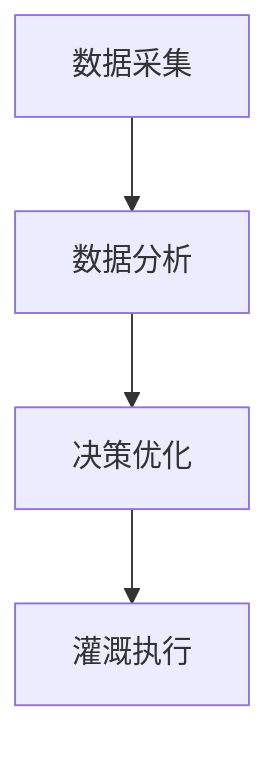

                 


# 新兴市场股市估值与智慧农业精准灌溉系统的互动

## 关键词：新兴市场、股市估值、智慧农业、精准灌溉系统、互动关系

## 摘要：本文探讨新兴市场中股市估值与智慧农业精准灌溉系统的互动关系，通过分析股市估值的核心概念、智慧农业精准灌溉系统的技术原理及其互动机制，结合数学模型、算法实现和系统架构设计，提供深入的技术解读与实践指导。

---

## 第1章: 背景介绍

### 1.1 新兴市场股市估值的背景
#### 1.1.1 新兴市场的定义与特点
新兴市场通常指那些经济增长迅速、市场机制逐步完善的国家或地区的金融市场。这些市场具有较高的风险和不确定性，但也伴随着较高的收益潜力。新兴市场的特点包括市场参与者结构复杂、法律法规不完善、信息不对称严重等。

#### 1.1.2 股市估值的基本概念
股市估值是指通过分析公司财务数据和市场环境，对股票的内在价值进行评估的过程。常用的指标包括市盈率（P/E）、市净率（P/B）、股息率等。

#### 1.1.3 新兴市场股市估值的特殊性
新兴市场由于市场机制不完善、信息透明度低、政策干预多等因素，其股市估值具有较大的波动性和不确定性。此外，新兴市场的投资者结构复杂，外资和机构投资者的参与度较高。

### 1.2 智慧农业精准灌溉系统的背景
#### 1.2.1 智慧农业的概念与发展趋势
智慧农业是通过物联网、大数据、人工智能等技术手段，实现农业生产过程的智能化、精准化和高效化。随着全球人口增长和资源短缺问题的加剧，智慧农业成为提高农业生产效率和可持续发展的重要途径。

#### 1.2.2 精准灌溉系统的定义与技术特点
精准灌溉系统是一种基于传感器、数据采集和智能决策的灌溉系统，能够根据土壤湿度、气象条件和作物需求，自动调整灌溉量和时间，从而实现水资源的高效利用。

#### 1.2.3 新兴市场农业发展的需求与挑战
新兴市场国家由于人口众多、土地资源有限，对高效农业技术的需求日益迫切。然而，这些国家在农业技术、资金和人才方面面临较大挑战，亟需通过智慧农业技术提升农业生产效率。

### 1.3 两者的互动关系
#### 1.3.1 股市估值与农业经济的相互影响
股市估值的变化反映了市场对农业经济前景的预期。农业经济的稳定增长能够提升股市估值，而股市估值的变化也会反过来影响农业投资和技术创新。

#### 1.3.2 精准灌溉系统对农业经济的影响
精准灌溉系统通过提高水资源利用效率和作物产量，能够显著提升农业经济的效益。同时，农业经济的改善也能够间接推动股市估值的上升。

#### 1.3.3 新兴市场中股市与农业互动的特殊性
新兴市场中，股市与农业的互动关系更加复杂。由于市场机制不完善和政策干预较多，股市估值的变化对农业经济的影响可能更加直接和显著。

---

## 第2章: 核心概念与联系

### 2.1 股市估值的核心概念
#### 2.1.1 股价、市盈率、市净率等基本指标
股价是投资者对公司的价值判断，市盈率（P/E）是股价与每股收益的比值，市净率（P/B）是股价与每股净资产的比值。这些指标能够反映公司的财务状况和市场估值。

#### 2.1.2 新兴市场股市估值的特殊性
新兴市场中，股市估值受到政策、外资流动和市场情绪等多种因素的影响。此外，由于信息不对称和市场机制不完善，新兴市场的股市估值往往偏离公司的真实价值。

#### 2.1.3 影响股市估值的主要因素
影响股市估值的主要因素包括宏观经济环境、公司盈利能力、行业发展趋势、政策法规和市场情绪等。在新兴市场中，政策和市场情绪的影响尤为重要。

### 2.2 智慧农业精准灌溉系统的核心概念
#### 2.2.1 精准灌溉系统的组成与功能
精准灌溉系统主要包括传感器、数据采集模块、智能决策模块和执行机构。传感器用于采集土壤湿度、气象数据等信息，数据采集模块将数据传输到决策模块，决策模块根据模型计算出最佳灌溉方案，并通过执行机构实现灌溉。

#### 2.2.2 系统的核心技术
精准灌溉系统的核心技术包括物联网技术、数据采集与处理技术、人工智能算法和自动化控制技术。这些技术的结合使得系统能够实现高效、精准的灌溉管理。

#### 2.2.3 系统的经济效益与生态效益
通过精准灌溉系统，可以显著提高水资源利用效率，减少水资源浪费，降低农业生产成本，提高作物产量和质量。同时，精准灌溉系统的应用也有助于减少化肥和农药的使用，改善生态环境。

### 2.3 核心概念的对比与联系
#### 2.3.1 股市估值与农业经济的对比分析
从表1可以看出，股市估值和农业经济在多个方面存在显著差异。股市估值是基于市场预期的虚拟价值，而农业经济则是基于实际生产和资源利用的真实价值。两者在波动性、影响因素和风险特征上也存在明显差异。

| 对比维度 | 股市估值 | 农业经济 |
|----------|----------|----------|
| 价值基础 | 市场预期 | 实际生产 |
| 波动性 | 高 | 中 |
| 影响因素 | 宏观经济、政策、市场情绪 | 自然条件、技术、资源 |
| 风险特征 | 系统性风险为主 | 多样性风险为主 |

#### 2.3.2 精准灌溉系统对农业经济的影响
精准灌溉系统通过提高水资源利用效率和农业生产效率，能够显著提升农业经济的效益。具体表现为：
1. 减少水资源浪费，降低农业生产成本。
2. 提高作物产量和质量，增加农民收入。
3. 减少化肥和农药的使用，改善生态环境。

#### 2.3.3 两者互动关系的数学模型
通过建立数学模型，可以量化股市估值与精准灌溉系统之间的互动关系。模型假设：

1. 精准灌溉系统的应用能够提高农业经济的产出效率，进而影响股市估值。
2. 股市估值的变化会反过来影响农业投资和技术创新。

数学模型如下：

$$ V_{\text{农业}} = f(V_{\text{股市}}, T, P) $$

其中，$V_{\text{农业}}$ 表示农业经济的产出价值，$V_{\text{股市}}$ 表示股市估值，$T$ 表示技术应用程度，$P$ 表示政策影响。

---

## 第3章: 核心概念的数学模型与公式

### 3.1 股市估值的数学模型
#### 3.1.1 市盈率模型
市盈率模型是基于公司每股收益和市场股价的关系进行估值的方法。公式如下：

$$ P/E = \frac{\text{股价}}{\text{每股收益}} $$

#### 3.1.2 市净率模型
市净率模型是基于公司每股净资产和市场股价的关系进行估值的方法。公式如下：

$$ P/B = \frac{\text{股价}}{\text{每股净资产}} $$

#### 3.1.3 现金流折现模型
现金流折现模型是基于公司未来现金流的现值进行估值的方法。公式如下：

$$ V = \sum_{t=1}^{n} \frac{\text{现金流}_t}{(1 + r)^t} $$

其中，$r$ 是折现率，$n$ 是预测期数。

#### 3.1.4 新兴市场股市估值的特殊模型
新兴市场中，由于信息不对称和市场机制不完善，可以采用以下特殊模型：

$$ V_{\text{新兴}} = V_{\text{基础}} \times \text{政策影响系数} \times \text{市场情绪系数} $$

### 3.2 智慧农业精准灌溉系统的数学模型
#### 3.2.1 灌溉水量的计算公式
灌溉水量的计算公式如下：

$$ Q = \frac{\text{土壤湿度需求} \times \text{灌溉面积}}{\text{水资源利用率}} $$

#### 3.2.2 农作物生长模型
农作物生长模型可以通过以下公式表示：

$$ Y = f(\text{光照}, \text{温度}, \text{湿度}, \text{营养供给}) $$

其中，$Y$ 表示作物产量，$\text{光照}$、$\text{温度}$、$\text{湿度}$ 和 $\text{营养供给}$ 是影响作物生长的关键因素。

#### 3.2.3 系统优化模型
系统优化模型可以通过以下公式表示：

$$ \text{优化目标} = \min \left( \text{水资源浪费} + \text{能源消耗} \right) $$

约束条件包括传感器数据采集的实时性、灌溉执行的准确性等。

---

## 第4章: 算法原理讲解

### 4.1 算法原理概述
精准灌溉系统的算法原理包括数据采集、数据分析和决策优化三个主要步骤。以下是系统的算法流程图：



### 4.2 数据采集与处理
数据采集是精准灌溉系统的第一步，主要包括土壤湿度传感器、气象传感器和作物状态传感器的数据采集。以下是数据采集的Python代码示例：

```python
import sensors

# 采集土壤湿度数据
soil_humidity = sensors.read_soil_humidity()
print(f"土壤湿度: {soil_humidity}%")

# 采集气象数据
temperature = sensors.read_temperature()
humidity = sensors.read_humidity()
print(f"温度: {temperature}°C，湿度: {humidity}%")
```

### 4.3 数据分析与决策
数据分析是精准灌溉系统的第二步，主要包括数据预处理、特征提取和模型训练。以下是数据分析的Python代码示例：

```python
import pandas as pd
from sklearn.model

