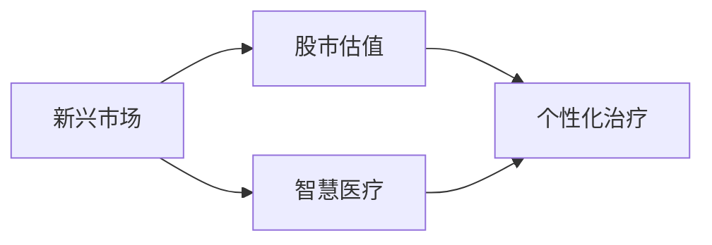

                 


# 新兴市场股市估值与智慧医疗个性化治疗的互动

> 关键词：新兴市场、股市估值、智慧医疗、个性化治疗、数据驱动、机器学习、算法模型

> 摘要：本文探讨新兴市场股市估值与智慧医疗个性化治疗之间的互动关系，通过数据驱动的方法进行建模和分析，揭示两者如何在新兴市场中相互影响，并提出跨领域的解决方案。

## 第一部分: 新兴市场股市估值与智慧医疗个性化治疗的互动背景

### 第1章: 新兴市场股市估值的现状与挑战

#### 1.1 新兴市场的定义与特点
- 新兴市场是指那些经济快速增长但尚未完全工业化的国家，如中国、印度、巴西等。
- 这些市场通常具有较高的增长率和较大的市场潜力，但也伴随着较高的波动性和不确定性。

#### 1.2 新兴市场股市估值的核心问题
- 股市估值是衡量企业价值的重要指标，但新兴市场的股市估值面临数据不完整、市场波动大等挑战。
- 传统估值方法（如市盈率、市净率）在新兴市场中可能失效，需要开发适合新兴市场的估值模型。

#### 1.3 新兴市场与发达市场的差异
- 发达市场通常具有成熟的金融体系和稳定的经济环境，而新兴市场则更具波动性和不确定性。
- 新兴市场的投资者可能更关注短期收益，而发达市场的投资者更注重长期价值。

### 第2章: 智慧医疗个性化治疗的发展趋势

#### 2.1 智慧医疗的定义与技术基础
- 智慧医疗是指利用信息技术和数据科学优化医疗流程，提高诊断和治疗效果。
- 核心技术包括大数据分析、人工智能、物联网和区块链等。

#### 2.2 个性化治疗的科学依据
- 基因组学、蛋白质组学等技术的发展为个性化治疗提供了科学依据。
- 通过分析患者的基因信息，可以制定更精准的治疗方案，提高疗效和减少副作用。

#### 2.3 智慧医疗在新兴市场的应用潜力
- 新兴市场人口基数大，医疗资源相对匮乏，智慧医疗可以提高医疗服务效率。
- 通过智慧医疗，可以实现医疗资源的优化配置和远程医疗，解决医疗资源分布不均的问题。

### 第3章: 互动关系的提出与研究意义

#### 3.1 股市估值与医疗治疗的潜在联系
- 医疗技术的进步可以提升企业的盈利能力，进而影响股市估值。
- 股市资金的流动可以影响医疗资源的分配，从而影响个性化治疗的效果。

#### 3.2 新兴市场中互动关系的独特性
- 新兴市场的经济波动和政策变化可能加剧股市估值与医疗治疗的互动。
- 新兴市场的数据获取成本较高，需要开发适合本地的互动模型。

#### 3.3 研究该互动关系的学术价值与现实意义
- 从学术角度来看，研究新兴市场股市估值与智慧医疗的互动关系可以丰富相关领域的理论研究。
- 从现实意义来看，这有助于优化医疗资源的配置，提升企业的估值，促进经济的可持续发展。

## 第二部分: 新兴市场股市估值与智慧医疗个性化治疗的核心概念与联系

### 第4章: 核心概念对比与联系

#### 4.1 股市估值与个性化治疗的核心概念对比
| 比较维度 | 股市估值 | 个性化治疗 |
|----------|----------|-------------|
| 目标     | 评估企业价值 | 制定精准治疗方案 |
| 方法     | 市盈率、市净率等 | 基因分析、机器学习模型 |
| 数据     | 财务数据、市场数据 | 医疗数据、基因数据 |

#### 4.2 实体关系图


#### 4.3 股市估值与个性化治疗的互动机制
- 医疗技术的进步可以提升企业的盈利能力和市场竞争力，从而影响股市估值。
- 股市资金的流动可以为医疗技术创新提供资金支持，促进个性化治疗的发展。

## 第三部分: 新兴市场股市估值与智慧医疗个性化治疗的互动机制

### 第5章: 互动机制的数学模型与算法原理

#### 5.1 时间序列分析在股市估值中的应用
- 时间序列分析是一种统计方法，用于分析随时间变化的数据。
- ARIMA模型（自回归积分滑动平均模型）常用于股市预测，其基本原理如下：
  - 通过历史数据预测未来的趋势。
  - 模型参数包括自回归系数和滑动平均系数。
- LSTM网络（长短期记忆网络）在处理时间序列数据方面表现优于ARIMA，因为它可以捕捉长期依赖关系。

#### 5.2 医疗数据驱动的个性化治疗模型
- 基于机器学习的治疗方案优化：通过分析患者的基因、生活习惯等数据，制定个性化治疗方案。
- 集成学习在医疗数据处理中的应用：通过集成多个模型的结果，提高预测的准确性和稳定性。
- 深度学习在医疗图像识别中的应用：通过卷积神经网络（CNN）识别医学图像中的病变区域。

#### 5.3 互动模型的构建与验证
- 模型输入：新兴市场的股市数据和医疗数据。
- 模型输出：预测股市估值的变化和个性化治疗的效果。
- 模型验证：通过历史数据验证模型的准确性和稳定性。

### 第6章: 互动机制的系统分析与架构设计

#### 6.1 系统架构设计
- 问题场景介绍：新兴市场中，如何利用数据驱动的方法优化股市估值和个性化治疗。
- 系统功能设计：包括数据采集、模型训练、预测分析和结果展示。
- 系统架构图：


#### 6.2 接口设计与交互流程
- 数据接口：从多个数据源获取股市和医疗数据。
- 模型接口：提供API供其他系统调用模型结果。
- 交互流程图：


## 第四部分: 项目实战与案例分析

### 第7章: 项目实战

#### 7.1 环境安装与数据获取
- 安装Python、TensorFlow、Keras等工具。
- 数据获取：从公开数据源获取新兴市场的股市数据和医疗数据。

#### 7.2 系统核心实现源代码
```python
# ARIMA模型实现
from statsmodels.tsa.arima_model import ARIMA
import pandas as pd

data = pd.read_csv('stock_data.csv')
model = ARIMA(data['price'], order=(5, 1, 0))
model_fit = model.fit()
```

#### 7.3 案例分析与结果解读
- 案例1：新兴市场某公司股票价格预测。
- 案例2：个性化治疗方案的制定与效果评估。

### 第8章: 互动机制的数学模型与算法原理

#### 8.1 时间序列分析
- ARIMA模型的参数选择和超参数调优。
- LSTM网络的结构设计和训练方法。

#### 8.2 医疗数据驱动的个性化治疗模型
- 机器学习算法的选择和优化。
- 深度学习模型的训练和评估。

### 第9章: 互动机制的系统分析与架构设计

#### 9.1 系统架构设计
- 分层架构：数据层、模型层、应用层。
- 每层的功能和交互关系。

#### 9.2 系统接口设计
- 数据接口：数据的输入和输出格式。
- 模型接口：API的设计和调用方法。

#### 9.3 系统交互流程
- 用户输入请求，系统返回预测结果。
- 交互流程图展示系统各部分的协作关系。

## 第五部分: 总结与展望

### 第10章: 总结与展望

#### 10.1 总结
- 新兴市场股市估值与智慧医疗个性化治疗的互动关系是一个复杂但具有潜力的领域。
- 数据驱动的方法可以有效捕捉这种互动关系，为优化股市估值和提高治疗效果提供支持。

#### 10.2 展望
- 进一步研究新兴市场中其他领域的互动关系。
- 推动数据驱动技术在更多领域的应用，促进跨学科的合作与创新。

## 第六部分: 最佳实践与注意事项

### 第11章: 最佳实践

#### 11.1 数据收集与处理
- 确保数据的准确性和完整性。
- 处理缺失数据和异常值。

#### 11.2 模型选择与优化
- 根据具体问题选择合适的算法。
- 进行模型调优和交叉验证。

#### 11.3 系统设计与实现
- 分模块设计系统，确保各部分的独立性和可扩展性。
- 使用版本控制工具管理代码。

### 第12章: 小结

#### 12.1 互动关系的重要性
- 新兴市场中股市估值和个性化治疗的互动关系对经济发展和人民健康具有重要意义。
- 通过数据驱动的方法可以有效捕捉和利用这种互动关系。

#### 12.2 未来研究方向
- 深入研究新兴市场中其他领域的互动关系。
- 推动数据驱动技术在更多领域的应用，促进跨学科的合作与创新。

## 附录

### 附录A: 参考文献
- 列出本文参考的所有文献和资料。

### 附录B: 术语表
- 解释文章中出现的专业术语和缩写。

---

作者：AI天才研究院/AI Genius Institute & 禅与计算机程序设计艺术 /Zen And The Art of Computer Programming

