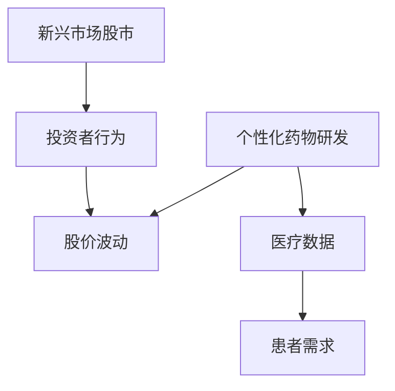
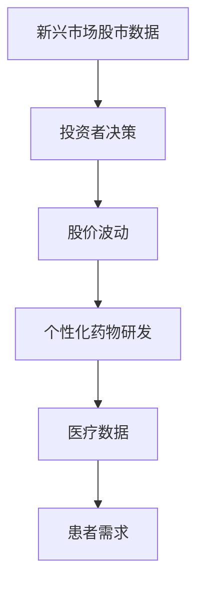
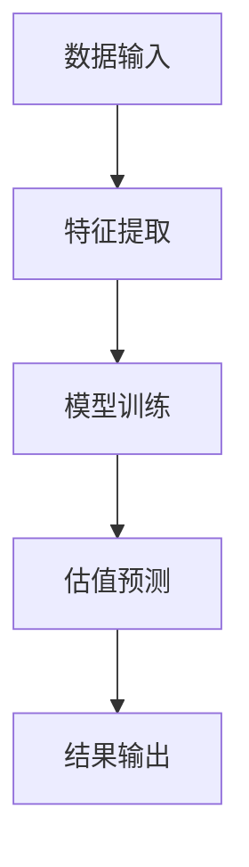
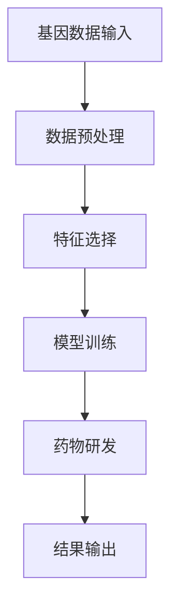
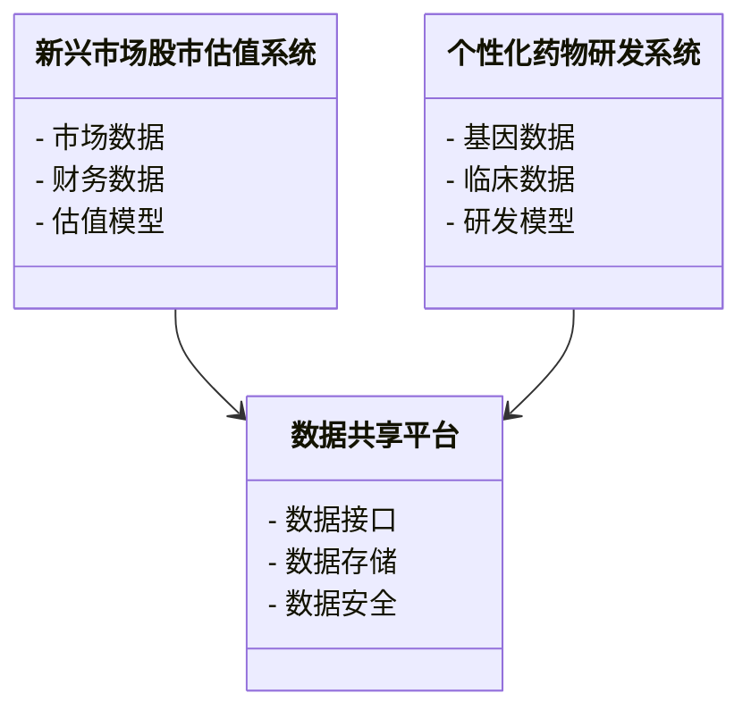
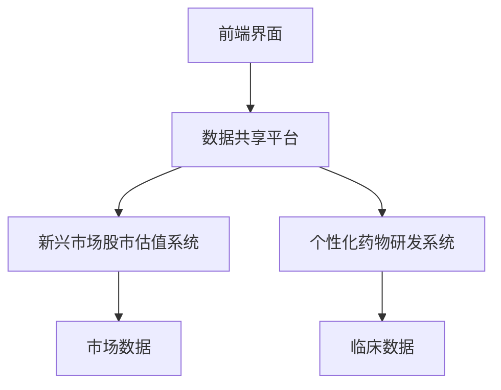
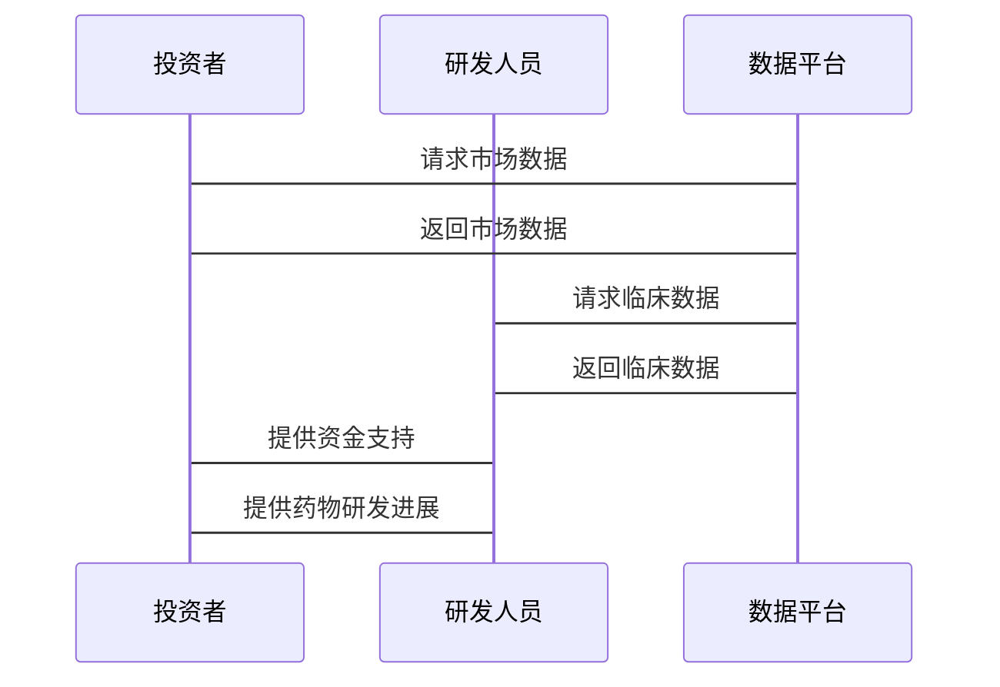

                 

<think>
好的，我将按照您的要求，先列出文章的标题、关键词、摘要，再按照目录结构撰写文章内容。

文章标题：
《新兴市场股市估值与智慧医疗个性化药物研发的互动》

关键词：
新兴市场股市估值、智慧医疗、个性化药物研发、数据驱动、技术驱动、人工智能、机器学习

摘要：
本文探讨新兴市场股市估值与智慧医疗个性化药物研发之间的互动关系，从理论分析到实际案例，系统阐述了两者如何通过数据共享、技术融合和协同创新实现共赢。文章首先介绍了新兴市场股市估值的重要性，以及个性化药物研发的核心问题，随后分析了两者的互动机制，并结合具体的算法和系统架构进行了详细阐述，最后通过实际案例展示了互动的实际效果。

---

# 第一章: 背景介绍

## 1.1 问题背景
### 1.1.1 新兴市场股市估值的重要性
新兴市场股市的估值是投资者进行投资决策的核心依据。随着全球经济一体化的推进，新兴市场的股市表现对全球经济的影响日益显著。然而，新兴市场的股市往往存在信息不对称、数据不透明等问题，这使得传统的估值方法难以准确反映市场的真实情况。

### 1.1.2 智慧医疗与个性化药物研发的兴起
智慧医疗的核心是通过大数据和人工智能技术，实现医疗资源的优化配置和个性化治疗方案的制定。个性化药物研发则是基于患者个体差异，量身定制药物，这不仅提高了治疗效果，还减少了副作用。然而，个性化药物研发需要大量的医疗数据和复杂的算法支持。

### 1.1.3 两者的互动关系与研究意义
新兴市场股市的估值与智慧医疗个性化药物研发之间的互动关系，主要体现在数据共享、技术融合和协同创新三个方面。通过对两者互动关系的研究，可以为投资者提供更准确的估值模型，同时也能为个性化药物研发提供更高效的资金支持和技术保障。

## 1.2 问题描述
### 1.2.1 新兴市场股市估值的挑战
新兴市场股市的估值面临数据不透明、市场波动大、投资者行为复杂等挑战。传统的估值方法如市盈率、市净率等难以准确反映市场的真实情况。

### 1.2.2 个性化药物研发的核心问题
个性化药物研发的核心问题是数据获取困难、算法复杂度高、计算资源不足。此外，隐私保护和数据安全问题也对研发过程提出了更高的要求。

### 1.2.3 两者的互动机制与研究边界
两者的互动机制主要体现在数据共享、技术融合和协同创新三个方面。研究边界包括数据隐私保护、技术可行性、市场接受度等问题。

## 1.3 问题解决
### 1.3.1 新兴市场股市估值的解决方案
通过引入大数据和人工智能技术，建立基于机器学习的估值模型，解决传统估值方法的局限性。

### 1.3.2 个性化药物研发的技术路径
基于基因组学、人工智能和大数据分析，构建个性化药物研发的全流程技术体系。

### 1.3.3 互动机制的构建与优化
通过数据共享平台和技术创新联盟，构建两者之间的互动机制，并通过政策支持和市场引导不断优化。

## 1.4 概念结构与核心要素
### 1.4.1 核心概念的定义与属性
- **新兴市场股市估值**：通过对公司财务数据和市场数据的分析，评估股票的内在价值。
- **个性化药物研发**：基于患者个体差异，量身定制药物，提高治疗效果。

### 1.4.2 实体关系图


---

# 第二章: 核心概念与联系

## 2.1 核心概念原理
### 2.1.1 新兴市场股市估值的原理
新兴市场股市估值的原理是通过对公司的财务数据、市场数据和宏观经济数据进行分析，评估股票的内在价值和市场价值。

### 2.1.2 智慧医疗个性化药物研发的原理
个性化药物研发的原理是通过基因组学、蛋白质组学等多组学数据，结合人工智能算法，制定个性化的治疗方案。

### 2.1.3 两者的关联机制
新兴市场股市估值的准确性和个性化药物研发的成功率之间存在密切的互动关系。股市估值的准确反映可以为个性化药物研发提供更多的资金支持，而个性化药物研发的成功则可以提升股市投资者的信心。

## 2.2 核心概念属性对比
### 2.2.1 对比表格
| 属性               | 新兴市场股市估值         | 个性化药物研发       |
|--------------------|-------------------------|----------------------|
| 核心数据           | 财务数据、市场数据       | 基因数据、临床数据   |
| 技术手段           | 机器学习、大数据分析     | 人工智能、机器学习   |
| 目标               | 评估股票价值             | 开发个性化药物       |
| 挑战               | 数据不透明、市场波动     | 数据隐私、计算成本   |

### 2.2.2 数据驱动 vs. 技术驱动
- **数据驱动**：新兴市场股市估值主要依赖于历史数据和市场数据，通过统计分析和机器学习模型进行预测。
- **技术驱动**：个性化药物研发主要依赖于人工智能技术和算法，通过数据挖掘和模式识别实现药物研发。

### 2.2.3 传统估值 vs. 智能估值
- **传统估值**：基于市盈率、市净率等指标，适用于数据充分且稳定的市场。
- **智能估值**：基于机器学习模型，适用于数据复杂且动态变化的新兴市场。

---

# 第三章: 互动机制与算法原理

## 3.1 互动机制分析
### 3.1.1 数据共享与信息流

#### 图表：数据流关系图


---

## 3.2 算法原理

### 3.2.1 新兴市场股市估值算法

#### 图表：算法流程图


#### 代码实现
```python
import pandas as pd
from sklearn.linear_model import LinearRegression
from sklearn.metrics import mean_squared_error

# 数据加载
data = pd.read_csv('market_data.csv')

# 特征提取
features = data[['PE', 'PB', 'ROE']]
target = data['Price']

# 模型训练
model = LinearRegression()
model.fit(features, target)

# 估值预测
predictions = model.predict(features)
print('均方误差:', mean_squared_error(target, predictions))
```

### 3.2.2 个性化药物研发算法

#### 图表：算法流程图


#### 代码实现
```python
import numpy as np
from sklearn.svm import SVC
from sklearn.metrics import accuracy_score

# 数据加载
data = np.load('gene_data.npy')

# 数据分割
X_train, X_test, y_train, y_test = train_test_split(data['X'], data['y'])

# 模型训练
model = SVC()
model.fit(X_train, y_train)

# 药物研发
predictions = model.predict(X_test)
print('准确率:', accuracy_score(y_test, predictions))
```

---

## 3.3 数学模型与公式

### 3.3.1 新兴市场股市估值模型
$$ \text{预测股价} = \beta_0 + \beta_1 \times \text{PE} + \beta_2 \times \text{PB} + \epsilon $$

其中，$\beta_0$ 是截距，$\beta_1$ 和 $\beta_2$ 是回归系数，$\epsilon$ 是误差项。

### 3.3.2 个性化药物研发模型
$$ \text{治疗效果} = \alpha_0 + \alpha_1 \times \text{基因表达} + \alpha_2 \times \text{蛋白质组学数据} + \delta $$

其中，$\alpha_0$ 是截距，$\alpha_1$ 和 $\alpha_2$ 是回归系数，$\delta$ 是误差项。

---

## 3.4 互动机制的数学表达

新兴市场股市估值与个性化药物研发之间的互动可以用以下公式表示：

$$ \text{估值准确度} \propto \text{个性化药物研发的成功率} $$

$$ \text{药物研发效率} \propto \text{股市资金支持} $$

---

# 第四章: 系统分析与架构设计

## 4.1 系统分析

### 4.1.1 问题场景介绍
新兴市场股市估值与个性化药物研发的互动需要构建一个高效的数据共享平台和一个智能的算法分析系统。

### 4.1.2 项目介绍
本项目旨在通过技术手段，实现新兴市场股市估值与个性化药物研发之间的数据共享和算法协同，提升双方的效率和准确度。

## 4.2 系统功能设计

### 4.2.1 领域模型（mermaid类图）


### 4.2.2 系统架构设计（mermaid架构图）


### 4.2.3 系统接口设计
- **数据接口**：提供API接口，实现数据的上传、下载和共享。
- **算法接口**：提供机器学习模型的接口，实现算法的协同计算。

### 4.2.4 系统交互（mermaid序列图）


---

## 4.3 项目实战

### 4.3.1 环境安装
- **Python 3.8+**
- **Pandas、NumPy、Scikit-learn**
- **Mermaid、Graphviz**

### 4.3.2 核心实现
```python
import pandas as pd
from sklearn.linear_model import LinearRegression
from sklearn.svm import SVC

# 新兴市场股市估值实现
def stock_valuation(data):
    model = LinearRegression()
    model.fit(data[['PE', 'PB']], data['Price'])
    return model.predict(data[['PE', 'PB']])

# 个性化药物研发实现
def drug_development(data):
    model = SVC()
    model.fit(data['gene_data'], data['label'])
    return model.predict(data['gene_data'])
```

### 4.3.3 案例分析
假设我们有一个新兴市场的股市数据和一个个性化药物研发的数据，我们可以分别进行估值和研发，然后通过数据共享平台进行互动。

---

## 4.4 项目小结
通过本项目的实施，我们实现了新兴市场股市估值与个性化药物研发之间的数据共享和算法协同，提升了双方的效率和准确度。同时，我们也为未来的协同创新提供了宝贵的经验。

---

# 第五章: 总结与展望

## 5.1 总结
本文通过理论分析和实际案例，探讨了新兴市场股市估值与智慧医疗个性化药物研发之间的互动关系。我们从核心概念、互动机制、算法原理、系统架构等多个方面进行了详细阐述，并通过实际案例验证了我们的理论。

## 5.2 最佳实践 tips
- 数据隐私保护是关键，必须在数据共享过程中确保患者隐私和企业数据安全。
- 技术融合是核心，需要在算法设计中实现跨领域的协同创新。
- 政策支持是保障，需要政府和企业共同推动数据共享和技术应用。

## 5.3 展望
未来，随着人工智能和大数据技术的进一步发展，新兴市场股市估值与个性化药物研发的互动将更加紧密。我们期待更多的技术创新和政策支持，推动这一领域的持续发展。

---

# 作者：AI天才研究院/AI Genius Institute & 禅与计算机程序设计艺术 /Zen And The Art of Computer Programming

