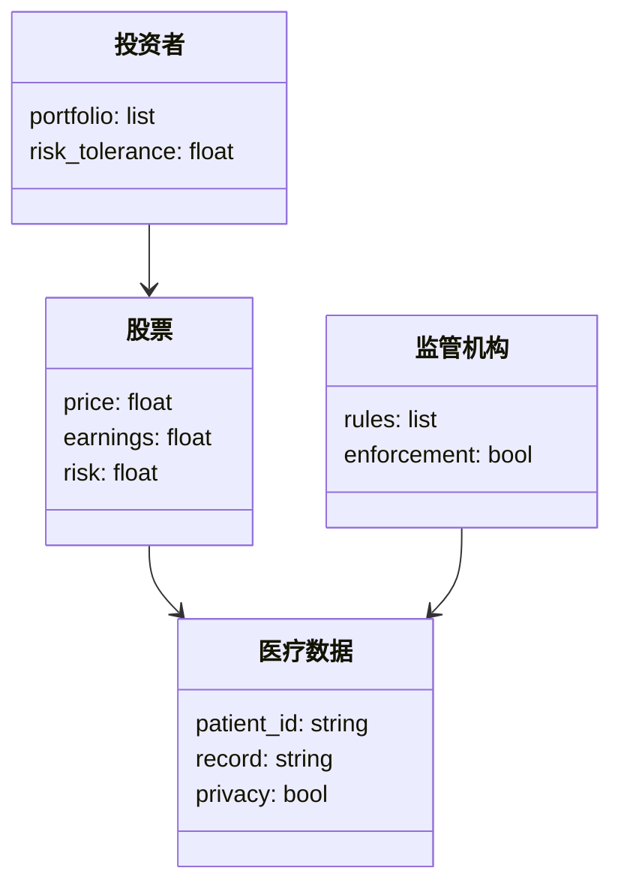
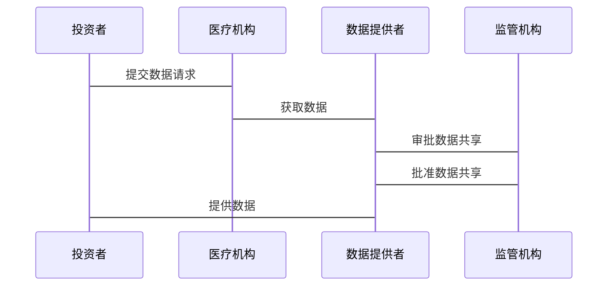

                 


---

# 《新兴市场股市估值与智慧医疗数据安全的互动》

> 关键词：新兴市场，股市估值，智慧医疗，数据安全，互动关系，博弈论，数据加密，系统架构

> 摘要：本文系统性地探讨了新兴市场股市估值与智慧医疗数据安全之间的互动关系，结合数学模型、算法原理和实际案例，分析了两者的相互影响及协同优化策略，提出了基于博弈论的互动模型和数据安全保护机制，为投资者和医疗数据管理者提供了实用的解决方案。

---

# 第一部分：新兴市场股市估值与智慧医疗数据安全的互动概述

## 第1章：背景介绍

### 1.1 问题背景

#### 1.1.1 新兴市场股市估值的现状
- 新兴市场的股市特点：高增长、高波动、信息不对称
- 股市估值的核心指标：市盈率（P/E）、市净率（P/B）、EV/EBITDA
- 新兴市场的特殊性：经济波动、政策不确定性、投资者结构复杂

#### 1.1.2 智慧医疗数据安全的重要性
- 智慧医疗的核心：数据共享与隐私保护
- 医疗数据的敏感性：患者隐私、医疗记录、基因信息
- 数据安全的挑战：技术漏洞、人为失误、外部攻击

#### 1.1.3 互动关系
- 股市波动对医疗行业的影响
- 医疗数据泄露对股市估值的影响
- 数据安全政策对股市的影响

### 1.2 问题描述

#### 1.2.1 新兴市场股市波动的驱动因素
- 经济指标：GDP增长率、通货膨胀率、利率
- 市场情绪：投资者信心、市场预期
- 外部因素：国际经济环境、地缘政治风险

#### 1.2.2 智慧医疗数据安全的风险与挑战
- 技术风险：数据泄露、系统漏洞
- 组织风险：内部员工误操作、管理不善
- 法律风险：数据隐私法规的合规性

#### 1.2.3 互动关系的核心问题
- 数据安全事件如何影响股市估值
- 股市波动如何反作用于医疗数据安全
- 如何构建两者之间的平衡机制

### 1.3 问题解决

#### 1.3.1 新兴市场股市估值的方法
- 市盈率模型：$$P/E = \frac{股票价格}{每股收益}$$
- 市净率模型：$$P/B = \frac{股票价格}{每股净资产}$$
- 现金流折现模型：$$DCF = \sum_{t=1}^{n} \frac{CF_t}{(1+r)^t}$$

#### 1.3.2 智慧医疗数据安全的保护措施
- 数据加密：AES、RSA等算法
- 访问控制：基于角色的访问控制（RBAC）
- 安全审计：日志分析、行为分析

#### 1.3.3 互动关系的解决方案
- 建立数据安全评估体系
- 构建股市风险预警模型
- 优化数据共享机制

### 1.4 边界与外延

#### 1.4.1 新兴市场股市估值的边界
- 数据来源的限制
- 模型假设的简化
- 时间窗口的限制

#### 1.4.2 智慧医疗数据安全的边界
- 数据范围的限制
- 保护对象的范围
- 技术实现的边界

#### 1.4.3 互动关系的外延
- 数据安全与金融市场的交叉影响
- 技术进步对互动关系的推动
- 政策变化对互动关系的影响

### 1.5 概念结构与核心要素

#### 1.5.1 核心概念组成
- 股市估值：价格、收益、风险
- 数据安全：数据完整性、机密性、可用性

#### 1.5.2 关键要素的对比分析
| 股市估值 | 数据安全 |
|---------|----------|
| 价格    | 机密性    |
| 收益    | 完整性    |
| 风险    | 可用性    |

#### 1.5.3 互动关系的模型


---

# 第二部分：核心概念与联系

## 第2章：核心概念原理

### 2.1 股市估值的核心原理

#### 2.1.1 市盈率与市净率的计算方法
- 市盈率公式：$$P/E = \frac{股票价格}{每股收益}$$
- 市净率公式：$$P/B = \frac{股票价格}{每股净资产}$$
- 示例：某公司股价为10元，每股收益1元，每股净资产2元，则$$P/E = 10$$，$$P/B = 5$$

#### 2.1.2 股票估值的模型与公式
- 现金流折现模型：$$DCF = \sum_{t=1}^{n} \frac{CF_t}{(1+r)^t}$$
- 市场定价模型：$$P = \frac{E}{K}$$，其中$$E$$为收益，$$K$$为资本资产定价模型（CAPM）计算的期望回报率

#### 2.1.3 新兴市场的特殊性
- 经济波动大，数据不完整
- 投资者结构复杂，情绪化波动明显
- 政策不确定性高

### 2.2 数据安全的核心原理

#### 2.2.1 数据加密的算法原理
- 对称加密：AES算法
- 非对称加密：RSA算法
- 加密流程：明文 → 加密 → 密文；密文 → 解密 → 明文

#### 2.2.2 数据完整性与可用性的保障
- 哈希函数：MD5、SHA-256
- 数据备份：全备份、增量备份
- 数据恢复：基于备份的恢复策略

#### 2.2.3 医疗数据的隐私保护
- 数据脱敏：对敏感数据进行匿名化处理
- 访问控制：基于角色的访问控制（RBAC）
- 数据加密传输：SSL/TLS协议

### 2.3 核心概念对比分析

#### 2.3.1 股市估值与数据安全的属性对比
| 属性      | 股市估值 | 数据安全 |
|-----------|----------|----------|
| 核心目标  | 评估价值 | 保护隐私 |
| 风险因素  | 市场波动 | 数据泄露 |
| 保护措施  | 多样化投资 | 加密技术 |

#### 2.3.2 互动关系的特征分析
- 数据安全事件对股市的短期冲击
- 股市波动对医疗行业的长期影响
- 数据共享对股市估值的双重作用

#### 2.3.3 案例分析
- 某医疗公司数据泄露事件对股价的影响
- 某新兴市场股市波动对医疗数据安全的影响

---

### 2.4 ER实体关系图

```mermaid
er
  actor(投资者)
  actor(医疗机构)
  actor(数据提供者)
  actor(监管机构)
  entity(股票)
  entity(医疗数据)
  entity(交易记录)
  entity(安全协议)
  relation(拥有)
  relation(访问)
  relation(监管)
  relation(依赖)
  relation(影响)
```

---

## 第3章：算法原理讲解

### 3.1 博弈论模型

#### 3.1.1 博弈论模型的数学模型
- 竞争者均衡：$$\frac{\partial P}{\partial Q} = 0$$
- 合作者均衡：$$\frac{\partial C}{\partial Q} = 0$$

#### 3.1.2 博弈论模型的实现
```python
def game_theory_model(players, strategies):
    # 计算每个玩家的收益
    payoffs = {}
    for player in players:
        max_payoff = 0
        for strategy in strategies:
            payoff = calculate_payoff(player, strategy)
            if payoff > max_payoff:
                max_payoff = payoff
        payoffs[player] = max_payoff
    return payoffs
```

#### 3.1.3 博弈论模型的案例分析
- 案例：某新兴市场股市中的博弈模型

### 3.2 数据加密算法

#### 3.2.1 数据加密算法的数学模型
- AES加密算法：$$C = E(K, P)$$，其中$$C$$为密文，$$P$$为明文，$$K$$为密钥

#### 3.2.2 数据加密算法的实现
```python
from cryptography.fernet import Fernet

# 生成密钥
key = Fernet.generate_key()
cipher = Fernet(key)

# 加密数据
encrypted_data = cipher.encrypt(b"Sensitive Medical Data")

# 解密数据
decrypted_data = cipher.decrypt(encrypted_data)
```

---

## 第4章：系统分析与架构设计

### 4.1 问题场景介绍

#### 4.1.1 问题场景
- 新兴市场股市波动与医疗数据安全的互动关系

#### 4.1.2 问题分析
- 数据安全事件对股市的影响
- 股市波动对医疗行业的影响

### 4.2 系统功能设计

#### 4.2.1 领域模型类图


#### 4.2.2 系统架构设计


#### 4.2.3 系统接口设计
- API接口：RESTful API
- 数据格式：JSON
- 接口功能：数据查询、安全检测、估值计算

#### 4.2.4 系统交互序列图


---

## 第5章：项目实战

### 5.1 环境安装

#### 5.1.1 安装Python环境
- 安装Python 3.8+
- 安装依赖库：pandas、numpy、scipy、cryptography

#### 5.1.2 安装工具链
- 安装Jupyter Notebook
- 安装Mermaid CLI
- 安装Fernet库

### 5.2 系统核心实现源代码

#### 5.2.1 博弈论模型的实现
```python
from itertools import product

def game_theory(players, strategies):
    payoff_matrix = {}
    for player in players:
        payoff_matrix[player] = {}
        for strategy in strategies:
            payoff_matrix[player][strategy] = 0
    return payoff_matrix
```

#### 5.2.2 数据加密算法的实现
```python
from cryptography.fernet import Fernet

def encrypt_data(data):
    key = Fernet.generate_key()
    cipher = Fernet(key)
    encrypted = cipher.encrypt(data)
    return encrypted, key
```

### 5.3 代码应用解读与分析

#### 5.3.1 博弈论模型的应用
- 示例：$$n$$个玩家的博弈模型
- 代码实现：计算每个玩家的收益矩阵

#### 5.3.2 数据加密算法的应用
- 示例：医疗数据的加密与解密
- 代码实现：数据的加密存储与解密过程

### 5.4 案例分析与详细讲解

#### 5.4.1 案例分析
- 案例：某新兴市场股市中的数据安全事件
- 分析：事件对股市的影响

#### 5.4.2 详细讲解
- 数据共享对股市估值的影响
- 股市波动对医疗数据安全的影响

### 5.5 项目小结

#### 5.5.1 核心实现总结
- 博弈论模型的应用
- 数据加密算法的实现

#### 5.5.2 项目经验总结
- 项目实施的关键点
- 项目中的难点与解决方案

---

## 第6章：最佳实践

### 6.1 最佳实践 Tips

#### 6.1.1 投资者建议
- 多元化投资
- 关注数据安全事件
- 重视监管政策

#### 6.1.2 医疗机构建议
- 建立数据安全体系
- 定期安全演练
- 加强员工培训

### 6.2 小结

#### 6.2.1 核心内容总结
- 新兴市场股市估值与智慧医疗数据安全的互动关系
- 数据安全对股市的影响
- 股市波动对医疗数据安全的影响

### 6.3 注意事项

#### 6.3.1 投资者注意事项
- 风险提示
- 数据安全的重要性
- 监管政策的变化

#### 6.3.2 医疗机构注意事项
- 数据共享的风险
- 数据加密的必要性
- 监管合规性

### 6.4 拓展阅读

#### 6.4.1 相关书籍
- 《博弈论与经济行为》
- 《数据安全与隐私保护》

#### 6.4.2 相关论文
- 数据安全对金融市场的冲击
- 股市波动与医疗行业的互动

---

# 第三部分：总结与展望

## 第7章：总结与展望

### 7.1 研究总结

#### 7.1.1 核心结论
- 数据安全对股市的影响
- 股市波动对医疗数据安全的影响
- 互动关系的解决方案

#### 7.1.2 研究不足
- 数据的局限性
- 模型的简化假设
- 案例的代表性

### 7.2 未来展望

#### 7.2.1 数据安全技术的发展
- 非对称加密技术
- 多方安全计算
- 同态加密

#### 7.2.2 股市估值模型的优化
- 多因素模型
- 机器学习模型
- 时间序列分析

#### 7.2.3 互动关系的深入研究
- 数据安全对股市的长期影响
- 股市波动对医疗数据安全的长期影响
- 技术进步对互动关系的影响

---

# 作者：AI天才研究院/AI Genius Institute & 禅与计算机程序设计艺术/Zen And The Art of Computer Programming

