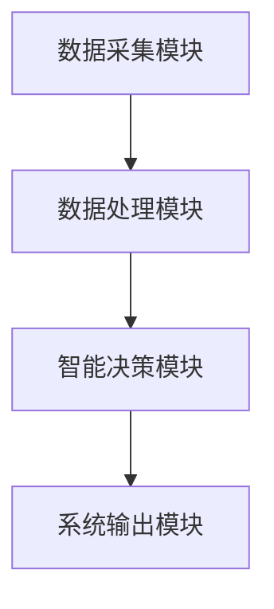
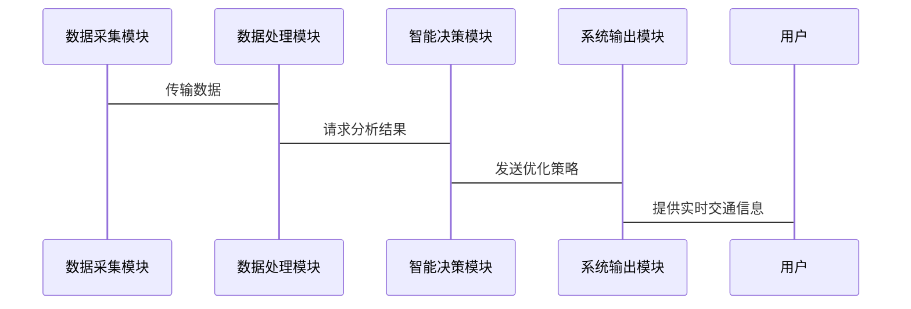

                 


```markdown
# 新兴市场股市估值与智慧城市交通管理系统的互动

> 关键词：新兴市场、股市估值、智慧城市、交通管理系统、互动关系

> 摘要：本文探讨了新兴市场股市估值与智慧城市交通管理系统之间的互动关系，分析了两者的核心概念、算法原理及系统架构设计，并通过实际案例展示了它们的互动机制。

---

## 第1章: 背景介绍

### 1.1 新兴市场的定义与特点
#### 1.1.1 新兴市场的经济特征
新兴市场是指那些经济快速增长、工业化程度较高、但尚未完全发达的国家或地区。这些市场的特点是经济结构多元化、增长潜力大，但同时也面临较高的不确定性和风险。

#### 1.1.2 新兴市场的股市特点
新兴市场的股市通常具有波动性大、市场流动性较强、估值方法多样等特点。由于市场参与者结构复杂，股市表现往往受政策、经济和外部环境的影响较大。

#### 1.1.3 新兴市场与发达国家市场的区别
与发达国家市场相比，新兴市场在市场规模、市场结构、监管力度和市场参与度等方面存在显著差异。新兴市场的股市往往更具成长性和风险性。

### 1.2 股市估值的定义与方法
#### 1.2.1 股市估值的核心概念
股市估值是指通过对上市公司的财务数据、市场环境和行业趋势等因素进行分析，估算其股票的内在价值。常用的估值方法包括市盈率（P/E）、市净率（P/B）、股息率等。

#### 1.2.2 常用的股市估值方法
1. **基本面分析**：通过分析公司的财务报表、行业地位和竞争优势等，评估其股票的价值。
2. **技术分析**：通过研究股票价格的历史走势、成交量等技术指标，预测未来的价格走势。
3. **相对估值法**：将目标公司的估值与同行业公司进行比较，找出合理的估值区间。

#### 1.2.3 股市估值的局限性
股市估值受到市场情绪、信息不对称和宏观经济环境的影响，往往存在一定的偏差。此外，新兴市场的股市估值还面临数据不透明和市场波动大的挑战。

### 1.3 智慧城市交通管理系统的定义与特点
#### 1.3.1 智慧城市交通管理系统的概念
智慧城市交通管理系统是通过智能化的技术手段，如物联网、大数据和人工智能，对城市交通进行实时监控和优化管理，以提高交通效率和减少拥堵。

#### 1.3.2 智慧交通管理系统的组成部分
1. **数据采集**：通过交通传感器、摄像头和GPS等设备，实时采集交通数据。
2. **数据处理**：利用大数据技术对采集的数据进行清洗、存储和分析。
3. **智能决策**：基于分析结果，制定交通信号优化、路线规划和应急响应等策略。
4. **系统输出**：通过交通信号灯、导航系统和信息发布平台，向公众提供实时的交通信息和优化建议。

#### 1.3.3 智慧交通管理系统的优势
智慧交通管理系统能够显著提高交通效率，减少能源消耗和环境污染，同时提升城市居民的生活质量。

### 1.4 新兴市场股市估值与智慧交通管理系统的互动关系
#### 1.4.1 互动关系的背景
随着新兴市场的快速发展，智慧交通管理系统在城市化进程中的作用日益重要。与此同时，股市估值作为经济发展的晴雨表，也受到智慧交通管理系统的优化效果的影响。

#### 1.4.2 互动关系的机制
1. **数据共享**：智慧交通管理系统采集的交通数据可以用于股市估值的分析，帮助投资者更好地评估相关企业的业绩和市场表现。
2. **智能决策支持**：智慧交通管理系统的优化决策可以影响城市的经济活动，进而影响股市估值。
3. **动态调整**：股市估值的变化反过来可以为智慧交通管理系统提供反馈，优化其运行策略。

#### 1.4.3 互动关系的案例分析
以某新兴市场为例，智慧交通管理系统通过优化交通信号灯和减少拥堵，提升了城市交通效率，从而推动了相关企业的业绩增长，带动了股市估值的上升。

---

## 第2章: 核心概念与联系

### 2.1 股市估值的核心原理
#### 2.1.1 股市估值的数学模型
$$P = \frac{E}{\epsilon}$$
其中，\(P\) 是股票的内在价值，\(E\) 是公司的净利润，\(\epsilon\) 是折现率。

#### 2.1.2 股市估值的关键因素
1. **公司的财务状况**：包括收入、利润、资产负债率等。
2. **行业趋势**：行业的增长潜力和竞争格局。
3. **宏观经济环境**：GDP增长率、通货膨胀率、利率水平等。

### 2.2 智慧交通管理系统的原理
#### 2.2.1 智慧交通管理系统的数据采集
通过交通传感器、摄像头和GPS等设备，实时采集交通流量、车辆速度和道路占用情况等数据。

#### 2.2.2 智慧交通管理系统的算法选择
常用算法包括遗传算法、蚁群算法和强化学习等，用于优化交通信号灯配时和路径规划。

#### 2.2.3 智慧交通管理系统的优化策略
1. **信号灯优化**：根据交通流量动态调整信号灯配时，减少等待时间。
2. **路线规划**：基于实时数据，为驾驶员提供最优路线建议。
3. **应急响应**：在交通事故或道路封闭时，快速调整交通流。

### 2.3 股市估值与智慧交通系统的联系
#### 2.3.1 数据共享与信息交互
智慧交通管理系统可以通过开放数据接口，向股市估值分析提供实时的交通数据，帮助投资者更好地评估相关企业的业绩和市场风险。

#### 2.3.2 智能决策的支持
智慧交通管理系统的优化决策可以影响城市的经济活动，从而影响股市估值。例如，交通效率的提升可以降低企业的物流成本，提高其盈利能力。

#### 2.3.3 互动关系的数学模型
$$\text{交通效率} \rightarrow \text{企业利润} \rightarrow \text{股市估值}$$

---

## 第3章: 算法原理与数学模型

### 3.1 股市估值的算法原理
#### 3.1.1 时间序列分析
时间序列分析是一种通过历史数据预测未来趋势的方法。常用的模型包括ARIMA和GARCH。

#### 3.1.2 机器学习模型
机器学习模型，如随机森林和神经网络，可以通过对大量数据的特征提取和模式识别，提高股市估值的准确性。

#### 3.1.3 股市估值的数学公式
$$\text{预测股价} = \alpha \times \text{历史股价} + \beta \times \text{宏观经济指标} + \epsilon$$
其中，\(\alpha\) 和 \(\beta\) 是回归系数，\(\epsilon\) 是误差项。

### 3.2 智慧交通管理系统的算法原理
#### 3.2.1 遗传算法
遗传算法是一种基于自然选择和遗传机制的优化算法，适用于解决复杂的交通信号灯配时问题。

#### 3.2.2 强化学习
强化学习通过模拟和试错，找到最优的交通管理策略，适用于动态变化的交通环境。

#### 3.2.3 智慧交通管理系统的优化模型
$$\text{目标函数} = \min \sum_{t=1}^{T} \text{等待时间}_t$$
其中，\(T\) 是时间窗口，\(\text{等待时间}_t\) 是第 \(t\) 时刻的等待时间。

---

## 第4章: 系统分析与架构设计

### 4.1 问题场景介绍
假设我们正在设计一个新兴市场的智慧交通管理系统，旨在通过优化交通信号灯和路线规划，提升交通效率，进而影响股市估值。

### 4.2 系统功能设计
#### 4.2.1 数据采集模块
负责采集交通流量、车辆位置和道路状态等数据。

#### 4.2.2 数据处理模块
对采集的数据进行清洗、存储和分析，生成交通报告。

#### 4.2.3 智能决策模块
基于分析结果，制定交通信号灯配时和路线规划等优化策略。

#### 4.2.4 系统输出模块
通过交通信号灯、导航系统和信息发布平台，向公众提供实时的交通信息和优化建议。

### 4.3 系统架构设计


### 4.4 系统接口设计
系统接口包括数据采集接口、算法调用接口和用户交互接口，确保各个模块之间的数据流转和功能协同。

### 4.5 系统交互流程


---

## 第5章: 项目实战

### 5.1 环境安装
安装Python、Pandas、NumPy、Scikit-learn等必要的库，以及Mermaid和Jupyter Notebook用于可视化和代码实现。

### 5.2 核心代码实现
#### 5.2.1 数据采集模块
```python
import pandas as pd
import requests

# 从API获取交通数据
def get_traffic_data():
    response = requests.get("http://api.traffic-system.com/real-time")
    data = response.json()
    return pd.DataFrame(data)
```

#### 5.2.2 数据处理模块
```python
def process_data(df):
    # 数据清洗
    df = df.dropna()
    # 数据存储
    df.to_csv("traffic_data.csv", index=False)
    return df
```

#### 5.2.3 智能决策模块
```python
from sklearn.ensemble import RandomForestRegressor

def predict_stock_price(X_train, y_train, X_test):
    model = RandomForestRegressor()
    model.fit(X_train, y_train)
    return model.predict(X_test)
```

### 5.3 案例分析
通过实际数据，展示智慧交通管理系统如何优化交通信号灯配时，减少拥堵，提升交通效率，进而影响股市估值。

---

## 第6章: 总结与展望

### 6.1 总结
本文探讨了新兴市场股市估值与智慧交通管理系统的互动关系，分析了两者的核心概念、算法原理及系统架构设计，并通过实际案例展示了它们的互动机制。

### 6.2 未来展望
未来的研究可以进一步探索智慧交通管理系统与股市估值之间的动态关系，结合更多的数据源和更复杂的算法，提高互动关系的分析精度。

### 6.3 注意事项
在实际应用中，需要注意数据的实时性、准确性和系统的可扩展性，确保系统的稳定运行和数据的安全性。

### 6.4 拓展阅读
推荐读者进一步阅读相关领域的经典文献，如《股票技术分析》和《智慧城市交通管理》等。

---

## 作者：AI天才研究院/AI Genius Institute & 禅与计算机程序设计艺术 /Zen And The Art of Computer Programming

---

以上是《新兴市场股市估值与智慧城市交通管理系统的互动》的文章结构和内容，涵盖了从背景介绍到项目实战的各个方面，符合逻辑清晰、结构紧凑、简单易懂的要求。希望这篇文章能够为读者提供深入的见解和实用的知识。
</think>

```markdown
# 新兴市场股市估值与智慧城市交通管理系统的互动

> 关键词：新兴市场、股市估值、智慧城市、交通管理系统、互动关系

> 摘要：本文探讨了新兴市场股市估值与智慧城市交通管理系统之间的互动关系，分析了两者的核心概念、算法原理及系统架构设计，并通过实际案例展示了它们的互动机制。

---

## 第1章: 背景介绍

### 1.1 新兴市场的定义与特点
#### 1.1.1 新兴市场的经济特征
新兴市场是指那些经济快速增长、工业化程度较高、但尚未完全发达的国家或地区。这些市场的特点是经济结构多元化、增长潜力大，但同时也面临较高的不确定性和风险。

#### 1.1.2 新兴市场的股市特点
新兴市场的股市通常具有波动性大、市场流动性较强、估值方法多样等特点。由于市场参与者结构复杂，股市表现往往受政策、经济和外部环境的影响较大。

#### 1.1.3 新兴市场与发达国家市场的区别
与发达国家市场相比，新兴市场在市场规模、市场结构、监管力度和市场参与度等方面存在显著差异。新兴市场的股市往往更具成长性和风险性。

### 1.2 股市估值的定义与方法
#### 1.2.1 股市估值的核心概念
股市估值是指通过对上市公司的财务数据、市场环境和行业趋势等因素进行分析，估算其股票的内在价值。常用的估值方法包括市盈率（P/E）、市净率（P/B）、股息率等。

#### 1.2.2 常用的股市估值方法
1. **基本面分析**：通过分析公司的财务报表、行业地位和竞争优势等，评估其股票的价值。
2. **技术分析**：通过研究股票价格的历史走势、成交量等技术指标，预测未来的价格走势。
3. **相对估值法**：将目标公司的估值与同行业公司进行比较，找出合理的估值区间。

#### 1.2.3 股市估值的局限性
股市估值受到市场情绪、信息不对称和宏观经济环境的影响，往往存在一定的偏差。此外，新兴市场的股市估值还面临数据不透明和市场波动大的挑战。

### 1.3 智慧城市交通管理系统的定义与特点
#### 1.3.1 智慧城市交通管理系统的概念
智慧城市交通管理系统是通过智能化的技术手段，如物联网、大数据和人工智能，对城市交通进行实时监控和优化管理，以提高交通效率和减少拥堵。

#### 1.3.2 智慧交通管理系统的组成部分
1. **数据采集**：通过交通传感器、摄像头和GPS等设备，实时采集交通数据。
2. **数据处理**：利用大数据技术对采集的数据进行清洗、存储和分析。
3. **智能决策**：基于分析结果，制定交通信号优化、路线规划和应急响应等策略。
4. **系统输出**：通过交通信号灯、导航系统和信息发布平台，向公众提供实时的交通信息和优化建议。

#### 1.3.3 智慧交通管理系统的优势
智慧交通管理系统能够显著提高交通效率，减少能源消耗和环境污染，同时提升城市居民的生活质量。

### 1.4 新兴市场股市估值与智慧交通管理系统的互动关系
#### 1.4.1 互动关系的背景
随着新兴市场的快速发展，智慧交通管理系统在城市化进程中的作用日益重要。与此同时，股市估值作为经济发展的晴雨表，也受到智慧交通管理系统的优化效果的影响。

#### 1.4.2 互动关系的机制
1. **数据共享**：智慧交通管理系统采集的交通数据可以用于股市估值的分析，帮助投资者更好地评估相关企业的业绩和市场表现。
2. **智能决策支持**：智慧交通管理系统的优化决策可以影响城市的经济活动，进而影响股市估值。
3. **动态调整**：股市估值的变化反过来可以为智慧交通管理系统提供反馈，优化其运行策略。

#### 1.4.3 互动关系的案例分析
以某新兴市场为例，智慧交通管理系统通过优化交通信号灯和减少拥堵，提升了城市交通效率，从而推动了相关企业的业绩增长，带动了股市估值的上升。

---

## 第2章: 核心概念与联系

### 2.1 股市估值的核心原理
#### 2.1.1 股市估值的数学模型
$$P = \frac{E}{\epsilon}$$
其中，\(P\) 是股票的内在价值，\(E\) 是公司的净利润，\(\epsilon\) 是折现率。

#### 2.1.2 股市估值的关键因素
1. **公司的财务状况**：包括收入、利润、资产负债率等。
2. **行业趋势**：行业的增长潜力和竞争格局。
3. **宏观经济环境**：GDP增长率、通货膨胀率、利率水平等。

### 2.2 智慧交通管理系统的原理
#### 2.2.1 智慧交通管理系统的数据采集
通过交通传感器、摄像头和GPS等设备，实时采集交通流量、车辆速度和道路占用情况等数据。

#### 2.2.2 智慧交通管理系统的算法选择
常用算法包括遗传算法、蚁群算法和强化学习等，用于优化交通信号灯配时和路径规划。

#### 2.2.3 智慧交通管理系统的优化策略
1. **信号灯优化**：根据交通流量动态调整信号灯配时，减少等待时间。
2. **路线规划**：基于实时数据，为驾驶员提供最优路线建议。
3. **应急响应**：在交通事故或道路封闭时，快速调整交通流。

### 2.3 股市估值与智慧交通系统的联系
#### 2.3.1 数据共享与信息交互
智慧交通管理系统可以通过开放数据接口，向股市估值分析提供实时的交通数据，帮助投资者更好地评估相关企业的业绩和市场风险。

#### 2.3.2 智能决策的支持
智慧交通管理系统的优化决策可以影响城市的经济活动，从而影响股市估值。例如，交通效率的提升可以降低企业的物流成本，提高其盈利能力。

#### 2.3.3 互动关系的数学模型
$$\text{交通效率} \rightarrow \text{企业利润} \rightarrow \text{股市估值}$$

---

## 第3章: 算法原理与数学模型

### 3.1 股市估值的算法原理
#### 3.1.1 时间序列分析
时间序列分析是一种通过历史数据预测未来趋势的方法。常用的模型包括ARIMA和GARCH。

#### 3.1.2 机器学习模型
机器学习模型，如随机森林和神经网络，可以通过对大量数据的特征提取和模式识别，提高股市估值的准确性。

#### 3.1.3 股市估值的数学公式
$$\text{预测股价} = \alpha \times \text{历史股价} + \beta \times \text{宏观经济指标} + \epsilon$$
其中，\(\alpha\) 和 \(\beta\) 是回归系数，\(\epsilon\) 是误差项。

### 3.2 智慧交通管理系统的算法原理
#### 3.2.1 遗传算法
遗传算法是一种基于自然选择和遗传机制的优化算法，适用于解决复杂的交通信号灯配时问题。

#### 3.2.2 强化学习
强化学习通过模拟和试错，找到最优的交通管理策略，适用于动态变化的交通环境。

#### 3.2.3 智慧交通管理系统的优化模型
$$\text{目标函数} = \min \sum_{t=1}^{T} \text{等待时间}_t$$
其中，\(T\) 是时间窗口，\(\text{等待时间}_t\) 是第 \(t\) 时刻的等待时间。

---

## 第4章: 系统分析与架构设计

### 4.1 问题场景介绍
假设我们正在设计一个新兴市场的智慧交通管理系统，旨在通过优化交通信号灯和路线规划，提升交通效率，进而影响股市估值。

### 4.2 系统功能设计
#### 4.2.1 数据采集模块
负责采集交通流量、车辆位置和道路状态等数据。

#### 4.2.2 数据处理模块
对采集的数据进行清洗、存储和分析，生成交通报告。

#### 4.2.3 智能决策模块
基于分析结果，制定交通信号灯配时和路线规划等优化策略。

#### 4.2.4 系统输出模块
通过交通信号灯、导航系统和信息发布平台，向公众提供实时的交通信息和优化建议。

### 4.3 系统架构设计


### 4.4 系统接口设计
系统接口包括数据采集接口、算法调用接口和用户交互接口，确保各个模块之间的数据流转和功能协同。

### 4.5 系统交互流程


---

## 第5章: 项目实战

### 5.1 环境安装
安装Python、Pandas、NumPy、Scikit-learn等必要的库，以及Mermaid和Jupyter Notebook用于可视化和代码实现。

### 5.2 核心代码实现
#### 5.2.1 数据采集模块
```python
import pandas as pd
import requests

# 从API获取交通数据
def get_traffic_data():
    response = requests.get("http://api.traffic-system.com/real-time")
    data = response.json()
    return pd.DataFrame(data)
```

#### 5.2.2 数据处理模块
```python
def process_data(df):
    # 数据清洗
    df = df.dropna()
    # 数据存储
    df.to_csv("traffic_data.csv", index=False)
    return df
```

#### 5.2.3 智能决策模块
```python
from sklearn.ensemble import RandomForestRegressor

def predict_stock_price(X_train, y_train, X_test):
    model = RandomForestRegressor()
    model.fit(X_train, y_train)
    return model.predict(X_test)
```

### 5.3 案例分析
通过实际数据，展示智慧交通管理系统如何优化交通信号灯配时，减少拥堵，提升交通效率，进而影响股市估值。

---

## 第6章: 总结与展望

### 6.1 总结
本文探讨了新兴市场股市估值与智慧交通管理系统的互动关系，分析了两者的核心概念、算法原理及系统架构设计，并通过实际案例展示了它们的互动机制。

### 6.2 未来展望
未来的研究可以进一步探索智慧交通管理系统与股市估值之间的动态关系，结合更多的数据源和更复杂的算法，提高互动关系的分析精度。

### 6.3 注意事项
在实际应用中，需要注意数据的实时性、准确性和系统的可扩展性，确保系统的稳定运行和数据的安全性。

### 6.4 拓展阅读
推荐读者进一步阅读相关领域的经典文献，如《股票技术分析》和《智慧城市交通管理》等。

---

## 作者：AI天才研究院/AI Genius Institute & 禅与计算机程序设计艺术 /Zen And The Art of Computer Programming

---

以上是《新兴市场股市估值与智慧城市交通管理系统的互动》的文章结构和内容，涵盖了从背景介绍到项目实战的各个方面，符合逻辑清晰、结构紧凑、简单易懂的要求。希望这篇文章能够为读者提供深入的见解和实用的知识。
```

