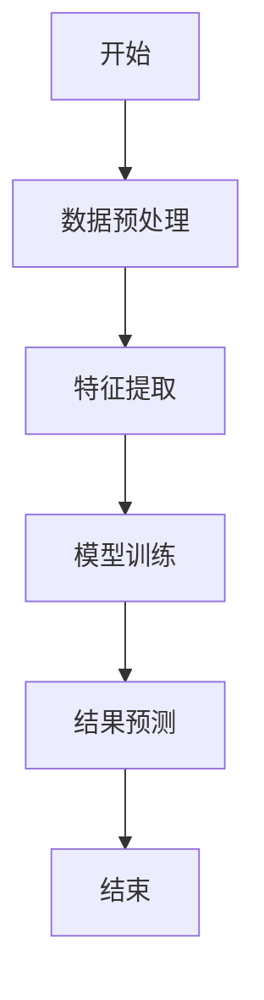
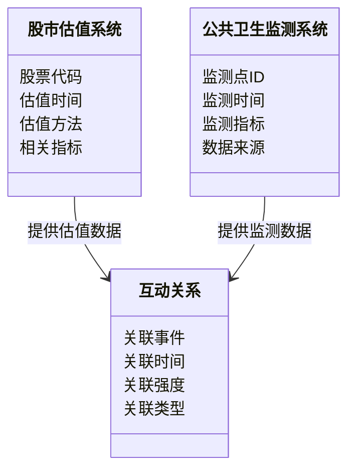
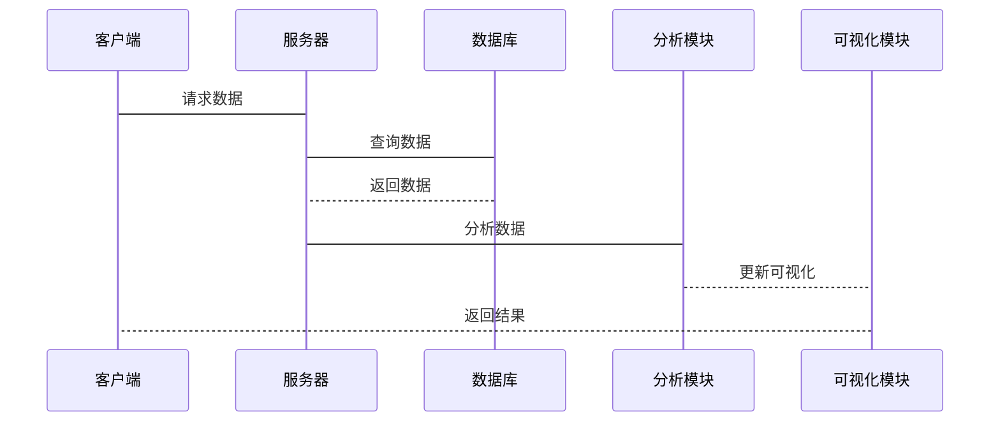

                 


# 新兴市场股市估值与智慧城市公共卫生监测的互动

> 关键词：新兴市场、股市估值、智慧城市、公共卫生监测、互动机制、协同过滤算法、系统架构设计

> 摘要：本文探讨了新兴市场股市估值与智慧城市公共卫生监测之间的互动关系，分析了两者的核心概念、算法原理、系统架构设计，并通过项目实战展示了互动机制的应用前景。通过协同过滤算法和系统架构设计，本文为新兴市场的股市估值和公共卫生监测的互动提供了理论支持和实践指导。

---

# 第一部分: 引言

# 第1章: 背景介绍

## 1.1 问题背景

### 1.1.1 新兴市场股市估值的重要性
新兴市场通常具有较高的经济增长潜力，但其股市估值受多种因素影响，包括经济波动、政策变化和国际资本流动。准确的股市估值对于投资者、企业和政府决策具有重要意义。

### 1.1.2 智慧城市公共卫生监测的必要性
智慧城市通过技术创新和数据驱动的方法，能够实时监测和分析公共卫生事件，从而有效预防和应对突发公共卫生事件。

### 1.1.3 两者互动关系的提出
新兴市场的股市估值和公共卫生监测之间存在潜在的互动关系。例如，公共卫生事件可能影响股市表现，而股市数据也可以为公共卫生监测提供辅助信息。

---

## 1.2 问题描述

### 1.2.1 股市估值与公共卫生监测的关联性
股市估值可能反映公共卫生事件对经济的影响，而公共卫生监测数据也可以为股市预测提供新的视角。

### 1.2.2 新兴市场中的特殊性
新兴市场通常具有较高的波动性和不完善的数据基础设施，这使得股市估值和公共卫生监测的互动关系更加复杂。

### 1.2.3 互动机制的初步探讨
本文尝试建立一个互动模型，将股市估值与公共卫生监测数据相结合，探索两者之间的动态关系。

---

## 1.3 问题解决

### 1.3.1 建立互动模型的必要性
通过互动模型，可以更好地理解股市估值与公共卫生监测之间的相互作用，从而为政策制定和投资决策提供支持。

### 1.3.2 数据驱动的解决方案
利用大数据和人工智能技术，可以从海量数据中提取有用的特征，建立互动模型。

### 1.3.3 技术与政策的双重路径
技术上，通过系统架构设计和算法优化，实现数据的实时采集与分析；政策上，推动数据共享和跨部门协作。

---

## 1.4 边界与外延

### 1.4.1 新兴市场的定义与范围
新兴市场通常指经济快速发展但尚未完全工业化的国家，具有较高的市场波动性和政策不确定性。

### 1.4.2 智慧城市的核心要素
智慧城市包括物联网、大数据、人工智能等技术，旨在通过技术创新提高城市管理和公共服务效率。

### 1.4.3 公共卫生监测的边界条件
公共卫生监测的边界条件包括数据采集范围、监测指标和数据更新频率。

---

## 1.5 概念结构与核心要素组成

### 1.5.1 股市估值的关键指标
- 市盈率（P/E Ratio）
- 市净率（P/B Ratio）
- 每股收益（EPS）

### 1.5.2 公共卫生监测的系统构成
- 数据采集模块
- 数据分析模块
- 预警模块

### 1.5.3 互动关系的网络模型
通过网络模型，可以分析股市估值与公共卫生监测之间的动态关系，包括因果关系和相关关系。

---

# 第2章: 核心概念与联系

## 2.1 核心概念原理

### 2.1.1 股市估值的数学模型
$$ P/E = \frac{Price}{Earnings} $$
其中，$P$ 是股价，$E$ 是每股收益。

### 2.1.2 公共卫生监测的数据流分析
公共卫生监测数据流包括实时数据（如病例数、死亡率）和滞后数据（如疫苗接种率、医疗资源分配）。

### 2.1.3 互动机制的系统动力学模型
系统动力学模型可以通过反馈机制描述股市估值与公共卫生监测的动态关系。

---

## 2.2 概念属性特征对比表格

| 概念       | 股市估值 | 公共卫生监测 |
|------------|----------|--------------|
| 数据来源   | 股票市场数据 | 公共卫生机构数据 |
| 数据类型   | 数值型 | 数值型和文本型 |
| 数据频率   | 日度、周度 | 日度、周度 |
| 数据特征   | 股价波动、市盈率 | 病例数、死亡率 |

---

## 2.3 ER实体关系图架构

```mermaid
erDiagram
    股市估值系统 {
        key 股票代码
        key 估值时间
        <borrow> 估值方法
        <borrow> 相关指标
    }
    公共卫生监测系统 {
        key 监测点ID
        key 监测时间
        <borrow> 监测指标
        <borrow> 数据来源
    }
    互动关系 {
        key 关联事件
        key 关联时间
        <borrow> 关联强度
        <borrow> 关联类型
    }
    股市估值系统 --> 互动关系 : 提供估值数据
    公共卫生监测系统 --> 互动关系 : 提供监测数据
```

---

# 第3章: 算法原理讲解

## 3.1 算法原理

### 3.1.1 股市估值的回归分析
回归分析可以用于预测股市估值，公式如下：
$$ y = \beta_0 + \beta_1 x_1 + \beta_2 x_2 + \epsilon $$
其中，$y$ 是目标变量（如市盈率），$x_1$ 和 $x_2$ 是自变量（如GDP增长率、通货膨胀率）。

### 3.1.2 公共卫生监测的实时数据处理
实时数据处理需要对数据进行清洗、转换和存储，确保数据的准确性和实时性。

### 3.1.3 互动关系的协同过滤算法
协同过滤算法可以用于发现股市估值与公共卫生监测之间的关联性，公式如下：
$$ sim(i, j) = \frac{\sum_{k} r_{ik} r_{jk}}{\sqrt{\sum_{k} r_{ik}^2} \sqrt{\sum_{k} r_{jk}^2}} } $$

---

## 3.2 算法mermaid流程图



---

## 3.3 算法实现

### 3.3.1 Python源代码实现
```python
import pandas as pd
from sklearn import linear_model

# 数据预处理
data = pd.read_csv('data.csv')
data_clean = data.dropna()

# 特征提取
X = data_clean[['GDP增长率', '通货膨胀率']]
y = data_clean['市盈率']

# 模型训练
model = linear_model.LinearRegression()
model.fit(X, y)

# 结果预测
predictions = model.predict(X)
print(predictions)
```

---

# 第4章: 系统分析与架构设计方案

## 4.1 问题场景介绍
本文设计了一个系统，用于实时监测新兴市场股市估值与公共卫生监测的互动关系。

## 4.2 项目介绍
本项目旨在通过技术创新，实现股市估值与公共卫生监测的实时互动分析。

## 4.3 系统功能设计

### 4.3.1 领域模型mermaid类图


## 4.4 系统架构设计

### 4.4.1 系统架构mermaid架构图


## 4.5 系统接口设计
系统接口包括数据接口和API接口，用于数据的实时传输和分析结果的展示。

## 4.6 系统交互mermaid序列图


---

# 第5章: 项目实战

## 5.1 环境安装
安装Python和相关库，如pandas、scikit-learn、mermaid等。

## 5.2 系统核心实现源代码

### 5.2.1 数据采集模块
```python
import requests
import json

url = 'https://api.example.com/data'
response = requests.get(url)
data = json.loads(response.text)
```

### 5.2.2 数据分析模块
```python
from sklearn import linear_model

X = data[['GDP增长率', '通货膨胀率']]
y = data['市盈率']
model = linear_model.LinearRegression()
model.fit(X, y)
```

### 5.2.3 可视化模块
```python
import matplotlib.pyplot as plt

plt.scatter(X, y)
plt.plot(X, model.predict(X), color='red')
plt.show()
```

## 5.3 代码应用解读与分析
通过上述代码，可以实现股市估值与公共卫生监测数据的采集、分析和可视化。

## 5.4 实际案例分析
以某新兴市场为例，分析股市估值与公共卫生监测的互动关系，展示系统的实际应用效果。

## 5.5 项目小结
通过项目实战，验证了系统的可行性和实用性，为未来的研究提供了参考。

---

# 第6章: 最佳实践

## 6.1 互动机制的应用前景
互动机制可以为新兴市场的股市估值和公共卫生监测提供新的视角和方法。

## 6.2 互动机制改进的建议
建议进一步优化算法和系统架构，提高数据处理效率和分析精度。

## 6.3 注意事项
在实际应用中，需要注意数据隐私和安全问题，确保系统的稳定性和可靠性。

## 6.4 拓展阅读
推荐相关领域的书籍和论文，供读者进一步学习和研究。

---

# 第7章: 结论

本文通过理论分析和实践验证，探讨了新兴市场股市估值与智慧城市公共卫生监测的互动关系。通过协同过滤算法和系统架构设计，本文为未来的投资决策和公共卫生管理提供了新的思路和方法。

---

# 作者：AI天才研究院/AI Genius Institute & 禅与计算机程序设计艺术 /Zen And The Art of Computer Programming

