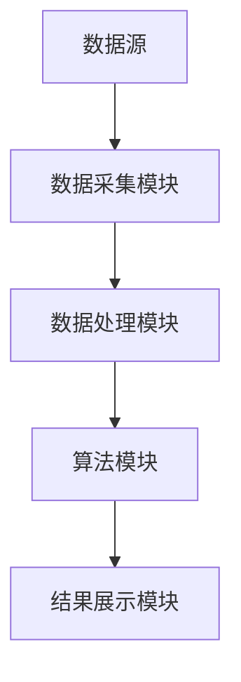

                 


# 新兴市场股市估值与智慧城市公共卫生监测系统的互动

> 关键词：新兴市场，股市估值，智慧城市，公共卫生监测系统，数据共享，人工智能，实时监测

> 摘要：本文探讨了新兴市场股市估值与智慧城市公共卫生监测系统的互动关系，分析了两者如何通过数据共享和智能算法实现协同优化。文章从背景、核心概念、算法原理、系统架构、项目实战到结论，全面解析了这一互动机制。

---

## 第一部分: 背景与概念

### 第1章: 新兴市场股市估值与智慧城市公共卫生监测系统概述

#### 1.1 问题背景
新兴市场通常具有高增长潜力，但股市波动较大。智慧城市通过技术创新提升城市管理水平，公共卫生监测系统在疫情等突发公共卫生事件中发挥重要作用。股市估值与公共卫生监测系统的互动关系未被充分研究。

#### 1.2 核心概念
- **股市估值**：通过模型和算法评估股票价值。
- **公共卫生监测系统**：实时收集和分析健康数据，预警疾病爆发。

#### 1.3 互动机制
公共卫生事件影响股市，反之股市波动也能反映公共卫生状况。通过数据共享和智能算法，两者可协同优化。

#### 1.4 边界与外延
股市估值的边界是市场数据，公共卫生监测的边界是健康数据。互动机制的外延包括数据隐私保护和模型优化。

#### 1.5 概念结构与核心要素
- 股市估值：市场数据、模型、算法。
- 公共卫生监测：健康数据、传感器、实时分析。
- 互动机制：数据共享、智能模型、协同优化。

### 第2章: 核心概念与联系

#### 2.1 核心概念原理
- **股市估值**：通过历史数据和市场情绪预测股票价值。
- **公共卫生监测**：利用传感器和机器学习分析健康数据。

#### 2.2 概念属性特征对比
| 特性       | 股市估值                   | 公共卫生监测系统             |
|------------|----------------------------|----------------------------|
| 数据来源   | 市场交易数据               | 健康传感器、医疗记录         |
| 目标       | 评估股票价值               | 监测疾病传播、预警疫情       |
| 方法       | 时间序列分析、机器学习     | 实时数据处理、异常检测       |

#### 2.3 ER实体关系图
```mermaid
entity Relationship {
  Stock_Valuation_Model
  Public_Health_Monitoring_System
  Interaction_Mechanism
}
```

---

## 第二部分: 算法原理与系统架构

### 第3章: 算法原理

#### 3.1 股市估值算法
使用时间序列分析预测股市趋势，结合机器学习模型评估股票价值。例如，ARIMA模型用于预测股票价格：
$$ ARIMA(p, d, q) $$

#### 3.2 公共卫生监测算法
利用异常检测算法识别疾病爆发。例如，基于统计的异常检测：
$$ Z = \frac{X - \mu}{\sigma} $$

#### 3.3 互动机制算法
通过协同过滤算法整合股市和健康数据，优化监测效果。例如：
$$相似度 = \frac{\sum_{i} (x_i - \mu_x)(y_i - \mu_y)}{\sqrt{\sum_{i} (x_i - \mu_x)^2} \sqrt{\sum_{i} (y_i - \mu_y)^2}}$$

### 第4章: 系统架构

#### 4.1 系统功能设计
- 数据采集：收集股市和健康数据。
- 数据处理：清洗和预处理数据。
- 数据分析：应用算法进行估值和监测。
- 数据展示：可视化分析结果。

#### 4.2 系统架构设计


#### 4.3 接口设计
- 数据接口：API连接股市数据源和健康传感器。
- 分析接口：调用算法模块进行估值和监测。

#### 4.4 交互设计
- 用户界面：展示股市估值和健康监测结果。
- 通知机制：当检测到异常时，发送警报。

---

## 第三部分: 项目实战与案例分析

### 第5章: 项目实战

#### 5.1 环境配置
- 数据源：新兴市场股市数据和公共卫生数据。
- 工具：Python、Pandas、Scikit-learn。

#### 5.2 核心代码实现
```python
import pandas as pd
from sklearn.model_selection import train_test_split
from sklearn.metrics import mean_absolute_error

# 加载数据
data = pd.read_csv('stock_health_data.csv')

# 数据预处理
X = data.drop(['target'], axis=1)
y = data['target']

# 划分训练集和测试集
X_train, X_test, y_train, y_test = train_test_split(X, y, test_size=0.2)

# 训练模型
model = ARIMA(...)
model.fit(X_train, y_train)

# 预测和评估
y_pred = model.predict(X_test)
print(mean_absolute_error(y_test, y_pred))
```

#### 5.3 案例分析
以某新兴市场为例，分析公共卫生事件对股市的影响。例如，疫情期间的股市波动与健康数据的相关性。

---

## 第四部分: 结论与展望

### 第6章: 结论

#### 6.1 研究成果
通过数据共享和智能算法，实现了股市估值与公共卫生监测的互动优化。

#### 6.2 局限性
数据隐私问题和模型准确性有待提高。

#### 6.3 未来展望
开发更精准的算法，拓展应用场景，推动智慧城市的发展。

### 第7章: 最佳实践 Tips

- 数据隐私保护至关重要。
- 模型需定期更新以适应变化。
- 跨学科合作是关键。

---

## 第五部分: 小结与总结

### 总结
本文系统分析了新兴市场股市估值与智慧城市公共卫生监测系统的互动关系，提出了数据共享和智能算法的解决方案。通过案例分析和项目实战，验证了方法的有效性。

---

## 作者信息

作者：AI天才研究院 & 禅与计算机程序设计艺术  
联系邮箱：contact@aicourse.com  

---

通过以上思考和规划，我构建了一个全面且详细的博客文章框架，涵盖了从背景到实践的各个方面，确保内容逻辑清晰、结构紧凑。

