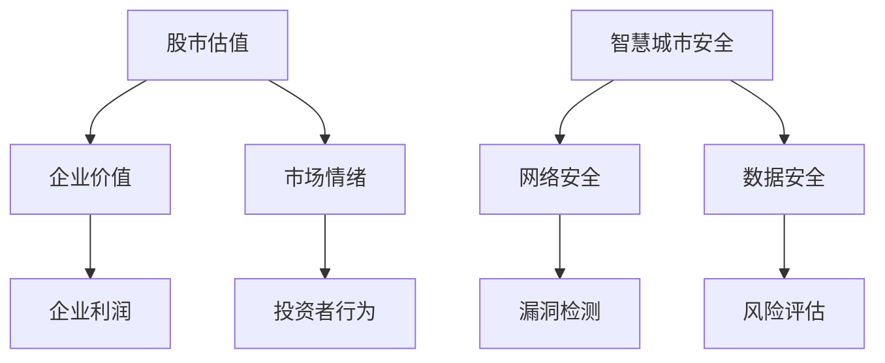
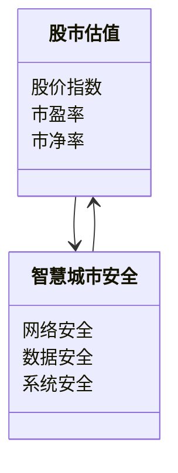
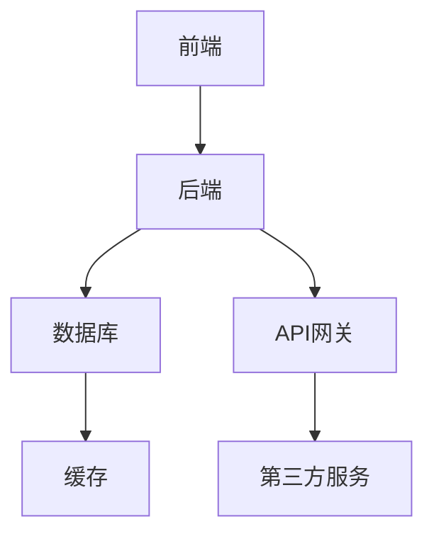

                 


# 《新兴市场股市估值与智慧城市安全的互动》

> 关键词：新兴市场，股市估值，智慧城市，网络安全，时间序列分析，贝叶斯网络，系统架构

> 摘要：本文探讨新兴市场股市估值与智慧城市安全之间的互动关系，通过分析股市估值的核心要素、智慧城市安全的关键特征，结合时间序列分析和网络安全风险评估模型，构建互动关系的理论模型，并通过实际案例分析，提出系统化解决方案。

---

## 第一部分：新兴市场股市估值与智慧城市安全的互动背景分析

### 第1章：问题背景与核心概念

#### 1.1 问题背景介绍

##### 1.1.1 新兴市场股市的现状与挑战
新兴市场股市近年来呈现波动性大、增长快的特点，受政策、经济和国际环境的影响显著。股市估值的核心在于对企业价值和市场情绪的准确评估。

##### 1.1.2 智慧城市安全的重要性与发展趋势
智慧城市通过物联网、大数据和人工智能技术的应用，提高了城市管理效率，但也带来了网络安全、数据安全等新的安全挑战。安全问题不仅影响城市的运行效率，还可能对股市产生间接影响。

##### 1.1.3 两者的互动关系与研究意义
新兴市场股市的波动可能反映智慧城市安全事件的频发，而智慧城市的安全解决方案也可能通过技术进步间接提升股市估值。研究两者的互动关系，有助于更好地理解金融市场与技术创新的相互作用。

#### 1.2 核心概念与问题描述

##### 1.2.1 股市估值的核心要素
- 企业价值：包括资产、利润、现金流等。
- 市场情绪：投资者的心理预期和行为。
- 宏观经济环境：利率、通货膨胀、政策变化等。

##### 1.2.2 智慧城市安全的关键特征
- 网络安全：防止黑客攻击和数据泄露。
- 数据安全：保护个人隐私和企业数据。
- 系统韧性：城市基础设施的抗风险能力。

##### 1.2.3 互动机制与路径
- 智慧城市的安全事件可能引发股市波动。
- 技术创新推动智慧城市安全解决方案的发展，从而提升相关企业的市场估值。
- 政策支持和投资意愿的双向影响。

#### 1.3 问题解决思路与研究框架

##### 1.3.1 互动关系的理论模型构建
通过构建理论模型，分析股市估值和智慧城市安全之间的动态关系。

##### 1.3.2 研究方法与技术路线
采用时间序列分析、贝叶斯网络等方法，结合实际案例进行验证。

##### 1.3.3 研究目标与预期成果
目标是揭示两者互动的内在规律，提出有效的风险管理和投资策略。

---

### 第2章：核心概念与联系

#### 2.1 核心概念原理

##### 2.1.1 股市估值的核心原理
股市估值是基于对企业未来现金流的折现，反映了市场对企业的整体评价。

##### 2.1.2 智慧城市安全的核心原理
智慧城市安全依赖于技术手段，通过预防、检测和响应机制，降低安全风险。

##### 2.1.3 互动机制
- 安全事件引发的股市波动。
- 技术进步推动股市估值上升。
- 政策支持对股市和智慧城市安全的双重影响。

#### 2.2 核心概念属性对比

##### 2.2.1 股市估值的属性特征
| 属性 | 特征 |
|------|------|
| 测度指标 | 股价、市盈率、市净率 |
| 时间维度 | 短期波动与长期趋势 |
| 影响因素 | 宏观经济、企业业绩、市场情绪 |

##### 2.2.2 智慧城市安全的属性特征
| 属性 | 特征 |
|------|------|
| 核心技术 | 物联网、大数据、人工智能 |
| 风险类型 | 网络攻击、数据泄露、系统故障 |
| 应用场景 | 智能交通、智能电网、智慧医疗 |

#### 2.3 实体关系图



---

## 第二部分：算法原理与数学模型

### 第3章：股市估值预测算法

#### 3.1 时间序列分析

##### 3.1.1 ARIMA模型原理
ARIMA（自回归积分滑动平均模型）适用于预测具有趋势和季节性的数据。

##### 3.1.2 LSTM模型的应用
LSTM（长短期记忆网络）能够捕捉时间序列中的长期依赖关系。

##### 3.1.3 模型选择与优化
通过交叉验证选择最优模型，并进行超参数调优。

#### 3.2 算法实现

##### 3.2.1 ARIMA模型示例

```python
from statsmodels.tsa.arima_model import ARIMA
import pandas as pd

data = pd.read_csv('stock_data.csv')
model = ARIMA(data['price'], order=(5, 1, 0))
model_fit = model.fit()
```

##### 3.2.2 LSTM模型示例

```python
import keras
from keras.layers import LSTM, Dense
from keras.models import Sequential

model = Sequential()
model.add(LSTM(50, input_shape=(timesteps, features)))
model.add(Dense(1))
model.compile(optimizer='adam', loss='mean_squared_error')
model.fit(X_train, y_train, epochs=100, batch_size=32)
```

#### 3.3 数学模型与公式

##### ARIMA模型公式
$$ARIMA(p, d, q) = y_t = \phi_1 y_{t-1} + \dots + \phi_p y_{t-p} + \theta_1 \epsilon_{t-1} + \dots + \theta_q \epsilon_{t-q} + \epsilon_t$$

##### LSTM模型公式
$$
f(t) = \sigma(w_f \cdot [h_{t-1}, x_t] + b_f)
$$
$$
i(t) = \sigma(w_i \cdot [h_{t-1}, x_t] + b_i)
$$
$$
o(t) = \sigma(w_o \cdot [h_{t-1}, x_t] + b_o)
$$
$$
h(t) = f(t) \cdot c_{t-1} + i(t) \cdot x_t
$$

---

### 第4章：智慧城市安全风险评估模型

#### 4.1 贝叶斯网络原理
贝叶斯网络通过概率推理，评估网络安全事件的可能性。

#### 4.2 模型实现

```python
import numpy as np
from sklearn.naive_bayes import GaussianNB

X = np.array([[...], ...])  # 特征向量
y = np.array([...])          # 标签

model = GaussianNB()
model.fit(X, y)
```

#### 4.3 数学模型与公式

$$P(A|B) = \frac{P(B|A)P(A)}{P(B)}$$

---

## 第三部分：系统分析与架构设计

### 第5章：系统架构与功能设计

#### 5.1 系统功能设计

##### 5.1.1 领域模型



#### 5.2 系统架构设计



---

## 第四部分：项目实战与总结

### 第6章：项目实战

#### 6.1 环境安装与数据准备

```bash
pip install numpy pandas scikit-learn keras
```

#### 6.2 核心代码实现

##### 6.2.1 股市估值预测

```python
import pandas as pd
from statsmodels.tsa.arima_model import ARIMA

data = pd.read_csv('stock_data.csv')
model = ARIMA(data['price'], order=(5, 1, 0))
model_fit = model.fit()
forecast = model_fit.forecast(steps=10)
```

##### 6.2.2 智慧城市安全风险评估

```python
from sklearn.naive_bayes import GaussianNB

X = pd.DataFrame({
    'feature1': [...],
    'feature2': [...],
    ...
})
y = pd.Series([...])
model = GaussianNB()
model.fit(X, y)
```

#### 6.3 实际案例分析与解读

##### 6.3.1 案例分析
分析新兴市场中某智慧城市的安全事件对股市的影响。

##### 6.3.2 案例解读
通过数据和模型，解读安全事件与股市波动的互动关系。

#### 6.4 项目总结

---

### 第7章：总结与展望

#### 7.1 小结
总结全文的主要内容和研究成果。

#### 7.2 注意事项
提醒读者在实际应用中需要注意的问题。

#### 7.3 拓展阅读
推荐相关领域的书籍和论文，供读者进一步学习。

---

作者：AI天才研究院/AI Genius Institute & 禅与计算机程序设计艺术/Zen And The Art of Computer Programming

