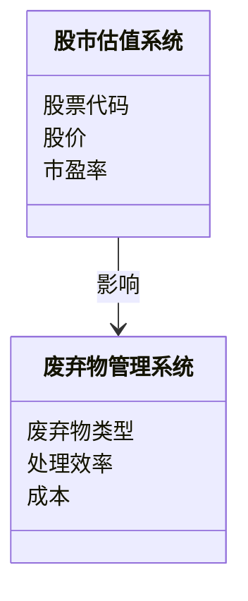

                 


# 新兴市场股市估值与智慧城市废弃物管理的互动

> 关键词：新兴市场，股市估值，智慧城市，废弃物管理，互动关系

> 摘要：本文探讨新兴市场股市估值与智慧城市废弃物管理之间的互动关系，分析其核心概念、算法原理、系统设计及项目实战，旨在为读者提供深入的技术见解。

---

## 第一部分：背景介绍

### 第1章：新兴市场股市估值与智慧城市废弃物管理的互动关系概述

#### 1.1 问题背景
- 新兴市场经济发展迅速，股市估值波动大。
- 智慧城市废弃物管理成为可持续发展的关键。

#### 1.2 问题描述
- 股市估值受多种因素影响，包括经济政策、企业盈利等。
- 智慧城市废弃物管理涉及分类、收集、运输和处理，依赖技术手段。

#### 1.3 问题解决
- 探讨股市估值与废弃物管理的协同机制。
- 分析废弃物管理对股市估值的影响路径。

#### 1.4 概念结构与核心要素
- 股市估值指标：市盈率、市净率。
- 废弃物管理要素：智能化分类、运输、处理。

---

### 第2章：核心概念与联系

#### 2.1 核心概念对比分析
- 属性特征对比（表格）：

| 概念         | 定义                     | 关键指标                     |
|--------------|--------------------------|------------------------------|
| 股市估值     | 股票价格的评估           | 市盈率、市净率                |
| 废弃物管理   | 智慧化废弃物处理         | 分类效率、处理成本            |

#### 2.2 ER实体关系图（Mermaid）

```mermaid
er
    实体1: 股市估值
        属性: 股票代码, 股价, 市盈率
    实体2: 废弃物管理
        属性: 废弃物类型, 处理效率, 成本
    关系: 互动影响
        股市估值 -> 废弃物管理: 影响处理成本
        废弃物管理 -> 股市估值: 影响企业盈利
```

---

## 第二部分：算法原理

### 第3章：多元回归分析

#### 3.1 算法原理
- 分析股市估值与废弃物管理的关系。
- 使用多元回归模型：$$y = \beta_0 + \beta_1x_1 + \beta_2x_2 + \epsilon$$

#### 3.2 流程图（Mermaid）

```mermaid
graph TD
    A[开始] -> B[数据收集]
    B -> C[特征选择]
    C -> D[模型训练]
    D -> E[结果分析]
    E -> F[结束]
```

#### 3.3 代码实现（Python）

```python
import numpy as np
import pandas as pd
from sklearn.linear_model import LinearRegression
from sklearn.metrics import r2_score

# 数据加载与预处理
data = pd.DataFrame({
    'valuation': [100, 150, 200, 250],
    'waste_management_cost': [10, 15, 20, 25]
})

# 模型训练
model = LinearRegression()
model.fit(data[['valuation']], data['waste_management_cost'])

# 结果分析
predictions = model.predict(data[['valuation']])
print("R²:", r2_score(data['waste_management_cost'], predictions))
```

---

### 第4章：数学模型与公式

#### 4.1 股市估值模型
- 市盈率公式：$$市盈率 = \frac{股价}{每股收益}$$

#### 4.2 废弃物管理优化模型
- 成本最小化模型：$$\min \sum_{i} c_i x_i$$

---

## 第三部分：系统分析与架构设计

### 第5章：系统功能设计

#### 5.1 领域模型类图（Mermaid）



#### 5.2 系统架构设计（Mermaid）

```mermaid
container 股市估值系统 {
    component 数据采集模块 {
        数据源: 股价数据
    }
    component 分析模块 {
        算法: 多元回归
    }
}
container 废弃物管理系统 {
    component 分类模块 {
        技术: 智能传感器
    }
    component 处理模块 {
        设备: 自动化运输
    }
}
```

---

## 第四部分：项目实战

### 第6章：环境安装与代码实现

#### 6.1 环境安装
- 安装Python和必要的库：`pip install numpy pandas scikit-learn`

#### 6.2 核心代码实现

```python
import numpy as np
import pandas as pd
from sklearn.linear_model import LinearRegression

# 数据加载
data = pd.DataFrame({
    'valuation': [100, 150, 200, 250],
    'waste_management_cost': [10, 15, 20, 25]
})

# 模型训练
model = LinearRegression()
model.fit(data[['valuation']], data['waste_management_cost'])

# 预测与评估
predictions = model.predict([[200]])
print("预测处理成本:", predictions[0])
print("R²值:", model.score(data[['valuation']], data['waste_management_cost']))
```

---

## 第五部分：结论与展望

### 第7章：结论与未来方向

#### 7.1 结论
- 股市估值与废弃物管理存在显著互动关系。
- 多元回归模型有效分析了这种关系。

#### 7.2 未来方向
- 结合更多因素优化模型。
- 探讨其他算法的应用。

---

作者：AI天才研究院/AI Genius Institute & 禅与计算机程序设计艺术/Zen And The Art of Computer Programming

