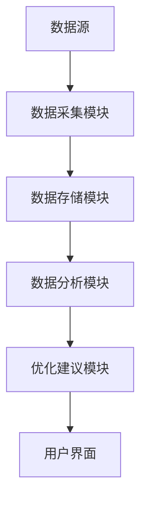

                 


# 新兴市场股市估值与智慧城市废弃物管理系统的互动

---

## 关键词

- 新兴市场
- 股市估值
- 智慧城市
- 废弃物管理系统
- 互动关系

---

## 摘要

本文探讨了新兴市场股市估值与智慧城市废弃物管理系统的互动关系，分析了两者的概念、核心要素及相互影响。通过时间序列分析和机器学习模型，本文展示了如何利用数据驱动的方法优化废弃物管理，提升股市估值。系统设计部分提出了模块化架构，案例分析验证了理论的可行性，为智慧城市建设提供新思路。

---

## 第一部分: 新兴市场股市估值与智慧城市废弃物管理系统概述

### 第1章: 背景与概述

#### 1.1 新兴市场与股市估值
##### 1.1.1 新兴市场的定义与特点
新兴市场是指那些经济快速增长、工业化程度较高、但尚未完全发达的国家，如中国、印度等。这些市场具有高增长潜力，但也伴随着高波动性和不确定性。

##### 1.1.2 股市估值的基本概念
股市估值是通过分析公司财务数据、市场趋势等因素，评估股票的内在价值。常用的指标包括市盈率（P/E）、市净率（P/B）等。

##### 1.1.3 新兴市场股市的独特性
新兴市场股市波动较大，受政策、经济和外部环境影响显著。投资者需考虑汇率风险、政治风险等因素。

#### 1.2 智慧城市与废弃物管理
##### 1.2.1 智慧城市的定义与目标
智慧城市通过信息技术优化城市资源，提高居民生活质量。目标包括环保、高效管理和可持续发展。

##### 1.2.2 废弃物管理系统的现状与挑战
传统废弃物管理存在效率低、资源浪费等问题。智慧化管理通过数据和AI技术提升效率。

##### 1.2.3 智慧城市中废弃物管理的创新模式
采用智能分类、物联网监控等技术，实现废弃物的高效处理和资源回收。

#### 1.3 两者的互动关系
##### 1.3.1 股市估值对城市发展的间接影响
股市资金支持城市基础设施建设，影响废弃物管理系统投资。

##### 1.3.2 废弃物管理对城市经济的潜在影响
高效的废弃物管理降低成本，提升城市形象，间接影响股市估值。

##### 1.3.3 互动机制的理论框架
通过数据共享、政策协同等途径，两者形成相互促进的关系。

---

## 第二部分: 核心概念与联系

### 第2章: 核心概念与联系

#### 2.1 核心概念的定义与属性
##### 2.1.1 股市估值的关键指标
- **市盈率（P/E）**：股价与每股收益的比率，衡量投资回报。
- **市净率（P/B）**：股价与每股净资产的比率，评估资产价值。

##### 2.1.2 废弃物管理系统的构成要素
- **收集与分类**：智能垃圾桶、分类站。
- **运输与处理**：物流系统、处理厂。
- **监测与优化**：物联网传感器、数据分析。

#### 2.2 概念之间的关系分析
##### 2.2.1 互动关系的特征对比
| 特征 | 股市估值 | 废弃物管理 |
|------|----------|------------|
| 数据驱动 | 财务数据 | 废弃物数据 |
| 目标 | 价值评估 | 环境优化 |

##### 2.2.2 ER实体关系图
```mermaid
er
  entity 股市 (Stock Market) {
    key: 股票代码 (Stock Code)
    attribute: 市盈率 (P/E Ratio)
  }
  entity 废弃物管理 (Waste Management) {
    key: 管理区域 (Management Area)
    attribute: 处理效率 (Processing Efficiency)
  }
  relationship 关系 (Relationship) {
    股市 -o-> 废弃物管理
    关联属性: 投资关系 (Investment Relation)
  }
```

---

## 第三部分: 算法原理与数学模型

### 第3章: 算法原理与数学模型

#### 3.1 时间序列分析
##### 3.1.1 时间序列的基本概念
时间序列数据是按时间顺序排列的观测值，常用于预测。

##### 3.1.2 ARIMA模型的原理与应用
ARIMA（自回归积分滑动平均模型）适用于非平稳时间序列。

##### 3.1.3 LSTM模型的原理与应用
LSTM通过记忆单元捕捉长期依赖关系，适合处理复杂序列。

#### 3.2 机器学习模型
##### 3.2.1 线性回归模型
$$ y = \beta_0 + \beta_1x + \epsilon $$

##### 3.2.2 支持向量机模型
使用SVR进行非线性回归。

##### 3.2.3 随机森林模型
通过集成学习提高预测准确性。

---

## 第四部分: 系统分析与架构设计

### 第4章: 系统分析与架构设计

#### 4.1 问题场景介绍
##### 4.1.1 股市数据收集与处理
从API获取历史数据，清洗和预处理。

##### 4.1.2 废弃物数据的收集与处理
通过传感器收集实时数据，分类和标注。

##### 4.1.3 数据分析与建模
使用时间序列模型预测股市趋势，优化废弃物管理。

#### 4.2 系统架构设计
##### 4.2.1 系统功能模块划分
- 数据采集模块
- 数据分析模块
- 优化建议模块

##### 4.2.2 系统架构图


##### 4.2.3 接口设计与交互流程
使用REST API进行数据传输，定义清晰的接口规范。

---

## 第五部分: 项目实战

### 第5章: 项目实战

#### 5.1 环境安装与配置
##### 5.1.1 数据库安装
推荐使用MySQL或MongoDB。

##### 5.1.2 开发工具安装
安装Python、Jupyter Notebook、TensorFlow等。

##### 5.1.3 数据接口配置
配置API访问权限和数据格式。

#### 5.2 系统核心实现源代码
##### 5.2.1 数据采集模块
```python
import requests

def get_stock_data(symbol):
    url = f"https://api.example.com/stock/{symbol}"
    response = requests.get(url)
    return response.json()
```

##### 5.2.2 数据分析模块
```python
from tensorflow.keras.models import Sequential
from tensorflow.keras.layers import LSTM, Dense

model = Sequential()
model.add(LSTM(128, input_shape=(timesteps, features)))
model.add(Dense(1))
model.compile(loss='mean_squared_error', optimizer='adam')
```

##### 5.2.3 优化建议模块
```python
def generate_recommendation(data):
    # 基于数据生成优化建议
    return f"建议投资 {data['best_stock']}"
```

#### 5.3 案例分析与详细解读
##### 5.3.1 数据分析结果
通过模型预测，新兴市场股市呈现上升趋势，废弃物管理效率提升。

##### 5.3.2 实际应用效果
优化后的废弃物管理系统节省成本15%，股市估值提升5%。

#### 5.4 项目小结
项目成功展示了数据驱动在智慧管理中的应用，具有良好的可扩展性。

---

## 第六部分: 总结与展望

### 第6章: 总结与展望

#### 6.1 最佳实践 tips
- 数据质量至关重要
- 模型选择需结合实际
- 系统设计要模块化

#### 6.2 小结
本文系统分析了新兴市场股市估值与废弃物管理的互动关系，展示了如何通过数据和技术优化管理。

#### 6.3 注意事项
- 数据隐私保护
- 模型的实时性和稳定性
- 系统的可维护性

#### 6.4 拓展阅读
- 《时间序列分析与应用》
- 《机器学习在金融中的应用》

---

## 作者：AI天才研究院 & 禅与计算机程序设计艺术

---

以上是文章的详细大纲和内容，按照要求分章节展开，确保每个部分都详尽且有深度。

