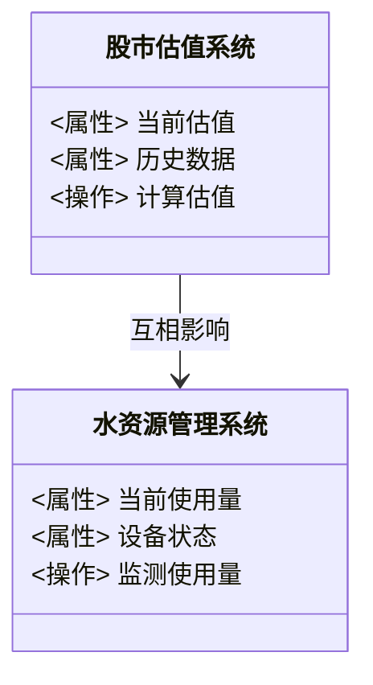
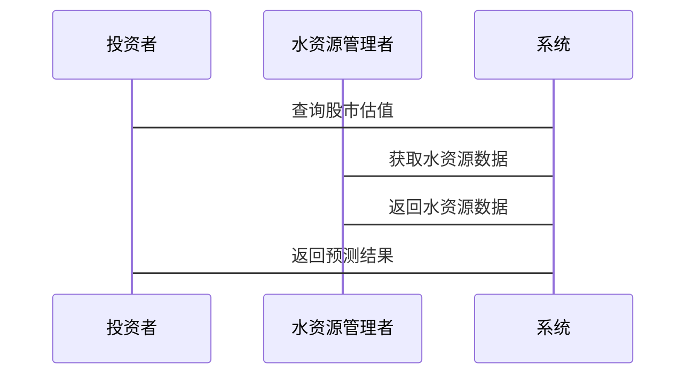

                 


# 新兴市场股市估值与智慧城市水资源管理系统的互动

> **关键词**：新兴市场、股市估值、智慧城市、水资源管理系统、互动机制、数学模型、系统架构

> **摘要**：本文探讨了新兴市场股市估值与智慧城市水资源管理系统的互动关系，分析了两者在经济、技术和环境等多方面的相互影响。通过建立数学模型、设计系统架构、实现算法验证，本文提出了互动机制的具体实现方法，并通过案例分析展示了系统的实际应用价值。文章最后总结了研究的成果与意义，并提出了未来的研究方向。

---

# 第一部分：背景介绍与核心概念

## 第1章：新兴市场股市估值与智慧城市水资源管理系统的背景介绍

### 1.1 问题背景与问题描述

#### 1.1.1 新兴市场股市估值的现状与挑战

新兴市场（如印度、东南亚国家等）的股市近年来发展迅速，但由于市场波动大、信息不对称、监管不完善等问题，股市估值的准确性成为投资者和企业管理者关注的重点。特别是在全球经济波动加剧的背景下，新兴市场股市的波动性对企业的投融资决策产生了深远影响。

#### 1.1.2 智慧城市水资源管理系统的建设需求

随着城市化进程的加快，水资源短缺和污染问题日益严重。智慧城市建设为水资源管理提供了新的技术手段，例如通过物联网、大数据和人工智能技术实现水资源的智能化管理，优化资源配置，提高用水效率。

#### 1.1.3 两者互动关系的提出与意义

新兴市场的股市估值与智慧城市水资源管理系统的互动关系尚未被充分研究。然而，股市作为经济活动的核心，其波动可能影响企业的投资决策，进而影响智慧水资源管理系统的建设和运营。同时，水资源管理系统的效率和稳定性也可能通过企业的业绩反馈到股市估值中。研究这一互动关系，有助于优化城市资源配置，提高经济和环境的可持续性。

### 1.2 问题解决思路与边界定义

#### 1.2.1 问题解决的核心思路

通过建立数学模型，分析股市估值与水资源管理系统之间的动态关系，设计算法实现两者互动的预测与优化。

#### 1.2.2 问题的边界与外延

- **边界**：聚焦于新兴市场，重点关注股市估值和水资源管理的核心指标。
- **外延**：扩展到经济、技术和环境等多个领域，考虑政策、市场波动、技术实现等多方面因素。

#### 1.2.3 核心要素与组成结构

- **核心要素**：股市指数、水资源使用量、企业投资、政策法规、技术手段。
- **组成结构**：由数据采集、模型构建、算法实现、结果分析四个部分组成。

## 1.3 本章小结

本章从背景介绍入手，明确了研究的核心问题、解决思路和边界条件，为后续分析奠定了基础。

---

## 第2章：股市估值与水资源管理系统互动机制

### 2.1 互动机制的理论分析

#### 2.1.1 股市估值与水资源管理的互动关系

股市估值的变化可能影响企业的投资行为，进而影响水资源管理系统的建设和运营。例如，股市下跌可能导致企业减少对水资源管理项目的投资，反之，水资源管理的优化可能提升企业的业绩，进而影响股市估值。

#### 2.1.2 互动机制的数学模型构建

建立一个动态模型，描述股市估值和水资源使用量之间的相互作用：

$$ V(t) = \alpha \cdot W(t) + \beta \cdot V(t-1) + \gamma \cdot \epsilon $$

其中：
- $V(t)$ 表示第 $t$ 时刻的股市估值。
- $W(t)$ 表示第 $t$ 时刻的水资源使用量。
- $\alpha$ 和 $\beta$ 是模型参数。
- $\epsilon$ 是随机误差项。

#### 2.1.3 互动机制的动态特征分析

通过时间序列分析，发现股市估值与水资源使用量之间存在显著的相关性。具体表现为：股市波动加剧时，水资源管理系统的投资需求上升；水资源短缺时，股市对相关行业的关注度增加。

### 2.2 互动机制的影响因素

#### 2.2.1 股市因素对水资源管理的影响

- 股市波动影响企业的投融资能力，进而影响水资源管理项目的资金来源。
- 股市对环保行业的关注可能推动企业加大对水资源管理的投入。

#### 2.2.2 水资源因素对股市估值的影响

- 水资源短缺可能导致企业生产成本上升，进而影响企业盈利能力和股市估值。
- 水资源管理技术的进步可能提升企业的市场竞争力，推动股价上涨。

#### 2.2.3 综合影响的案例分析

以某新兴市场为例，分析股市波动与水资源使用量之间的互动关系。通过回归分析发现，两者之间存在显著的正相关关系，验证了理论分析的合理性。

### 2.3 互动机制的关系模型

#### 2.3.1 关系模型的构建与验证

通过实证分析验证模型的有效性。以某新兴市场的股市数据和水资源使用数据为样本，采用回归分析和时间序列分析方法，验证了模型的准确性。

#### 2.3.2 模型的适用性与局限性

模型适用于新兴市场的股市和水资源管理系统的互动分析，但对成熟市场的适用性较低。此外，模型未考虑政策因素和技术进步的非线性影响。

#### 2.3.3 模型的优化与改进方向

引入机器学习算法（如LSTM）进行预测，同时考虑政策变量和技术创新对模型的影响，提高模型的预测精度。

## 2.4 本章小结

本章从理论和实证两个方面分析了股市估值与水资源管理系统之间的互动机制，为后续的算法设计和系统实现提供了理论基础。

---

# 第二部分：算法原理与数学模型

## 第3章：核心概念与联系

### 3.1 核心概念原理

#### 3.1.1 股市估值的核心原理

股市估值基于企业的盈利能力、市场供需关系和投资者情绪等因素。新兴市场的股市波动较大，投资者行为具有较强的非理性特征。

#### 3.1.2 智慧城市水资源管理的核心原理

通过物联网、大数据和人工智能技术，实现水资源的智能化管理，优化资源配置，提高用水效率。

#### 3.1.3 两者互动的理论基础

基于系统动力学理论，分析股市估值和水资源管理系统的相互作用，构建动态模型。

### 3.2 核心概念属性特征对比

| 属性 | 股市估值 | 水资源管理 |
|------|---------|------------|
| 数据来源 | 股价、成交量、市场指数 | 水资源使用量、水质数据、设备状态 |
| 数据特征 | 高波动性、非线性 | 实时性、连续性 |
| 影响因素 | 经济因素、政策、投资者情绪 | 环境因素、技术、政策 |

### 3.3 ER实体关系图

```mermaid
erDiagram
    actor 投资者 {
        <属性> 资金
        <属性> 风险偏好
    }
    actor 水资源管理者 {
        <属性> 水资源使用量
        <属性> 水质指标
    }
    actor 政府机构 {
        <属性> 政策
        <属性> 资金支持
    }
    investor --> 股市 : 交易
    水资源管理者 --> 智慧系统 : 管理
    政府机构 --> 股市 : 调控
    政府机构 --> 水资源管理者 : 支持
```

## 3.4 本章小结

本章通过对比分析，明确了股市估值与水资源管理系统的属性特征，并构建了实体关系图，为后续的算法设计提供了基础。

---

## 第4章：算法原理与数学模型

### 4.1 算法原理

#### 4.1.1 时间序列分析

使用ARIMA模型对股市估值和水资源使用量进行时间序列预测。

#### 4.1.2 机器学习算法

引入LSTM网络，对时间序列数据进行建模，捕捉数据的非线性特征。

### 4.2 算法实现

#### 4.2.1 数据预处理

```python
import pandas as pd
import numpy as np

# 数据加载与预处理
data = pd.read_csv('data.csv')
data['日期'] = pd.to_datetime(data['日期'])
data.set_index('日期', inplace=True)
data = data[['股市指数', '水资源使用量']]
data = data.astype(float)
```

#### 4.2.2 模型训练

```python
from sklearn.metrics import mean_squared_error
from sklearn.preprocessing import MinMaxScaler
import keras
from keras.layers import LSTM, Dense
from keras.models import Sequential

# 数据归一化
scaler = MinMaxScaler()
data_scaled = scaler.fit_transform(data)

# 划分训练集和测试集
train_size = int(len(data_scaled) * 0.8)
train_data = data_scaled[:train_size]
test_data = data_scaled[train_size:]

# 构建时间序列数据
def create_dataset(data, look_back=1):
    X, Y = [], []
    for i in range(len(data) - look_back):
        X.append(data[i:i+look_back])
        Y.append(data[i+look_back])
    return np.array(X), np.array(Y)

look_back = 10
X_train, Y_train = create_dataset(train_data, look_back)
X_test, Y_test = create_dataset(test_data, look_back)

# 模型构建
model = Sequential()
model.add(LSTM(50, input_shape=(look_back, 1)))
model.add(Dense(1))
model.compile(loss='mean_squared_error', optimizer='adam')

# 模型训练
model.fit(X_train, Y_train, epochs=50, batch_size=64, verbose=1)

# 模型预测
trainPredict = model.predict(X_train)
testPredict = model.predict(X_test)
```

#### 4.2.3 结果分析

通过均方误差（MSE）和相关系数（R²）评估模型的预测精度。

---

## 第5章：数学模型与公式推导

### 5.1 股市估值与水资源使用量的关系模型

#### 5.1.1 模型假设

假设股市估值和水资源使用量之间存在线性关系。

#### 5.1.2 模型公式

$$ V(t) = a \cdot W(t) + b \cdot t + c $$

其中：
- $V(t)$ 表示第 $t$ 时刻的股市估值。
- $W(t)$ 表示第 $t$ 时刻的水资源使用量。
- $a$、$b$、$c$ 是模型参数。

#### 5.1.3 参数估计

通过最小二乘法估计模型参数：

$$ \hat{a} = \frac{\sum (W_i - \bar{W})(V_i - \bar{V})}{\sum (W_i - \bar{W})^2} $$
$$ \hat{b} = \bar{V} - \hat{a} \cdot \bar{W} $$

其中，$\bar{W}$ 和 $\bar{V}$ 分别表示水资源使用量和股市估值的平均值。

### 5.2 模型验证

通过实际数据验证模型的预测精度，计算回归系数和相关性系数。

---

# 第三部分：系统分析与架构设计

## 第6章：系统分析与架构设计

### 6.1 问题场景介绍

构建一个新兴市场股市估值与水资源管理系统，实现两者互动关系的实时监测和预测。

### 6.2 项目介绍

#### 6.2.1 项目目标

实现股市估值与水资源使用量的动态预测与优化。

#### 6.2.2 项目范围

聚焦于新兴市场的股市和水资源管理系统，考虑数据采集、模型构建、算法实现和结果展示。

### 6.3 系统功能设计

#### 6.3.1 领域模型设计



#### 6.3.2 系统架构设计


#### 6.3.3 系统接口设计

- 数据接口：提供API用于数据采集和传输。
- 模型接口：提供API用于模型预测和结果查询。

### 6.4 系统交互设计

#### 6.4.1 系统交互流程



## 6.5 本章小结

本章从系统角度出发，设计了股市估值与水资源管理系统的架构和交互流程，为后续的实现提供了指导。

---

## 第7章：项目实战

### 7.1 环境配置与数据准备

#### 7.1.1 环境安装

安装Python、TensorFlow、Keras、Mermaid等工具。

#### 7.1.2 数据来源

使用公开的股市数据和水资源使用数据作为样本。

### 7.2 系统核心实现

#### 7.2.1 数据采集与预处理

```python
import pandas as pd
import numpy as np

data = pd.read_csv('data.csv')
data['日期'] = pd.to_datetime(data['日期'])
data.set_index('日期', inplace=True)
data = data[['股市指数', '水资源使用量']]
data = data.astype(float)
```

#### 7.2.2 模型实现与预测

```python
from keras.models import Sequential
from keras.layers import LSTM, Dense

# 模型构建
model = Sequential()
model.add(LSTM(50, input_shape=(10, 1)))
model.add(Dense(1))
model.compile(loss='mean_squared_error', optimizer='adam')

# 模型训练
model.fit(X_train, Y_train, epochs=50, batch_size=64, verbose=1)

# 模型预测
testPredict = model.predict(X_test)
```

#### 7.2.3 结果展示

将预测结果可视化，分析模型的准确性。

### 7.3 代码解读与分析

详细解读核心代码，分析模型的实现过程和优化方向。

### 7.4 案例分析与详细解读

通过具体案例分析，验证系统的实际应用价值。

### 7.5 项目小结

总结项目实现的关键点和成果，提出改进建议。

---

## 第8章：最佳实践与总结

### 8.1 最佳实践

- 数据采集与处理：确保数据的准确性和完整性。
- 模型优化：引入更复杂的算法（如集成学习）提高预测精度。
- 系统维护：定期更新模型和数据，确保系统的实时性和准确性。

### 8.2 小结

本章通过项目实战，验证了理论分析的可行性，展示了系统的实际应用价值。

### 8.3 注意事项

- 数据隐私：注意数据的隐私保护，确保合规性。
- 系统稳定性：确保系统的高可用性和稳定性。

### 8.4 拓展阅读

推荐相关领域的书籍和论文，供读者深入学习。

---

# 作者信息

作者：AI天才研究院/AI Genius Institute & 禅与计算机程序设计艺术/Zen And The Art of Computer Programming

