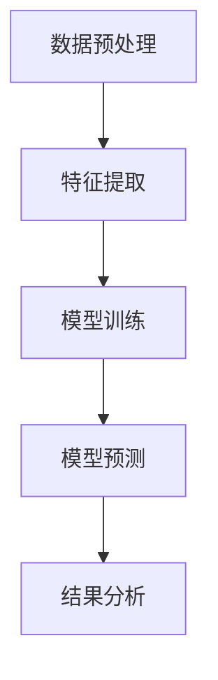
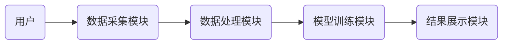
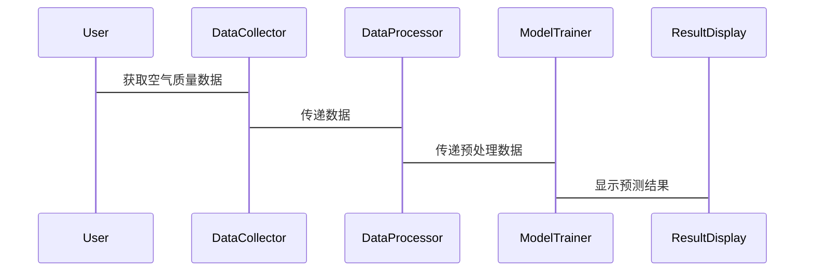

                 


# 新兴市场股市估值与智慧城市空气质量管理的互动

> 关键词：新兴市场，股市估值，智慧城市，空气质量管理，互动关系

> 摘要：本文探讨新兴市场中股市估值与智慧城市空气质量管理之间的互动关系。通过分析股市估值的核心概念、空气质量管理的数学模型以及两者之间的相互作用，提出一种基于机器学习的解决方案，以优化城市空气质量管理，提升股市估值。

---

## 第一部分：背景介绍与核心概念

### 第1章：新兴市场股市估值的背景与挑战

#### 1.1 问题背景
- **1.1.1 新兴市场的定义与特点**  
  新兴市场是指那些经济增长迅速、但尚未完全工业化的国家或地区。这些市场的特点是经济结构多元化、市场规模逐渐扩大，但同时也面临许多挑战，如金融市场不完善、政策不确定性高等。

- **1.1.2 股市估值的基本概念**  
  股市估值是通过对公司财务数据的分析，评估其股票的合理价格。常用的估值方法包括市盈率（P/E）、市净率（P/B）等。

- **1.1.3 新兴市场股市估值的独特性**  
  新兴市场股市估值的独特性主要体现在其高波动性、政策依赖性和市场流动性不足等方面。

#### 1.2 问题描述
- **1.2.1 股市估值的核心要素**  
  包括公司盈利能力、成长性、行业地位、市场竞争力等。

- **1.2.2 新兴市场的特殊挑战**  
  包括经济波动、政策变化、市场流动性不足等问题。

- **1.2.3 股市估值与经济发展的互动关系**  
  股市估值不仅是经济发展的重要指标，也对经济发展具有反作用。

### 第2章：智慧城市空气质量管理的背景与挑战

#### 2.1 问题背景
- **2.1.1 智慧城市的定义与特点**  
  智慧城市是指通过信息技术和数据驱动的方式，优化城市资源配置、提升城市管理水平的城市发展模式。

- **2.1.2 空气质量管理的基本概念**  
  空气质量管理是通过监测和控制空气污染物的排放，改善空气质量，保障居民健康的过程。

- **2.1.3 智慧城市空气质量管理的独特性**  
  智慧城市空气质量管理的独特性体现在其高度依赖数据和技术，能够实现实时监测和精准管理。

#### 2.2 问题描述
- **2.2.1 空气质量管理的核心要素**  
  包括空气污染物监测、污染源识别、空气质量预测等。

- **2.2.2 智慧城市中的特殊挑战**  
  包括数据获取难度大、模型精度要求高、管理决策复杂等。

- **2.2.3 空气质量管理与城市发展的互动关系**  
  空气质量管理不仅影响居民健康，还影响城市经济和社会发展。

### 第3章：股市估值与空气质量管理的互动关系

#### 3.1 互动背景
- **3.1.1 新兴市场的经济特征**  
  新兴市场的经济特征包括高增长、高波动、政策敏感性强等。

- **3.1.2 空气质量对经济活动的影响**  
  空气质量差会导致居民健康问题，进而影响劳动生产率和消费能力。

- **3.1.3 股市估值与城市发展的相互作用**  
  城市发展会影响股市估值，而股市估值的变化也会反过来影响城市投资和建设。

#### 3.2 互动机制
- **3.2.1 经济活动对空气质量的影响**  
  工业化进程、交通量增加等经济活动会导致空气污染加剧。

- **3.2.2 空气质量对股市估值的影响**  
  空气质量差会导致企业生产成本上升、利润下降，从而影响股票估值。

- **3.2.3 城市规划与股市估值的关系**  
  合理的城市规划可以提升空气质量，进而提高股市估值。

#### 3.3 边界与外延
- **3.3.1 新兴市场的边界条件**  
  包括经济规模、政策环境、市场流动性等。

- **3.3.2 空气质量管理的边界条件**  
  包括监测范围、污染源分布、技术能力等。

- **3.3.3 股市估值与空气质量管理的相互影响范围**  
  包括直接影响和间接影响，如居民健康、企业利润、政府政策等。

---

## 第二部分：核心概念与联系

### 第4章：核心概念与联系

#### 4.1 核心概念原理
- **4.1.1 股市估值的数学模型**  
  $$ P = \frac{E}{E/P} $$  
  其中，P为股票价格，E为每股收益，E/P为市盈率。

- **4.1.2 空气质量管理的数学模型**  
  $$ AQI = \sum_{i=1}^{n} w_i C_i $$  
  其中，AQI为空气质量指数，$w_i$为污染物权重，$C_i$为污染物浓度。

- **4.1.3 互动关系的数学模型**  
  $$ V = \beta \cdot AQI + \gamma \cdot GDP + \epsilon $$  
  其中，V为股市估值，$\beta$和$\gamma$为回归系数，GDP为国内生产总值，$\epsilon$为误差项。

#### 4.2 概念属性特征对比
以下是股市估值与空气质量管理的核心属性对比：

| 属性         | 股市估值                | 空气质量管理             |
|--------------|------------------------|--------------------------|
| 核心目标      | 评估股票合理价格        | 改善空气质量             |
| 数据来源      | 公司财务数据、市场数据  | 空气质量监测数据         |
| 方法论        | 市盈率、市净率等        | 实时监测、回归模型等     |
| 影响因素      | 利润、成长性、政策      | 污染源、气象条件、技术    |
| 应用场景      | 投资决策、风险管理      | 环境保护、公共健康        |

#### 4.3 ER实体关系图架构
以下是股市估值与空气质量管理的实体关系图：

```mermaid
erd
    项目
    -------
    id: Int Primary Key
    name: String
    stock_valuation: Int
    air_quality: Int

    空气质量监测点
    -------
    id: Int Primary Key
    location: String
    pollution_level: Int

    股市
    -------
    id: Int Primary Key
    name: String
    total_market_cap: Int

    项目 --o 股市
    项目 --o 空气质量监测点
```

---

## 第三部分：算法原理讲解

### 第5章：算法原理讲解

#### 5.1 算法原理
以下是基于机器学习的股市估值与空气质量管理互动关系的算法流程：



#### 5.2 算法实现
以下是Python代码示例：

```python
import pandas as pd
from sklearn.linear_model import LinearRegression
from sklearn.metrics import r2_score

# 数据加载
data = pd.read_csv('stock_air_data.csv')

# 特征与目标变量分离
X = data[['AQI', 'GDP']]
y = data['Stock_Valuation']

# 模型训练
model = LinearRegression()
model.fit(X, y)

# 模型预测
y_pred = model.predict(X)

# 模型评估
print("R² Score:", r2_score(y, y_pred))
```

#### 5.3 代码解读
- 数据加载：从CSV文件中加载数据。
- 特征与目标变量分离：将AQI和GDP作为特征变量，Stock_Valuation作为目标变量。
- 模型训练：使用线性回归模型进行训练。
- 模型预测：使用训练好的模型进行预测。
- 模型评估：计算R²分数，评估模型的拟合优度。

---

## 第四部分：系统分析与架构设计方案

### 第6章：系统分析与架构设计方案

#### 6.1 问题场景介绍
- 系统目标：通过整合股市数据和空气质量数据，优化城市空气质量管理，提升股市估值。

#### 6.2 系统功能设计
- 数据采集模块：实时采集空气质量数据和股市数据。
- 数据处理模块：对数据进行清洗和预处理。
- 模型训练模块：基于机器学习算法，训练互动关系模型。
- 结果展示模块：将模型预测结果可视化展示。

#### 6.3 系统架构设计
以下是系统架构图：



#### 6.4 系统交互设计
以下是系统交互序列图：



---

## 第五部分：项目实战

### 第7章：项目实战

#### 7.1 环境安装
- 安装Python和相关库：
  ```bash
  pip install pandas scikit-learn
  ```

#### 7.2 系统核心实现
以下是核心代码实现：

```python
import pandas as pd
from sklearn.linear_model import LinearRegression
from sklearn.metrics import r2_score

# 数据加载
data = pd.read_csv('stock_air_data.csv')

# 特征与目标变量分离
X = data[['AQI', 'GDP']]
y = data['Stock_Valuation']

# 模型训练
model = LinearRegression()
model.fit(X, y)

# 模型预测
y_pred = model.predict(X)

# 模型评估
print("R² Score:", r2_score(y, y_pred))
```

#### 7.3 代码应用解读
- 数据加载：从CSV文件中加载数据。
- 特征与目标变量分离：将AQI和GDP作为特征变量，Stock_Valuation作为目标变量。
- 模型训练：使用线性回归模型进行训练。
- 模型预测：使用训练好的模型进行预测。
- 模型评估：计算R²分数，评估模型的拟合优度。

#### 7.4 实际案例分析
以下是实际案例分析：

1. 数据收集：收集新兴市场股市数据和空气质量数据。
2. 数据清洗：处理缺失值和异常值。
3. 模型训练：使用机器学习算法训练互动关系模型。
4. 模型预测：预测股市估值。
5. 结果分析：分析预测结果，优化模型参数。

---

## 第六部分：小结与展望

### 第8章：小结与展望

#### 8.1 小结
- 本文探讨了新兴市场股市估值与智慧城市空气质量管理的互动关系，提出了基于机器学习的解决方案。
- 通过分析股市估值的核心概念、空气质量管理的数学模型以及两者之间的相互作用，提出了优化城市空气质量管理的策略。

#### 8.2 最佳实践
- 在进行股市估值时，应考虑空气质量对经济活动的影响。
- 在进行空气质量管理时，应考虑股市估值的变化对城市发展的反向影响。

#### 8.3 注意事项
- 数据质量对模型预测结果有重要影响，需确保数据的准确性和完整性。
- 模型的适用性需根据具体场景进行调整和优化。

#### 8.4 拓展阅读
- 推荐阅读《Python机器学习实战》和《智慧城市与环境管理》。

---

## 作者

作者：AI天才研究院/AI Genius Institute & 禅与计算机程序设计艺术 /Zen And The Art of Computer Programming

---

以上是《新兴市场股市估值与智慧城市空气质量管理的互动》的技术博客文章的完整目录和内容规划。希望这篇文章能够为您提供有价值的见解和启发！

