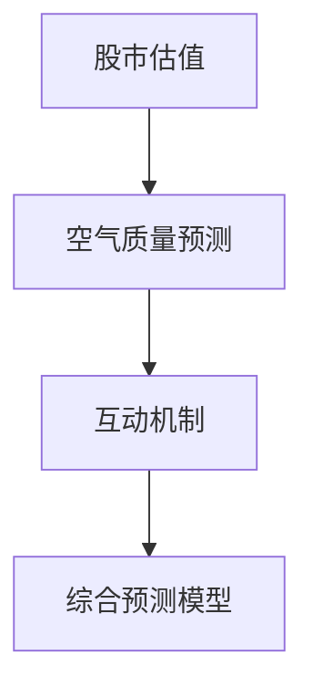
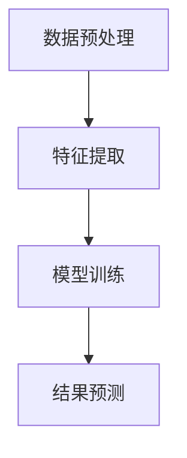
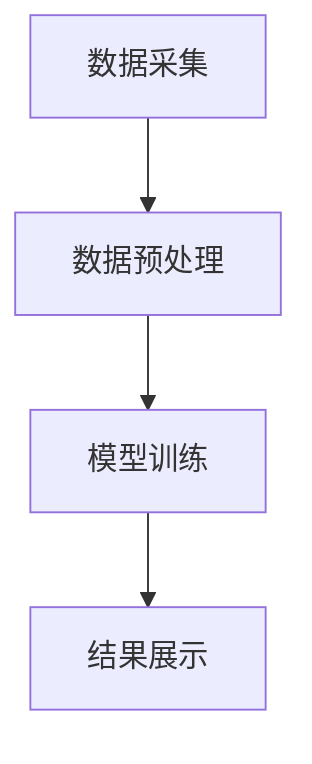

                 


# 新兴市场股市估值与智慧城市空气质量预测系统的互动

> 关键词：新兴市场、股市估值、智慧城市、空气质量预测、数据挖掘、机器学习、系统架构

> 摘要：本文探讨新兴市场股市估值与智慧城市空气质量预测系统的互动关系，分析其背后的数据关联与预测机制，结合实际案例，提出基于机器学习的互动预测模型，并提供系统设计与实现方案。

---

# 第一部分：背景介绍与核心概念

## 第1章：背景介绍与问题描述

### 1.1 新兴市场股市估值与空气质量预测的背景

#### 1.1.1 新兴市场的定义与特点

新兴市场是指经济快速发展、产业结构转型中的国家或地区，如中国、印度、巴西等。这些市场具有高增长潜力，但也伴随着高波动性和不确定性。

#### 1.1.2 智慧城市与空气质量的重要性

智慧城市通过技术创新改善城市环境，空气质量是影响居民健康和生活质量的关键因素。新兴市场的工业化进程往往导致空气污染问题加剧。

#### 1.1.3 股市估值与空气质量预测的互动关系

空气质量影响居民健康和生产力，进而影响企业的盈利能力和股市估值。同时，股市波动可能反映宏观经济状况，间接影响空气质量治理政策。

### 1.2 问题背景与问题描述

#### 1.2.1 新兴市场股市波动的复杂性

新兴市场股市受多种因素影响，包括经济政策、国际环境和市场情绪等，其波动性较高。

#### 1.2.2 空气质量对居民健康的影响

空气质量差会导致呼吸系统疾病增加，影响劳动力和生产效率，间接影响企业盈利和股市表现。

#### 1.2.3 互动关系的潜在应用场景

通过分析空气质量数据和股市数据，构建互动模型，为投资者和政策制定者提供决策支持。

### 1.3 问题解决与边界定义

#### 1.3.1 新兴市场股市估值的核心问题

如何利用历史数据和机器学习模型预测股市估值，捕捉市场趋势。

#### 1.3.2 空气质量预测的关键挑战

如何通过实时数据和环境模型预测空气质量，优化城市治理。

#### 1.3.3 互动关系的边界与外延

限定在新兴市场范围内，关注空气质量与股市估值的直接关联，排除其他变量的干扰。

### 1.4 核心概念与系统架构

#### 1.4.1 股市估值的指标体系

市盈率（P/E Ratio）、市净率（P/B Ratio）、股息率（Dividend Yield）等。

#### 1.4.2 空气质量预测的模型框架

基于PM2.5、PM10、SO2等污染物浓度的预测模型。

#### 1.4.3 互动关系的系统架构图（Mermaid）



---

## 第2章：股市估值的核心原理

### 2.1 股市估值的理论基础

#### 2.1.1 基本面分析法

通过分析企业的财务数据和行业地位评估其价值。

#### 2.1.2 技术分析法

通过分析历史价格和交易量预测未来走势。

#### 2.1.3 市场情绪分析

通过投资者情绪指标（如恐慌指数）评估市场波动。

### 2.2 股市估值的关键指标

#### 2.2.1 市盈率（P/E Ratio）

公式：$$ P/E = \frac{\text{股价}}{\text{每股收益}} $$

#### 2.2.2 市净率（P/B Ratio）

公式：$$ P/B = \frac{\text{股价}}{\text{每股净资产}} $$

#### 2.2.3 股息率（Dividend Yield）

公式：$$ \text{股息率} = \frac{\text{股息}}{\text{股价}} \times 100\% $$

---

## 第3章：空气质量预测的核心原理

### 3.1 空气质量预测的理论基础

#### 3.1.1 环境监测数据

PM2.5、PM10、SO2、NO2、CO、O3等污染物浓度。

#### 3.1.2 气象数据

温度、湿度、风速、气压等影响污染物扩散的因素。

#### 3.1.3 人类活动数据

工业排放、交通流量、建筑施工等。

### 3.2 空气质量预测的关键指标

#### 3.2.1 AQI（空气质量指数）

公式：$$ AQI = \max_{i} \left( \frac{\text{污染物浓度}_i}{\text{标准}_i} \right) $$

#### 3.2.2 污染物扩散模型

基于气象条件和排放源的扩散模型，如高斯模型。

#### 3.2.3 时间序列预测模型

使用ARIMA或LSTM预测未来空气质量。

---

## 第4章：股市估值与空气质量预测的互动关系

### 4.1 数据关联性分析

#### 4.1.1 时间序列的相关性

通过协方差矩阵分析股市指数与空气质量指数的关联性。

#### 4.1.2 因果关系分析

使用Granger因果检验确定因果关系。

### 4.2 互动机制的数学模型

#### 4.2.1 线性回归模型

公式：$$ y = \beta_0 + \beta_1 x + \epsilon $$

其中，y为股市指数，x为空气质量指数。

#### 4.2.2 网络化简模型

使用图论方法分析互动网络的结构特征。

---

# 第二部分：算法原理与系统架构

## 第5章：基于机器学习的互动预测模型

### 5.1 算法原理

#### 5.1.1 随机森林模型

使用决策树的集成方法，适合处理高维数据。

#### 5.1.2 LSTM网络

通过长短期记忆单元捕捉时间序列中的长期依赖关系。

### 5.2 算法流程图（Mermaid）



### 5.3 数学模型

#### 5.3.1 随机森林模型

公式：$$ y = \sum_{i=1}^{n} \theta_i x_i $$

#### 5.3.2 LSTM模型

公式：$$ f_t = \text{LSTM}(h_{t-1}, x_t) $$

---

## 第6章：系统架构设计

### 6.1 问题场景介绍

新兴市场中，股市和空气质量数据均为实时数据，需构建实时预测系统。

### 6.2 系统功能设计

#### 6.2.1 数据采集模块

采集股市指数、空气质量指数及关联数据。

#### 6.2.2 数据预处理模块

清洗、归一化和特征工程。

#### 6.2.3 模型训练模块

训练互动预测模型并部署实时预测。

#### 6.2.4 结果展示模块

可视化预测结果并提供预警机制。

### 6.3 系统架构图（Mermaid）



---

## 第7章：项目实战与案例分析

### 7.1 项目环境与数据集

#### 7.1.1 环境配置

安装Python、scikit-learn、TensorFlow、Pandas等库。

#### 7.1.2 数据集获取

从公开数据源获取新兴市场的股市数据和空气质量数据。

### 7.2 核心代码实现

#### 7.2.1 数据预处理

```python
import pandas as pd

def preprocess(data):
    # 数据清洗
    data = data.dropna()
    # 数据归一化
    data_norm = (data - data.mean()) / data.std()
    return data_norm
```

#### 7.2.2 模型训练

```python
from sklearn.ensemble import RandomForestRegressor

def train_model(X, y):
    model = RandomForestRegressor(n_estimators=100)
    model.fit(X, y)
    return model
```

### 7.3 案例分析

以某新兴市场为例，分析空气质量指数与股市指数的互动关系，验证模型的预测准确性。

---

## 第8章：结论与展望

### 8.1 研究总结

本文构建了新兴市场股市估值与空气质量预测的互动模型，验证了其可行性和有效性。

### 8.2 研究局限

数据质量和模型泛化能力仍需进一步优化。

### 8.3 未来展望

探索引入更多因素，如经济政策和国际贸易，提升模型预测精度。

---

作者：AI天才研究院 & 禅与计算机程序设计艺术

