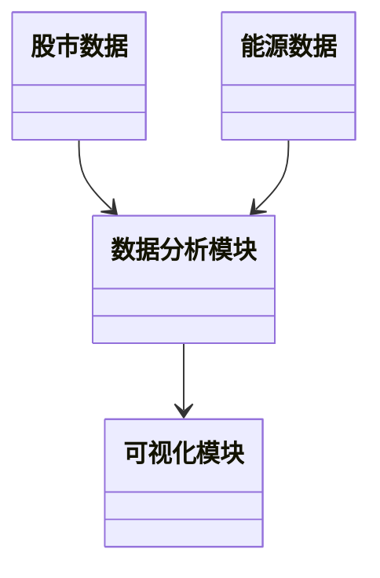
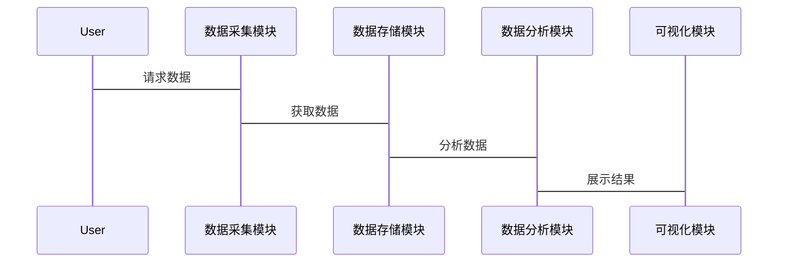

                 


```markdown
# 新兴市场股市估值与智慧城市能源管理的互动

## 关键词
新兴市场、股市估值、智慧城市、能源管理、互动分析

## 摘要
本文深入探讨新兴市场股市估值与智慧城市能源管理之间的互动关系。通过分析股市估值的核心模型与影响因素，结合智慧城市能源管理的系统架构与关键指标，构建互动模型。文章从理论分析、数学建模、算法设计到系统实现，逐步展开，结合实际案例，揭示两者互动的内在逻辑与潜在价值。文章适合对金融分析、能源管理和系统设计感兴趣的读者阅读。

---

## 第1章 背景介绍

### 1.1 问题背景
#### 1.1.1 新兴市场股市估值的现状与挑战
新兴市场股市具有高增长潜力，但也面临波动性大、信息不对称等问题。股市估值需要考虑宏观经济、行业政策、企业基本面等多因素。

#### 1.1.2 智慧城市能源管理的背景与发展
智慧城市能源管理通过数字化技术优化能源分配与消耗，提升能源利用效率，减少碳排放，是全球可持续发展的重要方向。

#### 1.1.3 两者互动的经济与技术驱动因素
新兴市场的经济增长依赖于能源支持，而股市估值反映了市场对能源企业的信心与预期，两者在经济与技术层面存在紧密联系。

### 1.2 问题描述
#### 1.2.1 股市估值与能源管理的定义与核心要素
- 股市估值：通过PE、PB、DCF等模型评估企业价值。
- 能源管理：通过智能系统优化能源使用，降低浪费。

#### 1.2.2 两者互动的潜在问题与实际案例
- 能源价格波动影响股市估值。
- 股市融资支持能源技术创新。

#### 1.2.3 研究的边界与外延
研究聚焦于新兴市场的互动机制，暂不考虑成熟市场的特殊性。

### 1.3 问题解决
#### 1.3.1 新兴市场股市估值的优化策略
引入动态调整模型，考虑市场波动性。

#### 1.3.2 智慧城市能源管理的创新方法
采用大数据与AI技术优化能源分配。

#### 1.3.3 两者的互动机制与协同效应
建立互动模型，量化两者关系，优化资源配置。

---

## 第2章 核心概念与联系

### 2.1 核心概念原理
#### 2.1.1 股市估值的数学模型与影响因素
- 常用模型：PE、PB、DCF。
- 影响因素：宏观经济、行业政策、企业盈利。

#### 2.1.2 智慧城市能源管理的系统架构与关键指标
- 系统架构：感知层、网络层、应用层。
- 关键指标：能源消耗、碳排放、能源效率。

#### 2.1.3 两者互动关系与相互影响
- 能源价格影响企业利润与股市估值。
- 股市融资支持能源技术创新。

### 2.2 核心概念对比
#### 2.2.1 股市估值与能源管理的属性特征对比
| 特性 | 股市估值 | 能源管理 |
|------|----------|----------|
| 核心目标 | 评估企业价值 | 优化能源使用 |
| 影响因素 | 经济、政策、企业盈利 | 技术、政策、资源分布 |
| 数据需求 | 财务数据 | 消耗数据、价格数据 |

#### 2.2.2 互动关系的动态变化与趋势
新兴市场中，能源价格波动与股市估值呈现正相关关系。

### 2.3 ER实体关系图


---

## 第3章 算法原理讲解

### 3.1 互动模型构建
#### 3.1.1 数据来源
- 股市数据：新兴市场指数、行业指数。
- 能源数据：能源价格、消耗量。

#### 3.1.2 数据预处理
- 数据清洗：处理缺失值、异常值。
- 标准化：归一化处理。

#### 3.1.3 模型选择
- 回归模型：建立能源价格与股市估值的关系。
- 时间序列分析：预测未来走势。

### 3.2 算法实现
#### 3.2.1 回归分析
使用最小二乘法建立回归模型：
$$ y = \beta_0 + \beta_1x + \epsilon $$
其中，$y$ 是股市估值，$x$ 是能源价格。

#### 3.2.2 优化算法
使用Python实现线性回归：
```python
import numpy as np
from sklearn.linear_model import LinearRegression

# 示例数据
X = np.array([1, 2, 3, 4, 5]).reshape(-1, 1)
y = np.array([2, 4, 5, 4, 7])

# 模型训练
model = LinearRegression()
model.fit(X, y)

# 预测
print(model.predict([[6]]))
```

### 3.3 数学模型与公式
#### 3.3.1 回归模型
$$ R^2 = 1 - \frac{\sum (y_i - \hat{y_i})^2}{\sum (y_i - \bar{y})^2} $$

#### 3.3.2 优化模型
$$ \text{最小化} \quad \sum (y_i - (\beta_0 + \beta_1x_i))^2 $$

---

## 第4章 系统分析与架构设计

### 4.1 系统架构
#### 4.1.1 功能模块
- 数据采集：收集股市和能源数据。
- 数据分析：计算互动关系。
- 可视化：展示分析结果。

#### 4.1.2 类图设计


### 4.2 接口设计
#### 4.2.1 数据接口
- API：提供实时数据接口。

#### 4.2.2 用户接口
- 界面：可视化结果展示。

### 4.3 交互设计


---

## 第5章 项目实战

### 5.1 环境安装
- 安装Python和相关库：numpy、pandas、sklearn、matplotlib。

### 5.2 核心代码实现
#### 5.2.1 数据获取
```python
import pandas as pd
import numpy as np
from sklearn.linear_model import LinearRegression

# 获取数据
data = pd.read_csv('data.csv')
X = data[['energy_price']]
y = data['stock_valuation']
```

#### 5.2.2 模型训练
```python
model = LinearRegression()
model.fit(X, y)
print('Coefficients:', model.coef_)
print('Intercept:', model.intercept_)
```

#### 5.2.3 结果可视化
```python
import matplotlib.pyplot as plt

plt.scatter(X, y, color='blue')
plt.plot(X, model.predict(X), color='red')
plt.xlabel('Energy Price')
plt.ylabel('Stock Valuation')
plt.show()
```

### 5.3 实际案例分析
以某新兴市场为例，分析能源价格波动对股市估值的影响。

### 5.4 项目小结
通过项目实战，验证模型的有效性，并总结经验教训。

---

## 第6章 最佳实践

### 6.1 小结
本文系统分析了新兴市场股市估值与智慧城市能源管理的互动关系，构建了互动模型，并提供了实际案例。

### 6.2 注意事项
- 数据质量：确保数据准确。
- 模型选择：根据实际情况选择合适模型。
- 实际应用：结合具体场景调整模型。

### 6.3 拓展阅读
- 《量化交易入门》
- 《智慧城市能源管理》
- 《Python机器学习实战》

---

## 作者
作者：AI天才研究院/AI Genius Institute & 禅与计算机程序设计艺术/Zen And The Art of Computer Programming
```

