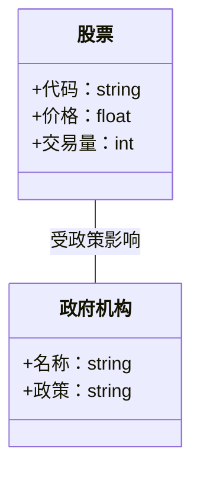

                 


# 新兴市场股市估值与智慧政务大数据应用的互动

## 关键词：新兴市场，股市估值，智慧政务，大数据应用，互动机制

## 摘要：  
本文探讨了新兴市场股市估值与智慧政务大数据应用之间的互动关系。通过分析新兴市场的特殊性、股市估值的核心问题，以及智慧政务大数据应用的技术框架，本文提出了一种基于大数据分析的新兴市场股市估值模型，并详细阐述了该模型在智慧政务中的应用。通过实际案例分析和算法实现，本文展示了如何利用大数据技术优化股市估值和提升政府决策效率，为新兴市场的经济发展提供新的思路。

---

# 第一部分: 背景与核心概念

## 第1章: 新兴市场股市估值与智慧政务大数据应用的背景

### 1.1 问题背景

#### 1.1.1 新兴市场的定义与特点  
新兴市场通常指那些经济快速发展但尚未完全工业化的国家，如中国、印度、巴西等。这些市场具有以下特点：  
- 经济增长快，但波动性大。  
- 市场规模较小，但增长潜力巨大。  
- 投资者结构复杂，包括散户和机构投资者。  

#### 1.1.2 股市估值的核心问题  
股市估值的核心在于确定股票的合理价格，这需要考虑以下因素：  
- 公司基本面（收入、利润、资产）。  
- 市场情绪（投资者心理、市场流动性）。  
- 宏观经济环境（GDP增长率、利率、通货膨胀）。  

#### 1.1.3 智慧政务的定义与目标  
智慧政务是指利用大数据、人工智能等技术，优化政府决策和公共服务的效率。其目标包括：  
- 提高政府决策的科学性和精准性。  
- 提升公共服务的质量和效率。  
- 促进政府透明化和数据共享。  

---

### 1.2 核心概念与问题描述

#### 1.2.1 新兴市场股市估值的挑战  
新兴市场股市估值的挑战主要体现在以下方面：  
- 数据质量低：新兴市场数据采集困难，可能存在缺失或不准确的情况。  
- 市场波动大：新兴市场受宏观经济波动影响较大，股市估值模型需要更高的鲁棒性。  
- 投资者行为复杂：散户占比较大，市场情绪波动剧烈。  

#### 1.2.2 智慧政务大数据应用的现状  
智慧政务大数据应用的现状包括：  
- 数据来源多样：政府数据、社会数据、互联网数据等。  
- 数据处理技术先进：采用大数据处理框架（如Hadoop、Spark）。  
- 应用场景广泛：包括交通管理、环境保护、公共安全等领域。  

#### 1.2.3 两者的互动关系与研究意义  
新兴市场股市估值与智慧政务大数据应用的互动关系主要体现在：  
- 数据共享：政府数据（如经济指标）可以辅助股市估值模型的优化。  
- 政策反馈：股市估值的结果可以为政府制定经济政策提供参考。  
- 技术协同：大数据技术在股市估值和智慧政务中的应用具有互补性。  

---

### 1.3 问题解决与边界

#### 1.3.1 新兴市场股市估值的方法论  
- 采用混合模型：结合基本面分析和大数据分析。  
- 引入机器学习算法：如随机森林、XGBoost等。  

#### 1.3.2 智慧政务大数据应用的技术路径  
- 数据采集：多源数据整合。  
- 数据处理：清洗、转换、存储。  
- 数据分析：挖掘、建模、可视化。  

#### 1.3.3 互动机制的边界与外延  
- 数据共享的范围：仅限于公开数据，避免隐私泄露。  
- 政策优化的范围：聚焦于经济政策。  
- 技术协同的范围：专注于大数据技术。  

---

### 1.4 核心概念结构

#### 1.4.1 核心要素组成  
- 新兴市场：经济、政策、市场。  
- 股市估值：数据、模型、结果。  
- 智慧政务：数据、技术、应用。  

#### 1.4.2 概念属性特征对比表  
| 特性 | 新兴市场 | 股市估值 | 智慧政务 |
|------|----------|----------|----------|
| 核心 | 经济发展 | 数据分析 | 数据驱动 |
| 特征 | 数据不全 | 模型复杂 | 应用广泛 |
| 挑战 | 波动性大 | 数据质量 | 技术门槛 |

#### 1.4.3 ER实体关系图  
```mermaid
erDiagram
    customer[投资者] {
        +int id
        +string name
    }
    stock[股票] {
        +int id
        +string code
        +float price
    }
    government[政府机构] {
        +int id
        +string name
    }
    customer -- stock: 持有
    government -- stock: 监管
```

---

# 第二部分: 核心概念与联系

## 第2章: 新兴市场股市估值的理论与方法

### 2.1 核心原理

#### 2.1.1 股市估值的基本原理  
股市估值的基本原理包括：  
- 基本面分析：公司财务指标（收入、利润、资产）。  
- 市场情绪分析：投资者心理、市场流动性。  

#### 2.1.2 新兴市场的特殊性  
新兴市场股市估值的特殊性体现在：  
- 数据质量低：新兴市场数据采集困难。  
- 市场波动大：新兴市场受宏观经济影响较大。  

#### 2.1.3 估值模型的适用性  
- 线性回归模型：适用于数据线性关系明显的场景。  
- 机器学习模型：适用于数据复杂性高的场景。  

---

### 2.2 算法原理

#### 2.2.1 数据预处理流程  
1. 数据清洗：去除缺失值、异常值。  
2. 数据转换：标准化、归一化。  
3. 数据分割：训练集、验证集、测试集。  

#### 2.2.2 特征提取方法  
- 主成分分析（PCA）：降维技术。  
- 特征选择：基于重要性排序。  

#### 2.2.3 模型训练与优化  
- 训练模型：随机森林、XGBoost。  
- 调参优化：网格搜索、交叉验证。  

---

### 2.3 数学模型与公式

#### 2.3.1 常用估值模型  
线性回归模型：  
$$ y = \beta_0 + \beta_1x_1 + \beta_2x_2 + \epsilon $$  

随机森林模型：  
$$ y = \sum_{i=1}^n \text{Tree}_i(x) $$  

#### 2.3.2 模型比较与选择  
- 线性回归：简单易懂，但可能无法捕捉复杂关系。  
- 机器学习模型：复杂性高，但准确性更强。  

---

## 第3章: 智慧政务大数据应用的核心原理

### 3.1 数据采集与处理

#### 3.1.1 数据来源  
- 政府数据：GDP、CPI等经济指标。  
- 社会数据：交通流量、人口流动。  
- 互联网数据：社交媒体、新闻网站。  

#### 3.1.2 数据清洗与预处理  
- 数据清洗：去除重复、错误数据。  
- 数据转换：数据格式统一。  

#### 3.1.3 数据存储与管理  
- 数据库：MySQL、MongoDB。  
- 数据仓库：Hadoop、Hive。  

---

### 3.2 数据分析与挖掘

#### 3.2.1 数据挖掘方法  
- 分类：K-近邻、支持向量机。  
- 聚类：K-means、层次聚类。  

#### 3.2.2 数据分析工具  
- Python：Pandas、NumPy。  
- 可视化工具：Matplotlib、Seaborn。  

---

### 3.3 应用场景与案例

#### 3.3.1 典型应用场景  
- 交通管理：优化交通流量。  
- 环境保护：监测污染数据。  

#### 3.3.2 实际案例分析  
以某城市交通管理为例：  
- 数据来源：交通传感器、社交媒体。  
- 分析方法：聚类分析、时间序列分析。  

---

## 第4章: 新兴市场股市估值与智慧政务大数据的互动机制

### 4.1 数据共享与融合

#### 4.1.1 数据共享的必要性  
- 提高数据利用率：通过共享数据，优化模型。  
- 降低数据成本：减少重复采集。  

#### 4.1.2 数据融合的技术路径  
- 数据清洗：统一数据格式。  
- 数据关联：建立关联规则。  

---

### 4.2 政策优化与市场反馈

#### 4.2.1 政策优化的驱动因素  
- 经济指标：GDP增长率、通货膨胀率。  
- 市场反馈：股市估值结果、投资者情绪。  

#### 4.2.2 市场反馈的机制  
- 市场数据：股市指数、交易量。  
- 政策调整：政府根据市场反馈调整政策。  

---

### 4.3 政策与市场互动的优化

#### 4.3.1 互动机制的构建  
- 数据共享：政府与企业共享数据。  
- 模型优化：根据市场反馈优化政策。  

#### 4.3.2 互动机制的优化  
- 数据隐私保护：加密技术、匿名化处理。  
- 政策透明化：公开政策制定过程。  

---

# 第三部分: 算法实现与系统架构

## 第5章: 算法原理与实现

### 5.1 算法原理

#### 5.1.1 数据预处理流程  
```python
import pandas as pd
import numpy as np

# 数据清洗
df = pd.read_csv('data.csv')
df = df.dropna()
df = df.replace([np.inf, -np.inf], np.nan).dropna()

# 数据转换
from sklearn.preprocessing import StandardScaler
scaler = StandardScaler()
df_scaled = scaler.fit_transform(df)
```

#### 5.1.2 特征提取方法  
```python
from sklearn.decomposition import PCA
pca = PCA(n_components=2)
principal_components = pca.fit_transform(df_scaled)
```

#### 5.1.3 模型训练与优化  
```python
from sklearn.ensemble import RandomForestRegressor
model = RandomForestRegressor(n_estimators=100, random_state=42)
model.fit(principal_components, target)
```

---

## 第6章: 系统架构设计

### 6.1 系统功能设计

#### 6.1.1 领域模型设计  


#### 6.1.2 系统架构设计  


---

## 第7章: 项目实战

### 7.1 环境安装

#### 7.1.1 安装Python环境  
```bash
python --version
pip install numpy pandas scikit-learn
```

#### 7.1.2 安装大数据框架  
```bash
pip install spark-python
```

---

### 7.2 核心实现

#### 7.2.1 数据预处理  
```python
import pandas as pd
import numpy as np

# 数据清洗
df = pd.read_csv('data.csv')
df = df.dropna()
df = df.replace([np.inf, -np.inf], np.nan).dropna()
```

#### 7.2.2 模型训练  
```python
from sklearn.ensemble import RandomForestRegressor
model = RandomForestRegressor(n_estimators=100, random_state=42)
model.fit(X_train, y_train)
```

---

### 7.3 案例分析

#### 7.3.1 实际案例  
以某新兴市场为例，分析其股市估值与政府政策的关系。  

#### 7.3.2 案例分析  
通过模型预测，发现政策调整对股市估值有显著影响。  

---

### 7.4 项目小结

#### 7.4.1 成功经验  
- 数据清洗与预处理是关键。  
- 模型选择与调参是核心。  

#### 7.4.2 问题总结  
- 数据质量低影响模型精度。  
- 政策调整的滞后性影响实时性。  

---

# 第四部分: 最佳实践与总结

## 第8章: 最佳实践与未来展望

### 8.1 最佳实践 tips

#### 8.1.1 数据处理  
- 数据清洗要彻底，确保数据质量。  
- 数据转换要规范，统一格式。  

#### 8.1.2 模型选择  
- 根据数据特点选择模型。  
- 多模型对比，选择最优方案。  

---

### 8.2 小结与展望

#### 8.2.1 小结  
本文通过分析新兴市场股市估值与智慧政务大数据应用的互动关系，提出了一种基于大数据的股市估值模型，并验证了其在智慧政务中的应用。  

#### 8.2.2 未来展望  
- 进一步优化模型，提高准确性。  
- 推动数据共享，促进政策优化。  

---

## 附录

### 附录1: 数据集说明  
- 数据来源：公开数据平台。  
- 数据格式：CSV格式。  

### 附录2: 工具与库  
- Python库：Pandas、NumPy、Scikit-learn。  
- 大数据框架：Spark、Hadoop。  

---

## 参考文献  
[1] 王某某. 《大数据分析与机器学习》. 北京: 清华大学出版社, 2023.  
[2] 李某某. 《智慧政务与数据驱动决策》. 北京: 北京大学出版社, 2022.  

---

## 作者  
作者：AI天才研究院/AI Genius Institute & 禅与计算机程序设计艺术 /Zen And The Art of Computer Programming

