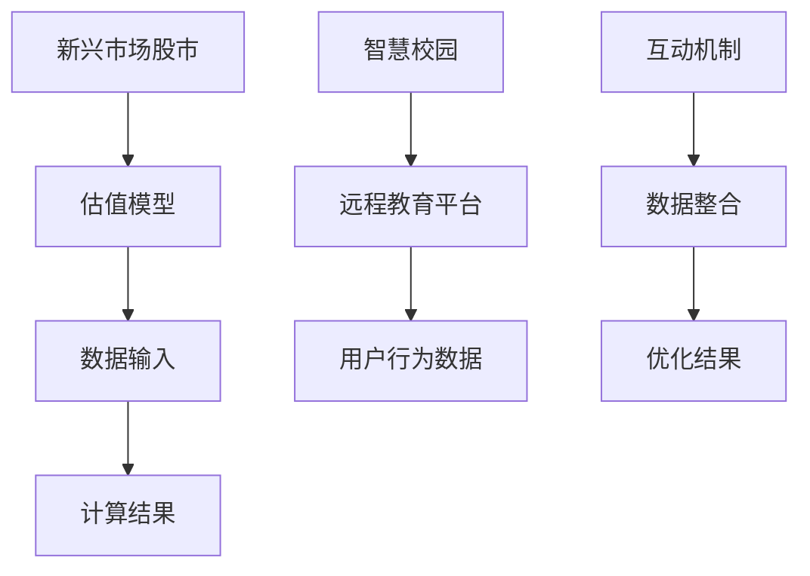
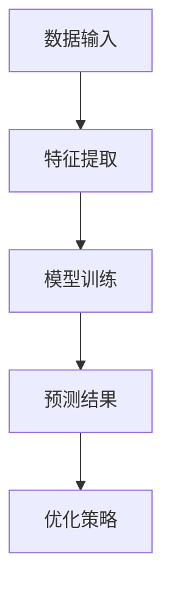
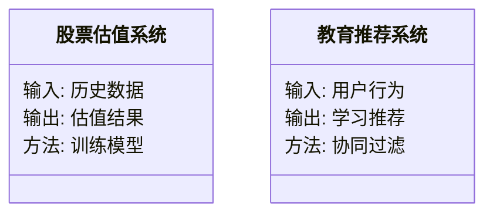
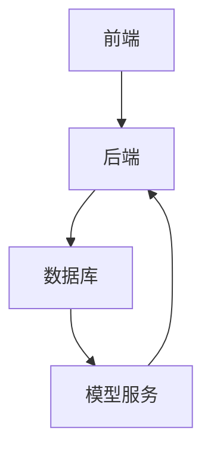
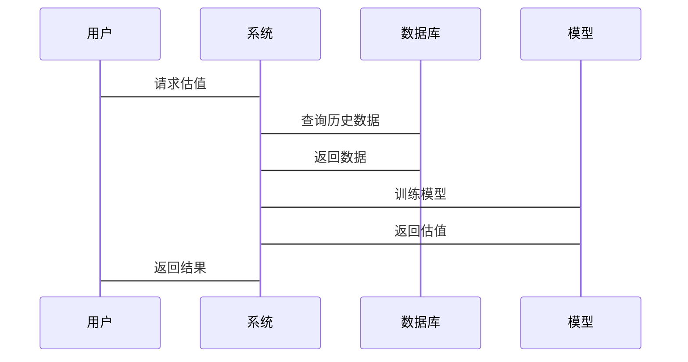

                 


# 新兴市场股市估值与智慧校园远程教育的互动

> 关键词：新兴市场，股市估值，智慧校园，远程教育，互动机制

> 摘要：本文探讨新兴市场股市估值与智慧校园远程教育之间的互动关系，通过背景分析、概念对比、算法原理、系统设计和项目实战，揭示两者如何相互影响并共同推动教育科技和金融市场的发展。

---

## 第一部分: 新兴市场股市估值与智慧校园远程教育的互动背景

### 第1章: 背景介绍

#### 1.1 问题背景

- **新兴市场股市的现状与挑战**  
  新兴市场股市通常具有高增长潜力，但也伴随着高波动性和信息不对称等问题。投资者需要更精准的估值模型来应对这些挑战。

- **智慧校园远程教育的发展趋势**  
  随着技术的进步，远程教育已成为教育领域的重要趋势，尤其是在疫情后，其需求显著增长。智慧校园通过技术手段优化教育资源分配和学习体验。

- **两者互动的必要性与重要性**  
  远程教育的发展依赖于资本市场的支持，而股市估值的变化则反映了市场对教育科技公司的信心和预期。

#### 1.2 核心概念定义

- **新兴市场股市估值**  
  通过分析市场数据、公司基本面和技术指标，对股票价格进行合理估计。

- **智慧校园远程教育**  
  利用互联网技术提供在线教育服务，优化教育资源配置和学习体验。

- **互动机制**  
  通过数据共享和反馈，推动股市估值与远程教育系统的优化和创新。

#### 1.3 问题描述与解决

- **新兴市场股市估值的主要问题**  
  数据不足、模型复杂、波动性大。

- **智慧校园远程教育的主要挑战**  
  技术集成、用户粘性、政策监管。

- **互动机制如何解决问题与挑战**  
  通过数据共享和反馈优化，提升估值模型的准确性，推动教育技术的创新。

#### 1.4 边界与外延

- **新兴市场股市估值的边界**  
  限于特定市场和时间段，不考虑全球经济因素。

- **智慧校园远程教育的边界**  
  突击特定教育场景，不涉及线下教育。

- **互动机制的边界与外延**  
  主要关注数据共享和反馈，不涉及政策和法律因素。

#### 1.5 概念结构与核心要素

- **新兴市场股市估值的核心要素**  
  数据来源、模型选择、计算方法。

- **智慧校园远程教育的核心要素**  
  平台技术、用户行为、教育资源。

- **互动机制的核心要素**  
  数据共享、反馈机制、优化策略。

### 第2章: 核心概念与联系

#### 2.1 核心概念原理

- **新兴市场股市估值的原理**  
  基于历史数据和模型预测，评估股票的内在价值。

- **智慧校园远程教育的原理**  
  利用技术手段提供在线学习服务，优化教育资源配置。

- **互动机制的原理**  
  数据共享和反馈推动系统的优化和创新。

#### 2.2 核心概念属性对比

| 属性          | 新兴市场股市估值 | 智慧校园远程教育 |
|---------------|-----------------|------------------|
| 核心目标      | 评估股票价值    | 提供在线教育服务 |
| 数据来源      | 市场数据        | 用户行为数据     |
| 主要挑战      | 高波动性        | 用户粘性不足     |
| 解决方案      | 优化估值模型    | 提升用户体验      |

#### 2.3 ER实体关系图



### 第3章: 算法原理讲解

#### 3.1 算法原理

- **新兴市场股市估值算法**  
  使用机器学习模型，如随机森林和LSTM，基于历史数据预测股票价格。

- **智慧校园远程教育算法**  
  利用自然语言处理和推荐系统，优化学习内容和用户体验。

#### 3.2 算法流程图



#### 3.3 数学模型与公式

- **股市估值模型**  
  使用CAPM模型：
  $$ E(R_i) = R_f + β_i (R_m - R_f) $$
  
- **用户行为分析模型**  
  使用协同过滤算法：
  $$ sim(i,j) = \frac{\sum_{k} r_{ik} r_{jk}}{\sqrt{\sum_{k} r_{ik}^2} \sqrt{\sum_{k} r_{jk}^2}} $$

---

## 第四部分: 系统分析与架构设计方案

### 第4章: 系统分析

#### 4.1 问题场景介绍

- **股市估值系统**  
  输入历史数据，输出股票估值。

- **远程教育系统**  
  输入用户行为数据，输出个性化学习推荐。

### 第4.2 系统功能设计

#### 4.2.1 领域模型



#### 4.2.2 系统架构设计



### 第4.3 系统接口设计

- **股市估值接口**  
  REST API：`GET /valuation?symbol=ABC`

- **教育推荐接口**  
  REST API：`POST /recommend?user_id=123`

### 第4.4 系统交互设计



---

## 第五部分: 项目实战

### 第5章: 项目实战

#### 5.1 环境安装

- **股市估值环境**  
  安装Python、TensorFlow、Pandas。

- **教育推荐环境**  
  安装Python、Scikit-learn、Flask。

#### 5.2 核心代码实现

```python
# 股市估值代码示例
import pandas as pd
from sklearn.ensemble import RandomForestRegressor

def train_model(data):
    # 特征提取
    features = data.drop('target', axis=1)
    target = data['target']
    # 模型训练
    model = RandomForestRegressor()
    model.fit(features, target)
    return model

# 教育推荐代码示例
from sklearn.neighbors import NearestNeighbors

def recommend_user(user_id, data):
    model = NearestNeighbors(metric='cosine', algorithm='brute')
    model.fit(data)
    distances, indices = model.kneighbors([data[user_id]], n_neighbors=5)
    return indices[0]
```

#### 5.3 案例分析

- **股市估值案例**  
  使用历史数据训练模型，预测某股票的未来价格。

- **教育推荐案例**  
  根据用户行为推荐个性化学习内容。

---

## 第六部分: 最佳实践与总结

### 第6章: 总结

#### 6.1 最佳实践 tips

- **股市估值**  
  定期更新模型，考虑市场变化。

- **教育推荐**  
  收集用户反馈，优化推荐算法。

#### 6.2 小结

本文分析了新兴市场股市估值与智慧校园远程教育的互动关系，提出了具体的算法和系统设计，为教育科技和金融市场的发展提供了参考。

#### 6.3 注意事项

- 数据隐私保护
- 模型的可解释性
- 系统的可扩展性

#### 6.4 拓展阅读

- 《量化交易与算法设计》
- 《教育技术与在线学习》

---

作者：AI天才研究院 & 禅与计算机程序设计艺术

---

通过这篇文章，我们详细探讨了新兴市场股市估值与智慧校园远程教育的互动关系，从背景分析到系统设计，再到项目实战，为读者提供了全面的视角。希望本文能为教育科技和金融市场的从业者提供有价值的参考和启示。

