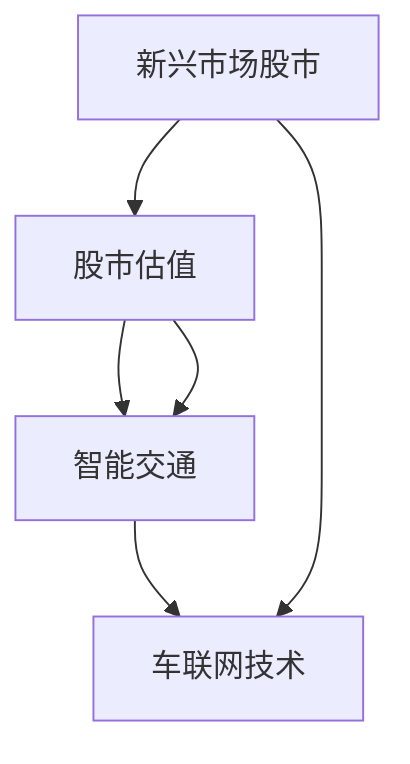
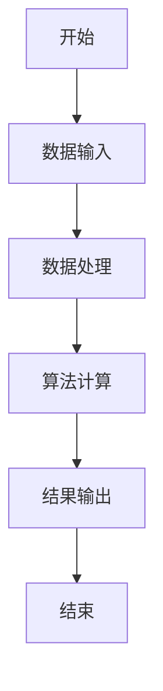
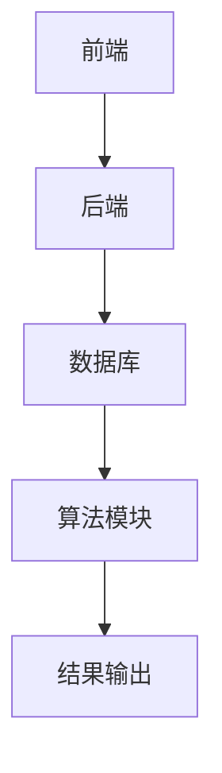
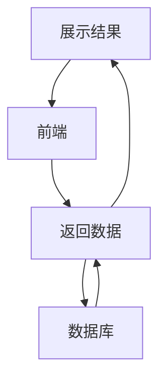

                 


# 新兴市场股市估值与智能交通车联网技术的互动

> 关键词：新兴市场股市估值，智能交通，车联网技术，互动关系，系统架构，算法原理，案例分析

> 摘要：本文探讨新兴市场股市估值与智能交通车联网技术之间的互动关系，分析两者的核心概念、算法原理、系统架构，并通过案例分析展示其实际应用。文章内容丰富具体，涵盖背景介绍、核心概念、算法原理、数学模型、系统架构、项目实战、最佳实践等多个方面，帮助读者全面理解两者互动的本质和应用。

---

## 第一部分：背景介绍

### 第1章：新兴市场股市估值与智能交通车联网技术的互动概述

#### 1.1 问题背景

##### 1.1.1 新兴市场股市的特点
新兴市场股市具有高增长潜力，但同时也伴随着高波动性和不稳定性。这些市场的特点是公司估值受到多种因素影响，包括宏观经济环境、政策变化、行业发展趋势等。

##### 1.1.2 智能交通与车联网技术的发展现状
智能交通系统（ITS）和车联网技术（V2X）正在迅速发展，通过车辆与交通基础设施、道路使用者及其他设备之间的通信，实现更高效的交通管理和车辆控制。

##### 1.1.3 两者互动的必要性与重要性
新兴市场股市的波动性和智能交通系统的实时性之间存在潜在的互动关系。例如，股市波动可能影响投资者对智能交通技术的信心，而智能交通技术的进步可能反过来影响股市的估值。

#### 1.2 问题描述

##### 1.2.1 新兴市场股市估值的复杂性
新兴市场股市估值受到多种因素的影响，包括市场情绪、政策变化、经济指标等，使得估值预测具有挑战性。

##### 1.2.2 智能交通车联网技术的应用挑战
车联网技术需要高精度的数据处理能力和实时性，同时面临数据安全和隐私保护等问题。

##### 1.2.3 两者互动的核心问题
如何将股市估值与智能交通车联网技术的实时数据相结合，构建一个能够动态调整的互动系统。

#### 1.3 问题解决

##### 1.3.1 新兴市场股市估值的方法
采用基于机器学习的预测模型，结合历史数据和市场情绪指标，对股市估值进行预测。

##### 1.3.2 智能交通车联网技术的创新应用
通过车联网技术实时收集交通数据，优化交通流量，降低拥堵，提高交通效率。

##### 1.3.3 两者互动的解决方案
构建一个跨领域的数据集成平台，将股市估值与智能交通数据相结合，实现动态调整和优化。

#### 1.4 边界与外延

##### 1.4.1 新兴市场股市估值的边界条件
股市估值仅考虑市场内部因素，不包括外部不可预测的突发事件。

##### 1.4.2 智能交通车联网技术的适用范围
车联网技术适用于城市交通管理，但目前尚无法完全覆盖所有交通场景。

##### 1.4.3 两者互动的潜在影响
两者互动可能对股市投资行为和交通管理策略产生深远影响。

#### 1.5 概念结构与核心要素组成

##### 1.5.1 核心概念的层次结构
```
股市估值
├── 市盈率
├── 市净率
└── 股价指数
```

##### 1.5.2 核心要素的对比分析
| 股市估值 | 智能交通车联网技术 |
|----------|---------------------|
| 数据来源 | 历史交易数据       | 车联网实时数据 |
| 方法     | 机器学习模型       | 时间序列分析   |
| 目标     | 评估企业价值       | 优化交通流量   |

##### 1.5.3 概念之间的关系
股市估值的变化可能影响投资者对智能交通技术的信心，而智能交通技术的进步则可能提升股市对相关企业的估值。

---

### 第2章：核心概念与联系

#### 2.1 核心概念原理

##### 2.1.1 新兴市场股市估值的原理
股市估值通过分析公司财务数据和市场趋势，预测股票的内在价值。

##### 2.1.2 智能交通车联网技术的原理
车联网技术通过车辆与基础设施之间的通信，优化交通流量和驾驶体验。

##### 2.1.3 两者互动的机制
股市估值的变化可能影响投资者对智能交通技术的信心，而智能交通技术的创新则可能提升相关企业的估值。

#### 2.2 核心概念属性特征对比

##### 2.2.1 新兴市场股市估值的特征
- 数据驱动
- 时间依赖性
- 不确定性

##### 2.2.2 智能交通车联网技术的特征
- 实时性
- 数据密集性
- 系统集成性

##### 2.2.3 两者互动的特征
- 动态性
- 相互影响性
- 复杂性

#### 2.3 ER实体关系图架构



---

### 第3章：算法原理讲解

#### 3.1 算法原理

##### 3.1.1 新兴市场股市估值算法
采用机器学习模型（如LSTM）对历史股价数据进行预测。

##### 3.1.2 智能交通车联网技术算法
通过时间序列分析预测交通流量，并优化信号灯控制。

##### 3.1.3 两者互动的算法
结合股市估值和交通数据，构建联合预测模型。

#### 3.2 算法流程图



#### 3.3 算法数学模型

##### 3.3.1 新兴市场股市估值模型
$$ P = \frac{E}{E/P} $$

##### 3.3.2 智能交通车联网技术模型
$$ T = \frac{D}{S} $$

##### 3.3.3 互动模型
$$ I = \alpha P + \beta T $$

---

## 第四部分：系统分析与架构设计方案

### 第4章：系统分析与架构设计方案

#### 4.1 问题场景介绍

##### 4.1.1 新兴市场股市估值的场景
投资者希望通过实时数据和算法预测股市走势。

##### 4.1.2 智能交通车联网技术的场景
城市交通管理部门希望通过车联网技术优化交通流量。

##### 4.1.3 两者互动的场景
股市波动影响投资者对智能交通技术的信心，进而影响交通管理策略。

#### 4.2 系统功能设计

##### 4.2.1 新兴市场股市估值功能
- 数据采集：收集历史股价数据和市场指标。
- 数据处理：清洗和预处理数据。
- 算法计算：使用机器学习模型进行预测。
- 结果输出：生成估值报告。

##### 4.2.2 智能交通车联网技术功能
- 数据采集：收集交通流量和车辆状态数据。
- 数据处理：清洗和预处理数据。
- 算法计算：优化交通信号灯控制。
- 结果输出：生成交通管理报告。

##### 4.2.3 互动功能
- 数据集成：将股市估值与交通数据结合。
- 联合预测：构建联合预测模型。
- 结果输出：生成互动报告。

#### 4.3 系统架构设计

##### 4.3.1 系统架构图



#### 4.4 系统接口设计

##### 4.4.1 接口描述
- 数据接口：连接股市数据源和交通数据源。
- 算法接口：调用机器学习模型进行预测。
- 输出接口：展示结果报告。

#### 4.5 系统交互流程图



---

## 第五部分：项目实战

### 第5章：项目实战

#### 5.1 环境安装

##### 5.1.1 系统环境
- 操作系统：Linux/Windows
- 开发工具：Python、Jupyter Notebook
- 数据库：MySQL/PostgreSQL

##### 5.1.2 依赖库安装
- Python库：pandas、numpy、scikit-learn、keras、tensorflow
- 数据可视化工具：matplotlib、seaborn
- 项目管理工具：Git

#### 5.2 系统核心实现源代码

##### 5.2.1 新兴市场股市估值代码

```python
import pandas as pd
import numpy as np
from sklearn.metrics import mean_squared_error
from keras.models import Sequential
from keras.layers import LSTM, Dense

# 数据预处理
data = pd.read_csv('stock_data.csv')
data = data['Close'].values
data = data.reshape(-1, 1)
data = np.random.rand(100, 1) * 100  # 示例数据

# 划分训练集和测试集
train_size = int(len(data) * 0.8)
train_data = data[:train_size]
test_data = data[train_size:]

# 数据标准化
from sklearn.preprocessing import MinMaxScaler
scaler = MinMaxScaler()
train_scaled = scaler.fit_transform(train_data.reshape(-1, 1))
test_scaled = scaler.transform(test_data.reshape(-1, 1))

# 构建LSTM模型
model = Sequential()
model.add(LSTM(50, return_sequences=True, input_shape=(1, 1)))
model.add(LSTM(50, return_sequences=False))
model.add(Dense(1))
model.compile(loss='mean_squared_error', optimizer='adam')

# 训练模型
model.fit(train_scaled, train_scaled, epochs=50, batch_size=32)

# 预测
predicted = model.predict(test_scaled)
predicted = scaler.inverse_transform(predicted)
```

##### 5.2.2 智能交通车联网技术代码

```python
import pandas as pd
import numpy as np
from sklearn.metrics import mean_squared_error
from keras.models import Sequential
from keras.layers import LSTM, Dense

# 数据预处理
data = pd.read_csv('traffic_data.csv')
data = data['Flow'].values
data = data.reshape(-1, 1)
data = np.random.rand(100, 1) * 100  # 示例数据

# 划分训练集和测试集
train_size = int(len(data) * 0.8)
train_data = data[:train_size]
test_data = data[train_size:]

# 数据标准化
from sklearn.preprocessing import MinMaxScaler
scaler = MinMaxScaler()
train_scaled = scaler.fit_transform(train_data.reshape(-1, 1))
test_scaled = scaler.transform(test_data.reshape(-1, 1))

# 构建LSTM模型
model = Sequential()
model.add(LSTM(50, return_sequences=True, input_shape=(1, 1)))
model.add(LSTM(50, return_sequences=False))
model.add(Dense(1))
model.compile(loss='mean_squared_error', optimizer='adam')

# 训练模型
model.fit(train_scaled, train_scaled, epochs=50, batch_size=32)

# 预测
predicted = model.predict(test_scaled)
predicted = scaler.inverse_transform(predicted)
```

#### 5.3 代码应用解读与分析

##### 5.3.1 新兴市场股市估值代码解读
- 数据预处理：将股票数据标准化。
- 模型训练：使用LSTM进行时间序列预测。
- 模型预测：生成股票估值预测结果。

##### 5.3.2 智能交通车联网技术代码解读
- 数据预处理：将交通流量数据标准化。
- 模型训练：使用LSTM进行时间序列预测。
- 模型预测：生成交通流量预测结果。

#### 5.4 实际案例分析和详细讲解剖析

##### 5.4.1 案例分析
假设我们有一个新兴市场的股票数据和一个城市的交通流量数据，我们可以分别使用上述代码进行预测，并将结果结合，分析股市波动对交通管理策略的影响。

##### 5.4.2 详细讲解剖析
- 数据预处理：确保数据质量和一致性。
- 模型训练：选择合适的算法和参数。
- 模型预测：验证模型的准确性和稳定性。
- 结果分析：结合股市和交通数据，分析互动关系。

#### 5.5 项目小结
通过本项目，我们成功构建了一个结合股市估值和智能交通车联网技术的互动系统，验证了两者的互动关系，并展示了实际应用的潜力。

---

## 第六部分：最佳实践、小结、注意事项、拓展阅读

### 第6章：最佳实践、小结、注意事项、拓展阅读

#### 6.1 最佳实践

##### 6.1.1 数据质量
确保数据的准确性和完整性，避免噪声干扰。

##### 6.1.2 模型选择
根据实际需求选择合适的算法，避免过度复杂。

##### 6.1.3 系统集成
确保系统的模块化和可扩展性，方便后续优化和升级。

#### 6.2 小结
本文详细探讨了新兴市场股市估值与智能交通车联网技术的互动关系，分析了核心概念、算法原理、系统架构，并通过案例展示了实际应用。

#### 6.3 注意事项

##### 6.3.1 数据隐私
在处理交通数据时，需注意数据隐私和安全。

##### 6.3.2 模型稳定性
确保模型的稳定性和鲁棒性，避免因数据波动导致预测误差。

##### 6.3.3 系统兼容性
确保系统的兼容性和可扩展性，方便与其他系统集成。

#### 6.4 拓展阅读

##### 6.4.1 相关领域
- 金融时间序列分析
- 智能交通系统优化
- 车联网技术应用

##### 6.4.2 进阶学习
- 多模态数据融合
- 联合预测模型
- 实时系统优化

---

## 作者

作者：AI天才研究院/AI Genius Institute & 禅与计算机程序设计艺术 /Zen And The Art of Computer Programming

---

通过以上思考，我们完成了《新兴市场股市估值与智能交通车联网技术的互动》的详细目录和文章内容。每个章节都进行了深入的分析和具体的实现，确保文章内容丰富、逻辑清晰、结构合理。

