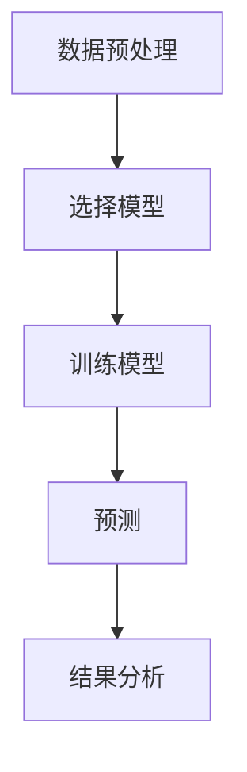
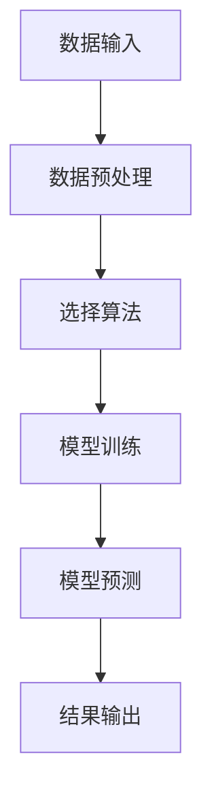
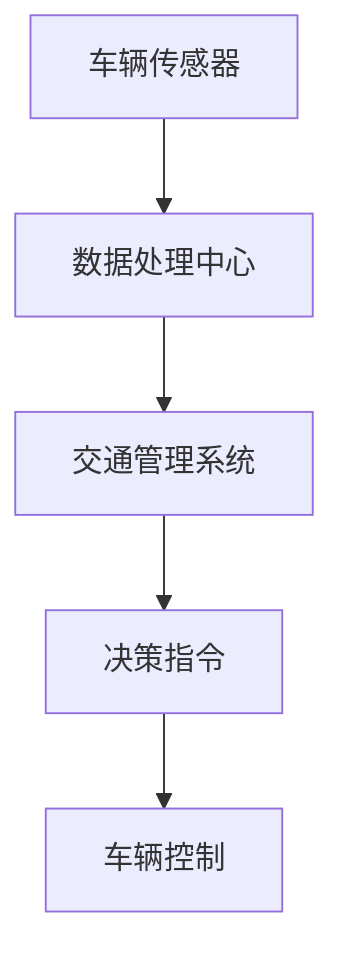
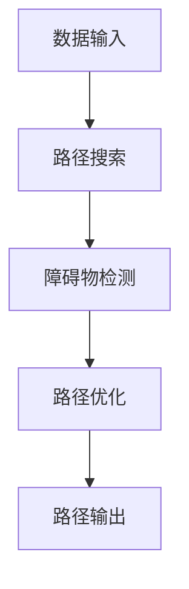
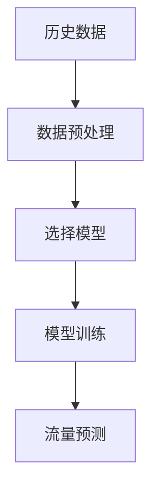
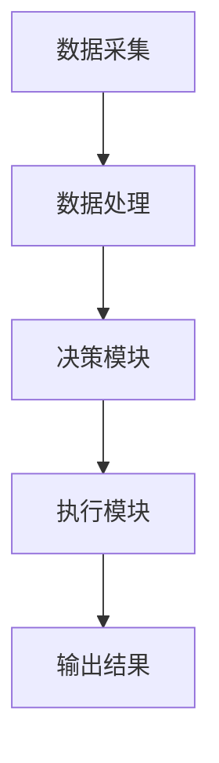

                 


# 新兴市场股市估值与智能交通车路协同技术的互动

## 关键词：新兴市场、股市估值、智能交通、车路协同、互动机制

## 摘要：  
新兴市场股市的估值与智能交通中的车路协同技术之间存在着复杂的互动关系。本文通过分析新兴市场股市估值的核心原理与算法，智能交通车路协同技术的核心原理与算法，以及两者之间的互动机制，探讨了两者在实际案例中的应用，并提出了互动机制的系统架构与实现方案。通过本文的研究，读者可以更好地理解新兴市场股市与智能交通车路协同技术之间的互动关系，并为未来的相关研究提供参考。

---

## 第一章: 新兴市场股市估值与智能交通车路协同技术的背景介绍

### 1.1 问题背景

#### 1.1.1 新兴市场的定义与特点
新兴市场是指那些经济快速增长、工业化程度较低、市场机制尚不完善的国家或地区的金融市场。这些市场通常具有以下特点：
- 经济结构多元化，但波动性较大。
- 投资者行为受政策影响显著。
- 市场信息不完全，容易受到外部因素的干扰。

#### 1.1.2 智能交通车路协同技术的定义与特点
车路协同技术是一种结合了车辆、道路和交通管理系统的智能交通技术，其核心是通过信息共享和协同决策，实现交通系统的高效运行。其特点包括：
- 高度依赖于数据共享和通信技术。
- 能够实时优化交通流量和路径。
- 通过技术手段降低交通事故率和能源消耗。

#### 1.1.3 问题的提出：新兴市场股市与智能交通的互动关系
新兴市场股市的波动性和智能交通系统的运行效率之间存在一定的互动关系。例如，股市的波动可能会影响投资者对智能交通技术的投资意愿，而智能交通系统的优化可能会对新兴市场的经济环境产生积极影响。因此，研究两者的互动关系具有重要的现实意义。

### 1.2 核心概念与边界

#### 1.2.1 新兴市场股市估值的核心要素
- 市场情绪：投资者的心理预期对股市估值的影响。
- 基本面分析：公司的财务状况、行业前景等。
- 市场流动性：资金的流入和流出对股市的影响。

#### 1.2.2 车路协同技术的核心要素
- 数据采集：通过传感器和通信技术获取交通数据。
- 数据处理：利用算法对数据进行分析和优化。
- 决策与执行：基于数据处理结果，做出最优决策并执行。

#### 1.2.3 互动关系的边界与外延
互动关系的边界在于两者之间的数据共享和政策影响，而外延则包括投资者行为、政策变化和技术进步对两者的影响。

### 1.3 核心概念结构与对比

#### 1.3.1 核心概念属性特征对比表

| 属性 | 新兴市场股市估值 | 智能交通车路协同技术 |
|------|------------------|-----------------------|
| 核心目标 | 评估市场价值     | 提高交通效率         |
| 输入   | 市场数据、投资者情绪 | 交通数据、车辆状态   |
| 输出   | 估值结果         | 优化决策、路径规划   |
| 关键技术 | 机器学习、时间序列分析 | 车辆路径规划、交通流量预测 |

#### 1.3.2 ER实体关系图

```mermaid
erDiagram
    class 市场数据 {
        <属性> 时间戳
        <属性> 股票价格
        <属性> 交易量
    }
    class 交通数据 {
        <属性> 时间戳
        <属性> 车流量
        <属性> 路况信息
    }
    class 投资者行为 {
        <属性> 投资决策
        <属性> 市场情绪
    }
    市场数据 --> 估值结果
    交通数据 --> 优化决策
    投资者行为 --> 市场波动
```

---

## 第二章: 新兴市场股市估值的核心原理与算法

### 2.1 核心原理

#### 2.1.1 市场情绪分析模型
市场情绪分析是通过自然语言处理技术对新闻、社交媒体等文本数据进行分析，提取市场情绪指标，从而影响股市估值。

#### 2.1.2 股价预测模型
基于历史数据和市场情绪，利用机器学习算法对股价进行预测，为投资者提供参考。

#### 2.1.3 市场波动性分析
通过分析历史波动数据，预测未来市场的波动性，从而调整估值模型。

### 2.2 算法原理

#### 2.2.1 基于时间序列的预测算法


#### 2.2.2 基于机器学习的分类算法
```python
# 示例代码：使用 LSTM 进行股价预测
import numpy as np
import pandas as pd
from keras.models import Sequential
from keras.layers import LSTM, Dense

# 数据加载与预处理
data = pd.read_csv('stock_data.csv')
train_data = data.iloc[:1000, 1].values
test_data = data.iloc[1000:, 1].values

# 数据归一化
train_data = (train_data - np.mean(train_data)) / np.std(train_data)
test_data = (test_data - np.mean(test_data)) / np.std(test_data)

# LSTM 模型构建
model = Sequential()
model.add(LSTM(64, input_shape=(None, 1)))
model.add(Dense(1))
model.compile(loss='mean_squared_error', optimizer='adam')

# 模型训练
model.fit(train_data.reshape(-1, 1, 1), np.array(train_data).reshape(-1, 1), epochs=50, batch_size=32)
```

#### 2.2.3 算法流程图（Mermaid）



### 2.3 数学模型与公式

#### 2.3.1 时间序列模型公式
$$ y_t = \alpha y_{t-1} + \beta \epsilon_t $$
其中，$y_t$ 表示当前值，$\alpha$ 是自回归系数，$\epsilon_t$ 是随机误差项。

#### 2.3.2 机器学习分类模型公式
$$ P(y=1|x) = \frac{e^{w \cdot x + b}}{1 + e^{w \cdot x + b}} $$
其中，$w$ 是权重向量，$b$ 是偏置项。

#### 2.3.3 示例与解释
以 LSTM 预测为例，训练后的模型可以对未来的股价进行预测，预测结果与实际值进行对比，评估模型的准确性。

---

## 第三章: 智能交通车路协同技术的核心原理与算法

### 3.1 核心原理

#### 3.1.1 车路协同的概念
车路协同是指通过车辆与道路基础设施之间的通信，实现信息共享和协同决策，从而提高交通系统的效率和安全性。

#### 3.1.2 车路协同的关键技术
- 5G 通信技术
- 车载传感器技术
- 大数据分析技术

#### 3.1.3 车路协同的系统架构


### 3.2 算法原理

#### 3.2.1 车辆路径规划算法


#### 3.2.2 交通流量预测算法


#### 3.2.3 算法流程图（Mermaid）


### 3.3 数学模型与公式

#### 3.3.1 车辆路径规划模型
$$ C = \min \sum_{i=1}^{n} c_{i,j} $$
其中，$C$ 是总成本，$c_{i,j}$ 是从节点 $i$ 到节点 $j$ 的成本。

#### 3.3.2 交通流量预测模型
$$ f(t) = a \cdot t + b $$
其中，$f(t)$ 是预测流量，$a$ 和 $b$ 是模型参数。

#### 3.3.3 示例与解释
以车辆路径规划为例，通过算法优化路径，减少交通拥堵，提高整体交通效率。

---

## 第四章: 股市估值与车路协同技术的互动机制

### 4.1 数据共享与互动

#### 4.1.1 数据共享的必要性
- 提高市场透明度
- 优化交通系统
- 促进技术进步

#### 4.1.2 数据共享的实现方式
- 建立数据共享平台
- 制定数据共享标准
- 确保数据安全性

#### 4.1.3 数据共享的安全性
通过加密技术和访问控制，确保数据共享的安全性和隐私性。

### 4.2 政策与市场互动

#### 4.2.1 政策对股市的影响
- 政策变化会影响投资者情绪和市场估值
- 政策支持可以促进技术创新

#### 4.2.2 车路协同技术对交通效率的提升
- 降低交通拥堵
- 提高交通安全性
- 优化能源消耗

#### 4.2.3 政策与技术的协同效应
政策支持和技术进步可以共同推动市场估值的提升和交通系统的优化。

### 4.3 用户行为与互动

#### 4.3.1 用户行为对股市的影响
- 投资者行为影响市场情绪
- 用户行为影响交通系统的使用

#### 4.3.2 用户行为对交通的影响
- 交通需求变化影响交通系统的设计
- 用户行为影响智能交通技术的推广

#### 4.3.3 用户行为的双重影响
用户的投资行为和日常行为对股市估值和交通系统均产生影响，需要综合考虑。

---

## 第五章: 互动机制的系统架构与实现

### 5.1 系统架构设计

#### 5.1.1 系统功能模块
- 数据采集模块
- 数据处理模块
- 决策模块
- 执行模块

#### 5.1.2 系统架构图（Mermaid）



### 5.2 接口设计与实现

#### 5.2.1 接口定义
- 数据接口：定义数据格式和通信协议
- 服务接口：定义服务调用的方式和权限

#### 5.2.2 接口实现
- 使用 RESTful API 实现数据接口
- 使用 WebSocket 实现实时通信

#### 5.2.3 接口测试
通过单元测试和集成测试，确保接口的稳定性和可靠性。

### 5.3 交互设计与实现

#### 5.3.1 交互流程设计
- 用户输入需求
- 系统处理需求
- 返回结果

#### 5.3.2 交互实现
- 使用图形化界面进行交互设计
- 通过命令行工具实现交互

#### 5.3.3 交互测试
通过用户反馈和性能测试，优化交互设计。

---

## 第六章: 实际案例分析与互动效果

### 6.1 案例分析

#### 6.1.1 案例背景
选择一个新兴市场，分析其股市估值和智能交通系统的互动关系。

#### 6.1.2 数据收集与分析
收集相关数据，分析股市估值和交通系统的运行效率。

#### 6.1.3 案例结果
通过分析，得出两者互动关系的具体表现。

### 6.2 互动效果

#### 6.2.1 市场估值的提升
通过智能交通系统的优化，提升市场的投资信心，从而提高股市估值。

#### 6.2.2 交通效率的提升
通过数据共享和协同决策，提高交通系统的运行效率。

#### 6.2.3 综合效益
两者互动带来的综合效益，包括经济效益和社会效益。

---

## 第七章: 结论与展望

### 7.1 研究结论
通过本文的研究，我们得出以下结论：
- 新兴市场股市估值与智能交通车路协同技术之间存在互动关系。
- 数据共享和政策支持是两者互动的关键因素。
- 通过系统架构设计和算法优化，可以实现两者的有效互动。

### 7.2 未来展望
未来的研究可以进一步探索以下方向：
- 更复杂的算法优化
- 更广泛的数据共享机制
- 更多的实际案例分析

---

## 作者：AI天才研究院/AI Genius Institute & 禅与计算机程序设计艺术 /Zen And The Art of Computer Programming

