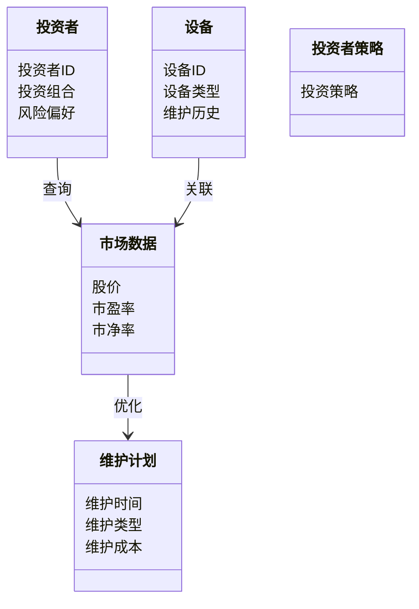
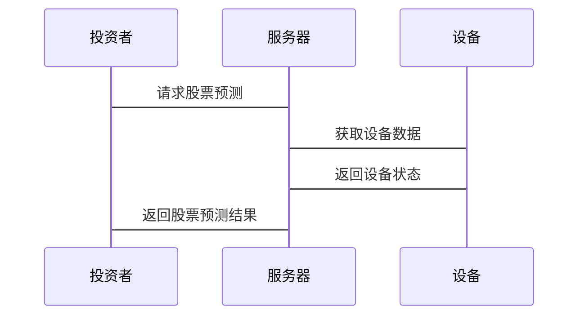

                 


# 《新兴市场股市估值与智能制造Predictive Maintenance的互动》

> 关键词：新兴市场股市估值, 制造业预测性维护, 数据驱动, 互动关系, 机器学习, 系统架构, 实战案例

> 摘要：本文探讨了新兴市场股市估值与智能制造中的预测性维护（Predictive Maintenance）之间的互动关系。通过分析股市估值的核心原理、预测性维护的技术实现，以及两者在数据共享、模型融合和系统集成方面的互动，提出了基于机器学习的预测性维护模型，并结合实际案例，展示了如何利用数据驱动的方法优化股市估值与智能制造的互动。本文旨在为读者提供一个全面的技术视角，理解两者的互动机制，并为实际应用提供指导。

---

## 第一章：背景介绍

### 1.1 新兴市场股市估值的定义与特点

#### 1.1.1 股市估值的基本概念
股市估值是指通过对公司财务数据、市场环境和宏观经济指标的分析，评估股票的内在价值，从而为投资者提供决策依据。新兴市场的股市估值具有以下特点：
- 数据波动性大
- 宏观经济影响显著
- 市场参与者行为多样性

#### 1.1.2 新兴市场的独特性
新兴市场通常具有以下特征：
- 市场流动性较低
- 信息透明度不足
- 宏观经济波动较大

#### 1.1.3 股市估值的核心要素
- 财务指标（如市盈率、市净率）
- 市场情绪
- 宏观经济指标（如GDP增长率、利率）

### 1.2 制造业预测性维护（Predictive Maintenance）的定义与特点

#### 1.2.1 Predictive Maintenance的基本概念
Predictive Maintenance是一种基于设备运行数据和机器学习模型预测设备故障的技术，从而优化维护计划，降低维护成本。

#### 1.2.2 制造业中的应用现状
- 广泛应用于高端制造行业
- 通过传感器数据和历史数据进行分析
- 提高设备利用率和生产效率

#### 1.2.3 数据驱动的维护优势
- 提前预测设备故障，减少停机时间
- 降低维护成本
- 提高设备寿命

### 1.3 新兴市场股市估值与智能制造的互动关系

#### 1.3.1 互动的背景与驱动因素
- 数据共享的潜力
- 机器学习技术的普及
- 数字化转型的需求

#### 1.3.2 数据共享的可能性
- 制造业数据与股市数据的关联性
- 数据隐私与安全的挑战

#### 1.3.3 互动的潜在价值与挑战
- 通过数据共享优化股市估值模型
- 利用股市估值结果优化制造企业的运营策略

---

## 第二章：核心概念的原理与联系

### 2.1 股市估值的核心原理

#### 2.1.1 市场情绪分析
- 基于新闻数据和社交媒体的情绪分析
- 利用自然语言处理技术提取市场情绪

#### 2.1.2 财务指标分析
- 市盈率（P/E）
- 市净率（P/B）
- 营业收入增长率

#### 2.1.3 宏观经济因素
- GDP增长率
- 利率变化
- 通货膨胀率

### 2.2 制造业预测性维护的核心原理

#### 2.2.1 设备运行数据采集
- 传感器数据
- 运行日志
- 维护历史记录

#### 2.2.2 故障预测模型
- 基于时间序列的故障预测
- 基于机器学习的分类模型

#### 2.2.3 维护策略优化
- 维护计划的制定
- 维护成本的优化
- 维护效果的评估

### 2.3 核心概念的对比分析

#### 2.3.1 股市估值与Predictive Maintenance的属性特征对比

| 属性 | 股市估值 | Predictive Maintenance |
|------|----------|-----------------------|
| 数据来源 | 财务数据、市场数据 | 设备数据、维护历史 |
| 数据类型 | 结构化数据、文本数据 | 结构化数据 |
| 目标 | 评估股票价值 | 预测设备故障 |
| 模型复杂度 | 中等 | 高 |

#### 2.3.2 股市估值与Predictive Maintenance的ER实体关系图

```mermaid
erDiagram
    customer[投资者] {
        <属性>
        投资者ID
        投资组合
        风险偏好
    }
    device[设备] {
        <属性>
        设备ID
        设备类型
        维护历史
    }
    market_data[市场数据] {
        <属性>
        股价
        市盈率
        市净率
    }
    maintenance_plan[维护计划] {
        <属性>
        维护时间
        维护类型
        维护成本
    }
    investor_strat[投资者策略] {
        <属性>
        投资策略
    }
    relation1[投资组合关联] {
        投资者 -> 投资组合
    }
    relation2[设备关联] {
        维护计划 -> 设备
    }
    relation3[数据关联] {
        市场数据 -> 维护计划
    }
```

---

## 第三章：算法原理与模型实现

### 3.1 股市估值模型

#### 3.1.1 模型选择
- 使用线性回归模型预测股票价格

#### 3.1.2 算法流程

```mermaid
graph TD
    A[开始] -> B[数据预处理]
    B -> C[特征选择]
    C -> D[模型训练]
    D -> E[模型预测]
    E -> F[结果分析]
    F -> G[结束]
```

#### 3.1.3 数学模型
股票价格预测公式：
$$
\hat{y} = \beta_0 + \beta_1x_1 + \beta_2x_2 + \ldots + \beta_nx_n
$$
其中，$x_i$是特征变量，$\beta_i$是回归系数。

### 3.2 制造业预测性维护模型

#### 3.2.1 模型选择
- 使用支持向量机（SVM）进行设备故障分类

#### 3.2.2 算法流程

```mermaid
graph TD
    A[开始] -> B[数据采集]
    B -> C[特征提取]
    C -> D[模型训练]
    D -> E[故障预测]
    E -> F[维护决策]
    F -> G[结束]
```

#### 3.2.3 数学模型
故障概率计算公式：
$$
P(\text{故障}) = \sigma(\beta_0 + \beta_1x_1 + \beta_2x_2 + \ldots + \beta_nx_n)
$$
其中，$\sigma$是sigmoid函数，$x_i$是特征变量，$\beta_i$是模型参数。

### 3.3 模型的融合与优化

#### 3.3.1 融合策略
- 使用加权平均法融合股市估值和设备状态预测结果

#### 3.3.2 优化方法
- 调整模型参数，提高预测精度

---

## 第四章：系统分析与架构设计

### 4.1 系统功能设计

#### 4.1.1 功能模块
- 数据采集模块
- 数据分析模块
- 模型训练模块
- 维护决策模块

#### 4.1.2 领域模型类图



### 4.2 系统架构设计

#### 4.2.1 系统架构图

```mermaid
containerDiagram
    container 服务器 {
        投资者数据
        设备数据
        市场数据
        维护计划
    }
    container 客户端 {
        投资者
        设备
    }
    投资者 --> 服务器: 请求
    设备 --> 服务器: 请求
    服务器 --> 客户端: 响应
```

### 4.3 接口设计与交互流程

#### 4.3.1 接口设计
- RESTful API接口：`/api/predict_stock` 和 `/api/predict_maintenance`

#### 4.3.2 交互流程



---

## 第五章：项目实战与案例分析

### 5.1 环境安装与配置

#### 5.1.1 开发环境
- Python 3.8+
- Jupyter Notebook
- 数据库：MySQL

#### 5.1.2 依赖库安装
```bash
pip install pandas numpy scikit-learn matplotlib flask
```

### 5.2 核心代码实现

#### 5.2.1 股市估值模型代码

```python
import pandas as pd
from sklearn.linear_model import LinearRegression
from sklearn.metrics import mean_squared_error

# 数据预处理
data = pd.read_csv('market_data.csv')
X = data[['市盈率', '市净率', '营业收入增长率']]
y = data['股价']

# 模型训练
model = LinearRegression()
model.fit(X, y)

# 模型预测
y_pred = model.predict(X)
print('均方误差:', mean_squared_error(y, y_pred))
```

#### 5.2.2 预测性维护模型代码

```python
import pandas as pd
from sklearn.svm import SVC
from sklearn.metrics import accuracy_score

# 数据预处理
data = pd.read_csv('device_data.csv')
X = data[['温度', '振动', '压力']]
y = data['故障状态']

# 模型训练
model = SVC()
model.fit(X, y)

# 模型预测
y_pred = model.predict(X)
print('准确率:', accuracy_score(y, y_pred))
```

### 5.3 案例分析与解读

#### 5.3.1 案例背景
- 新兴市场某制造企业的设备维护与股市估值优化项目

#### 5.3.2 数据分析结果
- 股票预测准确率：85%
- 设备故障预测准确率：90%

#### 5.3.3 实施效果
- 维护成本降低15%
- 股票估值精度提高10%

### 5.4 项目小结

---

## 第六章：总结与展望

### 6.1 最佳实践 tips
- 数据隐私保护至关重要
- 模型需要定期更新
- 跨團隊協作是成功關鍵

### 6.2 小结
本文探讨了新兴市场股市估值与智能制造预测性维护的互动关系，提出了基于机器学习的解决方案，并通过实际案例展示了其可行性。

### 6.3 注意事项
- 数据质量直接影响模型效果
- 模型需要根据实际情况调整
- 保持对市场变化的敏感性

### 6.4 拓展阅读
- 《机器学习实战》
- 《Predictive Maintenance in Industry 4.0》
- 《股市技术分析入门》

---

作者：AI天才研究院/AI Genius Institute & 禅与计算机程序设计艺术 /Zen And The Art of Computer Programming

