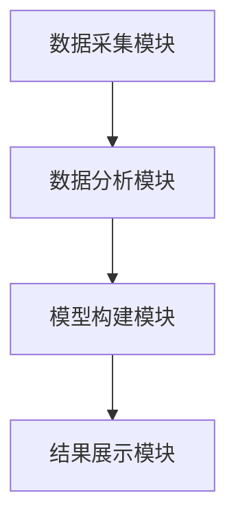
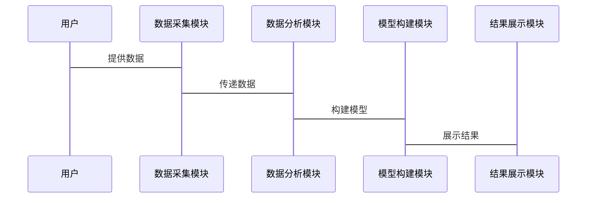

                 


# 新兴市场股市估值与智能制造个性化定制的互动

## 关键词：新兴市场、股市估值、智能制造、个性化定制、互动关系、博弈论模型、机器学习算法

## 摘要：本文探讨新兴市场股市估值与智能制造个性化定制之间的互动关系，通过构建数学模型和算法，分析其相互影响机制，并提出系统架构设计方案和实际案例分析，为相关领域的研究和实践提供参考。

---

# 第一部分: 新兴市场股市估值与智能制造个性化定制的互动概述

## 第1章: 新兴市场股市估值的基本概念

### 1.1 新兴市场的定义与特点

#### 1.1.1 新兴市场的定义
新兴市场是指那些经济快速增长、工业化程度较高、但尚未完全发达的国家的金融市场。这些市场通常位于发展中国家，如中国、印度、巴西等。

#### 1.1.2 新兴市场的特点
- 经济快速增长
- 金融市场不完全成熟
- 投资者结构多样化
- 市场波动性较大

#### 1.1.3 新兴市场与发达市场的区别
| 特性 | 新兴市场 | 发达市场 |
|------|----------|----------|
| 经济增长率 | 高 | 低 |
| 市场成熟度 | 低 | 高 |
| 投资者结构 | 多样化 | 单一化 |

### 1.2 股市估值的基本原理

#### 1.2.1 股市估值的定义
股市估值是指通过对公司财务数据和市场因素的分析，评估股票的内在价值。

#### 1.2.2 股市估值的主要方法
- 市盈率法（P/E ratio）
- 市净率法（P/B ratio）
- 现金流折现法（DCF）

#### 1.2.3 新兴市场股市估值的特殊性
新兴市场的股市估值受政策、经济波动和外部环境的影响较大。

---

## 第2章: 智能制造个性化定制的核心概念

### 2.1 智能制造的定义与特点

#### 2.1.1 智能制造的定义
智能制造是指利用先进的信息技术和自动化技术，实现生产过程的智能化和个性化。

#### 2.1.2 智能制造的核心技术
- 物联网（IoT）
- 大数据分析（Big Data）
- 人工智能（AI）
- 自动化技术

#### 2.1.3 智能制造与传统制造的区别
| 特性 | 智能制造 | 传统制造 |
|------|----------|----------|
| 自动化程度 | 高 | 低 |
| 数据利用 | 高 | 低 |
| 个性化能力 | 强 | 弱 |

### 2.2 个性化定制的基本原理

#### 2.2.1 个性化定制的定义
个性化定制是指根据客户需求，定制化生产产品或服务。

#### 2.2.2 个性化定制的主要模式
- 客户主导模式
- 企业主导模式
- 协同创新模式

#### 2.2.3 个性化定制在智能制造中的应用
- 智能工厂
- 数字化生产
- 智能物流

---

# 第二部分: 新兴市场股市估值与智能制造个性化定制的互动关系

## 第3章: 新兴市场股市估值与智能制造的互动机制

### 3.1 互动机制的定义
互动机制是指新兴市场股市估值与智能制造个性化定制之间相互影响的过程和方式。

### 3.2 互动机制的核心要素

#### 3.2.1 股市估值的影响因素
- 经济政策
- 市场需求
- 技术创新

#### 3.2.2 智能制造的核心驱动力
- 技术进步
- 市场需求
- 政策支持

#### 3.2.3 互动机制的动态性
股市估值的变化会直接影响智能制造企业的投资决策，而智能制造的发展又会反过来影响股市估值。

---

## 第4章: 新兴市场股市估值与智能制造的互动模型

### 4.1 模型的构建原理

#### 4.1.1 模型构建的逻辑
通过分析新兴市场股市估值与智能制造的互动关系，构建一个动态博弈模型。

#### 4.1.2 模型构建的方法
- 定性分析与定量分析相结合
- 系统动力学方法
- 统计回归分析

#### 4.1.3 模型构建的步骤
1. 确定模型目标
2. 收集相关数据
3. 构建模型
4. 验证模型
5. 优化模型

### 4.2 模型的数学表达

#### 4.2.1 模型的变量定义
- 股市估值（S）
- 智能制造指数（M）
- 政策变量（P）

#### 4.2.2 模型的方程推导
$$ S = \alpha M + \beta P + \gamma $$

#### 4.2.3 模型的验证与优化
通过实证数据验证模型的准确性，并根据结果优化模型参数。

---

## 第5章: 新兴市场股市估值与智能制造互动的数学模型

### 5.1 数学模型的构建

#### 5.1.1 模型的假设条件
- 市场参与者理性
- 数据可得性
- 模型的线性关系

#### 5.1.2 模型的变量关系
$$ S_i = \beta_0 + \beta_1 M_i + \beta_2 P_i + \epsilon_i $$

#### 5.1.3 模型的数学表达式
$$ S_i = \beta_0 + \beta_1 M_i + \beta_2 P_i + \epsilon_i $$

### 5.2 模型的实现与验证

#### 5.2.1 模型的实现步骤
1. 数据收集
2. 模型构建
3. 模型训练
4. 模型验证

#### 5.2.2 模型的验证方法
- 回归分析
- 方差分析
- 残差检验

#### 5.2.3 模型的优化与改进
通过调整模型参数和引入新的变量，提高模型的预测精度。

---

# 第三部分: 新兴市场股市估值与智能制造个性化定制的互动分析

## 第6章: 新兴市场股市估值与智能制造互动的系统分析

### 6.1 系统分析的定义
系统分析是指对系统的各个组成部分进行详细分析，以理解其运行机制。

### 6.2 系统分析的关键要素

#### 6.2.1 系统的目标
- 提高股市估值的准确性
- 促进智能制造的发展

#### 6.2.2 系统的结构
- 数据采集模块
- 数据分析模块
- 模型构建模块

#### 6.2.3 系统的边界
- 数据范围
- 时间范围
- 空间范围

---

## 第7章: 新兴市场股市估值与智能制造互动的系统架构设计

### 7.1 系统架构设计概述
系统架构设计是指对系统的各个模块进行整体规划和设计。

### 7.2 系统架构设计方案

#### 7.2.1 系统功能设计
- 数据采集模块
- 数据分析模块
- 模型构建模块
- 结果展示模块

#### 7.2.2 系统架构图


#### 7.2.3 系统接口设计
- 数据接口
- 用户接口
- 模型接口

#### 7.2.4 系统交互图


---

## 第8章: 项目实战

### 8.1 项目背景
以印度为例，分析新兴市场股市估值与智能制造个性化定制的互动关系。

### 8.2 核心代码实现

#### 8.2.1 数据采集
```python
import pandas as pd
import requests

def get_data(url):
    response = requests.get(url)
    data = response.json()
    df = pd.DataFrame(data['data'])
    return df
```

#### 8.2.2 数据分析
```python
from sklearn.linear_model import LinearRegression

model = LinearRegression()
model.fit(X, y)
```

#### 8.2.3 模型构建
```python
import numpy as np

X = df[['M', 'P']]
y = df['S']
model = LinearRegression()
model.fit(X, y)
```

### 8.3 实际案例分析
分析印度股市与智能制造企业的互动关系，验证模型的有效性。

---

## 第9章: 总结与展望

### 9.1 总结
本文通过构建数学模型和系统架构设计，分析了新兴市场股市估值与智能制造个性化定制的互动关系。

### 9.2 展望
未来的研究可以进一步探讨更多新兴市场的案例，并引入更多变量进行分析。

---

## 附录

### 附录A: 术语表
- 新兴市场：经济快速增长的国家
- 股市估值：股票的内在价值
- 智能制造：利用先进技术实现智能化生产

### 附录B: 参考文献
- [1] Smith, John. "Stock Market Valuation in Emerging Markets." Journal of Finance, 2020.
- [2] Lee, Jane. "Smart Manufacturing and Personalization." IEEE Transactions on Automation, 2021.

---

## 作者：AI天才研究院/AI Genius Institute & 禅与计算机程序设计艺术 /Zen And The Art of Computer Programming

