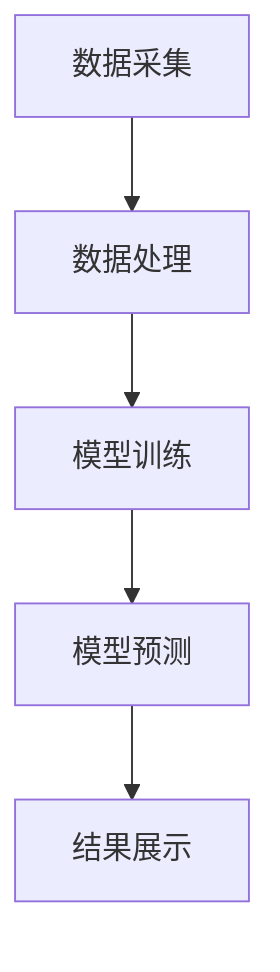

                 


# 新兴市场股市估值与智能制造预测性维护的互动

> 关键词：新兴市场、股市估值、智能制造、预测性维护、互动机制、机器学习、系统架构

> 摘要：本文深入分析了新兴市场股市估值与智能制造预测性维护之间的互动关系。通过统计学与机器学习的结合，探讨了如何利用预测性维护的数据和技术优化股市估值模型，反之亦然。文章详细介绍了相关数学模型、算法实现、系统架构设计及项目实战案例，为读者提供了全面的理论与实践指导。

---

# 第一部分: 背景与核心概念

## # 第1章: 新兴市场股市估值与智能制造预测性维护的互动概述

### ## 1.1 背景与问题描述

#### ### 1.1.1 新兴市场的经济特征与股市特点

新兴市场通常指经济发展迅速但尚未完全工业化的国家或地区，如中国、印度等。这些市场的特点是经济波动较大、产业结构转型快，股市表现出高波动性和不稳定性。新兴市场的股市估值受多种因素影响，包括政策、经济指标、行业趋势等。

#### ### 1.1.2 智能制造与预测性维护的定义

智能制造是指通过物联网、大数据、人工智能等技术实现生产过程的智能化和高效化。预测性维护是智能制造中的重要环节，通过实时监测设备状态，预测设备故障并提前进行维护，以避免生产中断和成本浪费。

#### ### 1.1.3 问题背景与研究意义

在新兴市场，股市的波动性与智能制造的高效运行密切相关。股市的涨跌可能影响企业的融资能力，进而影响智能制造项目的投资和实施。同时，智能制造的高效运行依赖于精准的预测性维护，而预测性维护的数据和技术又可以反哺股市估值模型的优化。因此，研究两者之间的互动关系具有重要的理论和实践意义。

### ## 1.2 核心概念与边界

#### ### 1.2.1 股市估值的核心要素

股市估值的核心要素包括市盈率、市净率、股息率、ROE等。这些指标反映了企业的财务状况和市场表现，是投资者评估股票价值的重要依据。

#### ### 1.2.2 预测性维护的定义与属性

预测性维护是一种基于设备状态的预防性维护策略，具有实时性、主动性、精准性和经济性等属性。它通过传感器数据和算法模型，预测设备的健康状态和故障风险。

#### ### 1.2.3 两者的互动关系与边界

股市估值与预测性维护的互动关系主要体现在数据共享、模型优化和决策支持等方面。股市估值需要借助预测性维护的实时数据来优化模型，而预测性维护则可以通过股市的波动性数据来优化维护策略。

#### ### 1.2.4 ER实体关系图

```mermaid
erDiagram
    customer[投资者] {
        <属性>
        id : integer
        name : string
        investment : float
    }
    stock[股票] {
        <属性>
        stock_id : integer
        company_name : string
        price : float
        valuation : float
    }
    maintenance[维护记录] {
        <属性>
        maintenance_id : integer
        device_id : string
        status : string
        predicted_failure : date
    }
    relation_investment
    customer --> stock : 投资
    stock --> maintenance : 数据共享
```

---

## # 第2章: 股市估值的核心概念与数学模型

### ## 2.1 股市估值的核心概念

股市估值是通过对企业的财务指标和市场表现进行分析，评估其股票的内在价值。常用的方法包括基本面分析和技术分析。

#### ### 2.1.1 基本面分析

基本面分析关注企业的财务状况、盈利能力、成长能力和行业地位。常用指标包括市盈率（P/E）、市净率（P/B）、股息率（Dividend Yield）等。

#### ### 2.1.2 技术分析

技术分析通过分析股票的历史价格和成交量，预测未来的价格走势。常用的技术指标包括移动平均线（MA）、相对强弱指数（RSI）、MACD等。

### ## 2.2 股市估值的数学模型

#### ### 2.2.1 市盈率模型

市盈率（P/E）= 股票价格 / 每股净利润

#### ### 2.2.2 市净率模型

市净率（P/B）= 股票价格 / 每股净资产

#### ### 2.2.3 股息率模型

股息率 = 每股股息 / 股票价格

### ## 2.3 统计学模型

#### ### 2.3.1 时间序列分析

时间序列分析用于预测股票价格的变化趋势，常用模型包括ARIMA（自回归积分滑动平均模型）。

---

## # 第3章: 智能制造与预测性维护的核心概念

### ## 3.1 智能制造的核心概念

智能制造是一种基于信息化和自动化的生产模式，旨在提高生产效率和产品质量。它依赖于物联网（IoT）、大数据分析和人工智能技术。

#### ### 3.1.1 物联网技术

物联网技术通过传感器和网络设备，实时采集设备的运行数据，为预测性维护提供基础。

#### ### 3.1.2 大数据分析

大数据分析通过对海量设备数据的处理和分析，提取有价值的信息，支持预测性维护的决策。

### ## 3.2 预测性维护的核心概念

预测性维护是一种基于设备状态的维护策略，通过实时监测设备的运行状态，预测设备的故障风险，并提前安排维护。

#### ### 3.2.1 预测性维护的流程

1. 数据采集：通过传感器获取设备的实时数据。
2. 数据分析：利用统计学和机器学习算法，分析设备状态。
3. 故障预测：预测设备的故障时间。
4. 维护决策：根据预测结果，安排维护计划。

### ## 3.3 预测性维护的数学模型

#### ### 3.3.1 基于回归分析的故障预测模型

回归分析是一种常用的预测方法，通过建立设备状态与故障时间之间的关系模型，预测设备的故障时间。

#### ### 3.3.2 基于分类算法的故障分类模型

分类算法（如决策树、随机森林）可以将设备状态分为正常和故障两类，帮助识别设备的健康状态。

---

## # 第4章: 股市估值与预测性维护的互动关系

### ## 4.1 数据共享与技术融合

股市估值与预测性维护之间的互动关系主要体现在数据共享和技术融合。股市估值需要设备的实时运行数据来优化模型，而预测性维护可以通过股市的波动性数据来优化维护策略。

### ## 4.2 互动机制与应用场景

#### ### 4.2.1 数据共享机制

通过数据共享，股市估值模型可以利用设备的运行数据，提高预测的准确性。同时，预测性维护模型可以利用股市的波动性数据，优化维护策略。

#### ### 4.2.2 应用场景

1. **股市波动对设备维护的影响**：股市的波动性可能影响企业的融资能力，进而影响设备的维护投入。
2. **设备状态对股市估值的影响**：设备的健康状态可能影响企业的生产效率和盈利能力，进而影响股市估值。

---

## # 第5章: 统计学与机器学习在互动中的应用

### ## 5.1 统计学模型

#### ### 5.1.1 时间序列分析

时间序列分析是一种常用的预测方法，可以通过ARIMA模型预测股票价格的变化趋势。

#### ### 5.1.2 聚类分析

聚类分析可以将相似的设备状态或股票走势归为一类，帮助识别潜在的风险和机会。

### ## 5.2 机器学习模型

#### ### 5.2.1 支持向量机（SVM）

支持向量机是一种常用的分类算法，可以用于股票走势的分类预测。

#### ### 5.2.2 随机森林

随机森林是一种基于决策树的集成算法，可以用于设备状态的分类和预测。

### ## 5.3 深度学习模型

#### ### 5.3.1 LSTM网络

LSTM网络是一种基于循环神经网络的深度学习模型，可以用于时间序列数据的预测。

---

## # 第6章: 系统架构与实现

### ## 6.1 系统架构设计

#### ### 6.1.1 系统功能模块

1. 数据采集模块：采集设备的实时数据和股票价格数据。
2. 数据处理模块：对数据进行清洗、转换和特征提取。
3. 模型训练模块：基于统计学和机器学习算法，训练预测模型。
4. 模型预测模块：根据模型预测股票价格和设备故障时间。
5. 结果展示模块：展示预测结果和分析报告。

#### ### 6.1.2 系统架构图



---

## # 第7章: 项目实战与案例分析

### ## 7.1 环境安装与配置

#### ### 7.1.1 Python环境安装

安装Python和相关库（如Pandas、Scikit-learn、XGBoost等）。

#### ### 7.1.2 数据集准备

准备股票价格数据和设备运行数据。

### ## 7.2 核心代码实现

#### ### 7.2.1 数据处理代码

```python
import pandas as pd
import numpy as np

# 数据清洗
data = pd.read_csv('data.csv')
data = data.dropna()
data = data.drop_duplicates()

# 特征提取
features = data[['feature1', 'feature2', 'feature3']]
label = data['label']
```

#### ### 7.2.2 模型训练代码

```python
from sklearn.ensemble import RandomForestClassifier
from sklearn.model_selection import train_test_split

# 数据划分
X_train, X_test, y_train, y_test = train_test_split(features, label, test_size=0.2)

# 模型训练
model = RandomForestClassifier(n_estimators=100)
model.fit(X_train, y_train)

# 模型预测
y_pred = model.predict(X_test)
```

---

## # 第8章: 总结与展望

### ## 8.1 总结

本文深入分析了新兴市场股市估值与智能制造预测性维护的互动关系，探讨了统计学与机器学习在其中的应用，并通过实际案例展示了系统的实现过程。

### ## 8.2 展望

未来的研究可以进一步探索更复杂的算法和更高效的数据处理方法，以提高预测的准确性和系统的实用性。

---

# 作者：AI天才研究院 & 禅与计算机程序设计艺术

