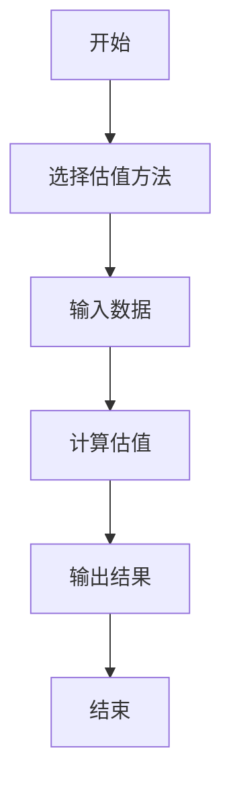
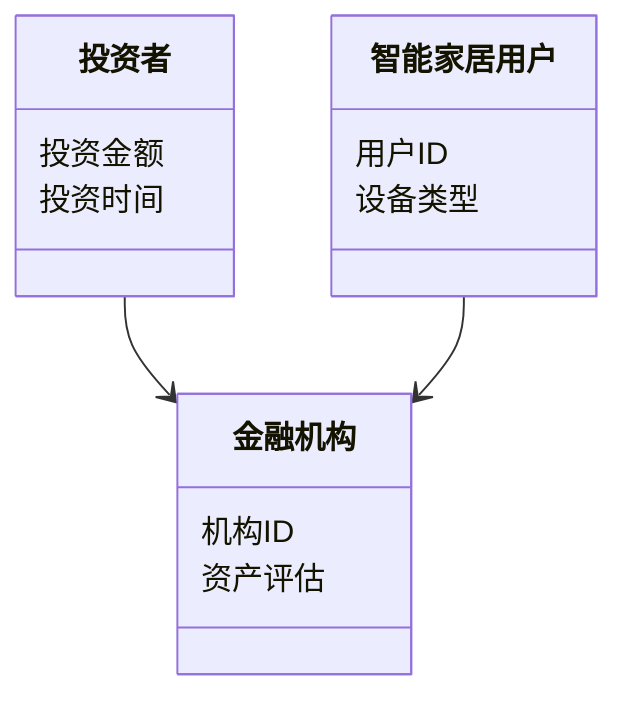
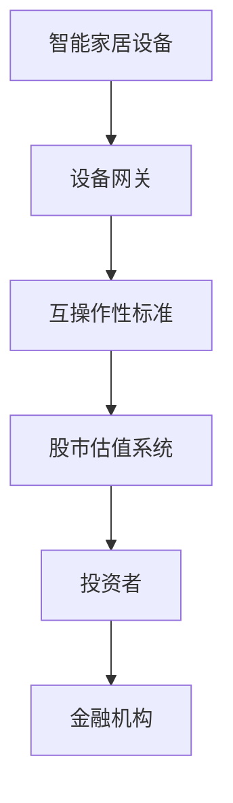
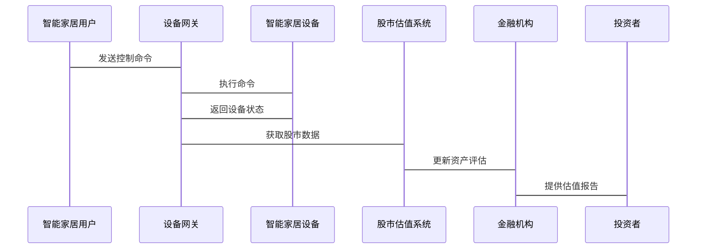

                 


# 新兴市场股市估值与智能家居互操作性标准的互动

---

## 关键词：新兴市场，股市估值，智能家居，互操作性标准，算法，系统架构

---

## 摘要：  
本文探讨新兴市场股市估值与智能家居互操作性标准之间的互动关系。通过分析股市估值的核心原理、智能家居互操作性标准的重要性，结合算法原理、系统架构设计和实际案例，揭示两者在技术与经济领域的深层互动。文章旨在为投资者和技术开发者提供理论与实践的双重参考。

---

# 第一部分：背景与核心概念

## 第1章：背景介绍

### 1.1 新兴市场股市估值的背景

#### 1.1.1 新兴市场的定义与特点  
新兴市场是指那些经济增长迅速、但尚未完全工业化的国家或地区的金融市场。其特点包括：  
- 市场规模较小但增长潜力大。  
- 投资者结构多元化，包括机构投资者和散户。  
- 市场波动性较大，受外部经济环境影响显著。  

#### 1.1.2 股市估值的基本概念  
股市估值是通过对企业的财务数据（如净利润、营业收入、市盈率等）进行分析，评估其股票的内在价值。常见的估值方法包括：  
- 市盈率（P/E）：市价与每股收益的比率。  
- 市净率（P/B）：市价与每股净资产的比率。  
- 现金流折现法（DCF）：通过未来现金流的现值计算企业价值。  

#### 1.1.3 新兴市场股市估值的特殊性  
新兴市场的股市估值受多重因素影响，包括政策风险、经济波动和外部资本流动。此外，新兴市场企业的财务数据可能不够透明，增加了估值的难度。

### 1.2 智能家居互操作性标准的背景

#### 1.2.1 智能家居的概念与现状  
智能家居是指通过物联网技术将家居设备（如灯光、空调、安防设备）连接到同一网络，实现智能化控制的家居环境。目前，智能家居市场快速增长，但设备之间的互操作性问题仍然突出。

#### 1.2.2 互操作性标准的定义  
互操作性标准是指不同品牌或类型的设备之间能够互相通信、协作的标准协议。例如，Wi-Fi、蓝牙、ZigBee 等通信协议都属于互操作性标准。

#### 1.2.3 智能家居互操作性标准的重要性  
良好的互操作性标准能够降低设备之间的兼容性问题，提升用户体验，促进智能家居市场的快速发展。

---

## 第2章：核心概念与联系

### 2.1 核心概念原理

#### 2.1.1 股市估值的核心原理  
股市估值的核心是通过分析企业的财务数据和市场环境，预测其未来的盈利能力，并据此计算其股票的合理价格。例如，市盈率反映了市场对企业的盈利能力的预期。

#### 2.1.2 智能家居互操作性标准的核心原理  
智能家居互操作性标准的核心是通过统一的通信协议，确保不同设备之间的数据能够互联互通。例如，通过 MQTT 协议实现设备间的通信。

### 2.2 概念属性特征对比

| **属性**         | **股市估值**             | **智能家居互操作性标准**       |
|------------------|--------------------------|-------------------------------|
| 核心目标         | 评估企业价值             | 实现设备间的互联互通           |
| 依赖因素         | 财务数据、市场环境       | 通信协议、设备硬件             |
| 影响范围         | 投资者、企业             | 用户、设备制造商、软件开发方   |
| 技术复杂度       | 中等，涉及数据分析技术   | 较高，涉及通信协议设计和实现   |

### 2.3 ER实体关系图

```mermaid
erDiagram
    投资者 --> 投资金额
    投资者 --> 投资时间
    智能家居用户 --> 用户ID
    智能家居用户 --> 设备类型
    金融机构 --> 机构ID
    金融机构 --> 资产评估
    投资者 --> 金融机构
    智能家居用户 --> 金融机构
```

---

# 第二部分：算法原理与数学模型

## 第3章：算法原理讲解

### 3.1 股市估值算法

#### 3.1.1 股票估值模型的分类  
股票估值模型主要分为两类：  
- 常规模型：如市盈率、市净率。  
- 现金流折现模型：如DCF模型。

#### 3.1.2 常见的股票估值方法  
- **市盈率（P/E）**：$P/E = \frac{\text{股价}}{\text{每股收益}}$  
- **市净率（P/B）**：$P/B = \frac{\text{股价}}{\text{每股净资产}}$  
- **DCF 模型**：通过预测未来现金流，计算其现值，得出企业价值。

#### 3.1.3 基于机器学习的股票估值算法  
基于机器学习的股票估值算法可以通过历史数据训练模型，预测股票的未来价格。例如，使用 LSTM 神经网络模型进行时间序列预测。

### 3.2 智能家居互操作性标准的算法

#### 3.2.1 智能家居设备通信协议  
智能家居设备通常使用 MQTT、HTTP 或 ZigBee 等协议进行通信。例如，通过 MQTT 协议实现设备间的消息订阅与发布。

#### 3.2.2 互操作性标准的实现算法  
实现智能家居互操作性标准的算法包括：  
1. 设备发现：通过广播或组播发现网络中的设备。  
2. 设备认证：验证设备的身份和权限。  
3. 数据传输：通过标准协议传输数据。  
4. 事件处理：根据接收到的事件触发相应的操作。

#### 3.2.3 基于 API 的设备交互算法  
通过 API 实现设备间的交互，例如，通过调用 API 控制智能家居设备的开关状态。

### 3.3 算法流程图



---

## 第4章：数学模型与公式

### 4.1 股票估值模型

#### 4.1.1 市盈率公式  
$$ P/E = \frac{\text{股价}}{\text{每股收益}} $$

#### 4.1.2 现金流折现模型  
$$ V = \sum_{t=1}^{n} \frac{CF_t}{(1 + r)^t} $$  
其中，$CF_t$ 是第 $t$ 年的现金流，$r$ 是折现率。

### 4.2 智能家居互操作性标准的数学模型

#### 4.2.1 设备间通信的数学模型  
智能家居设备之间的通信可以通过 MQTT 协议实现，消息队列的长度可以用以下公式表示：  
$$ Q = \sum_{i=1}^{n} \text{消息数}_i $$  
其中，$n$ 是设备的数量。

---

# 第三部分：系统分析与架构设计

## 第5章：系统分析

### 5.1 问题场景介绍  
本文设计一个智能家居设备与股市估值系统的互动场景，通过互操作性标准实现设备间的通信，并结合股市数据优化设备的控制策略。

### 5.2 系统功能设计

#### 5.2.1 领域模型类图  


#### 5.2.2 系统架构设计  


#### 5.2.3 系统接口设计  
智能家居设备通过 MQTT 协议与设备网关通信，设备网关通过 REST API 与股市估值系统交互。

#### 5.2.4 系统交互流程图  


---

## 第6章：项目实战

### 6.1 环境安装

#### 6.1.1 安装 MQTT 服务器  
安装 Mosquitto MQTT 服务器：  
```bash
sudo apt-get install mosquitto
```

#### 6.1.2 安装 Python 开发环境  
安装 Python 和相关库：  
```bash
sudo apt-get install python3 python3-pip
pip install paho-mqtt
```

### 6.2 系统核心实现

#### 6.2.1 智能家居设备代码实现  
```python
import paho.mqtt.client as mqtt

# 连接 MQTT 服务器
client = mqtt.Client()
client.connect("localhost", 1883, 60)

# 发布消息
client.publish("home/devices/light", "on", 0, False)
client.publish("home/devices/aircon", "start", 0, False)

# 订阅消息
def on_message(client, userdata, msg):
    print(f"接收到消息：{msg.payload.decode()}")
client.on_message = on_message
client.subscribe("home/devices/status")

client.loop_forever()
```

#### 6.2.2 股市估值系统代码实现  
```python
import pandas as pd
import numpy as np

# 示例数据
data = {
    '股价': [100, 110, 120, 130],
    '每股收益': [10, 11, 12, 13]
}
df = pd.DataFrame(data)

# 计算市盈率
df['P/E'] = df['股价'] / df['每股收益']
print(df)
```

### 6.3 案例分析与解读  
通过在新兴市场中选取某智能家居企业的数据，结合股市估值模型，分析其股票的潜在价值。

---

## 第7章：总结与展望

### 7.1 总结  
本文通过分析新兴市场股市估值与智能家居互操作性标准的互动关系，探讨了两者在技术与经济领域的深度融合。通过算法原理、系统架构设计和实际案例的分析，揭示了两者的互动机制。

### 7.2 未来展望  
未来研究可以进一步探索动态数据调整算法、区域市场对比分析以及跨平台互操作性标准的优化。

---

## 注意事项  
1. 本文内容仅供参考，不构成投资建议。  
2. 系统设计和代码实现需根据具体需求进行调整。  
3. 本文基于公开信息撰写，不涉及敏感数据。

---

## 拓展阅读  
- 《股票技术分析》  
- 《物联网设备互操作性标准》  
- 《智能家居系统架构》  

---

作者：AI天才研究院/AI Genius Institute & 禅与计算机程序设计艺术/Zen And The Art of Computer Programming

