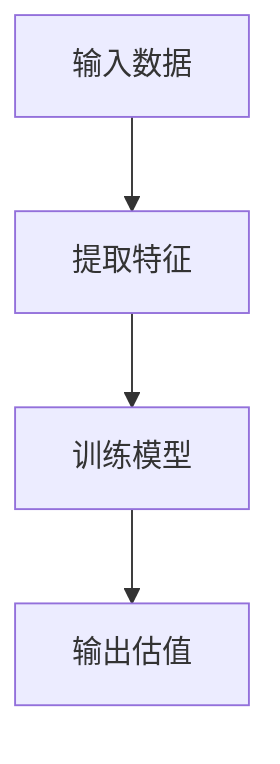
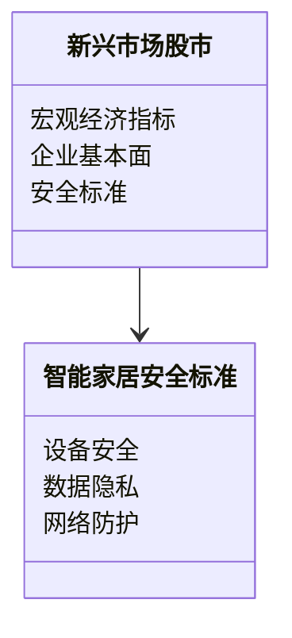

                 


# 新兴市场股市估值与智能家居安全标准的互动

> 关键词：新兴市场、股市估值、智能家居、安全标准、互动模型、算法设计、系统架构

> 摘要：本文探讨新兴市场股市估值与智能家居安全标准之间的互动关系，分析股市估值的核心概念、智能家居安全标准的属性特征，构建互动模型并设计相关算法。通过系统架构设计、项目实战和案例分析，深入阐述两者的互动机制，并提出最佳实践建议。

---

## 第一部分: 新兴市场股市估值与智能家居安全标准的互动概述

### 第1章: 新兴市场股市估值与智能家居安全标准的互动背景

#### 1.1 新兴市场股市估值的现状与挑战
- 新兴市场的定义与特点：新兴市场通常指经济快速发展但尚未完全成熟的国家，如中国、印度等。这些市场具有高增长潜力，但也伴随着高波动性和不确定性。
- 新兴市场股市估值的核心问题：如何准确评估公司的价值，尤其是在信息不透明和市场波动大的情况下。
- 新兴市场股市估值的边界与外延：包括宏观经济指标、公司基本面、市场情绪等多因素的综合分析。

#### 1.2 智能家居安全标准的核心概念
- 智能家居的定义与技术特征：智能家居是指通过物联网技术将家庭设备连接，实现智能化控制和管理。
- 智能家居安全标准的制定与实施：包括数据隐私、设备安全、网络防护等方面的标准。
- 智能家居安全标准的边界与外延：涉及硬件、软件、网络等多个层面，且随着技术进步不断更新。

#### 1.3 互动关系的初步探讨
- 新兴市场股市与智能家居产业的关联性：智能家居产业作为新兴经济的一部分，其发展直接影响股市估值。
- 智能家居安全标准对股市估值的影响：安全问题可能影响投资者信心，进而影响股价。
- 互动机制的初步框架：通过数据流、政策影响、市场反馈等多方面体现。

---

### 第2章: 新兴市场股市估值的核心概念与原理

#### 2.1 新兴市场股市估值的理论基础
- 股市估值的基本原理：包括市盈率、市净率等指标。
- 新兴市场的特殊性与调整因素：如高增长但波动性大，需考虑政策风险和市场流动性。
- 股市估值的核心要素分析：宏观经济、行业趋势、公司基本面。

#### 2.2 智能家居安全标准的属性特征对比
- 安全标准的属性特征：包括强制性、技术性、动态性。
- 不同安全标准的对比分析：如ISO标准与国家标准的差异。
- 标准属性与股市估值的关系：安全标准的严格性可能影响企业成本和市场信任。

#### 2.3 核心概念与联系
- **对比表格**：
| 特性 | 新兴市场股市估值 | 智能家居安全标准 |
|------|------------------|-------------------|
| 核心目标 | 评估企业价值    | 保障设备安全     |
| 影响因素 | 宏观经济、政策   | 技术、政策        |
| 实施难度 | 高              | 中高             |

- **ER实体关系图**：
```mermaid
erd
  智能家居设备 --> 安全标准
  安全标准 --> 新兴市场股市
  新兴市场股市 <-- 宏观经济指标
```

---

### 第3章: 新兴市场股市估值与智能家居安全标准的互动模型

#### 3.1 互动模型的构建
- **核心假设**：智能家居安全问题会影响投资者对相关企业的估值。
- **输入变量**：股市数据、安全标准、宏观经济指标。
- **输出变量**：企业估值变化。

#### 3.2 互动模型的数学表达
- **公式推导**：
  $$ V = f(S, M, S_{\text{安全}}) $$
  其中，$V$ 表示企业估值，$S$ 表示安全标准，$M$ 表示宏观经济指标。

- **验证与优化**：通过历史数据验证模型准确性，并根据实际结果调整参数。

---

### 第4章: 新兴市场股市估值与智能家居安全标准的互动算法

#### 4.1 互动算法的设计
- **算法流程**：


- **Python代码示例**：
  ```python
  import pandas as pd
  from sklearn.model_selection import train_test_split
  from sklearn.ensemble import RandomForestRegressor

  # 数据预处理
  data = pd.read_csv('data.csv')
  X = data[['安全标准', '宏观经济指标']]
  y = data['企业估值']

  # 划分训练集和测试集
  X_train, X_test, y_train, y_test = train_test_split(X, y, test_size=0.2)

  # 训练模型
  model = RandomForestRegressor(n_estimators=100)
  model.fit(X_train, y_train)

  # 预测与评估
  y_pred = model.predict(X_test)
  print('预测值:', y_pred)
  ```

---

### 第5章: 系统分析与架构设计方案

#### 5.1 系统功能设计
- **领域模型类图**：


#### 5.2 系统架构设计
- **架构图**：


---

### 第6章: 项目实战与案例分析

#### 6.1 环境搭建
- 安装Python、Pandas、Scikit-learn等工具。

#### 6.2 核心实现代码
- **数据处理**：
  ```python
  import pandas as pd
  data = pd.read_csv('data.csv')
  ```

- **模型训练**：
  ```python
  from sklearn.ensemble import RandomForestRegressor
  model = RandomForestRegressor()
  model.fit(X_train, y_train)
  ```

#### 6.3 案例分析
- 分析某新兴市场中智能家居企业的估值变化，验证模型的有效性。

---

### 第7章: 最佳实践与小结

#### 7.1 最佳实践
- 定期更新安全标准，关注宏观经济变化。

#### 7.2 小结
- 新兴市场股市估值与智能家居安全标准的互动关系复杂，需综合考虑多因素。

---

## 作者：AI天才研究院 & 禅与计算机程序设计艺术

