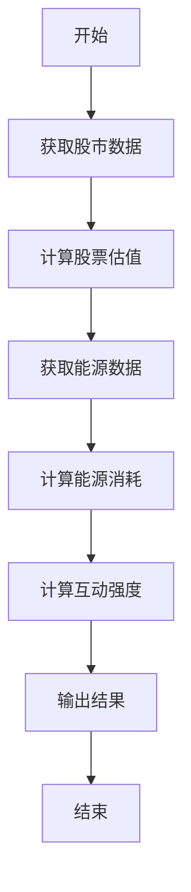
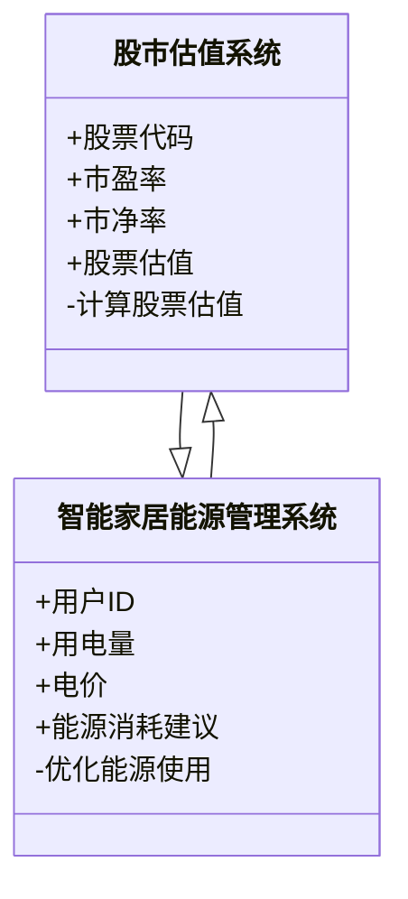

                 


# 新兴市场股市估值与智能家居能源管理的互动

> 关键词：新兴市场、股市估值、智能家居、能源管理、互动机制

> 摘要：本文探讨了新兴市场股市估值与智能家居能源管理的互动关系，分析了两者的核心概念、互动机制及算法模型，并通过实际案例展示了如何利用这些模型优化能源管理和投资决策。

---

# 第一部分: 新兴市场股市估值与智能家居能源管理的互动概述

## 第1章: 背景介绍与核心概念

### 1.1 问题背景

#### 1.1.1 新兴市场股市估值的现状与挑战

新兴市场股市估值的波动性较大，受到政策、经济、市场情绪等多种因素的影响。投资者在新兴市场中面临较高的风险和不确定性，因此需要更加精准的估值方法来指导投资决策。

#### 1.1.2 智能家居能源管理的发展趋势

智能家居能源管理通过智能化技术优化能源使用效率，减少能源浪费，降低能源成本。随着物联网、人工智能和大数据技术的快速发展，智能家居能源管理在新兴市场中的应用前景广阔。

#### 1.1.3 两者互动的现实需求与潜在价值

新兴市场股市估值与智能家居能源管理的互动可以通过数据共享、技术融合和资源共享等方式实现。这种互动能够帮助投资者更好地理解市场动态，同时优化能源管理的效率，实现双赢。

---

### 1.2 核心概念与问题描述

#### 1.2.1 股市估值的基本原理与方法

股市估值是通过对上市公司的财务数据、市场环境和行业趋势等因素进行分析，确定股票的合理价格。常用的估值方法包括市盈率（P/E）、市净率（P/B）和现金流折现法（DCF）等。

#### 1.2.2 智能家居能源管理的定义与关键特征

智能家居能源管理是指通过智能设备和物联网技术，实时监控和优化能源的使用效率。其关键特征包括智能化、实时性、高效性和用户友好性。

#### 1.2.3 两者互动的核心问题与边界条件

新兴市场股市估值与智能家居能源管理的互动核心问题在于如何通过数据和技术实现两者的有效结合。边界条件包括数据隐私、技术可行性、经济成本和市场接受度等。

---

### 1.3 问题解决与边界外延

#### 1.3.1 新兴市场股市估值的优化方法

通过引入大数据和人工智能技术，优化股市估值模型，提高估值的准确性和及时性。

#### 1.3.2 智能家居能源管理的创新模式

通过智能化和数据驱动的方式，创新能源管理模式，降低能源消耗，提高能源利用效率。

#### 1.3.3 互动机制的边界与外延分析

互动机制的边界包括数据共享的范围、技术实现的可行性以及用户隐私保护。外延则包括扩展到更多领域，如绿色金融、可持续投资等。

---

### 1.4 核心概念结构与要素组成

#### 1.4.1 股市估值系统的核心要素

- 数据输入：财务数据、市场数据、宏观经济数据
- 计算模型：市盈率、市净率、现金流折现法
- 输出结果：股票估值、投资建议

#### 1.4.2 智能家居能源管理系统的核心要素

- 数据输入：能耗数据、设备数据、用户行为数据
- 计算模型：能源消耗预测、优化算法
- 输出结果：能源使用建议、成本优化方案

#### 1.4.3 两者互动的系统架构与要素关联

- 数据共享：股市数据与能源数据的交互
- 技术融合：人工智能技术的应用
- 用户需求：投资者和家庭用户的双重需求

---

## 第2章: 核心概念与联系

### 2.1 核心概念原理

#### 2.1.1 股市估值的数学模型与算法原理

股市估值的数学模型可以通过多元回归分析来预测股票价格：

$$ P = \beta_0 + \beta_1 E + \beta_2 F + \epsilon $$

其中，$P$ 是股票价格，$E$ 是每股收益，$F$ 是市盈率，$\beta$ 是回归系数，$\epsilon$ 是误差项。

#### 2.1.2 智能家居能源管理的算法原理

智能家居能源管理可以通过动态规划算法优化能源使用效率：

$$ E_{\text{opt}} = \argmin_{E} \sum_{t=1}^{T} c_t E_t $$

其中，$E_{\text{opt}}$ 是优化的能源使用量，$c_t$ 是时间 $t$ 的能源成本，$T$ 是时间周期。

#### 2.1.3 两者互动的机制与原理

互动机制的核心在于通过数据共享和技术融合，将股市估值与能源管理结合起来。例如，股市估值可以为能源管理提供经济指标，而能源管理数据可以为股市估值提供新的变量。

---

### 2.2 概念属性特征对比

| 属性 | 股市估值 | 智能家居能源管理 |
|------|----------|-----------------|
| 数据输入 | 财务数据、市场数据 | 能耗数据、设备数据 |
| 计算模型 | 多元回归、DCF模型 | 动态规划、优化算法 |
| 输出结果 | 股票价格、投资建议 | 能源使用建议、成本优化方案 |

---

### 2.3 ER实体关系图

```mermaid
erDiagram
    investor {
        投资者ID
        投资偏好
    }
    stock_data {
        股票代码
        市场指数
    }
    home_user {
        用户ID
        能耗数据
    }
    energy_management {
        用电量
        电价
    }
    investor -|> stock_data
    home_user -|> energy_management
    stock_data -|> energy_management
```

---

## 第3章: 互动机制与算法原理

### 3.1 互动机制的数学模型

#### 3.1.1 股市估值的数学模型

$$ V = \alpha P + \beta Q $$

其中，$V$ 是股票估值，$P$ 是市盈率，$Q$ 是市净率，$\alpha$ 和 $\beta$ 是权重系数。

#### 3.1.2 智能家居能源管理的数学模型

$$ E = \gamma D + \delta T $$

其中，$E$ 是能源消耗，$D$ 是设备数量，$T$ 是时间周期，$\gamma$ 和 $\delta$ 是系数。

#### 3.1.3 互动机制的数学模型

$$ I = \epsilon V + \zeta E $$

其中，$I$ 是互动强度，$V$ 是股市估值，$E$ 是能源消耗，$\epsilon$ 和 $\zeta$ 是互动系数。

---

### 3.2 算法流程图



---

## 第4章: 系统分析与架构设计方案

### 4.1 问题场景介绍

新兴市场中，股市估值与智能家居能源管理的互动可以通过数据共享和技术融合实现。投资者可以通过能源数据优化投资决策，而能源管理公司可以通过股市数据优化能源使用效率。

### 4.2 项目介绍

本项目旨在通过开发一个基于人工智能的系统，实现新兴市场股市估值与智能家居能源管理的互动。

### 4.3 系统功能设计

#### 4.3.1 领域模型



---

### 4.4 系统架构设计


---

### 4.5 系统接口设计

- 股市估值系统接口：提供股票数据查询和估值计算功能。
- 智能家居能源管理系统接口：提供能源数据查询和优化建议功能。

---

## 第5章: 项目实战

### 5.1 环境安装

- Python 3.8+
- NumPy、Pandas、Scikit-learn库
- Mermaid图生成工具（可选）

### 5.2 核心实现源代码

```python
# 股市估值模型
import numpy as np
import pandas as pd
from sklearn.linear_model import LinearRegression

# 数据准备
data = pd.DataFrame({
    'P': [10, 15, 20, 25],
    'Q': [5, 10, 15, 20]
})
# 训练模型
model = LinearRegression()
model.fit(data[['P', 'Q']], data['P'])
# 预测估值
new_data = pd.DataFrame({
    'P': [20],
    'Q': [15]
})
prediction = model.predict(new_data[['P', 'Q']])
print("预测估值:", prediction[0])
```

---

### 5.3 案例分析

假设新兴市场中某公司股票的市盈率为20，市净率为3，预测其股票估值：

$$ V = \alpha P + \beta Q $$

假设 $\alpha = 0.6$，$\beta = 0.4$，则：

$$ V = 0.6 \times 20 + 0.4 \times 3 = 12 + 1.2 = 13.2 $$

---

## 第6章: 总结与展望

### 6.1 总结

本文分析了新兴市场股市估值与智能家居能源管理的互动关系，提出了数学模型和算法，并通过实际案例展示了其应用。

### 6.2 展望

未来，随着人工智能和大数据技术的进一步发展，股市估值与智能家居能源管理的互动将更加紧密，为投资者和能源管理公司创造更大的价值。

---

作者：AI天才研究院/AI Genius Institute & 禅与计算机程序设计艺术 /Zen And The Art of Computer Programming

