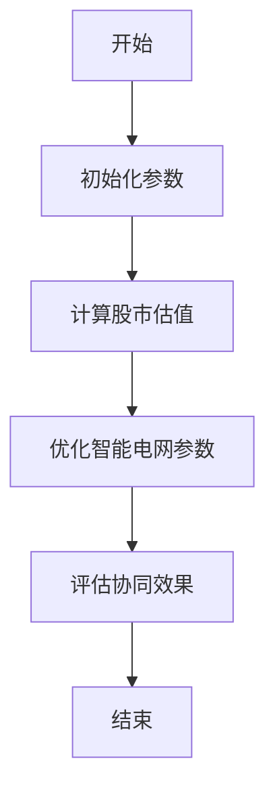
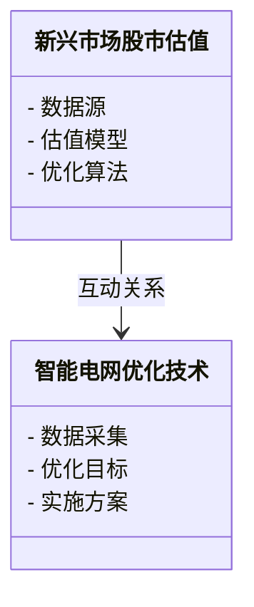
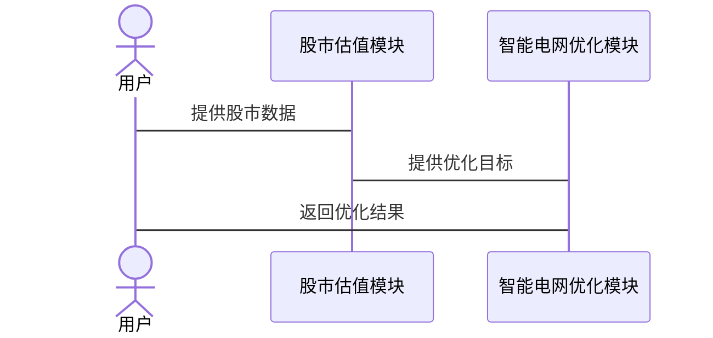

                 


# 《新兴市场股市估值与智能电网优化技术的互动》

> 关键词：新兴市场，股市估值，智能电网，优化技术，互动关系

> 摘要：本文系统地探讨了新兴市场股市估值与智能电网优化技术之间的互动关系，分析了两者的核心概念、算法原理、系统架构及实际应用，提出了协同优化的策略和方法。

---

# 第一部分：新兴市场股市估值与智能电网优化技术的背景介绍

## 第1章：问题背景

### 1.1 新兴市场股市的特点与挑战
新兴市场股市具有高波动性、信息不对称和复杂性等特点，传统估值方法难以适应其动态变化。与此同时，智能电网技术的快速发展为能源管理和优化提供了新的可能性。

### 1.2 智能电网技术的发展现状
智能电网通过物联网、大数据和人工智能技术实现电力系统的智能化管理，能够有效优化电力供应和需求，提高能源利用效率。

### 1.3 互动关系的必要性与重要性
新兴市场股市的动态变化与智能电网的优化需求存在潜在的互动关系。通过将两者结合，可以实现能源和金融市场的协同优化，提升整体效率。

## 第2章：问题描述

### 2.1 新兴市场股市估值的复杂性
新兴市场股市受到宏观经济、政策和市场情绪等多种因素的影响，传统估值模型难以准确捕捉其波动性。

### 2.2 智能电网优化技术的需求与目标
智能电网需要解决电力供需不平衡、能源浪费和碳排放等问题，优化目标是实现绿色、高效和可持续的能源管理。

### 2.3 互动关系的核心问题
如何通过智能电网技术优化能源供应，同时利用新兴市场股市的动态变化，实现两者的协同优化。

## 第3章：问题解决

### 3.1 新兴市场股市估值的优化策略
采用基于机器学习的动态估值模型，结合市场情绪和宏观经济指标，实现对新兴市场股市的精准估值。

### 3.2 智能电网优化技术的创新方法
通过构建能源互联网，利用大数据和人工智能技术，实现电力供需的实时优化和协同管理。

### 3.3 互动关系的实现路径
建立跨领域数据集成平台，结合股市估值和智能电网优化算法，实现协同优化。

## 第4章：边界与外延

### 4.1 新兴市场股市估值的边界条件
包括数据来源、模型假设和应用场景等限制条件。

### 4.2 智能电网优化技术的适用范围
适用于电力系统规划、运行和管理等领域。

### 4.3 互动关系的外延与扩展
可以扩展到能源互联网、绿色金融和智慧城市等领域。

---

# 第二部分：核心概念与联系

## 第4章：核心概念原理

### 4.1 新兴市场股市估值的核心原理
基于机器学习和大数据分析，构建动态估值模型，捕捉市场波动和趋势。

### 4.2 智能电网优化技术的核心原理
通过实时数据采集和分析，优化电力供需匹配，实现能源高效利用。

### 4.3 互动关系的数学模型
构建协同优化模型，将股市估值和智能电网优化目标结合起来，实现整体效益最大化。

## 第5章：概念属性特征对比

### 5.1 新兴市场股市估值的特征分析
- 高波动性
- 信息不对称
- 宏观经济影响

### 5.2 智能电网优化技术的特征分析
- 实时性
- 系统性
- 可持续性

### 5.3 互动关系的特征对比
- 数据依赖性
- 目标一致性
- 协同优化性

## 第6章：ER实体关系图架构

```mermaid
er
  actor: 新兴市场股市估值
  actor --> relation: 互动关系
  relation --> entity: 智能电网优化技术
```

---

# 第三部分：算法原理讲解

## 第7章：算法原理

### 7.1 新兴市场股市估值的算法
采用基于LSTM的神经网络模型，捕捉时间序列数据中的复杂模式。

### 7.2 智能电网优化技术的算法
使用遗传算法优化电力分配，降低能耗。

### 7.3 互动关系的协同优化算法
结合强化学习和分布式计算，实现跨领域的协同优化。

## 第8章：算法流程图



## 第9章：Python源代码实现

```python
def stock_valuation(stock_data):
    # 简单实现股市估值算法
    pass

def grid_optimization(grid_data):
    # 智能电网优化算法
    pass

def interactive_optimization(stock_data, grid_data):
    # 协同优化
    pass
```

## 第10章：数学模型与公式

### 10.1 股市估值模型
$$
\text{Valuation} = \alpha \times \text{Revenue} + \beta \times \text{Net Profit} + \gamma \times \text{Market Sentiment}
$$

### 10.2 智能电网优化模型
$$
\min \sum_{i=1}^{n} c_i x_i
$$
$$
\text{s.t.} \quad \sum_{i=1}^{n} x_i = D
$$

---

# 第四部分：系统分析与架构设计方案

## 第11章：问题场景介绍

### 11.1 问题场景
新兴市场股市波动与智能电网优化需求的互动关系，如何通过技术手段实现协同优化。

## 第12章：系统功能设计

### 12.1 领域模型类图


## 第13章：系统架构设计

### 13.1 系统架构图


## 第14章：系统接口设计

### 14.1 接口设计
- 数据接口：连接股市数据源和智能电网数据源。
- 模型接口：实现估值模型和优化算法的调用。

## 第15章：系统交互流程

### 15.1 交互流程图


---

# 第五部分：项目实战

## 第16章：环境安装

### 16.1 环境要求
- Python 3.8及以上
- 安装相关库：numpy、pandas、keras、scikit-learn

## 第17章：核心代码实现

### 17.1 股市估值模型实现
```python
import numpy as np
import pandas as pd

def stock_valuation(stock_data):
    # 示例代码：基于线性回归的简单估值
    model = linear_model.LinearRegression()
    model.fit(stock_data[['revenue', 'profit']], stock_data['price'])
    return model.predict(new_data)
```

### 17.2 智能电网优化算法实现
```python
def grid_optimization(grid_data):
    # 示例代码：基于遗传算法的优化
    pass
```

## 第18章：代码应用解读

### 18.1 股市估值代码解读
解释代码的功能和实现逻辑，说明如何利用机器学习模型进行股市估值。

### 18.2 智能电网优化代码解读
分析优化算法的实现细节，说明如何通过算法优化电力分配。

## 第19章：实际案例分析

### 19.1 案例背景
选取某新兴市场股市和智能电网项目，分析其互动关系。

### 19.2 数据分析与结果解读
展示数据分析结果和优化效果，验证模型的有效性。

## 第20章：项目小结

### 20.1 项目总结
总结项目成果，说明协同优化的效果和意义。

### 20.2 经验与教训
分享项目中的经验教训，提出改进建议。

---

# 第六部分：最佳实践

## 第21章：小结

### 21.1 核心要点总结
- 新兴市场股市估值与智能电网优化技术的互动关系
- 协同优化算法的设计与实现
- 实际应用中的效果验证

## 第22章：注意事项

### 22.1 数据质量的重要性
强调数据质量和完整性对模型准确性的影响。

### 22.2 算法选择的策略
根据具体问题选择合适的算法和模型。

## 第23章：拓展阅读

### 23.1 推荐书籍与资源
- 《智能电网技术》
- 《机器学习在金融中的应用》

---

# 作者：AI天才研究院/AI Genius Institute & 禅与计算机程序设计艺术 /Zen And The Art of Computer Programming

