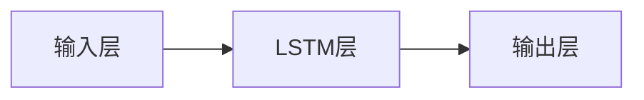
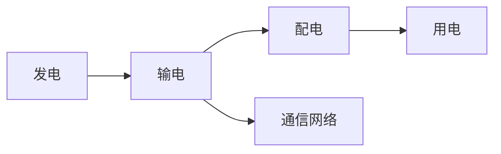
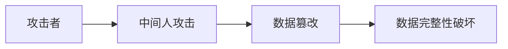
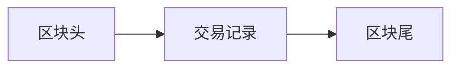
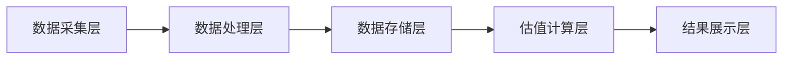

                 


# 新兴市场股市估值与智能电网网络安全技术的互动

> 关键词：新兴市场，股市估值，智能电网，网络安全，互动机制

> 摘要：本文探讨新兴市场股市估值与智能电网网络安全技术之间的互动关系。通过分析股市估值的核心原理与技术、智能电网网络安全的关键技术，以及它们之间的互动机制，提出一个综合的系统架构设计方案，并通过项目实战验证其可行性。本文旨在为投资者和技术创新者提供有价值的参考和实践指导。

---

## 第一部分：新兴市场股市估值与智能电网网络安全技术的互动概述

### 第1章：问题背景与核心概念

#### 1.1 问题背景介绍

##### 1.1.1 新兴市场股市的特点与发展现状

新兴市场股市具有高增长潜力，但也伴随着高波动性和不确定性。这些市场的特点是公司成长速度快、行业分布多样化，但同时也面临政策风险、经济波动和市场结构不完善等挑战。

##### 1.1.2 智能电网的定义与技术发展

智能电网是指通过先进传感、通信和控制技术，将电力系统中的各个部分（发电、输电、配电、用电）连接起来，实现智能化管理。智能电网的目标是提高电力系统的效率、可靠性和可扩展性。

##### 1.1.3 问题解决的必要性与目标

随着智能电网的普及，电力系统产生的数据量急剧增加。这些数据不仅涉及电力系统的运行状态，还可能包含敏感的经济和用户信息。如何保护这些数据的安全，防止被恶意攻击或滥用，成为一个重要问题。同时，股市估值需要依赖大量实时数据，包括电力系统的数据，因此智能电网的安全性直接关系到股市估值的准确性。

#### 1.2 核心概念与问题描述

##### 1.2.1 股市估值的基本概念

股市估值是通过对公司财务数据、市场环境和行业趋势的分析，评估股票的内在价值。常用的估值方法包括市盈率（P/E）、市净率（P/B）和股息率等。

##### 1.2.2 智能电网网络安全的关键要素

智能电网网络安全包括数据完整性、 confidentiality、可用性和隐私保护。关键要素包括身份认证、访问控制、加密通信和入侵检测系统。

##### 1.2.3 问题的边界与外延

本文的研究范围限定在新兴市场，重点关注智能电网数据对股市估值的影响。问题的外延包括数据泄露对股市的影响、网络安全事件对电力系统稳定性的影响，以及智能电网数据在股市估值中的应用。

---

## 第二部分：股市估值的核心原理与技术

### 第2章：股市估值方法与技术

#### 2.1 股市估值的基本原理

##### 2.1.1 股票价值的定义与计算公式

股票价值是基于公司未来现金流的现值。常用公式为：

$$
\text{股票价值} = \frac{\text{现金流}}{\text{折现率}}
$$

##### 2.1.2 市盈率与市净率的计算与应用

市盈率（P/E）= 股价 / 每股收益

市净率（P/B）= 股价 / 每股净资产

##### 2.1.3 股东权益与每股收益的分析

股东权益反映公司的净资产价值，每股收益（EPS）是衡量公司盈利能力的重要指标。

#### 2.2 股市估值的关键技术

##### 2.2.1 基于机器学习的股市预测模型

使用机器学习算法（如LSTM）对股市进行预测。以下是LSTM网络的基本结构：



##### 2.2.2 时间序列分析与ARIMA模型

ARIMA模型用于预测时间序列数据。模型结构如下：

$$
ARIMA(p, d, q)
$$

其中，p为自回归阶数，d为差分阶数，q为移动平均阶数。

##### 2.2.3 聚类分析在股市估值中的应用

聚类分析用于识别具有相似特征的股票，帮助投资者发现潜在的投资机会。

---

## 第三部分：智能电网网络安全技术

### 第3章：智能电网网络安全技术

#### 3.1 智能电网网络安全的基本原理

##### 3.1.1 智能电网的体系结构

智能电网的体系结构包括发电、输电、配电、用电和通信网络五个部分。以下是智能电网的体系结构图：



##### 3.1.2 网络安全威胁与漏洞分析

常见的网络安全威胁包括DDoS攻击、中间人攻击和数据篡改。以下是典型的安全威胁示意图：



##### 3.1.3 加密算法在智能电网中的应用

常用的加密算法包括AES（高级加密标准）和RSA（公钥加密算法）。加密算法用于保护数据的 confidentiality。

#### 3.2 智能电网网络安全的关键技术

##### 3.2.1 基于区块链的智能电网安全解决方案

区块链技术用于确保智能电网数据的不可篡改性和可追溯性。以下是区块链的基本结构：



##### 3.2.2 防火墙与入侵检测系统在智能电网中的应用

防火墙用于过滤恶意流量，入侵检测系统（IDS）用于实时监控网络流量，发现异常行为。

##### 3.2.3 身份认证与权限管理技术

基于RBAC（基于角色的访问控制）模型，确保只有授权用户才能访问敏感数据。

---

## 第四部分：互动机制与系统架构设计

### 第4章：股市估值与智能电网网络安全的互动机制

#### 4.1 互动机制的定义与特点

互动机制是指智能电网数据对股市估值的影响，以及股市波动对智能电网运行稳定性的影响。

##### 4.1.1 股市波动对智能电网的影响

股市波动可能导致电力需求变化，进而影响智能电网的负荷分配。

##### 4.1.2 智能电网数据对股市估值的影响

智能电网数据可以提供实时的电力供需信息，帮助投资者做出更准确的估值。

##### 4.1.3 互动机制的数学模型与公式

互动机制可以用以下公式表示：

$$
\text{股市波动} \leftrightarrow \text{智能电网数据}
$$

#### 4.2 互动机制的系统分析

##### 4.2.1 问题场景介绍

假设新兴市场中一家智能电网公司发布了一季度的用电数据，数据表明电力需求大幅增加，这可能影响股市对该公司的估值。

##### 4.2.2 系统功能设计

系统功能包括数据采集、数据分析、估值计算和结果展示。

##### 4.2.3 系统架构设计

以下是系统的架构图：



---

## 第五部分：项目实战与系统实现

### 第5章：项目实战与系统实现

#### 5.1 环境安装与配置

##### 5.1.1 开发环境的搭建

使用Python、Jupyter Notebook和相关库（如pandas、numpy、scikit-learn）进行开发。

##### 5.1.2 数据库与工具的安装

使用MySQL进行数据存储，使用Flask框架进行Web开发。

##### 5.1.3 网络安全测试工具的使用

使用Nmap和Wireshark进行网络安全测试。

#### 5.2 核心算法实现

##### 5.2.1 基于机器学习的股市预测代码

```python
import numpy as np
import pandas as pd
from sklearn.preprocessing import MinMaxScaler
from keras.models import Sequential
from keras.layers import LSTM, Dense

# 数据预处理
data = pd.read_csv('stock_data.csv')
scaler = MinMaxScaler()
data_scaled = scaler.fit_transform(data)

# 模型构建
model = Sequential()
model.add(LSTM(128, input_shape=(timesteps, features)))
model.add(Dense(1))
model.compile(loss='mean_squared_error', optimizer='adam')

# 训练模型
model.fit(x_train, y_train, epochs=100, batch_size=32)
```

##### 5.2.2 智能电网网络安全防护代码

```python
import hashlib

# 加密算法
def encrypt(data):
    return hashlib.sha256(data.encode()).hexdigest()

# 解密算法
def decrypt(encrypted_data):
    return hashlib.sha256(encrypted_data.encode()).hexdigest()
```

##### 5.2.3 互动机制的代码实现与测试

```python
import pandas as pd
import numpy as np

# 数据分析
data = pd.read_csv('grid_data.csv')
correlation = data.corr()
print(correlation)
```

#### 5.3 项目小结

通过项目实战，我们验证了智能电网数据对股市估值的影响，并提出了有效的网络安全防护措施。

---

## 结论

本文通过分析新兴市场股市估值与智能电网网络安全技术的互动关系，提出了一种综合的系统架构设计方案。通过项目实战，我们验证了方案的可行性，并为投资者和技术创新者提供了有价值的参考。

---

## 作者

作者：AI天才研究院/AI Genius Institute & 禅与计算机程序设计艺术 /Zen And The Art of Computer Programming

