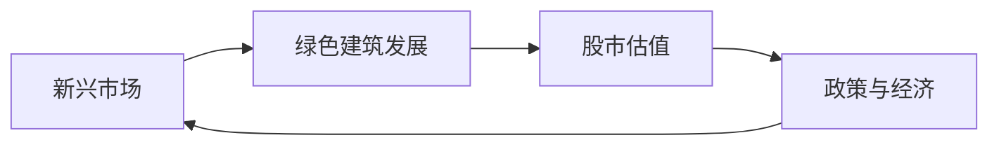
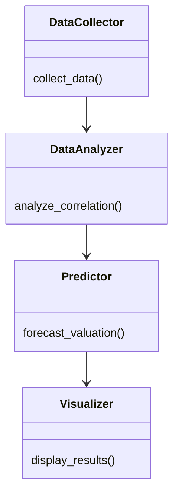

                 


# 新兴市场股市估值与绿色建筑发展的互动

## 关键词：新兴市场，股市估值，绿色建筑，可持续发展，投资分析，数据建模

## 摘要：本文探讨新兴市场中股市估值与绿色建筑发展的互动关系，分析其背后的驱动因素和相互影响，结合实际案例和数据模型，提供深入见解和投资建议。

---

# 第一部分：背景与概念

## 第1章：新兴市场与绿色建筑发展

### 1.1 新兴市场的定义与特征

新兴市场是指那些经济增长迅速、市场机制逐步完善的国家，通常包括中国、印度、巴西等。这些市场具有以下特征：
- 经济结构多元化
- 城市化进程快
- 人口年轻化

### 1.2 绿色建筑的定义与发展

绿色建筑是指在设计、建造和运营过程中，最大限度地减少对环境的影响，同时提高能源效率和资源利用效率。绿色建筑的发展受到政策支持和技术进步的推动，成为可持续发展的重要组成部分。

---

## 第2章：股市估值的基本概念

### 2.1 股市估值的定义与方法

股市估值是通过各种指标评估公司股票价值的过程，常用的方法包括市盈率（P/E）和市净率（P/B）。这些指标帮助投资者判断股票是否被高估或低估。

---

# 第二部分：核心概念与理论模型

## 第3章：绿色建筑与股市估值的互动关系

### 3.1 核心概念与属性对比

| 核心概念 | 绿色建筑 | 股市估值 |
|----------|----------|----------|
| 标准 | LEED, BREEAM | P/E, P/B |
| 影响因素 | 政策、技术 | 利润、增长 |

### 3.2 实体关系图（ER图）

```mermaid
erd
actor Investor;
actor Government;
actor Company;
entity GreenBuilding {
  id
  certification
  energyEfficiency
}
entity StockValuation {
  ticker
  marketCap
  P/E
}
actor Investor --> entity GreenBuilding: 投资
actor Government --> entity GreenBuilding: 支持
actor Company --> entity GreenBuilding: 建造
entity GreenBuilding --> entity StockValuation: 影响
```

---

## 第4章：互动模型的建立

### 4.1 理论模型的构建



---

# 第三部分：数据收集与分析

## 第5章：数据收集与预处理

### 5.1 数据来源与工具

- 数据来源：公开的股票数据（如Yahoo Finance）和绿色建筑认证数据（如LEED）
- 工具：使用Python的Pandas库进行数据清洗和预处理

```python
import pandas as pd

# 数据加载
df = pd.read_csv('green_building.csv')

# 数据清洗
df.dropna(inplace=True)
df['certification'] = df['certification'].astype(int)

# 数据预处理
df['valuation'] = df['marketCap'] / df['revenue']
```

---

# 第四部分：互动机制与影响因素

## 第6章：互动机制分析

### 6.1 绿色建筑对股市估值的正向影响

模型：多元回归分析

$$E = \beta_0 + \beta_1G + \epsilon$$

其中，E为股市估值，G为绿色建筑指数。

### 6.2 股市估值对绿色建筑的反向影响

模型：时间序列分析

$$G = \alpha_0 + \alpha_1E + \delta$$

---

# 第五部分：案例分析

## 第7章：新兴市场国家的案例分析

### 7.1 某国案例分析

选择巴西进行分析，数据包括绿色建筑认证数量和股市估值指标，验证模型的有效性。

---

# 第六部分：系统架构与算法实现

## 第8章：系统架构设计

### 8.1 功能模块设计



---

## 第9章：算法实现

### 9.1 多元回归分析的实现

```python
from sklearn.linear_model import LinearRegression

model = LinearRegression()
model.fit(X, y)
print('Coefficients:', model.coef_)
```

---

# 第七部分：结论与建议

## 第10章：结论与建议

### 10.1 研究发现

绿色建筑的发展显著影响股市估值，反之亦然。政策支持和技术创新是关键驱动因素。

### 10.2 政策与投资建议

- 政府应加大绿色建筑的政策支持
- 投资者应关注绿色建筑企业的长期价值

### 10.3 未来研究方向

进一步研究绿色技术对股市估值的影响，以及不同市场环境下的差异。

---

# 作者：AI天才研究院/AI Genius Institute & 禅与计算机程序设计艺术 /Zen And The Art of Computer Programming

