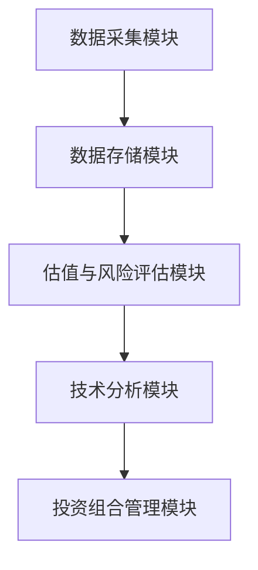

                 


### 第一部分: 新兴科技股投资背景与核心概念

---

### 第二部分: 新兴科技股投资的分析方法

## 第4章: 科技股投资的定量分析方法

### 4.1 科技股的财务指标分析

#### 4.1.1 营收与利润分析
- 营收增长率的计算方法
- 净利润的波动性分析
- 资产负债率的评估标准

#### 4.1.2 研发投入分析
- 研发投入占总收入的比例
- 研发投入与技术创新的关系
- 研发投入的周期性影响

#### 4.1.3 财务健康状况评估
- 现金流的稳定性分析
- 资产周转率的计算方法
- 负债结构的合理性评估

### 4.2 科技股的估值方法

#### 4.2.1 市盈率与市净率分析
- 市盈率的计算公式：$P/E = \frac{股票价格}{每股收益}$
- 市净率的计算公式：$P/B = \frac{股票价格}{每股净资产}$
- 市盈率与市净率的对比分析

#### 4.2.2 现金流折现法
- 自由现金流的计算方法
- 折现率的确定标准
- 现金流折现法的优缺点

#### 4.2.3 市场对标法
- 同行业可比公司的选择标准
- 市场对标法的适用场景
- 市场对标法的局限性分析

### 4.3 科技股的风险评估模型

#### 4.3.1 风险因素的识别与分类
- 市场风险、信用风险、流动性风险的定义
- 科技股特有的风险因素，如技术风险、政策风险、竞争风险

#### 4.3.2 风险评估模型的构建
- 采用层次分析法（AHP）构建风险评估模型
- 风险权重的确定方法
- 风险评分的计算公式

#### 4.3.3 风险评估的数学模型
$$
\text{风险评分} = \sum_{i=1}^{n} w_i \times r_i
$$
其中，$w_i$ 是第 $i$ 个风险因素的权重，$r_i$ 是第 $i$ 个风险因素的风险值

### 4.4 科技股的估值与风险评估的综合应用

#### 4.4.1 综合估值模型的构建
- 结合市盈率、现金流折现法和市场对标法的综合估值模型
- 综合估值模型的数学公式：
$$
\text{综合估值} = \alpha \times P/E + \beta \times \text{现金流折现值} + \gamma \times \text{市场对标值}
$$

#### 4.4.2 综合风险评估的应用
- 风险评估结果对估值的调整方法
- 不同风险等级下的估值策略

---

## 第5章: 科技股投资的技术分析方法

### 5.1 技术分析的基本原理

#### 5.1.1 技术分析的核心思想
- 价格反映所有信息的原则
- 历史价格的重复性规律
- 技术指标的领先性特征

#### 5.1.2 技术分析与基本面分析的结合
- 技术分析在投资决策中的作用
- 技术分析与基本面分析的协同效应

### 5.2 科技股的技术分析指标

#### 5.2.1 常用技术指标
- 移动平均线（MA）
- 相对强弱指数（RSI）
- 指数平滑异同平均线（MACD）

#### 5.2.2 技术指标的计算公式
- MA的计算公式：
$$
\text{MA}_n = \frac{1}{n} \sum_{i=1}^{n} \text{收盘价}_i
$$
- RSI的计算公式：
$$
\text{RSI}_n = \frac{100}{1 + \frac{\text{上涨幅度}}{\text{下跌幅度}}}
$$
- MACD的计算公式：
$$
\text{MACD}_n = \text{短期EMA} - \text{长期EMA}
$$

#### 5.2.3 技术指标的组合使用
- 技术指标的交叉应用策略
- 技术指标的有效性验证

### 5.3 科技股的技术分析实战

#### 5.3.1 技术分析的步骤
1. 确定分析的时间周期
2. 选择合适的技术指标
3. 分析价格走势的形态
4. 判断买卖信号
5. 结合基本面分析进行确认

#### 5.3.2 技术分析的实战案例
- 某科技股的价格走势分析
- 技术指标的应用与信号解读
- 投资决策的综合判断

---

## 第6章: 科技股投资的行业与公司分析

### 6.1 行业分析的核心方法

#### 6.1.1 行业生命周期分析
- 科技行业的生命周期阶段
- 不同阶段的投资策略

#### 6.1.2 行业竞争结构分析
- 五力模型在科技行业的应用
- 科技行业的主要竞争对手分析

#### 6.1.3 行业发展趋势分析
- 科技行业的未来增长点
- 新兴技术对行业的颠覆性影响

### 6.2 公司分析的核心要素

#### 6.2.1 公司基本面分析
- 财务状况、盈利能力、成长能力
- 管理团队的能力与稳定性

#### 6.2.2 公司创新能力分析
- 研发投入与技术创新能力
- 核心技术的竞争力分析
- 知识产权的数量与质量

#### 6.2.3 公司市场地位分析
- 市场份额的分布情况
- 客户粘性和品牌影响力
- 供应链的稳定性和优势

### 6.3 行业与公司分析的综合应用

#### 6.3.1 行业与公司分析的结合
- 行业分析结果对个股投资的影响
- 公司分析结果对行业投资的影响

#### 6.3.2 行业与公司分析的实战案例
- 某科技行业的现状与趋势分析
- 某科技公司的竞争优势分析
- 投资决策的综合判断

---

## 第7章: 科技股投资的系统架构与实现

### 7.1 投资系统的设计目标

#### 7.1.1 系统功能需求
- 数据采集与处理
- 估值与风险评估
- 技术分析与信号生成
- 投资组合管理

#### 7.1.2 系统性能需求
- 数据处理的实时性要求
- 系统的可扩展性要求
- 系统的稳定性要求

### 7.2 系统功能设计

#### 7.2.1 数据采集模块
- 数据源的获取渠道
- 数据清洗与预处理
- 数据存储与管理

#### 7.2.2 估值与风险评估模块
- 财务指标的计算与分析
- 估值模型的构建与应用
- 风险评估模型的构建与应用

#### 7.2.3 技术分析模块
- 技术指标的计算与分析
- 价格走势的形态识别
- 技术信号的生成与管理

#### 7.2.4 投资组合管理模块
- 资产配置的优化策略
- 投资组合的风险管理
- 投资绩效的评估与优化

### 7.3 系统架构设计

#### 7.3.1 系统架构图


#### 7.3.2 系统接口设计
- 数据接口：API接口的设计与实现
- 模块接口：模块之间的调用关系

#### 7.3.3 系统交互流程
```mermaid
sequenceDiagram
    participant 用户
    participant 数据采集模块
    participant 数据存储模块
    participant 估值与风险评估模块
    participant 技术分析模块
    participant 投资组合管理模块
    用户 -> 数据采集模块: 请求数据采集
    数据采集模块 -> 数据存储模块: 存储数据
    用户 -> 估值与风险评估模块: 请求估值分析
    估值与风险评估模块 -> 数据存储模块: 获取数据
    估值与风险评估模块 ->抽取出结果
    用户 -> 技术分析模块: 请求技术分析
    技术分析模块 -> 数据存储模块: 获取数据
    技术分析模块 ->抽取出结果
    用户 -> 投资组合管理模块: 请求投资建议
    投资组合管理模块 -> 估值与风险评估模块: 获取估值结果
    投资组合管理模块 -> 技术分析模块: 获取技术分析结果
    投资组合管理模块 ->抽取出结果
```

---

## 第8章: 科技股投资的项目实战

### 8.1 项目背景与目标

#### 8.1.1 项目背景
- 选择某新兴科技行业进行分析
- 选择某科技公司进行深入研究

#### 8.1.2 项目目标
- 构建科技股投资的分析框架
- 实现科技股投资的系统化流程
- 提供科技股投资的实战案例

### 8.2 项目实施步骤

#### 8.2.1 数据获取与清洗
- 数据来源：公开市场数据、财务报表、新闻报道
- 数据清洗：缺失值处理、异常值处理
- 数据存储：数据库设计与实现

#### 8.2.2 估值与风险评估
- 采用综合估值模型进行估值
- 运用风险评估模型进行风险判断
- 结合行业与公司分析进行综合判断

#### 8.2.3 技术分析与信号生成
- 选择合适的

