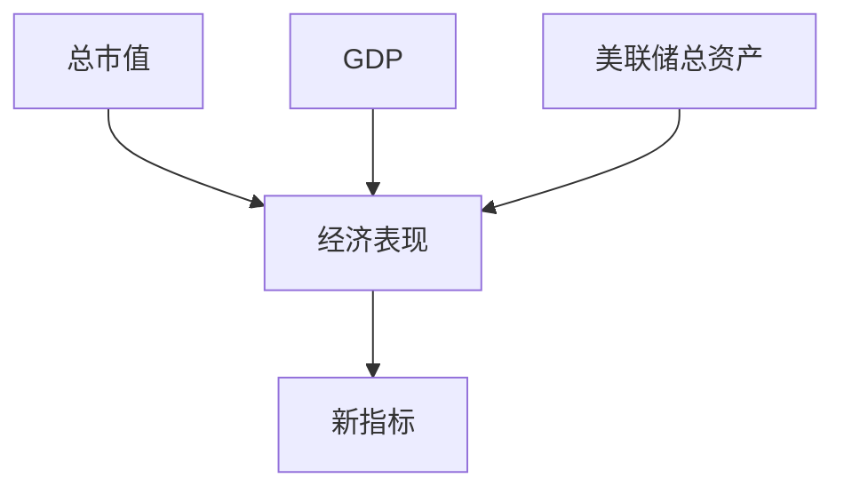
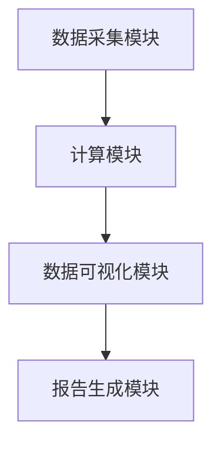
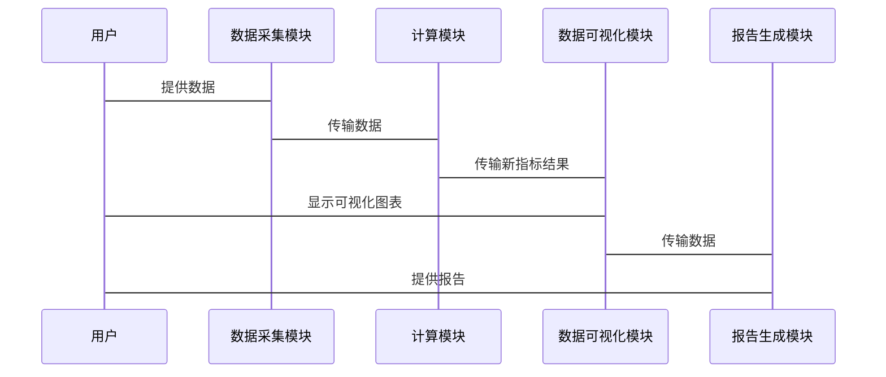

                 


# 新指标: 总市值占GDP与美联储总资产之和的百分比

> 关键词：经济指标，总市值，GDP，美联储总资产，市场分析

> 摘要：本文提出了一种新的经济指标——总市值占GDP与美联储总资产之和的百分比。通过分析总市值、GDP和美联储总资产的定义、计算方法及相互关系，构建了一个数学模型，并通过实际案例展示了该指标的应用价值。

---

# 第一部分: 新指标背景与概念

## 第1章: 新指标的背景与问题背景

### 1.1 当前经济指标的局限性

#### 1.1.1 经济指标体系的现状
现有的经济指标体系主要包括国内生产总值（GDP）、通货膨胀率、失业率、消费者信心指数等，这些指标能够反映一个国家或地区的经济整体状况。然而，这些指标往往无法全面反映金融市场和货币政策对经济的综合影响。

#### 1.1.2 现有指标的不足与局限性
- **GDP**：GDP反映的是一个国家的经济总量，但无法直接反映金融市场的波动和货币政策的影响。
- **总市值**：总市值反映的是金融市场中企业的整体价值，但无法单独衡量经济的整体表现。
- **美联储总资产**：美联储的资产规模反映的是货币政策的宽松程度，但其与经济总量的关系并不直接。

#### 1.1.3 引入新指标的必要性
为了全面衡量经济与金融市场的综合表现，我们需要一个能够同时反映经济总量、金融市场价值和货币政策影响的综合指标。因此，提出了“总市值占GDP与美联储总资产之和的百分比”这一新指标。

---

### 1.2 问题背景与问题描述

#### 1.2.1 经济监测与市场分析的挑战
经济监测和市场分析需要考虑的因素包括经济总量、金融市场价值和货币政策的影响。现有指标体系无法同时反映这三个方面。

#### 1.2.2 现有指标体系的不足
- GDP仅反映经济总量，无法反映金融市场价值。
- 总市值反映金融市场价值，但无法反映经济总量和货币政策的影响。
- 美联储总资产反映货币政策的影响，但无法直接衡量经济总量和金融市场价值。

#### 1.2.3 新指标的提出与目标
提出新指标的目标是综合反映经济总量、金融市场价值和货币政策的综合影响，为经济监测和市场分析提供更全面的视角。

---

### 1.3 问题解决与边界定义

#### 1.3.1 新指标的核心目标
新指标的核心目标是衡量总市值相对于经济总量和货币政策资产规模的相对重要性，为经济监测和市场分析提供参考。

#### 1.3.2 边界与适用范围
- 适用范围：适用于分析经济总量、金融市场价值和货币政策影响的综合情况。
- 不适用范围：不适用于分析单一经济指标的具体表现。

#### 1.3.3 指标体系的外延与内涵
- 外延：总市值、GDP、美联储总资产。
- 内涵：综合反映经济总量、金融市场价值和货币政策的综合影响。

---

### 1.4 核心概念与概念结构

#### 1.4.1 总市值的定义与属性
- **定义**：总市值是指市场上所有上市公司股票的总价值。
- **属性**：波动性高，受市场情绪、政策和经济数据的影响较大。

#### 1.4.2 GDP的定义与属性
- **定义**：GDP是衡量一个国家或地区经济总量的指标，包括消费、投资、政府支出和净出口。
- **属性**：相对稳定，受政策和经济周期影响。

#### 1.4.3 美联储总资产的定义与属性
- **定义**：美联储总资产是指美联储资产负债表中资产的总和，包括政府债券、银行贷款等。
- **属性**：受货币政策影响，具有较大的波动性。

#### 1.4.4 新指标的概念结构与核心要素
- 新指标由总市值、GDP和美联储总资产三个核心要素构成，通过计算总市值占GDP与美联储总资产之和的百分比，综合反映经济总量、金融市场价值和货币政策的综合影响。

---

## 第2章: 核心概念与联系

### 2.1 核心概念原理

#### 2.1.1 总市值的计算方法
- **公式**：总市值 = 市场价格 × 发行量
- **特点**：波动性高，受市场情绪和经济数据影响较大。

#### 2.1.2 GDP的计算方法
- **公式**：GDP = 消费 + 投资 + 政府支出 + 净出口
- **特点**：相对稳定，受政策和经济周期影响。

#### 2.1.3 美联储总资产的计算方法
- **公式**：美联储总资产 = 资产负债表中资产总额
- **特点**：受货币政策影响，具有较大的波动性。

---

### 2.2 概念属性对比

#### 2.2.1 总市值与GDP的对比
| 属性 | 总市值 | GDP |
|------|--------|-----|
| 计算方式 | 市场价格 × 发行量 | 消费 + 投资 + 政府支出 + 净出口 |
| 波动性 | 高 | 低 |
| 受影响因素 | 市场情绪、政策、经济数据 | 经济周期、政策 |

#### 2.2.2 GDP与美联储总资产的对比
| 属性 | GDP | 美联储总资产 |
|------|-----|--------------|
| 计算方式 | 消费 + 投资 + 政府支出 + 净出口 | 资产负债表中资产总额 |
| 波动性 | 低 | 高 |
| 受影响因素 | 经济周期、政策 | 货币政策、经济数据 |

#### 2.2.3 总市值与美联储总资产的对比
| 属性 | 总市值 | 美联储总资产 |
|------|--------|--------------|
| 计算方式 | 市场价格 × 发行量 | 资产负债表中资产总额 |
| 波动性 | 高 | 高 |
| 受影响因素 | 市场情绪、政策、经济数据 | 货币政策、经济数据 |

---

### 2.3 ER实体关系图



---

### 2.4 指标体系的相互作用

#### 2.4.1 经济表现与市场价值的关系
- 经济表现（GDP）影响市场价值（总市值）。
- 市场价值（总市值）反映经济表现（GDP）的变化。

#### 2.4.2 货币政策与市场价值的关系
- 货币政策（美联储总资产）影响市场价值（总市值）。
- 市场价值（总市值）反映货币政策（美联储总资产）的变化。

#### 2.4.3 新指标的综合反映作用
- 新指标综合反映经济表现、市场价值和货币政策的综合影响。
- 新指标的变化能够揭示经济与市场的相互作用。

---

## 第3章: 新指标的数学模型与公式

### 3.1 数学模型构建

#### 3.1.1 总市值、GDP与美联储总资产的关系
- 总市值反映金融市场价值。
- GDP反映经济总量。
- 美联储总资产反映货币政策的影响。

#### 3.1.2 新指标的计算公式
$$新指标 = \frac{总市值}{GDP + 美联储总资产} \times 100\%$$

---

### 3.2 公式推导与解释

#### 3.2.1 总市值的计算公式
$$总市值 = 市场价格 \times 发行量$$

#### 3.2.2 GDP的计算公式
$$GDP = 消费 + 投资 + 政府支出 + 净出口$$

#### 3.2.3 美联储总资产的计算公式
$$美联储总资产 = 资产负债表中资产总额$$

---

### 3.3 案例分析

#### 3.3.1 假设案例
假设总市值为1000亿美元，GDP为5000亿美元，美联储总资产为4000亿美元。

$$新指标 = \frac{1000}{5000 + 4000} \times 100\% = \frac{1000}{9000} \times 100\% \approx 11.11\%$$

---

## 第4章: 系统分析与架构设计

### 4.1 问题场景介绍

#### 4.1.1 问题场景
- 经济监测系统需要综合反映经济总量、金融市场价值和货币政策的综合影响。

#### 4.1.2 项目介绍
- 项目目标：开发一个经济监测系统，能够计算和展示新指标。
- 项目范围：数据采集、计算、可视化和报告生成。

---

### 4.2 系统功能设计

#### 4.2.1 领域模型


---

### 4.3 系统架构设计

#### 4.3.1 系统架构图


---

### 4.4 系统接口设计

#### 4.4.1 数据接口
- 数据输入接口：接收总市值、GDP和美联储总资产的数据。
- 数据输出接口：输出新指标的计算结果。

#### 4.4.2 用户接口
- 用户输入接口：接收用户输入的参数。
- 用户输出接口：显示新指标的计算结果和可视化图表。

---

### 4.5 系统交互流程

#### 4.5.1 交互流程图


---

## 第5章: 项目实战

### 5.1 环境安装

#### 5.1.1 安装Python
```bash
# 安装Python
# 下载Python安装包并按照提示完成安装
```

#### 5.1.2 安装必要的Python库
```bash
pip install numpy pandas matplotlib
```

---

### 5.2 核心代码实现

#### 5.2.1 数据读取与计算
```python
import numpy as np
import pandas as pd
import matplotlib.pyplot as plt

# 数据读取
market_cap = 1000  # 总市值（单位：亿美元）
gdp = 5000  # GDP（单位：亿美元）
fed_assets = 4000  # 美联储总资产（单位：亿美元）

# 新指标计算
new_indicator = (market_cap / (gdp + fed_assets)) * 100
print(f"新指标 = {new_indicator}%")
```

---

### 5.3 代码应用解读与分析

#### 5.3.1 代码功能
- 数据读取：读取总市值、GDP和美联储总资产的数据。
- 新指标计算：根据公式计算新指标。
- 结果输出：打印新指标的值。

#### 5.3.2 代码分析
- 代码简洁明了，能够快速计算新指标。
- 代码依赖Python和必要的库（numpy、pandas、matplotlib）。

---

### 5.4 实际案例分析

#### 5.4.1 案例分析
假设总市值为1000亿美元，GDP为5000亿美元，美联储总资产为4000亿美元。

```python
market_cap = 1000
gdp = 5000
fed_assets = 4000

new_indicator = (market_cap / (gdp + fed_assets)) * 100
print(f"新指标 = {new_indicator}%")  # 输出：新指标 = 11.11%
```

---

### 5.5 项目小结

#### 5.5.1 项目总结
- 项目目标：开发一个经济监测系统，能够计算和展示新指标。
- 项目成果：实现了新指标的计算和可视化功能。

---

## 第6章: 最佳实践与注意事项

### 6.1 最佳实践

#### 6.1.1 数据来源的选择
- 数据来源应选择权威的经济数据库，如美联储公开数据、经济指标数据库等。

#### 6.1.2 数据计算的频率
- 数据计算的频率应根据实际需求确定，可以是每日、每周或每月。

#### 6.1.3 可视化工具的选择
- 可视化工具可以是Matplotlib、Seaborn或Tableau等。

---

### 6.2 小结

#### 6.2.1 关键点回顾
- 新指标的定义和计算方法。
- 系统设计与实现。
- 项目实战与应用。

---

### 6.3 注意事项

#### 6.3.1 数据的准确性和及时性
- 数据的准确性和及时性直接影响新指标的计算结果。

#### 6.3.2 模型的适用性
- 新指标适用于综合反映经济总量、金融市场价值和货币政策的综合影响，但在特定情况下可能需要调整。

---

### 6.4 拓展阅读

#### 6.4.1 相关文献
- 《经济学原理》
- 《货币政策与金融市场》

#### 6.4.2 实践案例
- 经济监测系统的实际应用案例。

---

## 作者：AI天才研究院/AI Genius Institute & 禅与计算机程序设计艺术 /Zen And The Art of Computer Programming

---

### 感谢您的阅读！

