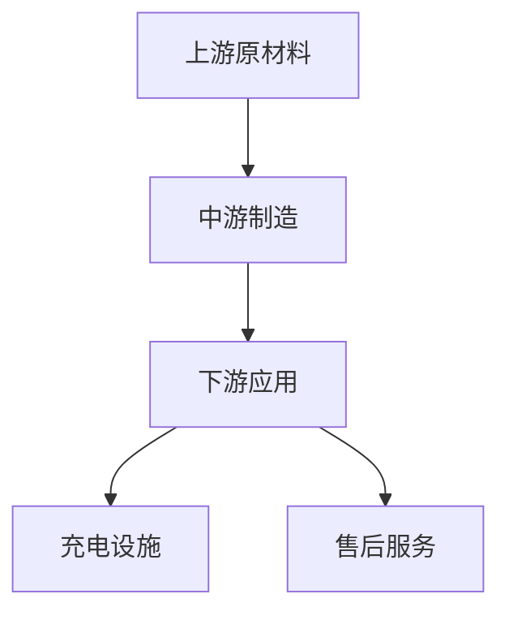

                 


# 新能源汽车产业链的投资机会与风险

> 关键词：新能源汽车、投资机会、产业链分析、风险管理、技术趋势

> 摘要：本文深入分析了新能源汽车产业链的核心环节、投资机会与风险，结合技术趋势和市场动态，为投资者提供科学的决策参考。

---

# 第一部分: 新能源汽车产业链的背景与现状

## 第1章: 新能源汽车产业链概述

### 1.1 新能源汽车的发展背景

#### 1.1.1 全球能源转型与环保压力
全球范围内，能源结构转型和环境保护已成为各国政府和企业的共同目标。新能源汽车作为减少碳排放的重要手段，得到了政策和市场的双重支持。

#### 1.1.2 政策推动与产业扶持
各国政府通过补贴、税收优惠和基础设施建设等政策，推动新能源汽车的普及。例如，中国的《新能源汽车产业发展规划（2021-2035年）》明确提出到2035年新能源汽车占据汽车总销量的50%以上。

#### 1.1.3 技术进步与市场驱动
电池技术的突破（如锂离子电池能量密度提升）、智能网联技术的发展以及整车制造的规模化效应，推动了新能源汽车的市场竞争力和用户体验的提升。

---

### 1.2 新能源汽车产业链的构成

#### 1.2.1 上游原材料
- **关键资源**：锂、镍、钴等金属材料。
- **特点**：资源依赖性强，价格波动大。

#### 1.2.2 中游制造
- **关键环节**：电池、电机、电控系统。
- **特点**：技术密集，研发投入高。

#### 1.2.3 下游应用
- **关键环节**：整车制造与销售。
- **特点**：市场需求驱动，竞争激烈。

#### 1.2.4 支持系统
- **关键环节**：充电设施、售后服务。
- **特点**：基础设施建设是产业链的重要组成部分。

---

## 第2章: 新能源汽车产业链的核心概念与联系

### 2.1 核心概念原理

#### 2.1.1 新能源汽车的定义与分类
- **定义**：以电能为动力来源，依靠电机驱动的汽车。
- **分类**：纯电动汽车（BEV）、插电式混合动力汽车（PHEV）、燃料电池汽车（FCEV）。

#### 2.1.2 产业链各环节的协同关系
- **协同关系**：上游原材料供应→中游制造→下游应用→支持系统。

#### 2.1.3 技术创新对产业链的驱动作用
- **技术创新**：电池技术、电机技术、智能控制系统是推动产业链发展的核心动力。

---

### 2.2 核心概念属性特征对比表格

| 环节       | 特性               | 描述                                         |
|------------|--------------------|----------------------------------------------|
| 上游原材料 | 资源依赖性         | 对锂、镍等资源的依赖度高，价格波动大       |
| 中游制造   | 技术密集性         | 高技术门槛，研发投入大，市场竞争激烈       |
| 下游应用   | 市场驱动性         | 市场需求主导，品牌竞争激烈                 |
| 支持系统   | 基础设施依赖性     | 充电设施是新能源汽车推广的关键支撑           |

---

### 2.3 ER实体关系图（Mermaid）



---

# 第二部分: 新能源汽车产业链的风险评估与分析

## 第3章: 新能源汽车产业链的风险评估

### 3.1 风险评估方法

#### 3.1.1 风险识别与分类
- **常见风险**：政策风险、技术风险、市场风险、财务风险。
- **分类标准**：按影响范围、发生概率、影响程度分类。

#### 3.1.2 风险评估模型
- **模型**：使用概率-影响矩阵（PIA）对风险进行量化评估。
- **步骤**：识别风险→评估概率→评估影响→绘制矩阵。

#### 3.1.3 风险影响分析
- **分析方法**：定量分析（成本模型）和定性分析（情景分析）。

---

### 3.2 产业链各环节的风险分析

#### 3.2.1 上游原材料
- **风险**：资源枯竭、价格波动。
- **应对策略**：多元化供应链布局、技术替代。

#### 3.2.2 中游制造
- **风险**：技术壁垒高、市场竞争激烈。
- **应对策略**：加大研发投入、优化生产流程。

#### 3.2.3 下游应用
- **风险**：市场需求波动、品牌竞争。
- **应对策略**：精准市场定位、提升品牌竞争力。

#### 3.2.4 支持系统
- **风险**：基础设施建设滞后。
- **应对策略**：加大投资、政策支持。

---

## 第4章: 新能源汽车产业链的风险管理

### 4.1 风险管理策略

#### 4.1.1 分散投资
- **策略**：分散投资于不同环节，降低单一环节风险。

#### 4.1.2 技术创新
- **策略**：加大对新技术的研发投入，降低技术风险。

#### 4.1.3 政策应对
- **策略**：密切关注政策变化，合理规避政策风险。

---

# 第三部分: 新能源汽车产业链的技术分析与投资策略

## 第5章: 新能源汽车产业链的技术分析

### 5.1 电池技术分析

#### 5.1.1 电池技术发展趋势
- **趋势**：高能量密度、快充技术、循环寿命提升。
- **核心技术**：锂离子电池、固态电池、钠离子电池。

#### 5.1.2 电池技术对产业链的影响
- **影响**：降低电池成本、提高续航里程。

---

### 5.2 智能网联技术分析

#### 5.2.1 技术发展现状
- **现状**：车联网、自动驾驶技术快速发展。
- **应用场景**：智能驾驶、远程监控。

#### 5.2.2 技术对产业链的推动作用
- **作用**：提升用户体验、增加附加价值。

---

## 第6章: 新能源汽车产业链的投资策略

### 6.1 投资机会分析

#### 6.1.1 上游原材料
- **机会**：需求增长带动价格上涨。
- **风险**：资源价格波动大。

#### 6.1.2 中游制造
- **机会**：技术进步和规模化效应降低成本。
- **风险**：技术壁垒高。

#### 6.1.3 下游应用
- **机会**：市场需求快速增长。
- **风险**：市场竞争激烈。

---

### 6.2 投资组合策略

#### 6.2.1 投资组合构建
- **策略**：分散投资于不同环节，平衡风险与收益。

#### 6.2.2 风险控制
- **方法**：设置止损点、定期评估投资组合。

---

# 第四部分: 新能源汽车产业链的案例分析与实战

## 第7章: 新能源汽车产业链的案例分析

### 7.1 案例背景
- **案例名称**：某新能源汽车电池生产企业投资分析。
- **背景**：企业计划投资于电池技术研发和生产。

---

### 7.2 项目实战

#### 7.2.1 项目目标
- **目标**：评估投资项目的可行性，制定投资策略。

#### 7.2.2 项目实施步骤
1. 市场调研：分析目标市场和竞争环境。
2. 技术评估：评估技术可行性。
3. 风险分析：识别潜在风险并制定应对策略。
4. 投资决策：制定投资计划。

---

### 7.3 代码实现

#### 7.3.1 数据分析代码（Python）

```python
import pandas as pd
import numpy as np

# 示例数据：新能源汽车电池市场数据分析
data = {
    'year': [2018, 2019, 2020, 2021, 2022],
    'sales': [10, 20, 30, 40, 50],
    'cost': [5, 6, 7, 8, 9],
    'profit': [5, 14, 23, 32, 41]
}

df = pd.DataFrame(data)
print(df)
```

#### 7.3.2 风险评估模型代码

```python
def risk_assessment(impact, probability):
    return impact * probability

# 示例评估
risks = {
    '风险': ['政策风险', '技术风险', '市场风险'],
    '影响': [0.8, 0.6, 0.7],
    '概率': [0.3, 0.4, 0.2]
}

df_risk = pd.DataFrame(risks)
df_risk['风险评分'] = df_risk.apply(lambda x: risk_assessment(x['影响'], x['概率']), axis=1)
print(df_risk)
```

---

## 第8章: 新能源汽车产业链的最佳实践与小结

### 8.1 最佳实践

#### 8.1.1 技术驱动投资
- **建议**：重点关注电池技术、智能网联技术等领域的投资机会。

#### 8.1.2 风险管理
- **建议**：分散投资、定期评估、设置止损。

---

### 8.2 小结

新能源汽车产业链的投资机会与风险并存，投资者需要结合技术趋势、市场动态和政策环境，制定科学的投资策略，同时注重风险管理，以实现稳健的投资回报。

---

# 作者：AI天才研究院/AI Genius Institute & 禅与计算机程序设计艺术 /Zen And The Art of Computer Programming

