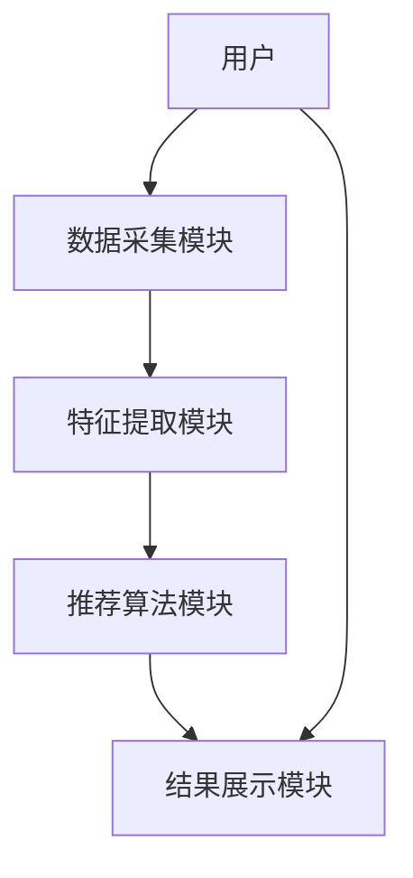

                 


# 旅游AI Agent：智能行程规划与推荐

## 关键词：旅游AI Agent、智能行程规划、推荐系统、协同过滤、深度学习、系统架构

## 摘要：本文深入探讨了旅游AI Agent在智能行程规划与推荐中的应用，从推荐系统的核心原理到算法实现，再到系统架构设计和项目实战，详细剖析了旅游AI Agent的构建过程。通过理论分析和实践案例，展示了如何利用AI技术提升旅游体验。

---

## 第一章：引言

### 1.1 旅游AI Agent的背景与现状

#### 1.1.1 传统旅游行程规划的挑战
传统的旅游行程规划依赖于人工经验，存在效率低、个性化不足的问题。用户需要花费大量时间筛选信息，难以找到最优方案。

#### 1.1.2 AI技术在旅游中的应用潜力
人工智能技术的发展为旅游行业带来了革新。通过机器学习和自然语言处理，AI Agent能够实时分析海量数据，提供个性化推荐。

#### 1.1.3 旅游AI Agent的定义与目标
旅游AI Agent是一种智能系统，旨在通过数据分析和推荐算法，帮助用户规划最优行程，提升旅游体验。

---

## 第二章：AI Agent的核心概念与联系

### 2.1 推荐系统的定义与分类

#### 2.1.1 推荐系统的定义
推荐系统通过分析用户行为和数据特征，预测用户的兴趣，提供个性化推荐。

#### 2.1.2 推荐系统的分类
推荐系统可分为协同过滤、基于内容的推荐、混合推荐等类型。

#### 2.1.3 推荐系统的应用场景
旅游推荐系统广泛应用于景点推荐、酒店预订、行程优化等领域。

### 2.2 推荐系统的核心要素

#### 2.2.1 用户行为分析
通过分析用户的点击、收藏、评分等行为，挖掘用户的兴趣偏好。

#### 2.2.2 物品特征提取
对景点、酒店等进行特征提取，如地理位置、价格、评价等。

#### 2.2.3 推荐算法的选择与优化
根据数据特点选择合适的推荐算法，并进行模型优化。

---

## 第三章：推荐算法的数学模型与实现

### 3.1 协同过滤算法

#### 3.1.1 协同过滤的定义
协同过滤基于用户相似性或物品相似性进行推荐。

#### 3.1.2 协同过滤的数学模型
用户-用户协同过滤公式：
$$similarity(u, v) = \frac{\sum_{i}(r_{u,i} - \bar{r}_u)(r_{v,i} - \bar{r}_v)}{\sqrt{\sum_{i}(r_{u,i} - \bar{r}_u)^2} \sqrt{\sum_{i}(r_{v,i} - \bar{r}_v)^2}}$$

#### 3.1.3 协同过滤的实现步骤
1. 数据预处理：处理缺失值、归一化数据。
2. 相似度计算：计算用户或物品的相似度。
3. 预测评分：基于相似度计算目标用户的预测评分。
4. 推荐生成：筛选高评分的物品作为推荐。

#### 3.1.4 协同过滤的优缺点
优点：考虑了用户偏好，实时性较强。缺点：计算复杂度高，稀疏性问题。

---

## 第四章：系统分析与架构设计

### 4.1 旅游AI Agent的系统架构

#### 4.1.1 模块划分
系统分为数据采集模块、特征提取模块、推荐算法模块、结果展示模块。

#### 4.1.2 功能设计
数据采集：收集用户行为和产品信息。
特征提取：提取用户和产品的特征。
推荐算法：实现协同过滤、深度学习模型。
结果展示：将推荐结果以用户友好的形式展示。

#### 4.1.3 系统架构图


### 4.2 系统交互流程

#### 4.2.1 用户输入
用户输入出发地、目的地、旅行天数等信息。

#### 4.2.2 数据处理
系统处理用户输入，匹配相似用户或景点。

#### 4.2.3 推荐生成
基于匹配结果，生成个性化推荐列表。

#### 4.2.4 结果展示
以图形或列表形式展示推荐结果。

---

## 第五章：项目实战

### 5.1 环境安装与配置

#### 5.1.1 安装Python和相关库
安装Python，安装Pandas、Scikit-learn、XGBoost等库。

#### 5.1.2 数据获取
从公开数据集获取旅游数据，清洗数据。

### 5.2 推荐算法实现

#### 5.2.1 协同过滤实现
代码示例：
```python
from sklearn.metrics.pairwise import cosine_similarity

# 用户-用户协同过滤
def user_based_recommender(train, test):
    user_item_matrix = train.pivot('user', 'item', 'rating')
    user_item_matrix = user_item_matrix.fillna(0)
    similarity = cosine_similarity(user_item_matrix.T)
    # 预测评分
    predictions = {}
    for user in test['user'].unique():
        for item in test['item'].unique():
            similar_users = train[(train['user'] != user) & (train['item'] == item)]
            if len(similar_users) == 0:
                predictions[(user, item)] = 3.0
            else:
                weighted_sum = similar_users['rating'].mean()
                predictions[(user, item)] = weighted_sum
    return predictions
```

#### 5.2.2 深度学习模型实现
使用神经网络模型进行推荐，代码示例略。

### 5.3 实验结果分析

#### 5.3.1 实验结果展示
对比不同算法的推荐效果，分析准确率、召回率等指标。

#### 5.3.2 模型优化
调整模型参数，如学习率、层数等，提升推荐效果。

---

## 第六章：最佳实践与总结

### 6.1 总结

旅游AI Agent通过智能推荐算法，显著提升了旅游行程规划的效率和个性化程度。协同过滤和深度学习模型的结合，使得推荐更加精准。

### 6.2 注意事项

在实际应用中，需要注意数据隐私、计算效率和用户反馈等问题。

### 6.3 拓展阅读

推荐进一步研究多目标推荐、实时推荐系统等前沿技术。

---

## 作者：AI天才研究院/AI Genius Institute & 禅与计算机程序设计艺术 /Zen And The Art of Computer Programming

---

以上是文章的详细大纲和部分内容，确保每个章节都详细展开，符合学术规范和技术深度。

