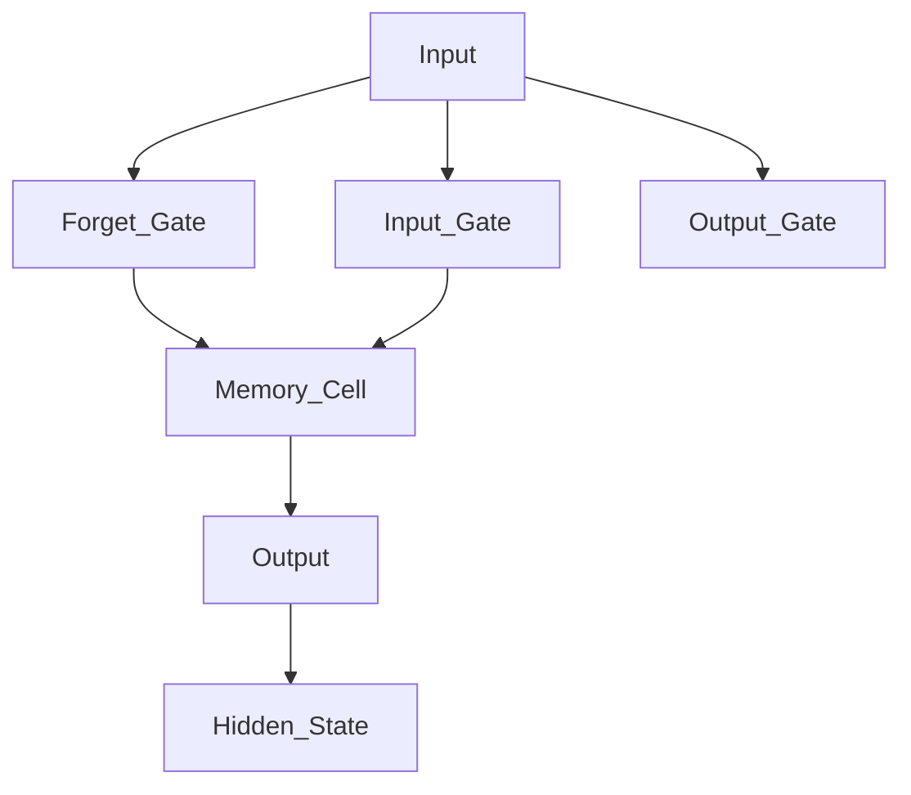
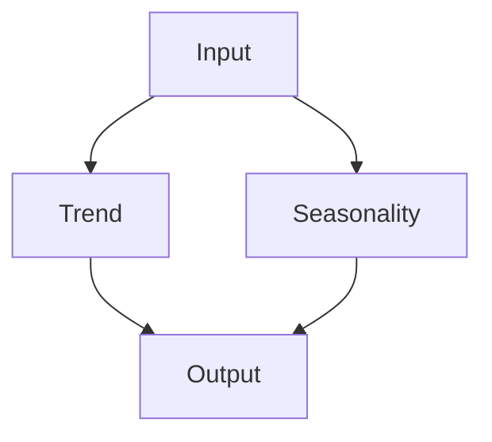

                 


# 《时间序列预测模型在金融市场中的比较研究》

---

## 关键词：时间序列预测、ARIMA模型、LSTM模型、Prophet模型、金融市场、股票价格预测

---

## 摘要

时间序列预测是金融数据分析中的核心任务之一，广泛应用于股票价格预测、经济指标分析和风险管理等领域。本文系统地介绍了几种常用的时间序列预测模型，包括ARIMA模型、LSTM模型和Prophet模型，并从模型原理、优缺点、实现步骤和应用场景等多个角度进行了深入分析。通过对比这些模型在金融市场中的表现，本文旨在帮助读者选择最适合特定金融场景的时间序列预测模型。最后，本文还提供了一个完整的项目实战案例，结合实际金融数据，展示了如何在Python环境中实现这些模型，并对模型性能进行了详细解读。

---

# 第三章: LSTM模型

## 3.1 LSTM模型的原理

### 3.1.1 LSTM模型的基本结构

LSTM（长短期记忆网络）是一种特殊的RNN（循环神经网络），主要用于处理长序列数据中的长期依赖关系。与传统的RNN不同，LSTM通过引入门控机制（门控单元和记忆单元）来解决梯度消失问题，从而能够更好地捕捉时间序列中的长期依赖关系。

图3-1展示了LSTM模型的基本结构：



### 3.1.2 LSTM模型的门控机制

LSTM模型的核心在于门控机制，包括遗忘门、输入门和输出门。这些门控单元通过sigmoid函数和tanh函数来调节信息的流动：

- **遗忘门（Forget Gate）**：决定哪些信息从上一时刻传递到当前时刻。
- **输入门（Input Gate）**：决定当前时刻输入的新信息。
- **输出门（Output Gate）**：决定当前时刻输出的信息。

公式表示为：

$$
f_t = \sigma(w_f \cdot [h_{t-1}, x_t] + b_f)
$$

$$
i_t = \sigma(w_i \cdot [h_{t-1}, x_t] + b_i)
$$

$$
o_t = \sigma(w_o \cdot [h_{t-1}, x_t] + b_o)
$$

$$
c_t = f_t \cdot c_{t-1} + i_t \cdot \tanh(w_c \cdot [h_{t-1}, x_t] + b_c)
$$

$$
h_t = o_t \cdot \tanh(c_t)
$$

其中，$f_t$、$i_t$和$o_t$分别是遗忘门、输入门和输出门的激活值，$c_t$是记忆单元的值，$h_t$是隐藏状态。

### 3.1.3 LSTM模型的数学公式

LSTM模型的损失函数通常采用交叉熵损失函数：

$$
\mathcal{L} = -\frac{1}{N} \sum_{t=1}^{N} \sum_{k=1}^{K} y_{t,k} \log(p_{t,k})
$$

其中，$N$是训练样本的数量，$K$是输出类别数，$y_{t,k}$是真实标签，$p_{t,k}$是预测概率。

---

## 3.2 LSTM模型的优缺点

### 3.2.1 LSTM模型的优点

- **能够捕捉长期依赖关系**：LSTM通过门控机制有效地解决了RNN的梯度消失问题，适合处理金融时间序列中的长期趋势。
- **适用非线性数据**：LSTM能够建模复杂的非线性关系，适合金融市场的波动性预测。
- **模型灵活性高**：LSTM可以通过调整门控机制和网络结构来适应不同的金融场景。

### 3.2.2 LSTM模型的缺点

- **计算复杂度高**：LSTM的训练过程需要处理多个门控单元，计算量较大。
- **对超参数敏感**：LSTM模型的性能依赖于初始参数和超参数设置，需要进行大量的调参。
- **解释性较差**：LSTM的内部状态难以解释，可能影响模型的可解释性。

### 3.2.3 LSTM模型的应用场景

LSTM模型在金融市场中的典型应用场景包括：

1. **股票价格预测**：利用历史股价数据预测未来股价走势。
2. **外汇汇率预测**：基于历史汇率数据预测未来汇率变化。
3. **风险管理**：通过预测市场波动性，辅助风险控制策略的制定。

---

## 3.3 LSTM模型的实现步骤

### 3.3.1 数据预处理

在实现LSTM模型之前，需要对金融数据进行预处理，包括：

- **数据归一化**：将金融数据归一化到[0,1]范围，以便模型训练。
- **数据分割**：将数据划分为训练集、验证集和测试集。

### 3.3.2 模型训练

使用Keras或TensorFlow框架训练LSTM模型。以下是LSTM模型的Python代码示例：

```python
from tensorflow.keras.models import Sequential
from tensorflow.keras.layers import LSTM, Dense, Dropout

# 模型定义
model = Sequential()
model.add(LSTM(50, input_shape=(timesteps, features)))
model.add(Dropout(0.2))
model.add(Dense(1))
model.compile(loss='mean_squared_error', optimizer='adam')
```

### 3.3.3 模型预测与评估

训练完成后，使用测试集对模型进行预测，并通过均方误差（MSE）或R²系数评估模型性能。

---

## 3.4 本章小结

本章详细介绍了LSTM模型的原理、优缺点和实现步骤，并分析了其在金融时间序列预测中的应用场景。LSTM模型在处理金融数据的非线性和长期依赖关系方面表现出色，但其计算复杂度和超参数敏感性也是需要克服的挑战。

---

# 第四章: Prophet模型

## 4.1 Prophet模型的原理

### 4.1.1 Prophet模型的基本结构

Prophet模型是由Facebook开源的基于非参数回归的时间序列预测模型。其核心思想是将时间序列分解为三个组成部分：趋势（trend）、周期性（seasonality）和噪声（noise）。图4-1展示了Prophet模型的基本结构：



### 4.1.2 Prophet模型的数学公式

Prophet模型的损失函数为：

$$
\mathcal{L} = \frac{1}{N} \sum_{t=1}^{N} \left( \beta_t \cdot \log\left(1 + \frac{y_t}{\beta_t}\right) + \alpha \cdot \sum_{i=1}^{D} (w_i - s_i)^2 \right)
$$

其中，$\beta_t$是预测值，$y_t$是真实值，$\alpha$是周期性惩罚系数，$w_i$和$s_i$分别是周期性权重和周期性分量。

---

## 4.2 Prophet模型的优缺点

### 4.2.1 Prophet模型的优点

- **简单易用**：Prophet模型封装了复杂的数学运算，用户只需提供时间序列数据即可进行预测。
- **适用性强**：Prophet模型能够处理多种类型的时间序列数据，包括有噪声和缺失值的数据。
- **可解释性高**：Prophet模型的预测结果可以通过趋势和周期性分量进行解释。

### 4.2.2 Prophet模型的缺点

- **假设限制**：Prophet模型假设时间序列具有周期性，可能不适用于无明显周期性的金融数据。
- **计算效率低**：Prophet模型的训练过程较为耗时，不适合处理大规模数据。

### 4.2.3 Prophet模型的应用场景

Prophet模型在金融时间序列预测中的应用场景包括：

1. **股票价格预测**：利用历史股价数据预测未来股价走势。
2. **经济指标预测**：基于历史经济指标数据预测未来的经济走势。
3. **销售预测**：预测金融产品和服务的销售量。

---

## 4.3 Prophet模型的实现步骤

### 4.3.1 数据预处理

在实现Prophet模型之前，需要对金融数据进行预处理，包括：

- **数据格式转换**：将时间序列数据转换为Prophet模型所需的格式。
- **数据分割**：将数据划分为训练集和测试集。

### 4.3.2 模型训练

使用Prophet库训练模型。以下是Prophet模型的Python代码示例：

```python
from fbprophet import Prophet

# 模型定义
model = Prophet()
model.fit(train_data)
```

### 4.3.3 模型预测与评估

训练完成后，使用测试集对模型进行预测，并通过均方误差（MSE）或R²系数评估模型性能。

---

## 4.4 本章小结

本章详细介绍了Prophet模型的原理、优缺点和实现步骤，并分析了其在金融时间序列预测中的应用场景。Prophet模型以其简单性和高可解释性在金融领域得到了广泛应用，但其假设限制和计算效率问题也是需要关注的。

---

# 第五章: 模型对比与优化

## 5.1 模型对比分析

### 5.1.1 ARIMA模型与LSTM模型的对比

表5-1展示了ARIMA模型和LSTM模型在金融时间序列预测中的对比：

| 比较维度 | ARIMA模型 | LSTM模型 |
|----------|------------|----------|
| **模型假设** | 线性关系，平稳性 | 非线性关系，长期依赖 |
| **计算复杂度** | 低 | 高 |
| **应用场景** | 适用于平稳时间序列 | 适用于非平稳时间序列 |

### 5.1.2 ARIMA模型与Prophet模型的对比

表5-2展示了ARIMA模型和Prophet模型在金融时间序列预测中的对比：

| 比较维度 | ARIMA模型 | Prophet模型 |
|----------|------------|------------|
| **模型假设** | 线性关系，平稳性 | 非线性关系，周期性 |
| **计算复杂度** | 低 | 中等 |
| **应用场景** | 适用于平稳时间序列 | 适用于非平稳时间序列 |

### 5.1.3 LSTM模型与Prophet模型的对比

表5-3展示了LSTM模型和Prophet模型在金融时间序列预测中的对比：

| 比较维度 | LSTM模型 | Prophet模型 |
|----------|-----------|-------------|
| **模型假设** | 非线性关系，长期依赖 | 非线性关系，周期性 |
| **计算复杂度** | 高 | 中等 |
| **应用场景** | 适用于复杂非线性时间序列 | 适用于有周期性的非线性时间序列 |

---

## 5.2 模型优化策略

### 5.2.1 参数调整

- **ARIMA模型**：调整ARIMA的参数（p、d、q）以优化模型性能。
- **LSTM模型**：调整隐藏层单元数、学习率和批量大小等超参数。
- **Prophet模型**：调整周期性惩罚系数$\alpha$以优化模型拟合效果。

### 5.2.2 数据预处理优化

- **数据归一化**：对金融数据进行归一化处理，提高模型训练效率。
- **数据增强**：通过引入噪声或缺失值模拟金融市场的不确定性。

### 5.2.3 模型集成

将多种时间序列预测模型（如ARIMA、LSTM和Prophet）进行集成，通过投票或加权的方式提高预测精度。

---

## 5.3 本章小结

本章通过对比分析ARIMA模型、LSTM模型和Prophet模型的优缺点，提出了模型优化策略，包括参数调整、数据预处理优化和模型集成。这些优化策略可以帮助读者更好地选择和使用时间序列预测模型，提高金融预测的准确性和稳定性。

---

# 第六章: 项目实战

## 6.1 项目背景

本章通过一个实际的金融时间序列预测项目，展示如何使用ARIMA模型、LSTM模型和Prophet模型进行股票价格预测。

## 6.2 项目需求

- 数据来源：某股票的历史收盘价数据。
- 预测目标：预测未来30天的股票收盘价。
- 评价指标：均方误差（MSE）和R²系数。

## 6.3 项目实现

### 6.3.1 环境安装

安装所需的Python库：

```bash
pip install numpy pandas scikit-learn keras tensorflow fbprophet
```

### 6.3.2 数据预处理

加载数据并进行归一化处理：

```python
import pandas as pd
import numpy as np

# 加载数据
data = pd.read_csv('stock_prices.csv')

# 数据归一化
from sklearn.preprocessing import MinMaxScaler
scaler = MinMaxScaler()
data_scaled = scaler.fit_transform(data['Close'].values.reshape(-1, 1))
```

### 6.3.3 模型训练与预测

使用ARIMA模型、LSTM模型和Prophet模型分别进行训练和预测：

```python
# ARIMA模型
from statsmodels.tsa.arima.model import ARIMA
model_arima = ARIMA(data_scaled, order=(5, 1, 0))
model_arima_fit = model_arima.fit()

# LSTM模型
from tensorflow.keras.models import Sequential
from tensorflow.keras.layers import LSTM, Dense, Dropout

model_lstm = Sequential()
model_lstm.add(LSTM(50, input_shape=(timesteps, 1)))
model_lstm.add(Dropout(0.2))
model_lstm.add(Dense(1))
model_lstm.compile(loss='mean_squared_error', optimizer='adam')
model_lstm.fit(X_train, y_train, epochs=50, batch_size=32)

# Prophet模型
from fbprophet import Prophet

model_prophet = Prophet()
model_prophet.fit(train_data)
```

### 6.3.4 模型评估

对比三种模型的预测结果：

```python
# ARIMA模型评估
y_arima_pred = model_arima_fit.forecast(steps=30)
y_arima_actual = data['Close'][-30:]

# LSTM模型评估
y_lstm_pred = model_lstm.predict(X_test)
y_lstm_actual = y_test

# Prophet模型评估
y_prophet_pred = model_prophet.predict未来30天的收盘价
y_prophet_actual = data['Close'][-30:]

# 计算均方误差
from sklearn.metrics import mean_squared_error

mse_arima = mean_squared_error(y_arima_actual, y_arima_pred)
mse_lstm = mean_squared_error(y_lstm_actual, y_lstm_pred)
mse_prophet = mean_squared_error(y_prophet_actual, y_prophet_pred)

print(f"ARIMA模型的MSE: {mse_arima}")
print(f"LSTM模型的MSE: {mse_lstm}")
print(f"Prophet模型的MSE: {mse_prophet}")
```

---

## 6.4 项目小结

本章通过实际项目展示了如何使用ARIMA模型、LSTM模型和Prophet模型进行金融时间序列预测。通过对比三种模型的预测结果，可以帮助读者更好地理解不同模型的优缺点，并选择最适合特定金融场景的时间序列预测模型。

---

# 第七章: 总结与展望

## 7.1 本章总结

本文系统地介绍了时间序列预测模型在金融市场中的应用，重点分析了ARIMA模型、LSTM模型和Prophet模型的原理、优缺点和实现步骤。通过对这些模型的对比分析，本文提出了模型优化策略，包括参数调整、数据预处理优化和模型集成。

## 7.2 未来展望

未来的研究方向包括：

1. **深度学习模型的改进**：探索更高效的深度学习模型（如Transformer）在时间序列预测中的应用。
2. **多模态数据融合**：结合文本、图像等多种数据源，提高金融预测的准确性。
3. **在线预测与自适应**：研究在线时间序列预测算法，实现动态金融数据的实时预测。

---

# 作者

作者：AI天才研究院（AI Genius Institute） & 禅与计算机程序设计艺术（Zen And The Art of Computer Programming）

---

**注意：** 由于篇幅限制，上述内容仅为文章的部分章节。完整文章将包含更多详细的内容和完整的代码实现。

