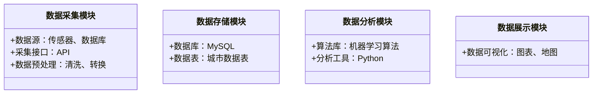

                 


# 智慧城市建设中的投资机会挖掘

> 关键词：智慧城市建设、投资机会、智慧城市规划、数字技术应用、智慧城市系统架构、人工智能技术、大数据分析

> 摘要：智慧城市建设是当前城市化进程中的重要趋势，依托数字技术的应用和智能化服务的创新，投资机会广泛存在于数据、技术和场景应用等多个层面。本文系统分析智慧城市建设的核心概念、关键技术、算法原理、系统架构，并通过实际案例探讨投资机会的挖掘方法，帮助投资者和相关人员把握智慧城市建设的机遇。

---

# 第一部分：智慧城市建设背景与投资机会概述

## 第1章：智慧城市建设的背景与现状

### 1.1 智慧城市的定义与核心概念

#### 1.1.1 智慧城市的定义
智慧城市建设是以信息技术为核心驱动力，通过数据的采集、处理和应用，构建智能化的城市管理系统，提升城市运行效率和居民生活质量。智慧城市不仅仅是技术的堆砌，更是城市管理和服务模式的创新。

#### 1.1.2 智慧城市的核心要素
智慧城市的核心要素包括：
- **数据**：数据是智慧城市的“血液”，贯穿整个城市系统的运行。
- **技术**：包括大数据、人工智能、物联网、云计算等技术支撑。
- **服务**：智能化的服务模式，如智能交通、智慧医疗、智慧教育等。
- **政策**：政府政策和市场机制的结合，推动智慧城市建设。

#### 1.1.3 智慧城市与传统城市的主要区别
智慧城市与传统城市的区别主要体现在以下几个方面：
- **数据驱动**：智慧城市依赖于数据的采集和分析，而传统城市主要依赖人工管理和经验。
- **智能化服务**：智慧城市提供个性化的服务，而传统城市的服务模式较为固定。
- **技术支撑**：智慧城市借助先进的数字技术，而传统城市主要依靠物理基础设施。

### 1.2 智慧城市建设的背景与驱动因素

#### 1.2.1 全球城市化进程的加速
随着全球城市化进程的加快，城市人口不断增加，城市资源的紧张和环境问题日益突出，智慧城市建设成为解决这些问题的重要途径。

#### 1.2.2 数字化与智能化技术的推动
大数据、人工智能、物联网等技术的快速发展，为智慧城市建设提供了强大的技术支撑。

#### 1.2.3 政府政策与社会资本的结合
政府通过政策引导和资金支持，吸引了大量社会资本参与智慧城市建设，形成了多方共赢的局面。

### 1.3 智慧城市建设的现状与发展趋势

#### 1.3.1 国际智慧城市建设现状
国际上，许多国家和地区已经开始智慧城市建设，如新加坡的“智慧国家2025”计划、韩国的首尔智慧城市项目等。

#### 1.3.2 我国智慧城市建设的现状
我国的智慧城市建设起步较晚，但发展迅速。许多城市已经启动了智慧交通、智慧医疗等项目，但在数据共享和系统集成方面仍面临挑战。

#### 1.3.3 智慧城市建设的未来发展趋势
未来，智慧城市建设将更加注重数据的深度应用和智能化服务的创新，同时更加注重城市的可持续发展。

### 1.4 智慧城市建设中的投资机会

#### 1.4.1 投资机会的背景与来源
智慧城市建设的投资机会主要来源于技术的进步和市场需求的增长。

#### 1.4.2 投资机会的核心领域
- **数据采集与处理**：如传感器网络、数据存储与分析。
- **智能化服务**：如智能交通、智慧医疗、智慧教育。
- **系统集成与运营**：如智慧城市平台的建设和运营。

#### 1.4.3 投资机会的潜力与风险
智慧城市建设的潜力巨大，但同时也面临技术风险、市场需求变化和政策不确定性等风险。

### 1.5 本章小结
本章详细介绍了智慧城市建设的背景、现状、核心要素以及投资机会，为后续章节的分析奠定了基础。

---

## 第2章：智慧城市建设中的核心概念与联系

### 2.1 智慧城市的核心概念

#### 2.1.1 数据驱动的智慧城市
数据是智慧城市的“血液”，贯穿整个城市系统的运行。

#### 2.1.2 数字化基础设施的重要性
数字化基础设施是智慧城市建设的基础，包括传感器、网络、数据中心等。

#### 2.1.3 智能化服务的创新模式
智能化服务通过数据的深度应用，提供个性化的城市服务。

### 2.2 智慧城市中的关键技术

#### 2.2.1 大数据技术
大数据技术在智慧城市建设中的应用包括数据的采集、存储、分析和挖掘。

#### 2.2.2 人工智能技术
人工智能技术在智慧城市建设中的应用包括智能识别、预测和决策支持。

#### 2.2.3 物联网技术
物联网技术通过传感器和网络实现城市设施的智能化监控和管理。

#### 2.2.4 云计算技术
云计算技术为智慧城市建设提供了弹性的计算资源和高效的数据处理能力。

### 2.3 智慧城市中的核心要素对比分析

#### 2.3.1 数据与技术的对比
数据是智慧城市建设的基础，而技术是实现数据价值的核心。

#### 2.3.2 服务与应用的对比
服务是智慧城市建设的最终目标，而应用是实现服务的技术手段。

#### 2.3.3 政策与市场的对比
政策是智慧城市建设的引导力量，而市场是智慧城市建设的推动力。

### 2.4 智慧城市系统的ER实体关系图

```mermaid
er
actor(投资者, "投资者在智慧城市建设中的角色")
actor(政府, "政府在智慧城市建设中的角色")
actor(企业, "企业在智慧城市建设中的角色")
actor(用户, "用户在智慧城市建设中的角色")
```

---

## 第3章：智慧城市建设中的算法原理与数学模型

### 3.1 数据驱动的智慧城市算法

#### 3.1.1 机器学习算法
机器学习算法在智慧城市建设中的应用包括智能分类、预测和推荐。

#### 3.1.2 大数据分析算法
大数据分析算法在智慧城市建设中的应用包括数据清洗、特征提取和模式识别。

#### 3.1.3 人工智能算法
人工智能算法在智慧城市建设中的应用包括自然语言处理、图像识别和智能决策。

#### 3.1.4 算法流程图

```mermaid
graph TD
    A[开始] -> B[数据采集]
    B -> C[数据预处理]
    C -> D[特征提取]
    D -> E[模型训练]
    E -> F[模型评估]
    F -> G[结束]
```

#### 3.1.5 算法实现代码
以下是一个简单的机器学习算法实现代码示例：

```python
import numpy as np
from sklearn.linear_model import LinearRegression

# 数据准备
X = np.array([[1], [2], [3], [4], [5]])
y = np.array([2, 4, 5, 4, 8])

# 模型训练
model = LinearRegression()
model.fit(X, y)

# 预测
print(model.predict([[6]]))
```

---

## 第4章：系统分析与架构设计方案

### 4.1 系统分析

#### 4.1.1 问题场景介绍
智慧城市建设中的数据管理系统需要实现数据的采集、存储、分析和展示。

#### 4.1.2 项目介绍
本项目旨在构建一个智慧城市数据管理平台，实现城市数据的高效管理和应用。

### 4.2 系统功能设计

#### 4.2.1 领域模型设计



### 4.3 系统架构设计

#### 4.3.1 系统架构图

```mermaid
graph TD
    A[用户] -> B[数据展示模块]
    B -> C[数据分析模块]
    C -> D[数据存储模块]
    D -> E[数据采集模块]
```

---

## 第5章：项目实战

### 5.1 智慧交通项目

#### 5.1.1 环境安装
安装Python、Jupyter Notebook、scikit-learn等工具。

#### 5.1.2 系统核心实现

```python
import pandas as pd
from sklearn.model_selection import train_test_split
from sklearn.linear_model import LinearRegression
from sklearn.metrics import mean_squared_error

# 数据加载
data = pd.read_csv('traffic_data.csv')

# 数据预处理
X = data[['time', 'weather']]
y = data['traffic_volume']

# 数据分割
X_train, X_test, y_train, y_test = train_test_split(X, y, test_size=0.2, random_state=42)

# 模型训练
model = LinearRegression()
model.fit(X_train, y_train)

# 预测与评估
y_pred = model.predict(X_test)
print(mean_squared_error(y_test, y_pred))
```

---

## 第6章：总结与展望

### 6.1 投资机会总结
智慧城市建设中的投资机会主要集中在数据技术、人工智能和系统集成等领域。

### 6.2 注意事项
投资者在选择投资项目时，应充分考虑技术风险和市场需求。

### 6.3 拓展阅读
建议读者进一步阅读相关技术书籍和行业报告，深入了解智慧城市建设的最新动态。

---

# 结语

智慧城市建设是一项复杂的系统工程，需要技术、政策和市场的多方协作。通过本文的分析，读者可以更好地把握智慧城市建设中的投资机会，为未来的投资决策提供参考。

---

作者：AI天才研究院/AI Genius Institute & 禅与计算机程序设计艺术 /Zen And The Art of Computer Programming

