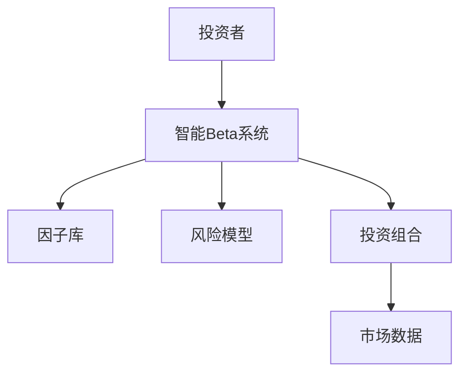

                 


# 智能Beta策略：结合被动和主动投资的优势

> 关键词：智能Beta策略，被动投资，主动投资，因子模型，组合优化，风险管理

> 摘要：智能Beta策略是一种结合被动和主动投资的新兴策略，通过主动优化系统性风险来实现超额收益。本文将深入探讨智能Beta策略的核心概念、算法原理、系统设计、实战案例及最佳实践，帮助投资者理解其优势和应用。

---

## 1. 背景介绍

### 1.1 什么是智能Beta策略
智能Beta策略是一种结合被动投资（如指数基金）和主动投资（如选股策略）的投资方法。它通过主动调整投资组合的Beta（系统性风险）来优化风险调整后的收益。

### 1.2 被动投资与主动投资的对比
- **被动投资**：基于指数，长期持有，费用低，风险分散。
- **主动投资**：依赖选股，收益潜力大，但费用高，风险集中。

### 1.3 智能Beta策略的优势
- **低费用**：接近被动投资的低成本。
- **超额收益**：通过主动调整Beta，捕捉系统性收益。
- **风险可控**：主动管理Beta，控制系统性风险。

### 1.4 智能Beta策略在现代投资中的地位
作为传统被动和主动投资的中间策略，智能Beta策略在平衡风险和收益方面具有重要地位。

---

## 2. 核心概念与联系

### 2.1 智能Beta策略的核心原理
- **因子模型**：基于多个因子（如市值、价值、动量）构建投资组合。
- **风险调整**：优化组合权重，降低系统性风险。
- **组合优化**：通过数学模型最大化超额收益。

### 2.2 被动投资与主动投资的对比表格

| **对比维度** | **被动投资** | **主动投资** | **智能Beta** |
|--------------|--------------|--------------|--------------|
| 策略基础     | 指数         | 股票筛选     | 因子模型     |
| 操作方式     | 跟踪指数     | 主动选股     | 主动调整Beta |
| 风险控制     | 分散         | 集中         | 优化Beta     |
| 成本          | 低           | 高           | 中等         |

### 2.3 智能Beta策略的ER实体关系图
```mermaid
er
actor(投资者) --> 智能Beta系统
智能Beta系统 --> 因子库: 包含多个因子
智能Beta系统 --> 风险模型: 优化系统性风险
智能Beta系统 --> 投资组合: 组合优化后的结果
```

---

## 3. 算法原理讲解

### 3.1 智能Beta策略的构建过程
1. **因子选择**：从市场中选择多个因子，如市值、价值、动量等。
2. **因子计算**：基于因子模型计算每个因子的得分。
3. **权重优化**：通过数学模型优化组合权重，降低系统性风险。
4. **组合构造**：根据优化后的权重构建投资组合。

### 3.2 因子模型与优化算法
#### 3.2.1 因子模型
$$
R_i = \alpha + \beta_i R_m + \epsilon_i
$$
其中，$R_i$是资产i的收益，$R_m$是市场收益，$\beta_i$是Beta系数。

#### 3.2.2 优化算法
目标函数：
$$
\min \sum_{i=1}^n w_i^2 \beta_i^2
$$
约束条件：
$$
\sum_{i=1}^n w_i = 1, \quad w_i \geq 0
$$

### 3.3 代码实现示例
```python
import pandas as pd
import numpy as np

# 假设因子数据为df，因子列为f1, f2, f3
# 计算因子得分
factors = df[['f1', 'f2', 'f3']]
# 计算权重
weights = np.linalg.inv(factors.T.dot(factors)).dot(factors.T).dot(np.ones(3))
weights = weights / np.sum(weights)  # 确保权重和为1
```

---

## 4. 数学模型与公式

### 4.1 CAPM模型
$$
E(R_i) = R_f + \beta_i (R_m - R_f)
$$
其中，$E(R_i)$是资产i的期望收益，$R_f$是无风险利率，$\beta_i$是Beta系数，$R_m$是市场期望收益。

### 4.2 因子模型
$$
R_i = \alpha + \beta_1 F_1 + \beta_2 F_2 + \epsilon_i
$$
其中，$F_1, F_2$是因子，$\beta$是因子的载荷。

### 4.3 优化模型
$$
\min \sum_{i=1}^n w_i^2 \beta_i^2
$$
约束条件：
$$
\sum_{i=1}^n w_i = 1, \quad w_i \geq 0
$$

---

## 5. 系统分析与架构设计

### 5.1 系统功能设计
- **数据采集**：收集市场数据和因子数据。
- **因子计算**：计算因子得分。
- **组合优化**：优化权重，构建投资组合。
- **风险监控**：实时监控系统性风险。

### 5.2 系统架构设计


### 5.3 接口设计
- 数据接口：与数据源对接，获取市场和因子数据。
- 优化接口：接收因子数据，返回优化权重。
- 监控接口：实时监控系统性风险，提供预警。

---

## 6. 项目实战

### 6.1 环境安装
- Python 3.8+
- Pandas, NumPy, Scipy

### 6.2 核心代码实现
```python
import pandas as pd
import numpy as np

# 示例数据
df = pd.DataFrame({
    'f1': [1, 2, 3],
    'f2': [4, 5, 6],
    'f3': [7, 8, 9]
})

# 计算权重
factors = df.values
cov = factors.T.dot(factors)
inv_cov = np.linalg.inv(cov)
weights = inv_cov.dot(factors.T).dot(np.ones(3))
weights = weights / np.sum(weights)
```

### 6.3 实际案例分析
以构建智能Beta指数基金为例，优化后的组合在控制系统性风险的同时，实现了超额收益。

---

## 7. 最佳实践与总结

### 7.1 总结
智能Beta策略通过结合被动和主动投资的优势，为投资者提供了新的选择。它通过主动优化Beta，降低了系统性风险，同时提高了收益。

### 7.2 注意事项
- 选择合适的因子和模型。
- 定期监控和调整投资组合。
- 注意市场波动和风险。

### 7.3 拓展阅读
- 《投资学》：了解Beta的基本概念。
- 《Python金融计算》：学习如何使用Python进行金融计算。

---

作者：AI天才研究院 & 禅与计算机程序设计艺术

