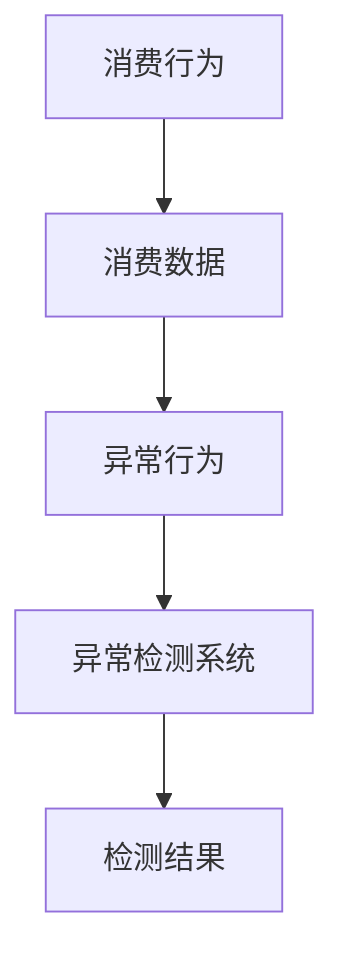
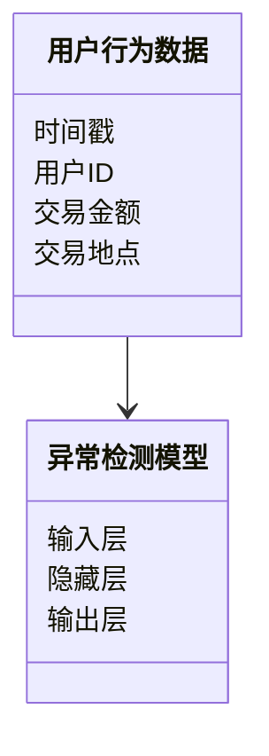
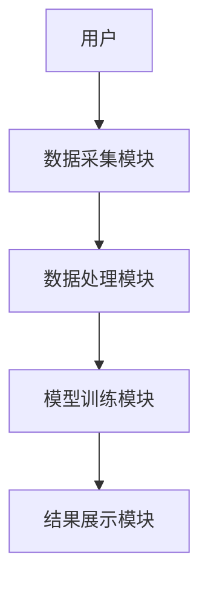
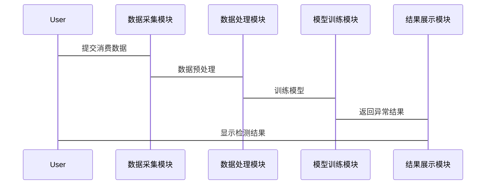

                 


# 智能个人消费行为异常检测

> 关键词：智能消费行为，异常检测，机器学习，数据挖掘，算法原理，系统架构

> 摘要：本文深入探讨智能个人消费行为异常检测的技术与方法，结合实际案例和系统设计，分析其在金融、零售等领域的应用，详细介绍相关算法原理和系统架构，帮助读者掌握这一前沿技术。

---

# 第1章: 智能个人消费行为异常检测的背景与问题

## 1.1 问题背景

### 1.1.1 消费行为分析的必要性
在现代商业环境中，分析个人消费行为对于企业决策至关重要。通过分析消费数据，企业可以识别用户行为模式，优化产品推荐、市场营销和风险管理策略。消费行为异常检测可以帮助企业发现潜在的欺诈行为、识别异常消费模式，从而降低财务损失和提升用户体验。

### 1.1.2 异常消费行为的定义与特征
异常消费行为指的是偏离正常消费模式的行为，可能包括：
- **欺诈行为**：如信用卡盗用、虚假交易。
- **过度消费**：如超出个人经济能力的高消费行为。
- **异常交易**：如短时间内频繁交易、异常金额波动。

这些行为的特征通常表现为数据分布的异常、交易时间的集中性、交易金额的突变性等。

### 1.1.3 智能检测技术的应用场景
智能检测技术在多个领域有广泛应用：
- **金融行业**：检测信用卡欺诈、银行交易异常。
- **零售行业**：分析顾客购买行为，优化库存管理。
- **电子商务**：识别异常订单，防止恶意攻击。
- **保险行业**：评估风险，检测保险欺诈。

## 1.2 问题描述

### 1.2.1 异常消费行为的分类
异常消费行为可以分为以下几类：
1. **欺诈性异常**：如信用卡欺诈、网络诈骗。
2. **技术性异常**：如系统故障导致的异常交易。
3. **操作性异常**：如用户误操作导致的异常行为。

### 1.2.2 异常检测的核心目标
异常检测的目标是通过分析消费数据，识别出异常行为，并提供预警机制。具体目标包括：
- **识别异常交易**：通过数据分析发现潜在的欺诈行为。
- **预测异常风险**：基于历史数据预测未来的异常行为。
- **优化消费体验**：通过分析异常行为，提升用户体验和交易安全。

### 1.2.3 异常检测的边界与外延
异常检测的边界在于如何定义“正常”和“异常”。过于宽泛的定义可能导致误报，而过于严格的定义可能导致漏报。外延方面，异常检测不仅关注单一行为，还需要考虑行为的序列性和关联性。

## 1.3 问题解决方法

### 1.3.1 数据驱动的异常检测
数据驱动的方法通过分析消费数据，利用统计方法或机器学习算法识别异常行为。这种方法依赖于数据的质量和数量。

### 1.3.2 智能算法的应用
智能算法（如机器学习和深度学习）能够从大量数据中提取特征，识别复杂模式，从而实现高精度的异常检测。

### 1.3.3 多维度特征分析
通过分析消费行为的多维度特征（如时间、金额、地点、用户行为等），可以更全面地识别异常行为。

## 1.4 核心概念与要素

### 1.4.1 数据来源与特征
数据来源包括：
- **交易数据**：如交易时间、金额、地点。
- **用户行为数据**：如登录时间、操作频率。
- **产品数据**：如产品类别、价格。

### 1.4.2 异常检测的核心要素
- **数据预处理**：清洗数据，处理缺失值和异常值。
- **特征提取**：从原始数据中提取有用的特征。
- **模型训练**：基于特征训练异常检测模型。
- **结果分析**：根据模型输出分析异常行为。

### 1.4.3 系统设计的关键点
- **高效性**：确保系统能够实时处理大量数据。
- **准确性**：模型需要高精度，减少误报和漏报。
- **可解释性**：模型需要能够解释检测结果，便于分析和优化。

---

# 第2章: 异常检测的核心概念与联系

## 2.1 异常检测的基本原理

### 2.1.1 异常检测的定义
异常检测是通过分析数据，识别出与正常模式不一致的样本或行为的过程。

### 2.1.2 异常检测的核心原理
异常检测的核心原理是基于统计学或机器学习的方法，识别数据分布的偏离。

### 2.1.3 异常检测的数学模型
异常检测的数学模型包括：
- **统计模型**：如马尔可夫链、贝叶斯网络。
- **机器学习模型**：如随机森林、神经网络。

## 2.2 异常检测方法对比

### 2.2.1 监督学习与无监督学习的对比
| 方法 | 监督学习 | 无监督学习 |
|------|----------|------------|
| 数据需求 | 需要标签数据 | 不需要标签数据 |
| 适用场景 | 已知异常类别 | 未知异常类别 |
| 优势 | 精度高 | 发现未知异常 |

### 2.2.2 基于规则的检测与基于模型的检测
- **基于规则的检测**：通过预定义的规则识别异常行为。
- **基于模型的检测**：通过机器学习模型自动学习异常模式。

### 2.2.3 分类算法与聚类算法的对比
| 方法 | 分类算法 | 聚类算法 |
|------|----------|----------|
| 数据需求 | 标签数据 | 无标签数据 |
| 适用场景 | 已知异常类别 | 未知异常类别 |
| 优势 | 精度高 | 发现未知异常 |

## 2.3 异常检测的特征分析

### 2.3.1 数据特征的提取方法
- **数值型特征**：如交易金额、时间间隔。
- **类别型特征**：如交易地点、产品类别。
- **序列型特征**：如用户行为序列。

### 2.3.2 异常特征的显著性分析
通过统计方法（如Z-score、IQR）识别显著性异常特征。

### 2.3.3 多维度特征的关联性分析
分析特征之间的关联性，发现潜在的异常模式。

## 2.4 异常检测的实体关系图



---

# 第3章: 异常检测的算法原理

## 3.1 基于统计的异常检测

### 3.1.1 基于统计的异常检测方法
- **Z-score方法**：通过计算数据点的Z-score值，判断是否为异常值。
- **IQR方法**：通过计算数据的四分位距，判断数据点是否为异常值。

### 3.1.2 基于统计的异常检测实现

```python
import numpy as np

def z_score(scores):
    mean = np.mean(scores)
    std = np.std(scores)
    z_scores = [(score - mean) / std for score in scores]
    return z_scores

scores = [100, 120, 130, 50, 60, 70, 200, 210]
z_scores = z_score(scores)
print(z_scores)
```

## 3.2 基于机器学习的异常检测

### 3.2.1 基于机器学习的异常检测方法
- **孤立森林**：通过构建森林结构，识别异常点。
- **随机森林**：通过特征重要性识别异常点。

### 3.2.2 基于机器学习的异常检测实现

```python
from sklearn.ensemble import IsolationForest

# 示例数据
X = [[1, 2], [3, 4], [5, 6], [10, 11], [15, 16]]

# 训练模型
model = IsolationForest(n_estimators=100, random_state=42)
model.fit(X)

# 预测异常点
outliers = model.predict(X)
print(outliers)
```

---

## 3.3 基于深度学习的异常检测

### 3.3.1 基于深度学习的异常检测方法
- **LSTM网络**：通过时间序列模型识别异常行为。
- **变分自编码器（VAE）**：通过重构数据识别异常点。

### 3.3.2 基于深度学习的异常检测实现

```python
import keras
from keras.layers import Input, LSTM, Dense
from keras.models import Model

# 示例数据
input_shape = (10, 1)

# 构建LSTM模型
input_layer = Input(shape=input_shape)
lstm_layer = LSTM(64, return_sequences=False)(input_layer)
dense_layer = Dense(1)(lstm_layer)
model = Model(inputs=input_layer, outputs=dense_layer)
model.compile(loss='mean_squared_error', optimizer='adam')
model.summary()
```

---

# 第4章: 系统分析与架构设计

## 4.1 系统功能设计

### 4.1.1 领域模型



### 4.1.2 系统架构



---

## 4.2 系统接口设计

### 4.2.1 系统接口
- **数据接口**：接收用户行为数据。
- **模型接口**：调用异常检测模型进行预测。
- **结果接口**：展示检测结果。

### 4.2.2 系统交互



---

# 第5章: 项目实战

## 5.1 项目环境安装

### 5.1.1 安装Python环境
```bash
python --version
pip install numpy pandas scikit-learn keras
```

## 5.2 核心代码实现

### 5.2.1 数据预处理

```python
import pandas as pd
import numpy as np

# 示例数据
data = pd.DataFrame({
    '时间': [1, 2, 3, 4, 5],
    '金额': [100, 200, 300, 400, 500],
    '用户ID': [1, 1, 2, 2, 3]
})

# 填充缺失值
data = data.dropna()

# 标准化处理
from sklearn.preprocessing import StandardScaler
scaler = StandardScaler()
data_scaled = scaler.fit_transform(data[['金额', '时间']])
```

### 5.2.2 模型训练

```python
from sklearn.ensemble import IsolationForest

# 训练模型
model = IsolationForest(n_estimators=100, random_state=42)
model.fit(data_scaled)

# 预测异常点
outliers = model.predict(data_scaled)
print(outliers)
```

---

## 5.3 代码解读与分析

### 5.3.1 数据预处理
数据预处理包括清洗缺失值和标准化处理，确保数据适合模型训练。

### 5.3.2 模型训练
使用孤立森林算法训练模型，识别异常点。

### 5.3.3 结果分析
分析模型输出的异常点，判断哪些是真正的异常行为。

## 5.4 实际案例分析

### 5.4.1 数据来源
使用真实交易数据，分析用户的消费行为。

### 5.4.2 模型应用
将模型应用于实际数据，识别异常交易。

### 5.4.3 结果展示
通过可视化工具展示异常交易，帮助用户理解结果。

---

# 第6章: 总结与扩展

## 6.1 小结
智能个人消费行为异常检测是一项重要的技术，结合机器学习和深度学习算法，可以在多个领域实现高效的应用。

## 6.2 最佳实践 tips
- 数据预处理是关键，确保数据质量。
- 选择合适的算法，根据数据特点和应用场景。
- 模型调优，提升检测精度。

## 6.3 注意事项
- 异常检测需要结合业务背景，避免误报和漏报。
- 系统设计需要考虑高效性，确保实时检测能力。

## 6.4 拓展阅读
- 《异常检测：理论与实践》
- 《深度学习在金融领域的应用》

---

# 作者

作者：AI天才研究院/AI Genius Institute  
禅与计算机程序设计艺术/Zen And The Art of Computer Programming  

---

