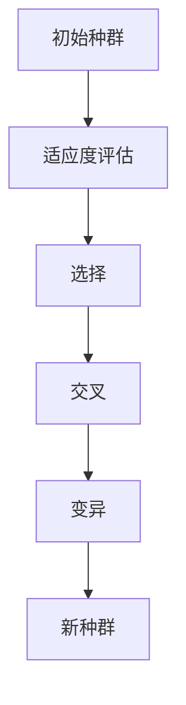
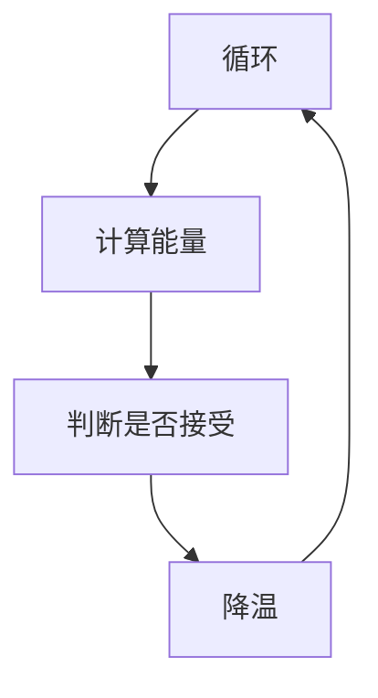
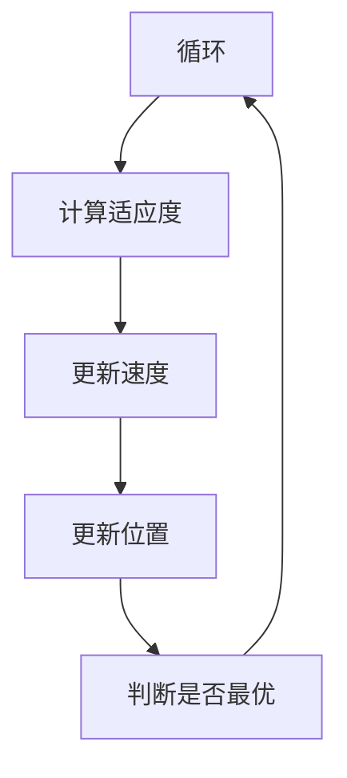
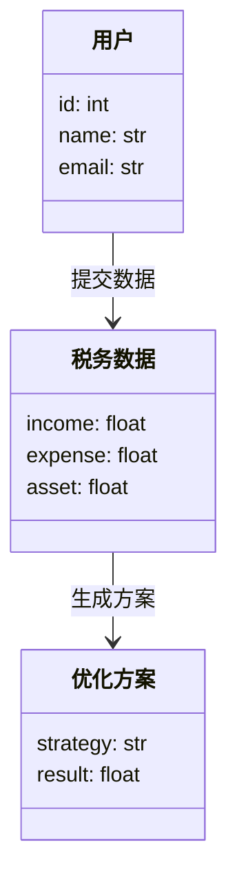
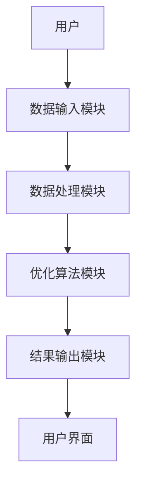
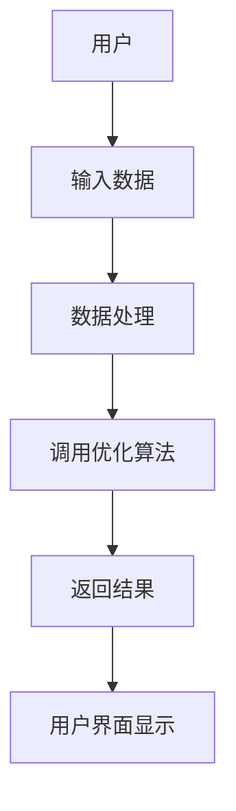

                 


# 智能个人税务筹划模拟器

## 关键词：
智能税务、税务优化、机器学习、算法设计、系统架构

## 摘要：
本文详细探讨了智能个人税务筹划模拟器的设计与实现，从背景、核心概念、算法原理到系统架构，再到项目实战和最佳实践，全面解析了如何利用智能技术优化个人税务筹划。文章通过丰富的案例和详细的代码实现，帮助读者理解并掌握智能税务模拟器的开发与应用。

---

# 第一部分: 智能个人税务筹划模拟器的背景与核心概念

## 第1章: 税务筹划与智能技术的结合

### 1.1 税务筹划的背景与挑战
#### 1.1.1 税务筹划的基本概念
税务筹划是指通过合法手段，优化个人或企业的税务负担，最大化经济利益的过程。传统的税务筹划依赖人工计算和经验判断，效率低下且容易出错。

#### 1.1.2 传统税务筹划的局限性
- 信息不全：人工难以全面收集和处理复杂的税务数据。
- 计算复杂：涉及多种税种和优惠政策，计算难度大。
- 时间成本高：手动计算耗时长，难以快速响应变化。

#### 1.1.3 智能技术在税务筹划中的应用前景
人工智能（AI）和机器学习（ML）技术的快速发展为税务筹划带来了新的可能性。智能税务模拟器可以通过自动化数据处理、智能优化算法和实时反馈，显著提高筹划效率和准确性。

---

### 1.2 智能个人税务筹划模拟器的必要性
#### 1.2.1 个人税务筹划的核心问题
- 如何在多种税种和优惠政策中找到最优解。
- 如何快速响应政策变化和经济环境的波动。
- 如何确保筹划方案的合法性和合规性。

#### 1.2.2 智能模拟器的优势与价值
- 自动化数据处理：快速收集和整理税务相关信息。
- 智能优化：基于机器学习算法，提供最优税务筹划方案。
- 实时反馈：根据最新政策和经济数据，动态调整筹划方案。

#### 1.2.3 模拟器的边界与外延
智能税务模拟器专注于优化税务负担，不涉及具体的法律咨询和财务规划。其外延包括税务申报、政策解读和风险评估。

---

### 1.3 本书的核心目标与结构
#### 1.3.1 本书的核心目标
通过技术分析和案例研究，详细讲解智能个人税务筹划模拟器的设计与实现，帮助读者掌握其核心原理和应用方法。

#### 1.3.2 目录结构概述
- 第一部分：背景与核心概念。
- 第二部分：算法原理。
- 第三部分：系统架构。
- 第四部分：项目实战与最佳实践。

#### 1.3.3 学习本书的注意事项
- 读者需要具备基本的编程和数学基础。
- 重点理解机器学习算法和系统设计的原理。

---

## 第2章: 智能税务模拟器的核心概念

### 2.1 智能税务模拟器的原理
#### 2.1.1 数据采集与处理
- 数据来源：个人收入、支出、资产、负债等。
- 数据清洗：去除冗余和错误数据，确保数据质量。

#### 2.1.2 税务规则的自动化应用
- 税务规则的编码：将税法条款转化为可执行的代码逻辑。
- 自动化计算：基于规则引擎，快速计算税务负担。

#### 2.1.3 智能优化算法
- 算法选择：遗传算法、模拟退火、粒子群优化等。
- 算法实现：通过机器学习模型，优化税务方案。

---

### 2.2 核心概念的属性特征对比
| 概念 | 数据来源 | 算法类型 | 应用场景 |
|------|-----------|-----------|-----------|
| 遗传算法 | 税务数据 | 遗传搜索 | 税务优化 |
| 模拟退火 | 经济指标 | 降温策略 | 风险评估 |
| 粒子群优化 | 政策变化 | 群体协作 | 方案调整 |

---

### 2.3 ER实体关系图架构
```mermaid
erd
    用户表
    税务数据表
    优化方案表
    算法日志表
    用户表 --> 税务数据表: 提交数据
    税务数据表 --> 优化方案表: 生成方案
    优化方案表 --> 算法日志表: 记录优化过程
```

---

# 第二部分: 智能个人税务筹划模拟器的算法原理

## 第3章: 税务优化算法的数学模型

### 3.1 税务优化问题的数学建模
#### 3.1.1 目标函数定义
$$\text{目标函数} = \text{税后净收益最大化}$$

#### 3.1.2 约束条件分析
- 收入约束：$$\text{总收入} \geq \text{可税收入}$$
- 支出约束：$$\text{总支出} \leq \text{可抵扣支出}$$

#### 3.1.3 模型求解方法
- 线性规划：通过线性方程组求解最优解。
- 非线性规划：处理复杂的约束条件和目标函数。

---

### 3.2 常用优化算法的原理

#### 3.2.1 遗传算法


#### 3.2.2 模拟退火算法


#### 3.2.3 粒子群优化算法


---

### 3.3 算法的数学公式与实现

#### 3.3.1 遗传算法的数学模型
- 适应度函数：$$f(x) = \sum_{i=1}^{n} x_i$$
- 选择操作：$$p_i = \frac{f(x_i)}{\sum_{j=1}^{n} f(x_j)}$$

#### 3.3.2 模拟退火算法的流程图


#### 3.3.3 粒子群优化算法的伪代码
```python
def particle_swarm_optimization():
    Initialize particles
    while not converged:
        Update particle velocities
        Update particle positions
        Update best solutions
    return optimal solution
```

---

## 第4章: 税务优化算法的实现

### 4.1 遗传算法的实现
```python
def fitness(x):
    return sum(x)

def genetic_algorithm():
    population = initialize_population()
    while not converged:
        fitness_values = [fitness(individual) for individual in population]
        selected = select(population, fitness_values)
        crossed = crossover(selected)
        mutated = mutate(crossed)
        population = crossed + mutated
    return best(population)
```

### 4.2 模拟退火算法的实现
```python
def simulated_annealing():
    current = initial_solution()
    best = current
    temperature = initial_temp()
    while temperature > 0:
        neighbor = neighbor_solution(current)
        delta = fitness(neighbor) - fitness(current)
        if delta > 0 or accept_probability(delta, temperature):
            current = neighbor
            if fitness(current) > fitness(best):
                best = current
        temperature =降温策略(temperature)
    return best
```

---

# 第三部分: 智能个人税务筹划模拟器的系统架构

## 第5章: 系统功能设计与实现

### 5.1 系统功能模块划分
#### 5.1.1 数据输入模块
- 功能：接收用户输入的税务数据。
- 实现：通过API接口或GUI界面采集数据。

#### 5.1.2 税务计算模块
- 功能：基于输入数据计算税后净收益。
- 实现：调用优化算法模块进行计算。

#### 5.1.3 优化方案模块
- 功能：生成最优税务筹划方案。
- 实现：结合多种优化算法，输出最优解。

---

### 5.2 系统功能设计

#### 5.2.1 领域模型类图


---

## 第6章: 系统架构设计

### 6.1 系统架构图


### 6.2 接口设计
- 数据输入接口：提供REST API，接收JSON格式的数据。
- 数据处理接口：调用优化算法模块，返回优化结果。

### 6.3 交互流程图


---

## 第7章: 项目实战

### 7.1 环境安装
- Python 3.8+
- 安装依赖：numpy, scikit-learn, matplotlib

### 7.2 核心代码实现

#### 7.2.1 数据处理模块
```python
def process_data(data):
    # 数据清洗和预处理
    return processed_data
```

#### 7.2.2 优化算法模块
```python
def optimize(processed_data):
    # 调用遗传算法或模拟退火算法
    return optimal_solution
```

#### 7.2.3 结果输出模块
```python
def display_result(solution):
    # 输出优化结果
    print(solution)
```

---

### 7.3 实际案例分析
假设用户年收入为100万元，可抵扣支出为30万元。通过智能模拟器计算，最优税务筹划方案为：
- 应纳税所得额：70万元
- 应缴税款：19.5万元

---

## 第8章: 最佳实践与总结

### 8.1 最佳实践 tips
- 定期更新政策数据，确保模拟器的准确性。
- 结合具体场景，调整优化算法的参数。

### 8.2 小结
智能个人税务筹划模拟器通过自动化数据处理和智能优化算法，显著提高了税务筹划的效率和准确性。本文详细讲解了其设计与实现，为读者提供了理论和实践的双重指导。

### 8.3 注意事项
- 模拟器的结果仅供参考，具体税务筹划需结合专业意见。
- 确保数据安全和隐私保护。

### 8.4 拓展阅读
建议读者进一步研究以下内容：
- 更复杂的优化算法，如蚁群算法。
- 大数据分析在税务筹划中的应用。

---

# 第四部分: 智能个人税务筹划模拟器的未来展望

## 第9章: 未来发展方向

### 9.1 技术创新
- 结合区块链技术，确保数据安全和透明性。
- 引入强化学习，提高优化算法的自适应能力。

### 9.2 应用场景拓展
- 企业税务筹划。
- 跨国税务规划。

### 9.3 伦理与法律
- 数据隐私保护。
- 税务政策的合规性。

---

## 作者：AI天才研究院/AI Genius Institute & 禅与计算机程序设计艺术 /Zen And The Art of Computer Programming

---

本文通过详细的技术分析和实践案例，全面探讨了智能个人税务筹划模拟器的设计与实现。从背景到算法，从系统架构到项目实战，帮助读者全面掌握其核心原理和应用方法。未来，随着人工智能技术的不断发展，智能税务模拟器将在更多领域发挥重要作用。

