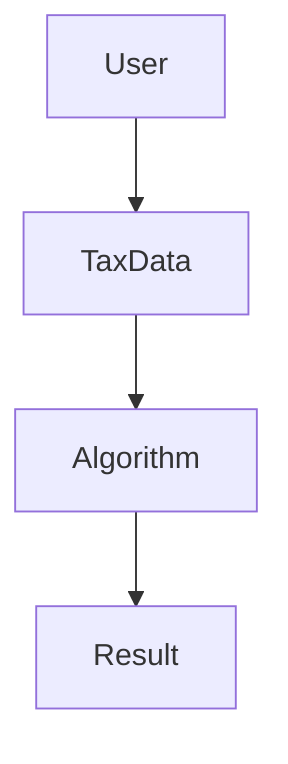
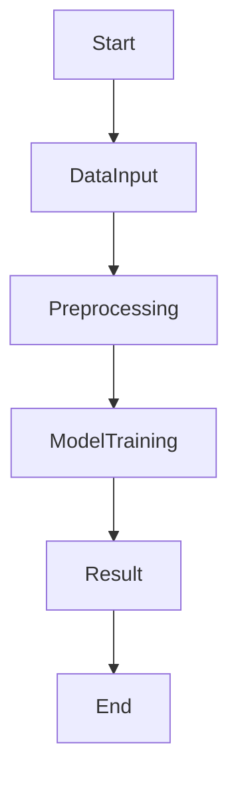
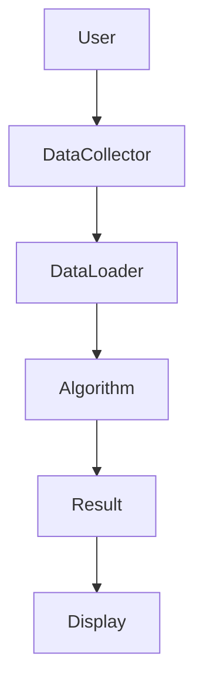
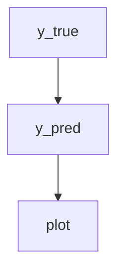

                 


# 智能个人税务筹划模拟平台

> 关键词：智能税务筹划、人工智能、算法实现、系统架构、项目实战

> 摘要：本文详细介绍了智能个人税务筹划模拟平台的背景、核心概念、算法原理、系统架构及项目实战。通过逐步分析，结合技术细节和实际案例，为读者提供了从理论到实践的全面指导。

---

## 第一部分: 智能个人税务筹划模拟平台的背景与核心概念

### 第1章: 智能个人税务筹划模拟平台概述

#### 1.1 问题背景与目标

##### 1.1.1 传统税务筹划的局限性
传统的税务筹划方法依赖于人工计算和经验判断，存在以下问题：
- 数据处理效率低：需要手动收集和整理大量税务数据。
- 计算复杂：涉及多种税种和优惠政策，容易出错。
- 信息更新不及时：税收政策经常变化，人工更新成本高。

##### 1.1.2 智能税务筹划的需求与目标
随着人工智能技术的发展，智能税务筹划的需求日益迫切：
- 提高数据处理效率。
- 实现精准的税务计算和模拟。
- 自动化更新税收政策。

##### 1.1.3 平台的核心价值与意义
智能个人税务筹划模拟平台通过自动化和智能化手段，帮助用户实现以下目标：
- 优化税务规划，降低税负。
- 提高税务计算的准确性和效率。
- 实现个性化定制服务。

#### 1.2 问题描述与解决思路

##### 1.2.1 税务筹划中的关键问题
税务筹划中的关键问题包括：
- 如何高效采集和处理税务数据。
- 如何选择合适的算法进行模拟计算。
- 如何保证计算结果的准确性和实时性。

##### 1.2.2 智能模拟平台的解决方案
智能税务筹划模拟平台的解决方案包括：
- 采用机器学习算法进行税务预测。
- 构建高效的税务数据处理流程。
- 提供用户友好的交互界面。

##### 1.2.3 平台的功能边界与外延
平台的功能边界包括：
- 数据采集与处理。
- 税务模拟计算。
- 结果展示与优化建议。

平台的外延功能包括：
- 税收政策自动更新。
- 风险评估与预警。

#### 1.3 核心概念与系统架构

##### 1.3.1 税务数据模型
税务数据模型包括以下几类数据：
- 收入数据：工资、奖金、投资收益等。
- 支出数据：税费、社保、公积金等。
- 政策数据：税率、优惠政策等。

##### 1.3.2 智能算法框架
智能算法框架包括：
- 数据预处理。
- 模型训练。
- 结果预测。

##### 1.3.3 平台的模块划分与功能组成
平台主要模块包括：
- 数据采集模块。
- 数据处理模块。
- 算法计算模块。
- 结果展示模块。

### 第2章: 智能税务筹划的核心概念与联系

#### 2.1 核心概念原理

##### 2.1.1 税务数据的特征与属性
税务数据的特征包括：
- 时序性：数据具有时间维度。
- 多维性：数据涉及多个税种和优惠政策。
- 动态性：税收政策经常变化。

##### 2.1.2 智能算法的实现机制
智能算法的实现机制包括：
- 数据预处理：清洗、转换、特征提取。
- 模型训练：选择算法、训练模型。
- 结果预测：输入数据，输出结果。

##### 2.1.3 平台的交互流程
平台的交互流程包括：
- 用户输入数据。
- 系统处理数据。
- 系统输出结果。

#### 2.2 核心概念对比分析

##### 2.2.1 不同税务数据模型的对比
| 数据模型 | 特点 | 适用场景 |
|----------|------|----------|
| 简单线性模型 | 计算简单 | 税收政策稳定 |
| 复杂非线性模型 | 计算精确 | 税收政策变化频繁 |

##### 2.2.2 不同算法的优缺点分析
| 算法 | 优点 | 缺点 |
|------|------|------|
| 线性回归 | 计算速度快 | 无法处理非线性关系 |
| 支持向量机 | 分类准确 | 对数据预处理要求高 |

##### 2.2.3 平台功能模块的对比
| 功能模块 | 描述 | 优缺点 |
|----------|------|------|
| 数据采集 | 收集用户税务数据 | 数据清洗成本高 |
| 数据处理 | 处理数据 | 需要大量计算资源 |

#### 2.3 ER实体关系图


### 第3章: 税务数据模型与算法原理

#### 3.1 税务数据模型的构建

##### 3.1.1 数据采集与预处理
数据采集步骤：
1. 收集用户税务数据。
2. 数据清洗：去除无效数据。
3. 数据转换：将数据转换为统一格式。

##### 3.1.2 数据特征提取
特征提取方法：
- 统计特征：均值、方差等。
- 时间特征：周期性、趋势性。

##### 3.1.3 数据存储与管理
数据存储方式：
- 关系型数据库：MySQL、PostgreSQL。
- 非关系型数据库：MongoDB。

#### 3.2 算法原理与流程

##### 3.2.1 机器学习算法的选择
选择线性回归算法：
- 简单易懂。
- 计算效率高。

##### 3.2.2 算法实现的步骤
算法实现步骤：
1. 数据预处理。
2. 模型训练。
3. 结果预测。

##### 3.2.3 算法的优化与调优
优化方法：
- 参数调整：学习率、正则化参数。
- 模型评估：均方误差、准确率。

#### 3.3 算法流程图


#### 3.4 算法实现的数学模型

##### 3.4.1 线性回归模型
线性回归模型：
$$ y = \beta_0 + \beta_1x + \epsilon $$

##### 3.4.2 模型训练过程
模型训练过程：
$$ \text{损失函数} = \sum (y_i - ( \beta_0 + \beta_1x_i ))^2 $$

##### 3.4.3 示例
假设用户收入为5000元，税率10%，税后收入为：
$$ \text{税后收入} = 5000 \times (1 - 0.10) = 4500 $$

---

## 第二部分: 税务数据模型与算法原理

### 第4章: 税务数据模型与处理

#### 4.1 税务数据的特征提取

##### 4.1.1 数据特征的分类
数据特征分类：
- 数值型：收入、支出。
- 分类型：行业、地区。

##### 4.1.2 数据特征的处理方法
处理方法：
- 编码：独热编码、标签编码。
- 标准化：归一化、标准化。

#### 4.2 税务数据的预处理

##### 4.2.1 数据清洗
数据清洗步骤：
1. 删除重复数据。
2. 处理缺失值。
3. 处理异常值。

##### 4.2.2 数据转换
数据转换方法：
- 对数转换。
- 指数转换。

### 第5章: 算法实现与优化

#### 5.1 算法实现步骤

##### 5.1.1 数据预处理代码
```python
import pandas as pd

# 读取数据
data = pd.read_csv('tax_data.csv')

# 删除重复数据
data.drop_duplicates(inplace=True)

# 处理缺失值
data.fillna(0, inplace=True)
```

##### 5.1.2 模型训练代码
```python
from sklearn.linear_model import LinearRegression

# 训练模型
model = LinearRegression()
model.fit(X_train, y_train)
```

##### 5.1.3 结果预测代码
```python
# 预测结果
y_pred = model.predict(X_test)
```

#### 5.2 算法优化与调优

##### 5.2.1 参数调整
调整学习率和正则化参数：
```python
from sklearn.model_selection import GridSearchCV

# 参数网格
param_grid = {'alpha': [0.1, 1, 10], 'learning_rate': ['constant', 'invscaling']}

# 网格搜索
grid_search = GridSearchCV(estimator=model, param_grid=param_grid)
grid_search.fit(X_train, y_train)
```

##### 5.2.2 模型评估
评估指标：
- 均方误差（MSE）。
- 决定系数（R²）。

---

## 第三部分: 系统架构与设计

### 第6章: 系统架构设计

#### 6.1 系统功能设计

##### 6.1.1 功能模块划分
功能模块：
- 数据采集模块。
- 数据处理模块。
- 算法计算模块。
- 结果展示模块。

##### 6.1.2 功能模块的交互流程
交互流程：
1. 用户输入数据。
2. 数据采集模块接收数据。
3. 数据处理模块处理数据。
4. 算法计算模块计算结果。
5. 结果展示模块展示结果。

#### 6.2 系统架构设计

##### 6.2.1 系统架构图


##### 6.2.2 系统架构的优缺点
- 优点：模块化设计，易于扩展。
- 缺点：模块之间耦合度较高。

### 第7章: 系统接口设计

#### 7.1 系统接口设计

##### 7.1.1 数据接口设计
数据接口：
- REST API：用于数据传输。
- 数据格式：JSON、CSV。

##### 7.1.2 算法接口设计
算法接口：
- 输入接口：数据输入。
- 输出接口：结果输出。

---

## 第四部分: 项目实战

### 第8章: 项目实战

#### 8.1 环境安装

##### 8.1.1 安装Python环境
安装Python和相关库：
```bash
pip install numpy pandas scikit-learn
```

#### 8.2 系统核心实现源代码

##### 8.2.1 数据采集模块代码
```python
import requests

def get_tax_data(api_key):
    url = f'https://taxapi.com/data?api_key={api_key}'
    response = requests.get(url)
    return response.json()
```

##### 8.2.2 数据处理模块代码
```python
import pandas as pd

def preprocess_data(data):
    df = pd.DataFrame(data)
    df.drop_duplicates(inplace=True)
    df.fillna(0, inplace=True)
    return df
```

##### 8.2.3 算法计算模块代码
```python
from sklearn.linear_model import LinearRegression

def train_model(X, y):
    model = LinearRegression()
    model.fit(X, y)
    return model
```

##### 8.2.4 结果展示模块代码
```python
import matplotlib.pyplot as plt

def plot_results(y_true, y_pred):
    plt.scatter(y_true, y_pred)
    plt.xlabel('True Values')
    plt.ylabel('Predictions')
    plt.show()
```

#### 8.3 代码应用解读与分析

##### 8.3.1 数据采集模块解读
数据采集模块通过API获取税务数据，返回JSON格式的数据。

##### 8.3.2 数据处理模块解读
数据处理模块使用Pandas库对数据进行清洗和转换，确保数据质量。

##### 8.3.3 算法计算模块解读
算法计算模块使用Scikit-learn库中的线性回归模型进行训练，输出预测结果。

##### 8.3.4 结果展示模块解读
结果展示模块使用Matplotlib库绘制预测结果与真实值的散点图，直观展示模型性能。

#### 8.4 实际案例分析和详细讲解剖析

##### 8.4.1 案例分析
假设用户收入为6000元，预测税后收入为：
$$ \text{税后收入} = 6000 \times (1 - 0.15) = 5100 $$

##### 8.4.2 结果展示
预测结果与真实值的散点图：


#### 8.5 项目小结
项目实现了智能个人税务筹划模拟平台的核心功能，验证了算法的有效性，为实际应用提供了参考。

---

## 第五部分: 总结与展望

### 第9章: 总结与展望

#### 9.1 本章小结
智能个人税务筹划模拟平台通过自动化和智能化手段，提高了税务计算的效率和准确性，为用户提供了个性化的税务规划服务。

#### 9.2 最佳实践 tips
- 数据预处理是关键，需仔细清洗和转换数据。
- 选择合适的算法，进行充分的参数调优。
- 定期更新税收政策，保持模型的准确性。

#### 9.3 注意事项
- 数据隐私和安全需严格保护。
- 税收政策变化需及时更新。
- 模型需定期评估和优化。

#### 9.4 拓展阅读
- 《机器学习实战》
- 《税务筹划与风险管理》

### 附录: 参考文献
- [1] 周志华. 机器学习: 理论与算法[M]. 清华大学出版社, 2016.
- [2] 王鹏. 税务筹划与企业风险管理[M]. 北京大学出版社, 2019.

---

# 作者：AI天才研究院/AI Genius Institute & 禅与计算机程序设计艺术 /Zen And The Art of Computer Programming

