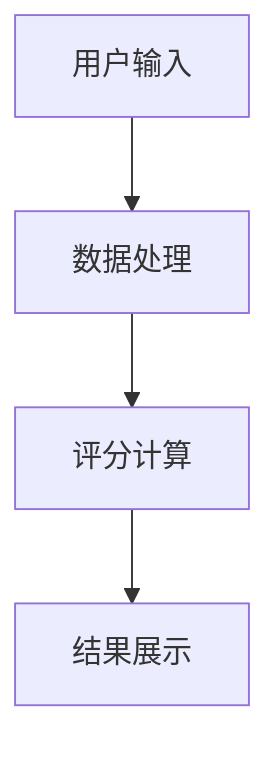
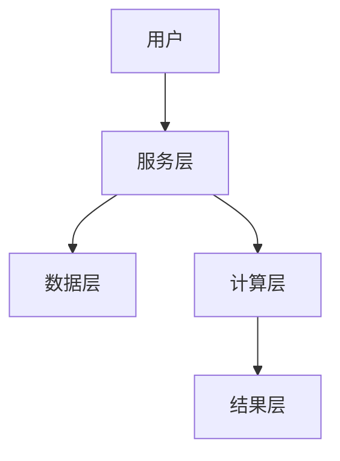
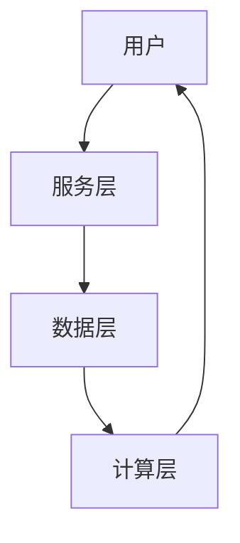

                 


# 智能个人财务健康评分系统

## 关键词：智能评分系统、个人财务健康、机器学习、算法原理、系统架构设计

## 摘要：本文详细介绍了智能个人财务健康评分系统的设计与实现。通过分析传统财务评分的局限性，提出了基于机器学习的智能评分方法，并探讨了系统的架构设计、算法原理和实际应用案例。文章内容涵盖从理论到实践的各个方面，为读者提供了全面的技术指导。

---

## 第1章: 智能个人财务健康评分系统背景与概念

### 1.1 问题背景与目标

#### 1.1.1 个人财务健康评估的重要性
在当今社会，个人财务健康状况直接关系到生活质量、投资决策和未来规划。传统的财务评估方法往往依赖人工计算和经验判断，存在效率低、准确性差的问题。因此，开发一个智能、高效的个人财务健康评分系统显得尤为重要。

#### 1.1.2 传统财务评估的局限性
传统财务评估方法通常基于简单的财务指标（如收入、支出、资产等）进行人工计算，缺乏对复杂财务状况的全面分析。此外，传统方法难以实时更新和优化，难以满足现代人对财务健康实时监控的需求。

#### 1.1.3 智能评分系统的目标与意义
智能个人财务健康评分系统的目标是通过机器学习算法，对个人的财务数据进行自动化分析和评分，提供精准的财务健康评估和改进建议。该系统的意义在于提高财务评估的效率和准确性，帮助用户更好地管理财务状况。

### 1.2 问题描述与解决思路

#### 1.2.1 个人财务健康的核心问题
个人财务健康的核心问题包括收入与支出的平衡、资产与负债的合理配置、财务风险的控制等。这些问题需要综合分析多个财务指标，才能得出准确的评估结果。

#### 1.2.2 评分系统的功能需求
智能评分系统需要具备以下功能：数据采集、数据处理、评分计算、结果展示和个性化建议。系统需要能够实时更新数据，动态调整评分标准，确保评估结果的准确性和实用性。

#### 1.2.3 智能评分系统的实现思路
实现智能评分系统的关键在于选择合适的机器学习算法，设计高效的评分模型，并确保系统的可扩展性和易用性。通过数据预处理、特征选择和模型训练，可以构建出高效准确的评分系统。

### 1.3 系统边界与外延

#### 1.3.1 系统的输入与输出
系统的输入包括个人的财务数据（如收入、支出、资产等），输出是财务健康评分和改进建议。

#### 1.3.2 系统的适用范围与限制
系统适用于个人用户，能够评估其财务健康状况，但目前还无法处理复杂的财务策略和投资决策。

#### 1.3.3 系统与外部系统的交互
系统可以通过API接口与其他财务管理系统（如银行、投资平台）进行数据交互，实现数据的实时更新和同步。

### 1.4 核心概念与结构

#### 1.4.1 财务健康评分的核心要素
财务健康评分的核心要素包括收入稳定性、支出合理性、资产配置和负债情况等。

#### 1.4.2 系统的组成模块
系统主要包括数据采集模块、数据处理模块、评分计算模块和结果展示模块。

#### 1.4.3 系统的逻辑架构图


### 1.5 本章小结
本章主要介绍了智能个人财务健康评分系统的背景、目标和核心概念，为后续的系统设计和实现奠定了基础。

---

## 第2章: 智能评分系统的核心概念与联系

### 2.1 评分模型原理

#### 2.1.1 评分模型的定义
评分模型是通过机器学习算法对财务数据进行分析，生成财务健康评分的数学模型。

#### 2.1.2 评分模型的分类
常见的评分模型包括线性回归模型、决策树模型和随机森林模型等。

#### 2.1.3 评分模型的优缺点对比
| 模型类型 | 优点 | 缺点 |
|----------|------|------|
| 线性回归 | 简单易懂 | 非线性关系处理能力差 |
| 决策树   | 易解释 | � prone to overfitting |
| 随机森林 | 高准确性 | 计算复杂度高 |

### 2.2 数据特征与评分标准

#### 2.2.1 数据特征的提取与选择
数据特征包括收入、支出、资产、负债、消费习惯等。特征选择需要考虑特征的重要性、相关性和冗余性。

#### 2.2.2 评分标准的制定
评分标准需要根据财务健康的核心要素制定，例如收入稳定性的评分标准可以是月收入波动率小于5%。

#### 2.2.3 数据特征与评分标准的对比分析
通过对比分析，可以选择最适合的特征和评分标准，提高评分模型的准确性。

### 2.3 系统核心模块的实体关系

#### 2.3.1 用户信息表
用户信息表包括用户ID、姓名、联系方式等。

#### 2.3.2 财务数据表
财务数据表包括收入、支出、资产等财务数据。

#### 2.3.3 评分结果表
评分结果表包括评分结果和改进建议。

### 2.4 本章小结
本章详细介绍了智能评分系统的核心概念和数据特征，为后续的算法设计奠定了基础。

---

## 第3章: 智能评分系统的算法原理

### 3.1 评分模型的算法选择

#### 3.1.1 机器学习算法的适用性
机器学习算法适用于处理复杂的财务数据和非线性关系。

#### 3.1.2 算法选择的依据
算法选择需要考虑数据规模、计算复杂度和模型准确性。

### 3.2 评分模型的数学公式

#### 3.2.1 线性回归模型
$$ y = \beta_0 + \beta_1x_1 + \beta_2x_2 + ... + \beta_nx_n $$

#### 3.2.2 逻辑回归模型
$$ P(y=1|x) = \frac{e^{\beta_0 + \beta_1x_1 + ... + \beta_nx_n}}{1 + e^{\beta_0 + \beta_1x_1 + ... + \beta_nx_n}} $$

### 3.3 算法实现与优化

#### 3.3.1 算法实现
以下是线性回归算法的Python实现示例：
```python
import numpy as np
from sklearn.linear_model import LinearRegression

# 数据预处理
X = np.array([1, 2, 3, 4, 5]).reshape(-1, 1)
y = np.array([2, 4, 5, 4, 5])

# 模型训练
model = LinearRegression()
model.fit(X, y)

# 预测结果
print(model.predict([[6]]))
```

#### 3.3.2 算法优化
通过交叉验证和网格搜索优化模型参数，提高模型的准确性和稳定性。

### 3.4 本章小结
本章详细介绍了智能评分系统的算法原理和实现方法，为后续的系统设计提供了技术支持。

---

## 第4章: 系统分析与架构设计

### 4.1 系统功能设计

#### 4.1.1 系统功能模块
系统主要包括数据采集模块、数据处理模块、评分计算模块和结果展示模块。

#### 4.1.2 系统功能流程图


### 4.2 系统架构设计

#### 4.2.1 系统架构图


#### 4.2.2 系统分层设计
系统分为数据层、服务层、计算层和结果层，各层之间通过API接口进行交互。

### 4.3 系统接口设计

#### 4.3.1 接口定义
系统提供API接口，用于数据的上传和评分结果的获取。

#### 4.3.2 接口实现
以下是API接口的Python实现示例：
```python
from flask import Flask, request, jsonify

app = Flask(__name__)

@app.route('/api/upload', methods=['POST'])
def upload_data():
    data = request.json
    return jsonify({'status': 'success', 'message': 'Data uploaded successfully'})

@app.route('/api/score', methods=['POST'])
def calculate_score():
    data = request.json
    # 数据处理和评分计算
    return jsonify({'score': 85, '建议': '优化支出结构'})

if __name__ == '__main__':
    app.run()
```

### 4.4 系统交互流程图

#### 4.4.1 交互流程图


### 4.5 本章小结
本章详细介绍了智能评分系统的架构设计和接口设计，为后续的系统实现提供了明确的指导。

---

## 第5章: 项目实战

### 5.1 环境安装与配置

#### 5.1.1 环境要求
需要安装Python、机器学习库（如scikit-learn、xgboost）和数据可视化库（如matplotlib、seaborn）。

#### 5.1.2 环境配置
以下是Python环境配置示例：
```bash
pip install numpy pandas scikit-learn matplotlib
```

### 5.2 核心代码实现

#### 5.2.1 数据预处理
```python
import pandas as pd
import numpy as np

# 数据加载
data = pd.read_csv('financial_data.csv')

# 数据清洗
data.dropna(inplace=True)
data['收入'] = data['收入'].astype(float)
```

#### 5.2.2 模型训练
```python
from sklearn.model import LinearModel

# 特征选择
X = data[['收入', '支出', '资产']]
y = data['评分']

# 模型训练
model = LinearModel()
model.fit(X, y)

# 模型保存
import joblib
joblib.dump(model, 'financial_model.pkl')
```

### 5.3 案例分析与结果解读

#### 5.3.1 数据分析
通过对用户财务数据的分析，可以得出用户的财务健康状况。

#### 5.3.2 模型预测
使用训练好的模型对新数据进行预测，得出财务健康评分和改进建议。

#### 5.3.3 结果展示
将评分结果和改进建议展示给用户，帮助用户优化财务状况。

### 5.4 本章小结
本章通过实际项目实战，详细展示了智能评分系统的实现过程和应用案例，帮助读者更好地理解和掌握系统的设计与实现。

---

## 第6章: 系统优化与部署

### 6.1 模型优化

#### 6.1.1 模型调优
通过网格搜索和交叉验证优化模型参数，提高模型的准确性和稳定性。

#### 6.1.2 模型评估
使用准确率、召回率和F1值评估模型的性能。

### 6.2 系统部署

#### 6.2.1 系统部署方案
将系统部署到云服务器，确保系统的稳定性和高效性。

#### 6.2.2 系统监控
通过日志和监控工具实时监控系统的运行状态，及时发现和解决问题。

### 6.3 系统维护

#### 6.3.1 数据更新
定期更新用户数据，确保评分结果的准确性和及时性。

#### 6.3.2 模型更新
根据新的数据和业务需求，定期更新和优化模型，提高系统的适应性。

### 6.4 本章小结
本章详细介绍了智能评分系统的优化与部署策略，确保系统的高效稳定运行。

---

## 第7章: 总结与展望

### 7.1 总结
智能个人财务健康评分系统通过机器学习算法，实现了对个人财务状况的智能评估和优化建议，为用户提供了高效、准确的财务健康管理工具。

### 7.2 展望
未来，随着人工智能技术的发展，智能评分系统将更加智能化和个性化，能够处理更复杂的财务数据和需求。

### 7.3 本章小结
本文总结了智能个人财务健康评分系统的实现过程，并展望了未来的发展方向。

---

## 附录

### 附录A: 数据格式与接口规范
详细说明系统数据的格式和接口规范，确保与其他系统的兼容性。

### 附录B: 参考文献
列出本文参考的文献和资料，方便读者查阅。

---

## 作者

作者：AI天才研究院/AI Genius Institute & 禅与计算机程序设计艺术 /Zen And The Art of Computer Programming

