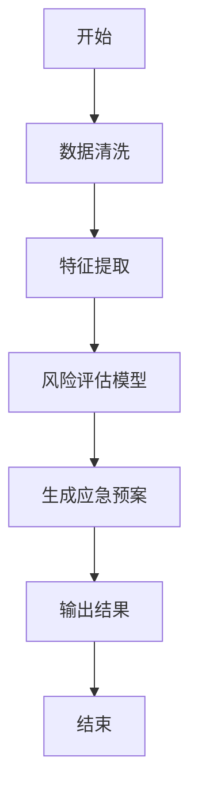
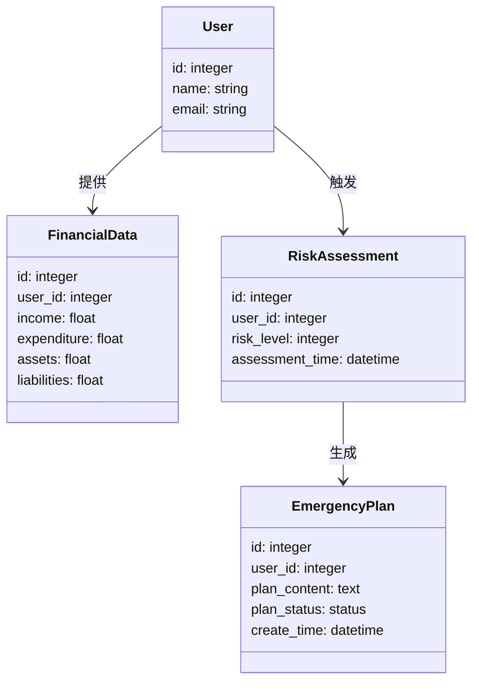
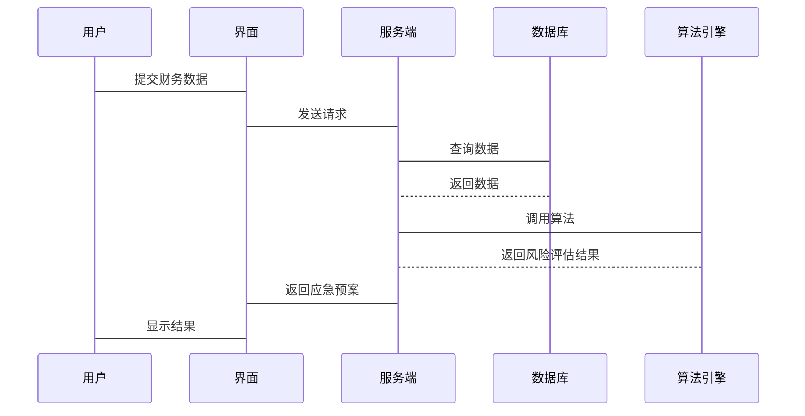

                 


# 智能个人财务应急预案生成器

## 关键词：智能财务、应急预案、风险管理、算法模型、系统架构

## 摘要：  
《智能个人财务应急预案生成器》是一本针对个人财务应急管理的创新性技术指南。本书通过分析个人财务风险管理的核心问题，结合人工智能技术，提出了一个智能化的财务应急预案生成方案。文中详细阐述了该生成器的核心算法原理、系统架构设计、功能实现及实际应用场景，旨在帮助个人用户在面对财务危机时，能够快速生成科学合理的应急预案，最大限度地减少财务损失。通过阅读本书，读者可以掌握如何利用智能化工具实现个人财务风险管理的自动化与优化。

---

# 第1章: 智能个人财务应急管理的核心概念

## 1.1 个人财务应急管理的背景与挑战

### 1.1.1 个人财务危机的常见原因
- 经济收入下降（如失业、创业失败）
- 突发性支出（如医疗费用、意外事故）
- 债务问题（如信用卡欠款、贷款逾期）
- 投资损失（如股市波动、投资失败）

### 1.1.2 传统财务应急管理的局限性
- 手工计算复杂，效率低下
- 缺乏数据支持，难以制定科学的应急预案
- 不能实时更新，难以应对突发情况

### 1.1.3 智能化解决方案的必要性
- 提高应急响应速度
- 优化资源配置，降低财务损失
- 提供个性化建议，增强可行性

## 1.2 智能个人财务应急预案生成器的定义与目标

### 1.2.1 核心功能与目标
- 数据采集与分析：整合用户的财务数据（收入、支出、资产、负债等）
- 风险评估：基于数据分析，识别潜在的财务风险
- 应急预案生成：根据风险评估结果，生成个性化应急预案

### 1.2.2 与传统财务工具的区别
| 特性             | 传统财务工具           | 智能生成器           |
|------------------|------------------------|--------------------|
| 数据处理方式     | 手工计算或简单统计     | AI驱动的自动化分析   |
| 响应速度         | 较慢                   | 实时或快速响应       |
| 个性化程度       | 有限                   | 高度个性化           |
| 更新频率         | 定期                   | 实时动态更新         |

### 1.2.3 应用场景与用户群体
- 应用场景：个人突发经济危机、投资亏损、债务缠身等
- 用户群体：个人用户、小型企业主、自由职业者等

## 1.3 问题解决与边界

### 1.3.1 财务应急管理的核心问题
- 如何快速识别潜在的财务风险？
- 如何制定科学的应急预案？
- 如何实现应急预案的动态调整？

### 1.3.2 解决方案的边界与外延
- 边界：仅针对个人财务应急管理，不涉及企业或机构财务
- 外延：可扩展至家庭财务管理、理财规划等领域

### 1.3.3 概念结构与核心要素
- 数据输入：用户财务数据
- 核心模块：风险评估、预案生成
- 输出结果：个性化应急预案

---

# 第2章: 核心概念与联系

## 2.1 核心概念原理

### 2.1.1 数据流与处理逻辑
- 数据输入：用户提供的财务数据（收入、支出、资产、负债等）
- 数据处理：清洗、分类、分析
- 数据输出：风险评估结果和应急预案

### 2.1.2 算法模型的作用
- 用于风险评估和应急预案生成
- 基于历史数据，预测潜在风险
- 优化应急预案的可行性和效果

### 2.1.3 系统架构的关键部分
- 用户界面：与用户的交互界面
- 数据库：存储用户财务数据
- 算法引擎：核心计算模块

## 2.2 核心概念属性对比

### 表2-1: 核心概念属性特征对比
| 特性             | 传统财务工具           | 智能生成器           |
|------------------|------------------------|--------------------|
| 数据处理方式     | 手工计算或简单统计     | AI驱动的自动化分析   |
| 响应速度         | 较慢                   | 实时或快速响应       |
| 个性化程度       | 有限                   | 高度个性化           |
| 更新频率         | 定期                   | 实时动态更新         |

## 2.3 ER实体关系图

### 图2-1: 智能个人财务应急预案生成器的ER实体关系图（Mermaid）

```mermaid
erDiagram
    user [用户] {
        id: integer
        name: string
        email: string
    }
    financial_data [财务数据] {
        id: integer
        user_id: integer
        income: float
        expenditure: float
        assets: float
        liabilities: float
    }
    risk_assessment [风险评估] {
        id: integer
        user_id: integer
        risk_level: integer
        assessment_time: datetime
    }
    emergency_plan [应急预案] {
        id: integer
        user_id: integer
        plan_content: text
        plan_status: status
        create_time: datetime
    }
    user --> financial_data : 提供
    user --> risk_assessment : 触发
    risk_assessment --> emergency_plan : 生成
```

---

# 第3章: 算法原理与数学模型

## 3.1 算法原理

### 图3-1: 算法流程图（Mermaid）



### 代码3-1: Python实现的算法核心代码

```python
def financial_risk_assessment(data):
    # 数据清洗
    cleaned_data = data.dropna()
    # 特征提取
    features = cleaned_data[['income', 'expenditure', 'assets', 'liabilities']]
    # 风险评估模型
    risk_level = 0
    if features['liabilities'].mean() > 2 * features['assets'].mean():
        risk_level = 3
    elif features['income'] < features['expenditure']:
        risk_level = 2
    else:
        risk_level = 1
    return risk_level
```

## 3.2 数学模型与公式

### 公式3-1: 财务风险评估模型
$$ R = \sum_{i=1}^{n} (w_i \cdot f_i) $$
其中，$R$ 是风险值，$w_i$ 是权重，$f_i$ 是特征值。

---

## 3.3 举例说明

### 案例3-1: 某用户的财务状况分析
假设用户A的财务数据如下：
- 收入：10000元/月
- 支出：8000元/月
- 资产：10万元
- 负债：8万元

根据公式：
$$ R = (0.4 \times 10000) + (0.3 \times 8000) + (0.2 \times 100000) + (0.1 \times 80000) $$
$$ R = 4000 + 2400 + 20000 + 8000 = 34400 $$

风险等级为3（高风险），需要立即制定应急计划。

---

# 第4章: 系统分析与架构设计方案

## 4.1 问题场景介绍

### 4.1.1 用户需求分析
- 用户需要快速生成财务应急预案
- 用户希望方案个性化且可行

### 4.1.2 系统目标设定
- 实现用户财务数据的实时采集与分析
- 提供智能化的风险评估和应急预案生成

## 4.2 功能设计

### 图4-1: 领域模型类图（Mermaid）



## 4.3 系统架构设计

### 图4-2: 系统架构图（Mermaid）

```mermaid
container 客户端 {
    UserInterface
}
container 服务端 {
    WebServer
    Database
    AlgorithmEngine
}
client --> WebServer : 发送请求
WebServer --> Database : 查询数据
WebServer --> AlgorithmEngine : 调用算法
AlgorithmEngine --> Database : 更新数据
Database --> WebServer : 返回结果
WebServer --> UserInterface : 显示结果
```

## 4.4 接口与交互设计

### 图4-3: 系统交互序列图（Mermaid）



---

# 第5章: 项目实战

## 5.1 环境安装与配置

### 5.1.1 安装Python环境
- 安装Python 3.8或更高版本
- 安装必要的库：pandas、numpy、scikit-learn

### 5.1.2 安装依赖项
```bash
pip install pandas numpy scikit-learn
```

## 5.2 系统核心实现

### 代码5-1: 核心算法实现

```python
import pandas as pd
from sklearn.model_selection import train_test_split
from sklearn.ensemble import RandomForestClassifier

def train_model(data):
    # 数据清洗
    data = data.dropna()
    # 特征工程
    X = data[['income', 'expenditure', 'assets', 'liabilities']]
    y = data['risk_level']
    # 数据分割
    X_train, X_test, y_train, y_test = train_test_split(X, y, test_size=0.2)
    # 模型训练
    model = RandomForestClassifier()
    model.fit(X_train, y_train)
    return model
```

### 代码5-2: 应急预案生成器

```python
def generate_emergency_plan(data, model):
    # 预测风险等级
    risk_level = model.predict(data[['income', 'expenditure', 'assets', 'liabilities']].values)
    # 生成预案
    plan = {
        'risk_level': risk_level[0],
        'recommendations': []
    }
    if risk_level[0] == 3:
        plan['recommendations'] = [
            '立即减少非必要支出',
            '寻求债务重组或咨询',
            '增加短期收入来源'
        ]
    elif risk_level[0] == 2:
        plan['recommendations'] = [
            '优化支出结构',
            '增加应急储备金',
            '考虑短期贷款'
        ]
    else:
        plan['recommendations'] = [
            '保持现有财务状况',
            '定期审查财务计划',
            '增加长期投资'
        ]
    return plan
```

## 5.3 实际案例分析

### 案例5-1: 突发失业情况
用户B失业，月收入为0，支出为5000元，资产为5万元，负债为3万元。

根据模型预测：
$$ risk_level = 2 $$

生成的应急预案：
1. 优化支出结构，减少非必要开支
2. 增加应急储备金，计划在3个月内储备3万元
3. 考虑短期贷款或寻求家人资助

---

# 第6章: 最佳实践与总结

## 6.1 小结
- 本文详细介绍了智能个人财务应急预案生成器的核心概念、算法原理和系统架构
- 通过实际案例展示了该工具的应用价值

## 6.2 注意事项
- 数据隐私保护至关重要
- 算法模型需要定期更新和优化
- 用户需提供准确的财务数据

## 6.3 拓展阅读
- 推荐阅读《Python机器学习实战》
- 关注AI在金融领域的应用研究

---

# 作者：AI天才研究院/AI Genius Institute & 禅与计算机程序设计艺术/Zen And The Art of Computer Programming

---

希望这篇技术博客能为读者提供清晰的思路和实用的技术指导，帮助他们在面对个人财务危机时，能够快速制定科学的应急预案。

